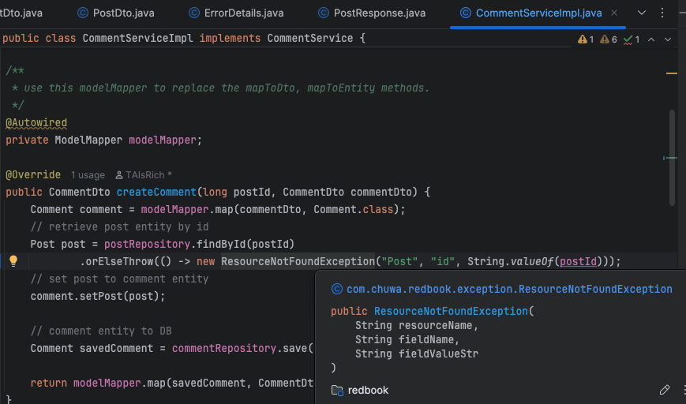
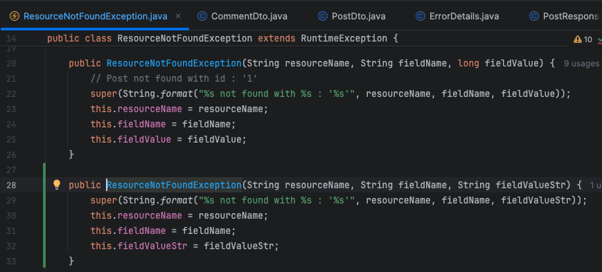
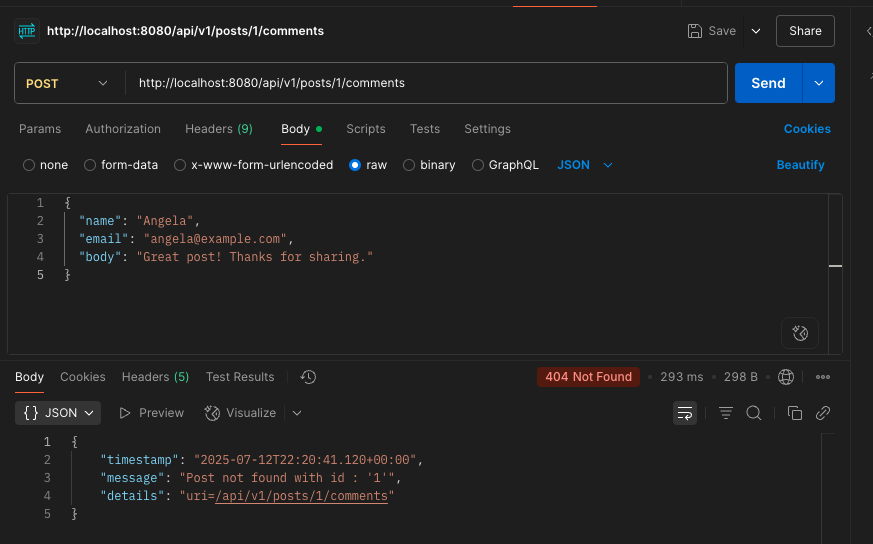
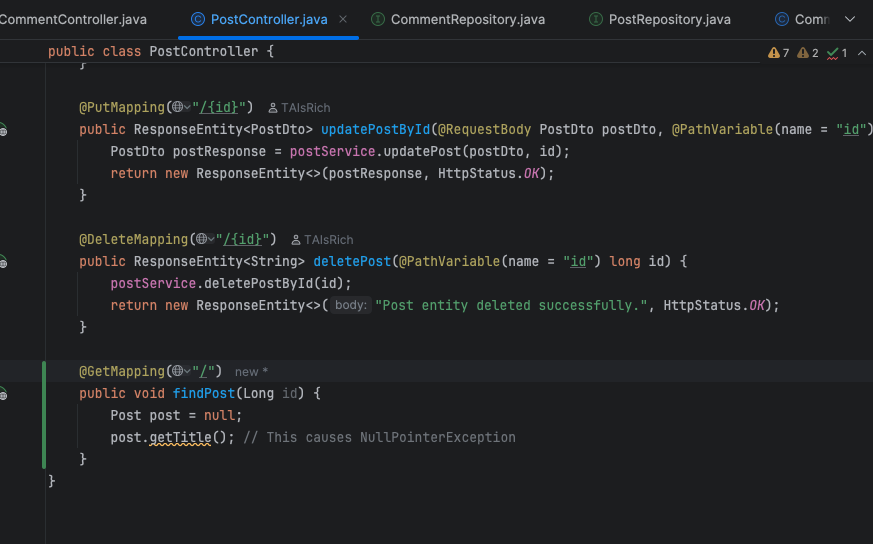
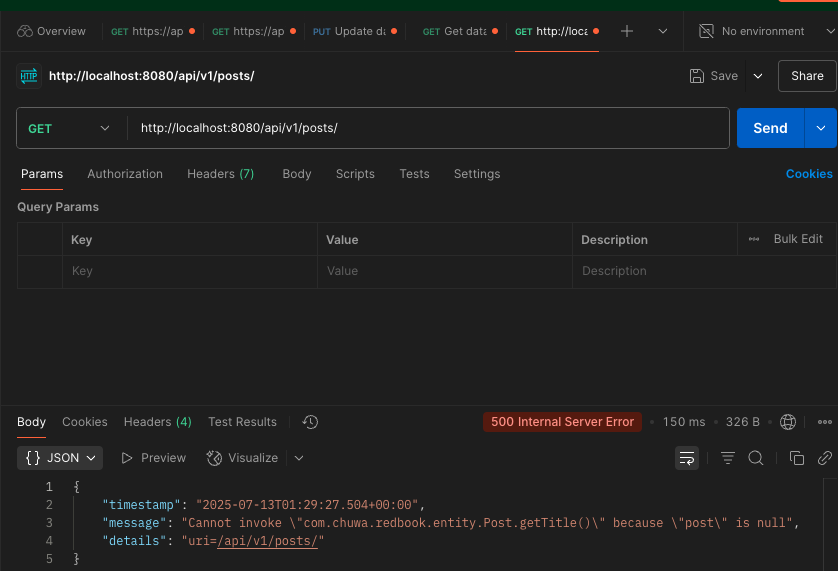
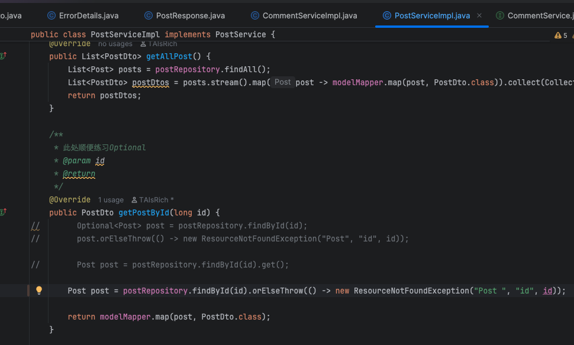
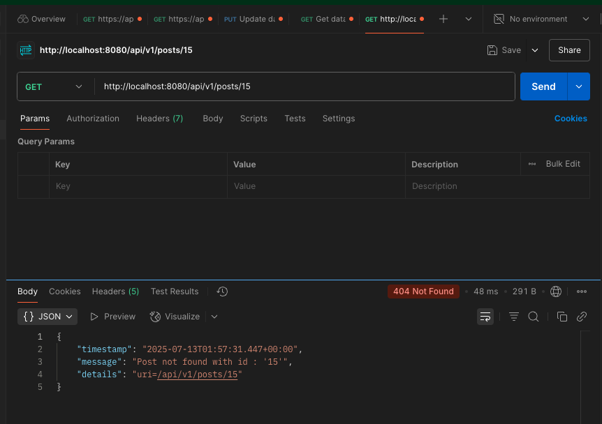

**3. Explain why do we need model mappers in Spring, and in what scanrios we need it.**

Model mappers are used to convert between **Entity classes** (used for persistence) and **DTOs** (used for API or UI layers).

**Purpose**
- **Separation of concerns**: Keep database logic separate from presentation logic.
- **Security**: Hide sensitive fields from API responses.
- **Flexibility**: Customize data sent/received without altering the database schema.
- **Maintainability**: Simplifies code when models evolve over time.

**When To Use
- When DTOs differ from entity structure
- When hiding or transforming fields in the response
- When validating request bodies (DTO) but not entities.
- When mapping nested or complex data.

---
**4. Provide 3 examples in which model mapper will NOT map succesfully, explain why.**

**1. Field Names Don't Match**
```java
public class User {
    private String fullName;
}
public class UserDto {
    private String name;
}
```
- **Why it fails** ModelMapper maps fields by name by default. Since `fullName` ≠ `name`, it won't map automatically.
- **Solution** Use `@Mapping`(MapStruct) or configure ModelMapper with custom mappings.
```java
ModelMapper modelMapper = new ModelMapper();
modelMapper.typeMap(User.class, UserDto.class).addMapping(User::getFullName, UserDto::setName);
```

**2. Nested Objects Aren't Mapped Automatically**
```
class User {
    private Address address;

    public Address getAddress() {
        return address;
    }

    public void setAddress(Address address) {
        this.address = address;
    }
}

class Address {
    private String city;

    public String getCity() {
        return city;
    }

    public void setCity(String city) {
        this.city = city;
    }
}

class UserDto {
    private String city;

    public String getCity() {
        return city;
    }

    public void setCity(String city) {
        this.city = city;
    }
}

```
- **Why it fails** ModelMapper cannot infer that `order.user.username` should map to `orderDto.username`.
- **Solution** Use custom property mapping
```java
ModelMapper modelMapper = new ModelMapper();

TypeMap<User, UserDto> typeMap = modelMapper.createTypeMap(User.class, UserDto.class);
typeMap.addMapping(
    src -> src.getAddress().getCity(),
    UserDto::setCity
);
```

**3. Incompatible Data Types**
```java
public class Product {
    private String price;
}

public class ProductDto {
    private BigDecimal price;
}
```
- **Why it fails**: ModelMapper cannot convert `String` → `BigDecimal` by default.
- **Solution**: Register a custom converter
```java
modelMapper.addConverter(ctx -> new BigDecimal(ctx.getSource()), String.class, BigDecimal.class);
```

---
**5. Explain how model mapper cast different data types between source object and target class.**

ModelMapper automatically converts data between source and target fields **if types are compatible or have known conversion rules**.

**Built-in Type Conversions**
ModelMapper supports basic conversions such as:
- `int` ↔ `Integer`
- `String` → `Date` (if parsable)
- `String` → `Enum` (by name)
- `List<Source>` → `List<Target>` (if mappable element types)

```java
public class Product {
    private String price;
}

public class ProductDto {
    private BigDecimal price;
}
```
**Handle specific type transformations**
```java
modelMapper.addConverter(ctx -> new BigDecimal(ctx.getSource()), String.class, BigDecimal.class);
```

---
**6. Add your own API exceptions so that when something wrong happens in service layer, your rest API will return your customized response and status code.**





---
**7. Explain how Controller Advices work, is there any other approach to do same/similar global API exception handling?**

`@ControllerAdvice` is a specialization of the `@Component` annotation in Spring used to define global exception handling logic across multiple controllers. It allows us to **centralize and reuse the error handling code.**

- `@ControllerAdvice` is used on a class that handles exceptions globally.
- Inside it, you define methods annotated with `@ExceptionHandler` to handle specific exception types.
- When an exception is thrown from any controller, Spring will look for a matching `@ExceptionHandler` in the `@ControllerAdvice`.

```java
@ControllerAdvice
public class GlobalExceptionHandler {
	@ExceptionHandler(ResourceNotFoundException.class)
	public ResponseEntity<ErrorDetails> handleNotFound(ResourceNotFoundException ex){
		ErrorDetails error = new ErrorDetails(LocalDateTime.now(), ex.getMessage(), "Not Found");
		return new ResponseEntity<>(error, HttpStatus.NOT_FOUND);
	}
}
```

**Alternative Approaches**
- **HandlerExceptionResolver Interface**
  - Implement `HandlerExceptionResolver` to customize error response globally
  - Give full control but more verbose
- **`@ExceptionHandler` inside individual controllers**
  - Not Global, may leads to duplicate code
- **`ErrorController`**
  - Mostly used to handle generic fallback errors like 404 or 500

---
**8. What's the difference between throwing a regular exception and a customized API exception that will be
eventually thrown to Controller Advice codes? Please provide screenshots to explain your findings.**

- **Throwing a Regular Exception (e.g., `NullPointerException`)**

If a standard Java exception like `NullPointerException` is thrown in the service layer without a proper handler:
- Spring will return a generic 500 Internal Server Error.
- Stack trace or minimal information is exposed to the client (depending on config).
- There is **no structure error response** unless globally intercepted.




- **Throwing a Custom API exception (Handled by `@ControllerAdvice`)**

If we throw a custom exception like `ResourceNotFoundException`, and handle it in a `@ControllerAdvice`, we can:
- Return a structured and meaningful error response 
- Specify custom HTTP status codes like 404, 400, etc




---
**9. Write some regular expression to restrict the value of attributes that your Post or Comment can have. You
may use https://regex101.com/ to construct and test/validate your regular expression.**

- **Email**
```java
@Email
@Pattern(regexp = "^[A-Za-z0-9._%+-]+@[A-Za-z0-9.-]+\\.[A-Za-z]{2,}$")
private String email;
```
- **Username** Alphanumeric, 3-30 chars
```java
@Pattern(regexp = "^[a-zA-Z0-9_]{3,30}$")
private String username;
```
- **Post Title** Allow basic punctuation, 5-100 chars
```java
@Pattern(regexp = "^[A-Za-z0-9.,!?\"'\\s-]{5,100}$")
private String title;
```

---
**10. Explain Spring framework fundamental principles. And how can they help build business applications?**

- **Dependency Injection(DI)**
- **What**: Spring manages object dependencies via IoC (Inversion of Control) container.
- **Benefit**: Promotes **loose coupling**, making the system more **testable**, **modular**, and **maintainable**.

- **Aspect-Oriented Programming (AOP)**
- **What**: Isolate these concerns into separate reusable components called aspects, so they don't clutter the main business logic.
- **Benefit**: Improves code separation, making business logic cleaner and focused.

```java
// Without AOP
public void createOrder() {
    log.info("Start order creation");      // cross-cutting
    checkUserPermission();                 // cross-cutting
    // business logic
    saveOrderToDB();                       // core logic
    log.info("Order created");            // cross-cutting
}
```

```java
// With AOP (separated concerns)
@LogExecutionTime
@Secured("ROLE_USER")
public void createOrder() {
    saveOrderToDB();  // only business logic here
}
```

- **Modularity and Layered Architecture**
  - **What**: Encourages separation into layers: Controller, Service, Repository, etc.
  - **Benefit**: Aligns with real-world business requirements and team roles, enhancing scalability and collaboration.

- **Declarative Programming via Annotations**
  - **What**: Annotations like `@Transactional`, `@RestController`, and `@Service` simplify configuration.
  - **Benefit**: Reduces boilerplate and increases readability and developer productivity.

- **Integration Support**
  - **What**: provides built-in modules for JPA, JDBC, Security, Web, Scheduling, Messaging, etc.
  - **Benefit**: Simplifies integration with databases, REST APIs, messaging systems, etc., essential for business applications.

- **Testing Support**
  - **What**: Offers test utilities like `@SpringBootTest` and `@MockBean`.
  - **Benefit**: Encourages test-driven development (TDD) and improves reliability of business logic.

---
**11. Explain different types of dependency injection, explain their suitable use cases, and why field injection
is not recommended in general. Please provide necessary code snippets and screenshots if possible.**

Dependency Injection (DI) is a design pattern used to implement **IoC (Inversion of Control)**, allowing the Spring container to manage the objects and their dependencies. This promotes loose coupling and makes code easier to test and maintain.

| Type            | Description                                                                 | Syntax Example                            | Use Case                                                    |
|-----------------|-----------------------------------------------------------------------------|--------------------------------------------|-------------------------------------------------------------|
| Constructor     | Dependencies are passed via the class constructor                           | `@Autowired` or no annotation from Spring 4.3+ | Recommended for **required** dependencies and immutability |
| Setter          | Dependencies are set via public setter methods                              | `@Autowired` on setter method             | Useful for **optional** dependencies                        |
| Field (not recommended) | Dependencies are injected directly into the fields                      | `@Autowired` on the field                  | Used for brevity, but not good for testability or clarity   |

- **Constructor Injection(Recommended)**
```java
@Component
public class OrderService {
    private final PaymentService paymentService;

    @Autowired  // Optional from Spring 4.3+ if only one constructor
    public OrderService(PaymentService paymentService) {
        this.paymentService = paymentService;
    }
}
```
- Suitable when:
  - Dependencies are mandatory
  - Need immutability (no setters)
  - Better unit testing and clarity

- **Setter Injection**
```java
@Component
public class OrderService {
    private PaymentService paymentService;

    @Autowired
    public void setPaymentService(PaymentService paymentService) {
        this.paymentService = paymentService;
    }
}
```

- Suitable when:
  - Dependency is optional
  - re-inject dependency cases
  - default constructor (for frameworks or tools)

- **Field Injection**
```java
@Component
public class OrderService {
    @Autowired
    private PaymentService paymentService;
}
```

- Why it is discouraged:
  - Not test-friendly: can't easily mock via constructor
  - Less visible: No clear indication of required dependencies
  - Breaks immutability: Allows reassignment

---
**12. Explain different types of application context in Spring framework, with screenshots. You may take https://
github.com/CTYue/springIOC for reference.**

Spring provides several implementations of the `ApplicationContext` interface for managing beans:
- **`ClassPathXmlApplicationContext`** Loads Spring configuration from an XML file in the classpath.
- Use Case: Legacy or simpler projects where configuration is externalized.
```java
ApplicationContext context = 
    new ClassPathXmlApplicationContext("beans.xml");

MyService service = context.getBean(MyService.class);
```

- **`AnnotationConfigApplicationContext` Java-based Configuration
  - This context loads beans from Java classes annotated with @Configuration, @Component, @Bean

`BeanConfig.java`
- Use Case: Preferred in modern Spring applications for type safety, readability, and better IDE support
```java
@Configuration
@ComponentScan(basePackages = "com.chuwa.springbasic")
public class BeanConfig {
    @Bean
    public JpaChuwa myDataNucleus() {
        return new JpaChuwa();
    }
}
```
`SpringIocContainerApplication.java`
```java
ApplicationContext context2 = new AnnotationConfigApplicationContext(BeanConfig.class);
DependencyInjectionByTypeByName bean2 = context2.getBean("dependencyInjectionByTypeByName", DependencyInjectionByTypeByName.class);
bean2.printFirstMessage();
```

---
**13. Compare @Component and @Bean and in which scenario they should be used.**
In Spring, both `@Component` and `@Bean` are used to register beans in the application context, but they serve different purposes and are used in different scenarios.

| Feature/Aspect           | `@Component`                                      | `@Bean`                                                        |
|--------------------------|---------------------------------------------------|----------------------------------------------------------------|
| **Purpose**              | Marks a class as a Spring-managed component       | Declares and returns a Spring bean manually                    |
| **Where it's used**      | On a class                                        | On a method inside a `@Configuration` class                    |
| **Detection Mechanism**  | Automatic via `@ComponentScan`                    | Manual registration via method return value                    |
| **Use Case**             | For classes like services, repositories.          | For third-party libraries or custom factory logic              |
| **Naming**               | Optional: `@Component("customName")`              | Method name = bean name (can override with `@Bean(name=...)`)  |
| **Bean creation logic**  | Cannot customize logic                            | Full control over creation and config logic                    |

- Use `@Component` when needing Spring to automatically detect and register your custom classes via classpath scanning.
- Use `@Bean` when needing to manually create, configure, or wrap third-party objects as Spring beans inside a @Configuration class.

---
**14. Explain Spring bean scopes and how to pick the correct bean scope.**
In Spring, **bean scope** defines **how many instances** of a bean are created and **how they are managed** within the Spring container.

| Scope       | Description                                                                 | Container       | Singleton per... |
|-------------|-----------------------------------------------------------------------------|------------------|-------------------|
| `singleton` | **(Default)** A single instance is created and shared across the container | Application      | Application       |
| `prototype` | A new bean instance is created every time it's requested                   | Application      | Request           |
| `request`   | One bean per HTTP request (web only)                                        | Web (Servlet)    | HTTP Request      |
| `session`   | One bean per HTTP session (web only)                                        | Web (Servlet)    | HTTP Session      |
| `application` | One bean per `ServletContext` (web-wide singleton)                        | Web (Servlet)    | ServletContext    |
| `websocket` | One bean per WebSocket session                                              | WebSocket app    | WebSocket session |

1. Is your bean **stateless** and reused across app?
   - Yes → Use `singleton` (default)

2. Do you need a **fresh bean each time**?
   - Yes → Use `prototype`

3. Are you in a **web application** and need bean per HTTP request?
   - Yes → Use `request`

4. Do you need to maintain **user-specific data across a session**?
   - Yes → Use `session`

5. Are you managing **global shared state** in a web app?
   - Yes → Use `application`

6. Is this bean tied to a **WebSocket connection**?
   - Yes → Use `websocket`

---
**15. Explain the difference between bean id and bean class.**

- `id` The **unique name** by which the bean can be retrieved from the Spring container 
- `class` The **fully qualified Java class name** that Spring uses to instantiate the bean 
| **Aspect**   | **`id`**                                             | **`class`**                              |
|--------------|------------------------------------------------------|------------------------------------------|
| **Purpose**  | Identifier to retrieve the bean                      | Specifies which class to instantiate     |
| **Uniqueness** | Must be unique per context                         | Can be reused in multiple beans          |
| **Usage**    | Used in `getBean("id")` or with `@Qualifier("id")`   | Defines the implementation to instantiate |

```xml
<bean id="userService" class="com.example.service.UserServiceImpl" />
```

```java
//UserServiceImpl is the class, UserService is the bean ID
@Component("userService")
public class UserServiceImpl implements UserService {
    // ...
}
```

- `bean id` is like a nickname or handle for referencing the bean.
- `bean class` tells Spring what to create.

---
**16. Explain that when a bean has multiple alternative implementations, how will Spring decide which bean
implementation to inject/autowire?**

- **Only one implementation exists**  
  → Spring will inject it automatically
- Multiple implementations + @Qualifier is used
  → Spring injects the one specified by @Qualifier.
- Multiple implementations, no @Qualifier, but one has @Primary
  → Spring injects the one marked with @Primary. 
- No @Qualifier, no @Primary, Spring matches by variable name
  → Bean name must match the variable name.
- None of the above resolve the ambiguity
  → Spring throws `NoUniqueBeanDefinitionException`.

- Use `@Qualifier` for precision, or `@Primary` for default selection.


