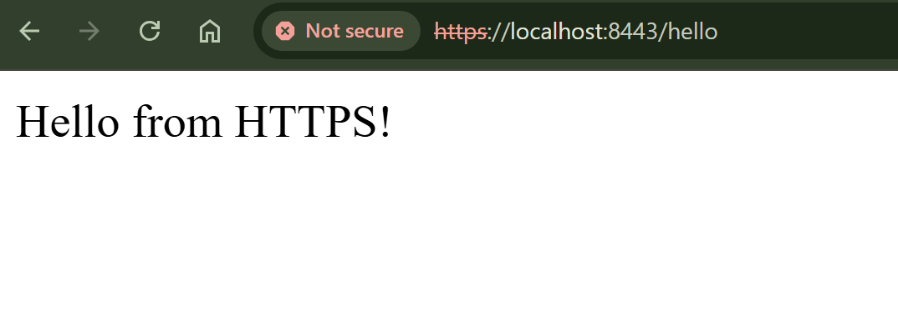

#### ✔️ Step 3: TLS Test & Result
I opened `https://localhost:8443/hello` in Chrome.

- Browser showed warning: `NET::ERR_CERT_AUTHORITY_INVALID` ✅
- I **did not bypass SSL/TLS verification**
- I clicked "Advanced → Proceed", and saw my response
- This shows the browser performed TLS verification but didn’t trust the self-signed CA

#### Notes
- I **did not disable TLS verification in Postman or browser settings**.

### 🔒 TLS Warning Screenshot (Self-signed cert)

