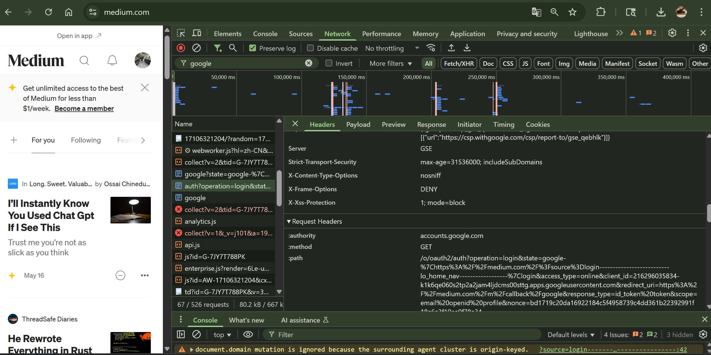
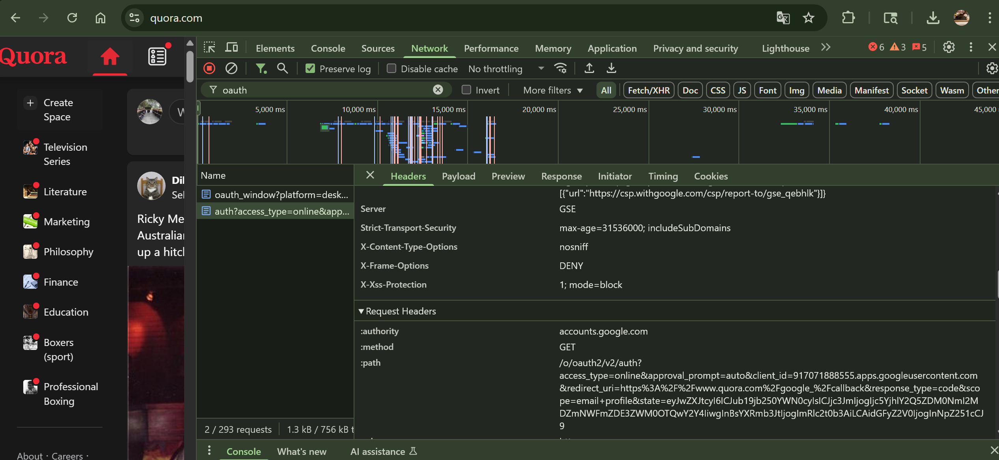

## Q9. Find at least TWO websites that use Google SSO and explain how it works

### 🌐 Website 1: Medium.com

Medium supports Google SSO (Single Sign-On). When clicking "Sign in with Google", the browser is redirected to:

- `https://accounts.google.com/o/oauth2/auth?...`
- This is an OAuth 2.0 flow with parameters like:
    - `client_id`
    - `redirect_uri`
    - `response_type=id_token`
    - `scope=email profile`
    - `nonce` etc.

After login, Google returns an `id_token` (JWT format) back to Medium through the redirect URI. Medium can verify this token to authenticate the user.

📸 Screenshot:

---

### 🌐 Website 2: Quora.com

Quora also supports Google login. Upon clicking "Continue with Google", similar requests to Google's OAuth endpoints are triggered:

- The browser initiates a GET request to:
    - `https://accounts.google.com/o/oauth2/v2/auth?...`
- Request headers include standard OAuth2 query parameters (`client_id`, `scope`, `redirect_uri`, etc.)

📸 Screenshot:

---

