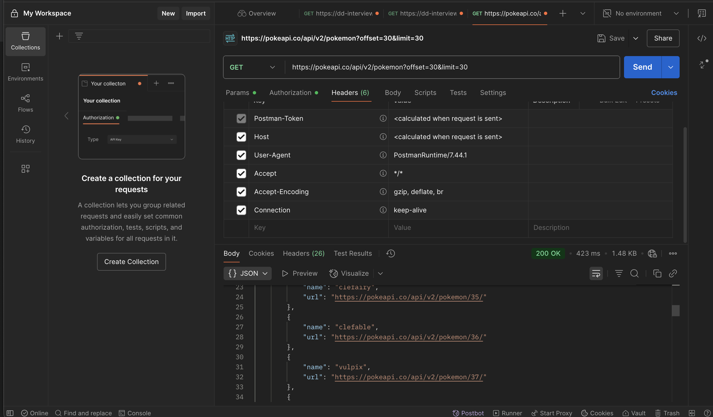
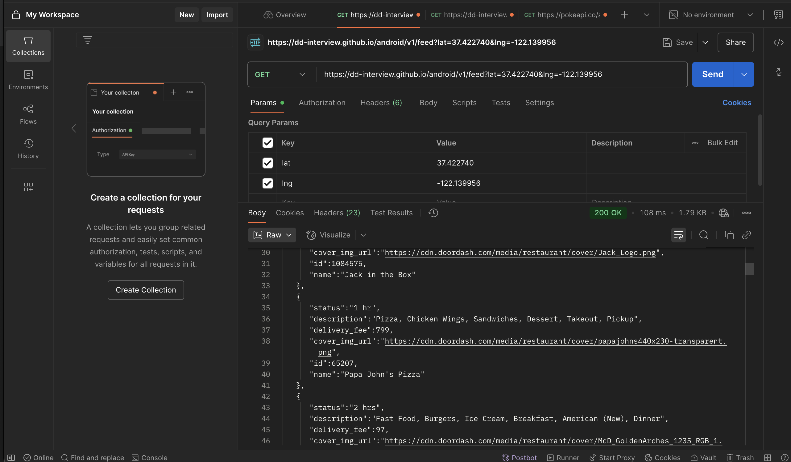
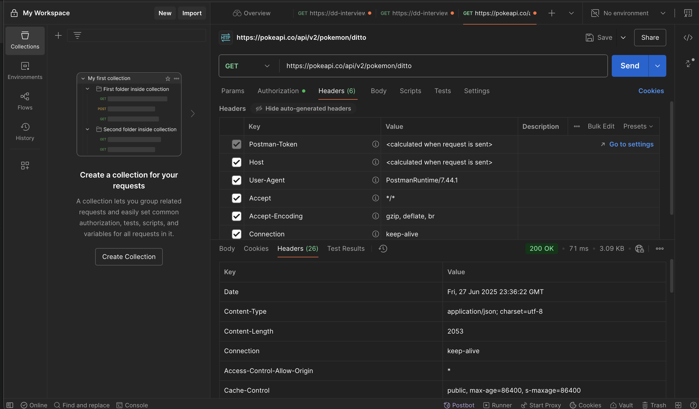

## 📡 API: Application Programming Interface

### ✅ What is an API?

An **API (Application Programming Interface)** is a **set of rules and protocols** that allows different software applications to communicate with each other.

It defines **what data can be requested**, **how to request it**, and **what kind of responses to expect** — acting as a **contract** between systems.

---

### 🔧 How APIs Work

Imagine an API as a **waiter** in a restaurant:

- You (client) make a request: "I want a burger."
- The waiter (API) takes your request to the kitchen (server).
- The kitchen prepares the response (burger).
- The waiter delivers the response back to you.

---

### 🧠 Why Do We Need APIs?

| Reason                           | Description                                                                 |
|----------------------------------|-----------------------------------------------------------------------------|
| 🔗 **Interoperability**          | Connects different systems and technologies                                |
| ⚡ **Efficiency**                | Enables reuse of business logic without rewriting it                       |
| 🧱 **Modularity**               | Frontend and backend can evolve independently                              |
| 📦 **Data Access & Sharing**     | Allows secure and structured access to data                                |
| 🚀 **Speed Up Development**      | Use third-party APIs (e.g., payments, maps, weather) instead of building from scratch |
| 📊 **Integration**               | Connect services (e.g., mobile app → cloud database via REST API)

## 🔄 Developer API vs Application API (Normal API)

| Feature            | Developer API                            | Application API (Normal API)          |
|--------------------|-------------------------------------------|----------------------------------------|
| 👨‍💻 Target User      | External **developers**                  | Internal **app components**            |
| 🔓 Access           | Exposed **publicly or via API keys**     | Used **privately** within application  |
| 📦 Purpose          | Allow 3rd-party devs to **integrate**    | Handle **app-to-app or module logic**  |
| 🌍 Examples         | Stripe, Google Maps, GitHub API          | Internal REST API for services         |
| 🔐 Auth             | Often uses **OAuth**, API keys           | May use **session tokens**             |
| 📄 Docs Required    | ✅ **Yes** – API documentation is essential | ❌ May not need external docs           |
| 💻 Format           | REST, JSON, GraphQL                      | REST, gRPC, RPC                        |

> ✅ **Developer APIs**: Designed for external integration  
> ✅ **Application APIs**: Power internal logic between app layers

## 3 - type of APIs

### Restful APIs, GraphQL, gRPC, WebSockets, MQTT, SOAP

## 4 - path variable vs request parameter 

| Feature                | Path Variable                          | Request Parameter                      |
|------------------------|----------------------------------------|----------------------------------------|
| 🔗 Location in URL      | Part of the **URL path**               | After `?` in the **query string**      |
| 📌 Syntax example       | `/users/{id}`                          | `/users?id=123`                        |
| 📦 Usage                | Identify a specific **resource**       | Filter, sort, paginate, or provide options |
| 🛠️ Access (Spring)       | `@PathVariable("id")`                  | `@RequestParam("id")`                  |
| 🌍 RESTful principle    | ✅ Follows RESTful best practices       | ⚠️ Optional for resource identification |
| 🔁 Can have multiple    | Yes, e.g. `/users/{userId}/orders/{orderId}` | Yes, e.g. `/users?page=1&size=10`      |
| ❓ Optional             | ❌ No (required by path)               | ✅ Often optional                      |
| 🧱 Use case             | `/products/42`                         | `/products?category=shoes&sort=price`  |

> ✅ Use **Path Variable** for required resource identifiers  
> ✅ Use **Request Parameter** for optional filters, search, or configs

## 5 - RESTful API ananomy 

 Component         | Description                                 | Example / Keywords                  |
|------------------|---------------------------------------------|-------------------------------------|
| 🌍 Base URI       | Root address of the API                     | `https://api.example.com/`          |
| 🔗 Resources      | Named endpoints representing data           | `/users`, `/products/123`           |
| 📦 HTTP Methods   | Actions on resources                        | `GET`, `POST`, `PUT`, `DELETE`      |
| 🧭 Path Variables | Required URL values                         | `/users/{id}`, `/orders/{orderId}`  |
| 🔍 Query Params   | Optional filters or modifiers               | `?sort=price&page=2`                |
| 📨 Request Headers| Metadata like format or auth                | `Content-Type`, `Authorization`     |
| 🧾 Request Body   | Data sent in `POST`/`PUT` requests          | JSON payload                        |
| 📬 Response       | Data + status returned by server            | JSON + status code (200, 404, etc.) |
| 🛡️ Status Codes   | HTTP response codes                        | `200 OK`, `201 Created`, `404 Not Found` |

## 6 cURL 
    curl is a commad_line tool used to send HTTP requestes to APIs for testing and debugging.
    postman provide a GUI, request history, environment management, mock server and easier auth handling. 
    make API testing faster and more orgnazied.

## 7 http status code
    - 200 succesful / OK : request succesfully responded
    - 400 bad request  / 404 not found : the request failed cuz client-side issue - 
            400: malformed request or invalid parameters 
            404 : entity/payload is not existed or endpoint is broken
    - 500 internal server error : the request failed - service down could be DB, micro service, anthing involved in backend stack

## 8 method 
    - GET: request to retrieve data from certain endpoint (read only, no body). 200 OK
    - PUT: request to update or replace existing data host on server side. 200 OK / 204 no content
    - POST: request to create new data of input parameter in the body. 201 created
    - DELETE: request to remove certain data from server. 200 OK / 204 no content

## 9 restful staleless
    REST API is stateless because each client request must contain all the necessary information for the server to process it, 
    and the server does not store any client context between requests.

## 10 the best practice for rest api design
    - Pagination: limit data returned per request to reduce payload size and improve response time.
    - Caching: use HTTP cache headers (e.g., ETag, Cache-Control) to prevent redundant server processing.
    - Compression: enable gzip or Brotli to reduce response size over the network.
    - Minimize Payload: return only required fields instead of full objects to reduce bandwidth usage.
    - Batch Requests: combine multiple operations into a single request where appropriate to reduce network calls.
    - Optimize Database Queries: ensure efficient queries with indexes and avoid N+1 query problems for fast data retrieval.
    - Asynchronous Processing: handle long-running tasks asynchronously and return job status endpoints.
    - Avoid Deep Nesting: flatten JSON responses where possible to simplify parsing and reduce payload.
    - Proper HTTP Status Codes: use correct status codes to avoid unnecessary retries or misinterpretation by clients.
    - Rate Limiting and Throttling: implement to protect backend performance and ensure fair usage among clients.

## 11 XSS and CSRF
    cross site scriping is an attack malicious scripts are injected into trusted websites, alloing attackeds to steal 
    cookies, session tokens or manipulate the DOM.
    key to prevent:
        escape and sanitize user input/output 
        use conent security policy (CSP) headers to restrict scripts 
        validate inputs strictly and avoid rendering raw HTML from untrusted sources. 
    
    cross site request forgery is an attack that tricks an auth user into executing unwated actions aon a web application 
    where they are logged in
    key to prevent:
        use anti-CSRF tokens in forms or headrs to validate legit request 
        same site cookie attribute to restrict cookie sending in cross-site requests 
        require re-auth for critical actions (password changes or payment)

## API analysis
    https://pokeapi.co/api/v2/pokemon/ditto
        pokeapi.co -> base URL
        api/v2/pokemon -> path
        path is ditto as search by name 
    https://pokeapi.co/api/v2/pokemon?offset=30&limit=30
        offset and limit -> parameter (optional)

    https://dd-interview.github.io/android/v1/feed?lat=37.422740&lng=-122.139956
        lat and lng -> parameter

    

    

### retrieve 30 pokemons skip first 30

### retrieve store feed by latitude and longtitude
    request header:
        postman-token: 
        user-agent: PostmanRuntime/7.44.1 -> identifyes the client application making the request 
        accept:
        accept-encoding:
        connection:
    
    respond header: 
        Connection keep-alive
        Content-Length 1113
        Server GitHub.com
        Content-Type application/octet-stream
        Last-Modified Mon, 14 Nov 2022 18:30:23 GMT
   

### retrieve pokemon by name
    

