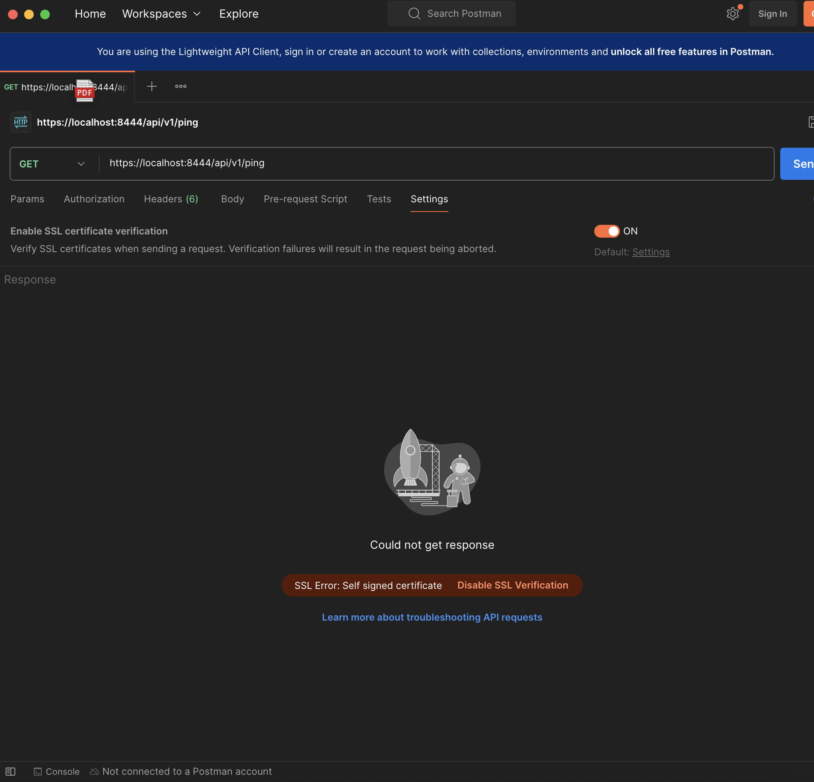
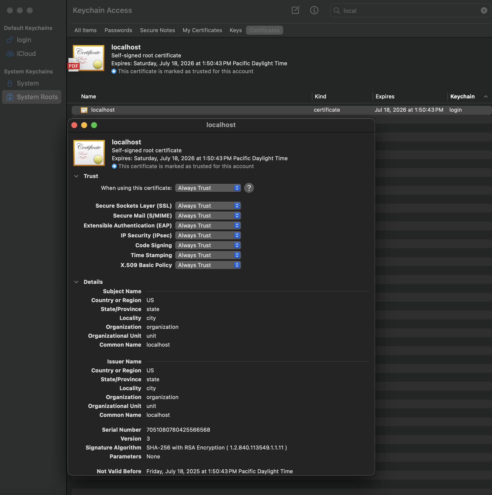
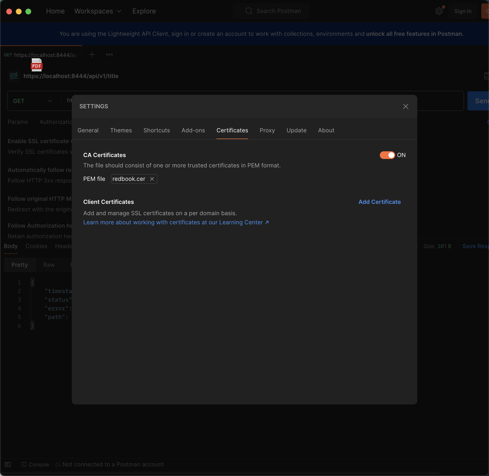
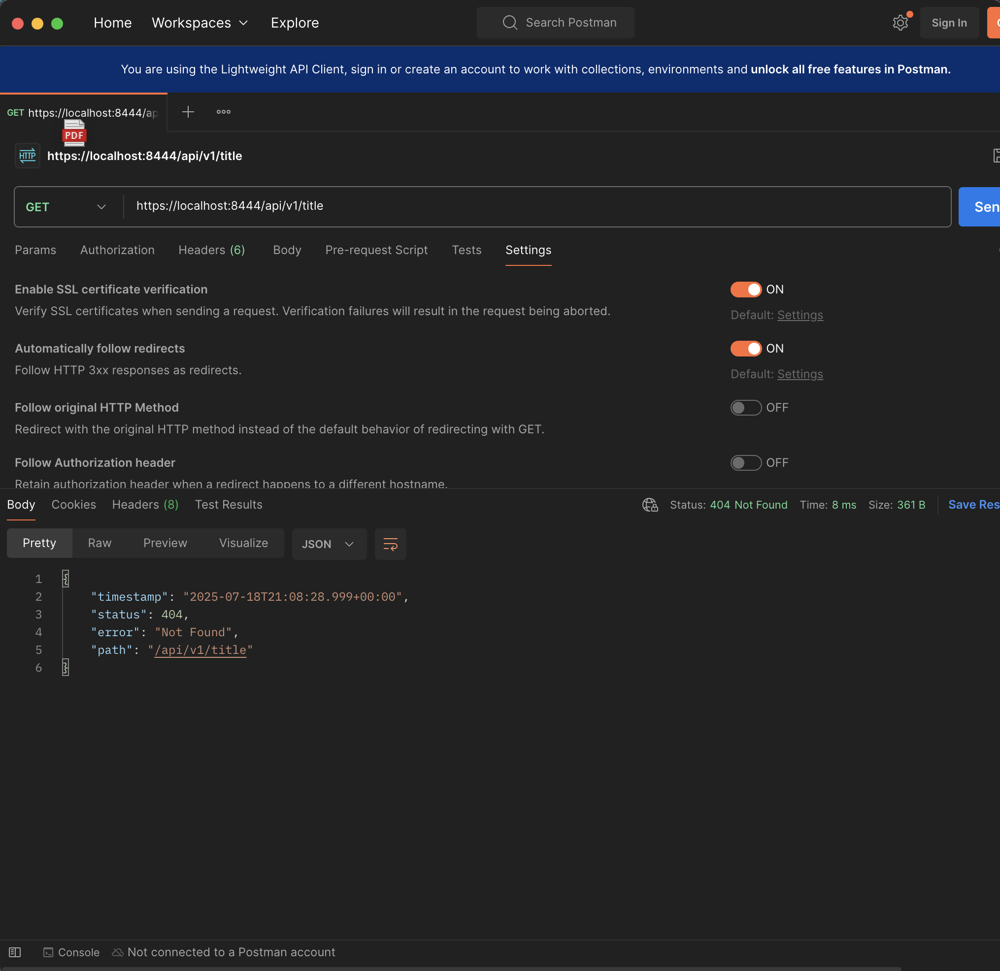
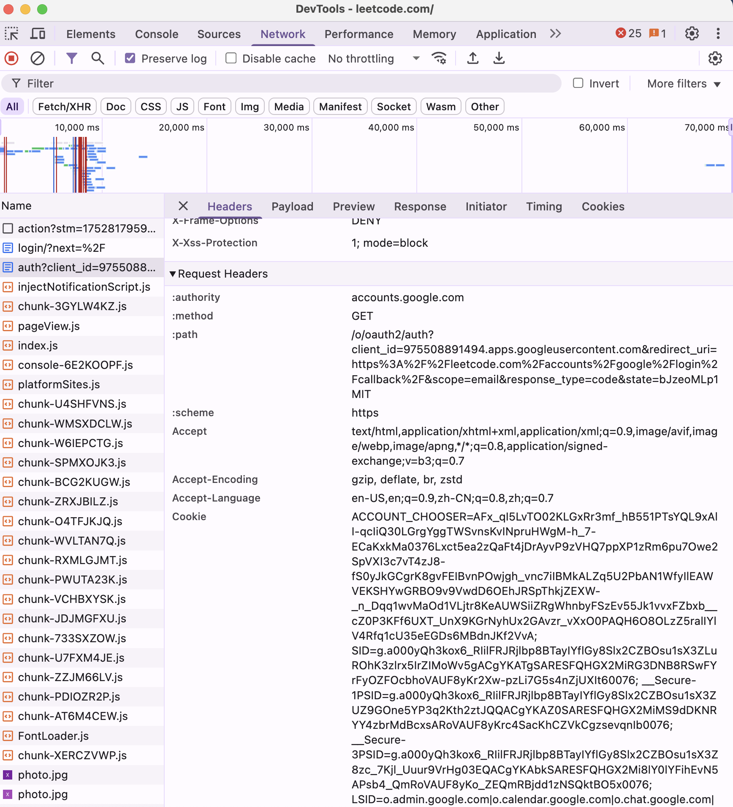
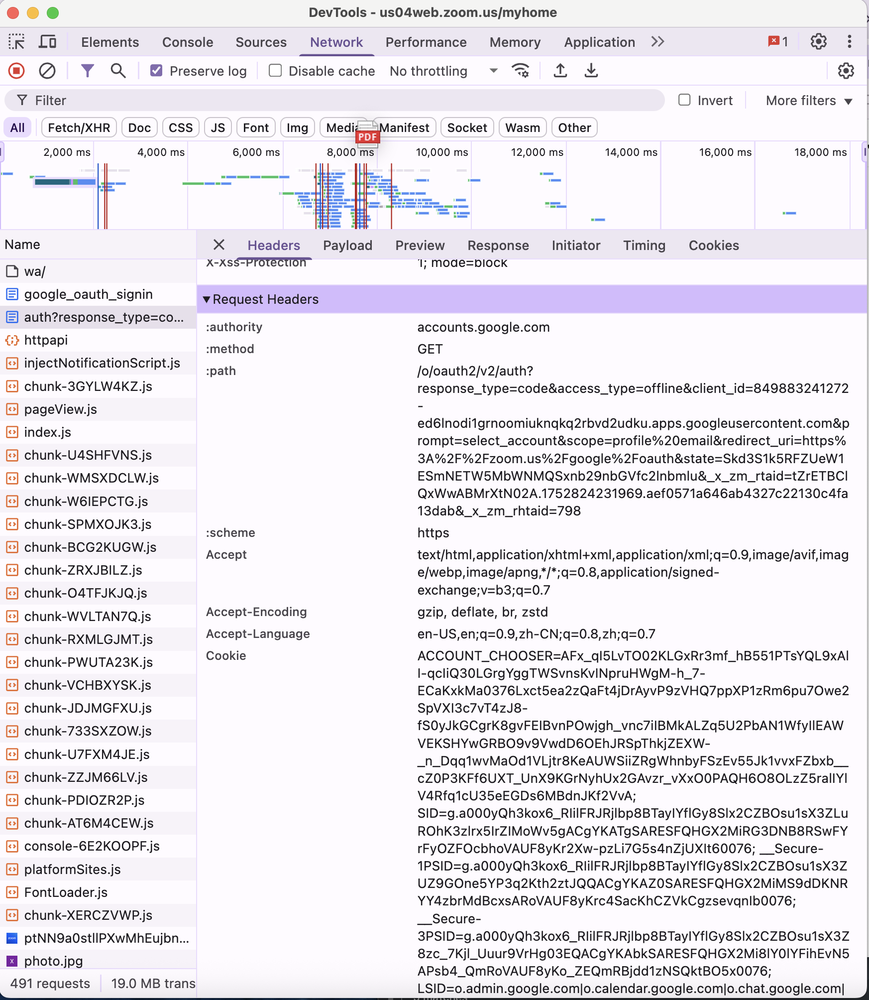

# List all of the annotations you learned from class and homework to annotaitons.md
YES

# Explain TLS, PKI, certificate, public key, private key, and signature.
- TLS: Transport Layer Security which is a security protocol that encrypts data between client and server.
- PKI: Public Key Infrastructure; PKI manages digital certificates and key pairs.
- Certificate: A digitally signed document—by a Certificate Authority (CA), binds an entity’s identity to its public key.
- public key: A key that everyone can access; used to encrypt data/verify signatures.
- private key: A confidential key held only by its owner; used to decrypt data/create signatures.
- signature: Data produced by your private key that anyone can verify with your public key.

# Write a Spring security based application, which provides https APIs (one simple get controller with empty response is good enough )instead of http, please generate a self-signed certificate to make your https TLS verfication work.
1. Pack your self-signed certificate in the form of jks file, as part of your application, name it properly
2. Test if you can verify your HTTPs api without importing the self-signed certificate to your local certificate chain, if not, explain why.
3. Explain what did you do to make https call work, do NOT bypass TLS/SSL verfication in Postman (this is cheating)!
Tutorial: https://www.baeldung.com/spring-channel-security-https
- Self‑signed certificate generation:
keytool -genkeypair \
  -alias redbook \
  -keyalg RSA -keysize 2048 \
  -storetype JKS \
  -keystore src/main/resources/keystore/redbook.jks \
  -validity 365

SpringBoot HTTPS configuration (application.properties):
server.port=8444
server.ssl.enabled=true
server.ssl.key-store=classpath:keystore/redbook.jks
server.ssl.key-store-password=password
server.ssl.key-store-type=JKS
server.ssl.key-password=password
server.ssl.key-alias=redbook

Export the public certificate:
keytool -export \
  -alias redbook \
  -file redbook.cer \
  -keystore src/main/resources/keystore/redbook.jks \
  -storepass password

- Generate the RSA key‑pair and configure SpringBoot for HTTPS, run the application. Initially you’ll see a “self‑signed certificate” error because the client doesn’t trust CA.
Export redbook.cer and import it into your loval Keychain, marking it “Always Trust.”
In Postman Settings → Certificates, turn SSL certificate verification on and add your CA certificate (PEM file) under CA Certificates.
Send an HTTPS request to https://localhost:8444/… and observe a successful TLS handshake (HTTP200/404/...).

- No – the client will reject the TLS handshake because the server’s self‑signed certificate isn’t in its trusted root store.

# list all http status codes that related to authentication and authorization failures.
- 401: unauthorized
- 403: forbidden
- 407: proxy authentication required
- 405: method not allowed

# Compare authentication and authorization? Name and explain important components in Spring security that undertake authentication and authorization
- authentication: "verify who the user is"
- authorization: "what an authenticated user can do"

authentication:
- UsernamePasswordAuthenticationFilter: Intercepts login requests, extracts username/password, and submits them for authentication.
- AuthenticationManager: Main interface for authentication; Delegates to AuthenticationProvider.
- AuthenticationProvider: Performs actual authentication logic; Validates credentials against user store.
- UserDetailsService: Loads user information from database/LDAP; Returns UserDetails object.
- PasswordEncoder: Encodes and validates passwords; BCrypt, SCrypt implementations.
- SecurityContextHolder: Holds the SecurityContext for the current thread or session.

- authorization:
- GrantedAuthority: Represents a permission or role granted to the user.
- SecurityMetadataSource: Defines which authorities are required to access a given resource.
- AccessDecisionManager: Makes final authorization decisions; Uses voters to decide access.
- SecurityExpressionHandler: Evaluates SpEL expressions like @PreAuthorize; Handles method-level security.
- FilterSecurityInterceptor: Intercepts requests for authorization; URL-based security configuration.
- MethodSecurittyInterceptor: Handles method-level authorization; Works with @Secured, @PreAuthorize.

# Explain HTTP Session?
- Session = Server-side storage that tracks user data across multiple HTTP requests
- HTTP is stateless protocol (server doesn't remember previous requests)
- Sessions solve this by binding user data with session ID
- ata stored on server-side for security

How it works:
- user visits (server create session ID) -> session ID sent to browser(via cookie) -> browser sends session ID with each request -> server uses session ID to retrieve user data.

# Explain Cookie?
- Cookie = Small text file stored on client-side (browser), can remember user information between requests, stored in client-side.

How Cookies Work:
- Server sends cookie(Set-Cookie) -> Browser automatically sends saved cookie -> Server reads cookie (retrieves stored information)

# Compare Session and Cookie?
| Feature     | Session   | Cookie  |
|-------------|-----------|---------|
| Storage     | Server    | Client  |
| Security    | High      | Low     |
| Size        | Unlimited | ~4KB    |
| Performance | Fast      | Slower  |

# Find at least TWO websites who can be logged in using your Google Account, explain in detail on how Google SSO works with screenshots like below, find SSO-related Rest calls in Chrome developer tool:
- 1. Leetcode (Browser → GET /o/oauth2/auth → Google login&consent → 302 redirect to /callback?code=… (get code) → BackendPOST/token (exchange token)→ Google returns tokens → Set‑Cookie LEETCODE_SESSION)

- 2. Zoom (Browser → GET /o/oauth2/auth)  -> Google login&consent -> POST https://accounts.google.com/_/signin/oauth -> GET https://accounts.google.com/signin/oauth/consent -> GET https://zoom.us/google/oauth -> GET https://zoom.us/google/oauth -> GET https://zoom.us/google/oauth -> get zm_token

# How do we use session and cookie to keep user information across the the application?
- Cookie: stored on the client; only holds a Session-ID. (e.g., JSESSIONID=ABC123)
- Session: stored on the server; holds all of the user’s data. (username, role, preferences)

Flow: 
Login → Create Session → Send Cookie (with Session ID) → Browser Stores Cookie → 
User Makes Request → Browser Sends Cookie (get session ID) → Server Finds Session Data → User Authenticated

# What is the spring security filter?
- A chain of security filters that intercept every incoming HTTP request to load the security context, authenticate the user, enforce authorization rules, and apply protections before it reaches your controllers.

How it works:
HTTP Request → Security Filter Chain → Your Controller

# Explain bearer token and how JWT works.
- bearer token: an access credential sent in the "Acuthorization: Bearer <token>" HTTP header.
- JWT: a self-contained bearer token in the form "header.payload.signature" that encodes user claims and is verified by its signature for stateless authentication.

# Explain how do we store sensitive user information such as password and credit card number in DB?
- Passwords: store only a salted, slow hash (e.g. BCrypt, Argon2); never plaintext.
- Credit Cards: use a PCI-compliant tokenization service (e.g. Stripe) or AES-256 encryption; store only the token and last four digits.

# Compare UserDetailService, AuthenticationProvider, AuthenticationManager, AuthenticationFilter?(把这⼏
个名字看熟悉也⾏)
- UserDetailService: Loads user-specific data
- AuthenticationProvider: Performs actual authentication logic to verify credentials
- AuthenticationManager: Routes authentication requests to its configured AuthenticationProvider(s)
- AuthenticationFilter: Intercepts incoming HTTP requests, extracts credentials, delegates authentication to the AuthenticationManager

# What is the disadvantage of Session? how to overcome the disadvantage?
- Disadvantages:
Sessions are stored in server memory, making it hard to scale across multiple servers, and sessions are lost if server restarts.

Overcome:
- External Session Storage: Put session data in a fast, shared cache (e.g. Redis)
- Stateless Authentication: Replace server-side sessions with signed tokens (e.g. JWT) passed in headers or cookies.

# how to get value from application.properties in Spring security?
- @Value("${name}")
- Environment.getProperty("name")
- @ConfigurationProperties(prefix = "name")

# What is the role of configure(HttpSecurity http) and configure(AuthenticationManagerBuilder auth)?
- configure(HttpSecurity http): Configures authorization - what an authenticated user can do (URL/role mappings, CSRF, session rules, login/logout, etc.)
- AuthenticationManagerBuilder auth: Configures authentication - who the user is (e.g. UserDetailsService, password encoders, in-memory/JDBC/LDAP users)

# Reading, 泛读⼀下即可，⾃⼰觉得是重点的，可以多看两眼。https://www.interviewbit.com/spring-security-interview-questions/#is-security-a-cross-cutting-concern
1. 1-12
2. 17 - 30
Yes
- digest authentication: It applies a hash function to username, password, HTTP method, and URI in order to send credentials in encrypted form. 
- some essential features of Spring Security: Authentication & Authorization; Detection and prevention of attacks;  Offers optional integration with Spring Web MVC; Java Authentication and Authorization Service(JAAS); Allows Single Sign-On(SSO)
- basic authentication (not secure): we send a username and password using the HTTP [Authorization] header to enable us to access the resource. Usernames and passwords are encoded using base64 encoding (not encryption) in Basic Authentication.
- Is security a cross-cutting concern?: yes, Spring security is also using Spring AOP (Aspect Oriented Programming) internally.
- AbstractSecurityInterceptor in spring security: handles the initial authorization of incoming requests. It has 2 concrete implementations: FilterSecurityInterceptor and MethodSecurityInterceptor.
- PasswordEncoder: 
encode(): It converts a plain password into an encoded form. 
matches(): It compares an encoded password from the database with a plain password (input by the user) that's been encoded using the same salting and hashing algorithm as the encoded password. 
- salting and its usage: Salting adds random data to passwords before hashing to prevent rainbow table attacks. Each password gets a unique salt, making identical passwords produce different hashes.
- method security and why do we need it: Method security provides fine-grained access control at the method level using annotations like @PreAuthorize and @PostAuthorize.（URL-level security isn't sufficient for complex business logic where access depends on user roles， data ownership, or specific conditions）
- OAuth2 Authorization code grant type: the way an application gets an access token.
- spring security OAuth2: permits client applications to access protected resources via an authorization server.

# Explain best practices to securely store secrets in applications.
- Never hard-code secrets in source code
- Use dedicated secret management services (AWS Secrets Manager, Azure Key Vault, HashiCorp Vault)
- Encrypt secrets at rest and in transit (https/TLS)
- Use separate secrets for different environments
- Rotate secrets regularly and monitor access to detect unauthorized usage