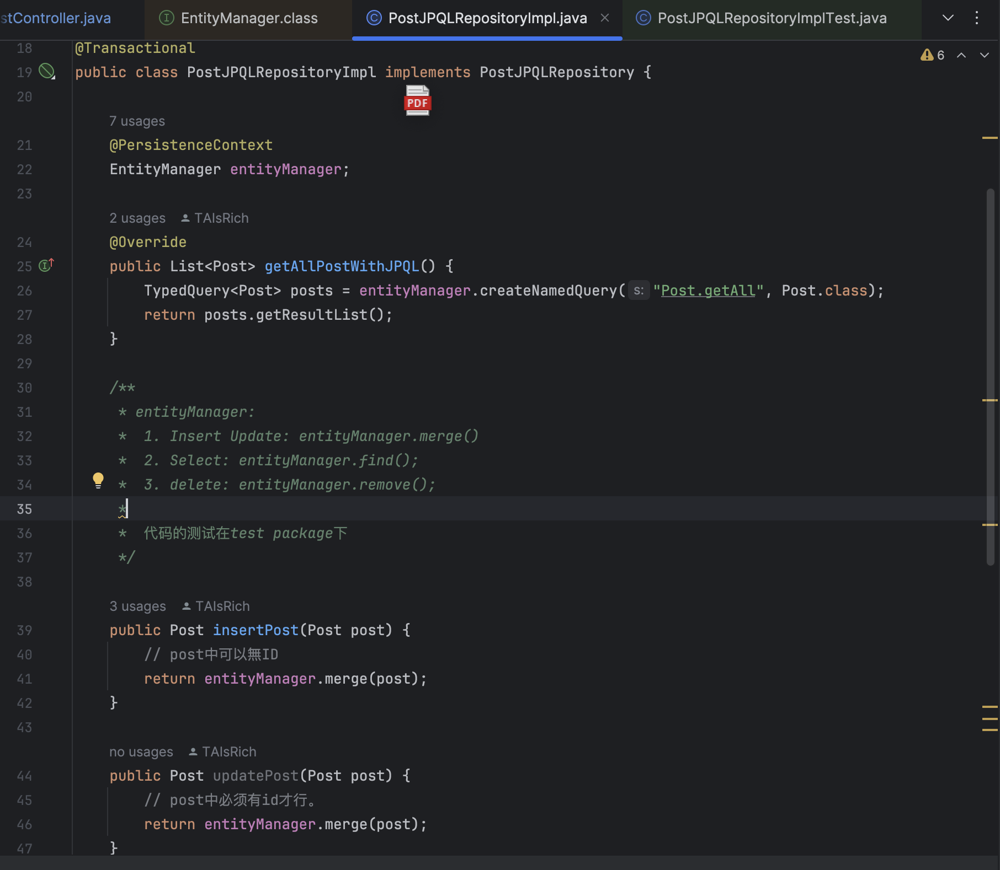
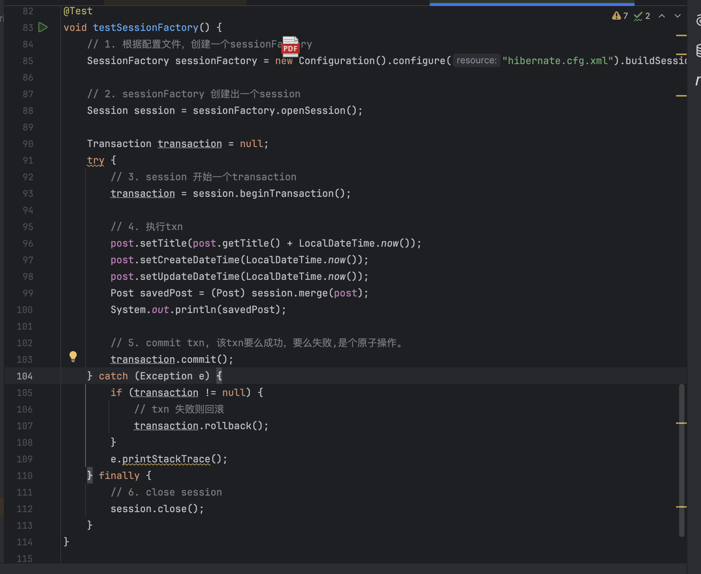

# Part 3: Core Conceptual Understanding
## Explain the differences and relationships among: Spring Data JPA, Hibernate, HikariCP, JDBC

Spring Data JPA: Interface that provides ready-made CRUD methods
Hibernate: JPA implementation and ORM framework that maps Java objects to database tables and auto-generates SQL
HikariCP: Database connection pool that manages and reuses database connections for better performance
JDBC: Low-level Java API for database operations, requires manual SQL writing

Spring Data JPA → Hibernate → HikariCP → JDBC → Database


## JPA Relationships： @OneToMany @ManyToOne @ManyToMany Also describe and explain the configuration properties inside each, such as mappedBy, cascade, and fetch.

@OneToMany: Lazy loading (Loads associated data only when accessed)
		 Typical use case: One User has many Posts.
		 mappedBy: Tells JPA who owns the relationship. This must match the field name in the @ManyToOne side
		 cascade: Controls whether operations (e.g., PERSIST, REMOVE) on the parent are propagated to the children.
		 fetch: Defaults to LAZY

@ManyToOne: eager loading (Loads associated data immediately)
		 Typical use case: Many Posts belong to one User.
		 fetch: Defaults to EAGER. Data is fetched immediately.
		 @JoinColumn: Defines the foreign key column in the database.

@ManyToMany: Lazy loading (Loads associated data only when accessed)
		 Typical use case: A Student enrolled in many Courses, and each Course has many Students.
		 @JoinTable: Specifies the join (middle) table used for mapping the relationship.
		 cascade: Used when you want changes in one side to cascade to the other.
		 fetch: Defaults to LAZY to avoid loading large collections unnecessarily.


## Cascade Options in JPA
### Explain cascade = CascadeType.ALL and orphanRemoval = true.
cascade = CascadeType.ALL
When I do something to the parent, do the same to the child automatically.

orphanRemoval = true
If a child is removed from the parent’s list, delete it from the database too (only works when you remove the child from the parent's collection）

### Also describe all other CascadeType values:
PERSIST: save parent -> also save children
MERGE: update parent -> update children
REMOVE: delete parent -> delete children
DETACH: Stop tracking parent -> also stop tracking children (from persistence context)
REFRESH: reload/refresh parent -> reload/refresh children (from DB）


## Fetch Types in JPA, Explain FetchType.LAZY and FetchType.EAGER, and describe when to use each.
FetchType.LAZY only load when needed (JPA does not fetch the related entity until you explicitly access it)
When you load a User, the posts list is not loaded until you call user.getPosts()

FetchType.Eager load immediately (JPA automatically loads the related entity right away with the parent)
When you load a Post, JPA also fetches the User it belongs to, even if you don't access it

LAZY: Large lists or collections, Relationships not always used
EAGER: Small or essential relationships, need immediate access


# Part 4: Querying and Data Access
## JPQL Overview
### Explain what JPQL is and how it differs from SQL. Include examples.

JPQL(an object-oriented query language) looks like SQL but works with Java classes and fields, not raw database tables. It's more portable and doesn’t need nativeQuery = true.

JPQL: Queries Java classes & fields, No need for nativeQuery = true, Portable across databases
```java
@Query("SELECT p FROM Post p WHERE p.title = ?1")
List<Post> findByTitle(String title);
```
Post is a Java class, title is its field.


SQL: Queries database tables & columns, Must add nativeQuery = true in JPA, Database-specific syntax
```java
@Query(value = "SELECT * FROM posts WHERE title = ?1", nativeQuery = true)
List<Post> findByTitle(String title);
```
posts is a table in the database, title is a column.


# Part 5: Hibernate and Entity Management
## EntityManager vs SessionFactory 
### Compare EntityManager and SessionFactory. Include screenshots from the codebase to illustrate their relationship.
EntityManager: JPA standard interface - Spring handles lifecycle automatically, declarative transactions (@Transactional)
SessionFactory: Hibernate factory - developer handles lifecycle manually, programmatic transactions (begin/commit/rollback)

（EntityManager = automatic management, SessionFactory = manual management）





## SessionFactory vs Session
### Explain the role of Session and how it differs from SessionFactory.
SessionFactory makes Sessions, Sessions do the work.
Simple Analogy：SessionFactory = Car Factory
			    Session = Individual Car


# Part 6: Database Fundamentals
## SQL Transactions
### Explain what a transaction is in the context of relational databases, and how Spring/Hibernate manage transactions.
Transaction: Ensures multiple database operations succeed or fail together. It follows ACID properties.

Spring (Transaction Manager):
		Manages transaction boundaries - when to start/end
		Coordinates business operations - entire workflow
		Declarative approach - @Transactional annotation

Hibernate (Transaction Executor):
		Handles database connections - low-level operations
		Executes actual SQL - CRUD operations
		Performs database transactions - real COMMIT/ROLLBACK

Spring and Hibernate work together: Spring decides when, Hibernate executes how. Spring/Hibernate handle transaction complexity automatically.


## Hibernate Caching
### Explain Hibernate’s caching mechanisms. Compare: First-Level Cache (session scope), Second-Level Cache (shared/global scope)
Caching stores frequently accessed data in memory to avoid repeated database queries. (good for read-heavy)

First-Level Cache (Session Cache): Session-level; Always enabled, cannot be disabled; Exists only during Session lifecycle; Not thread-safe

Second-Level Cache (SessionFactory Cache): Application-level (across all sessions); Must be explicitly configured; Exists until application shutdown; Thread-safe

Flow: First-level cache → Second-level cache → Database
