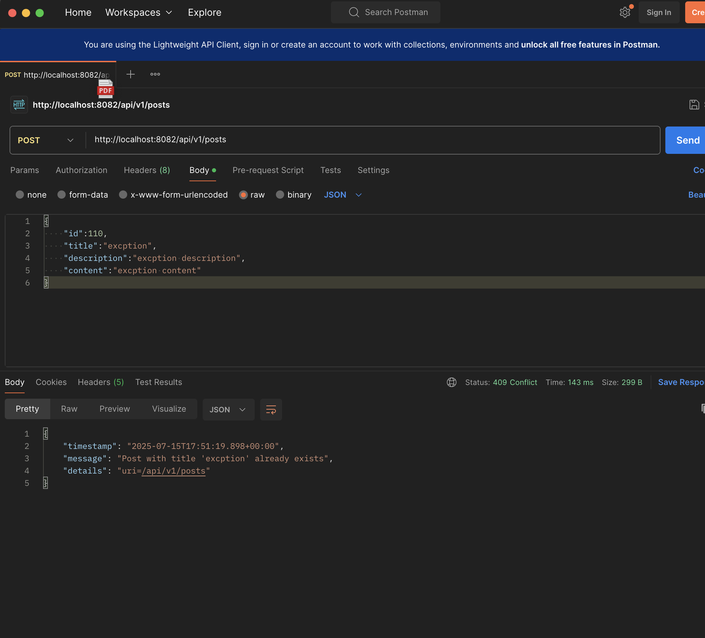
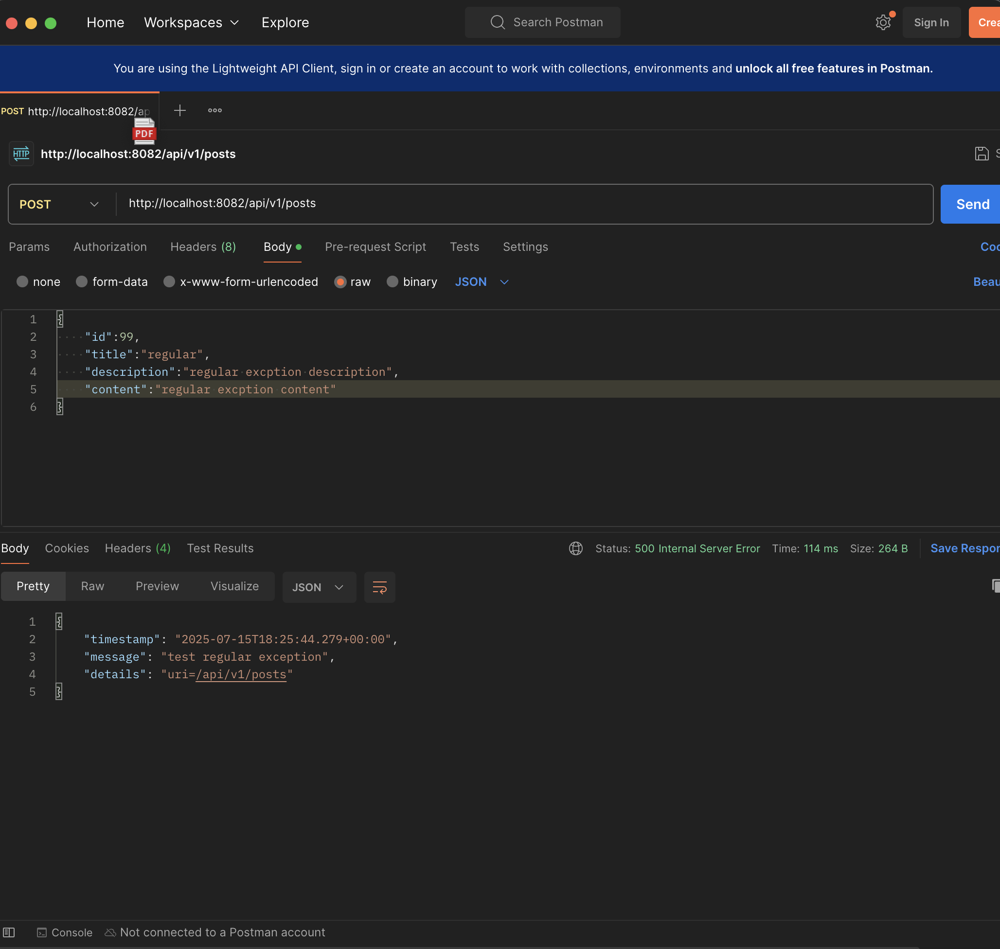
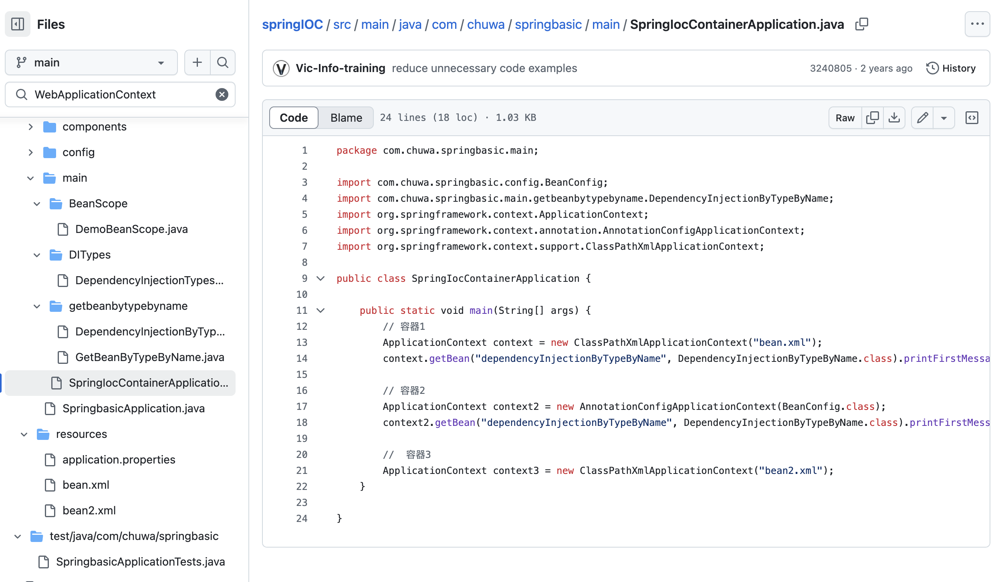
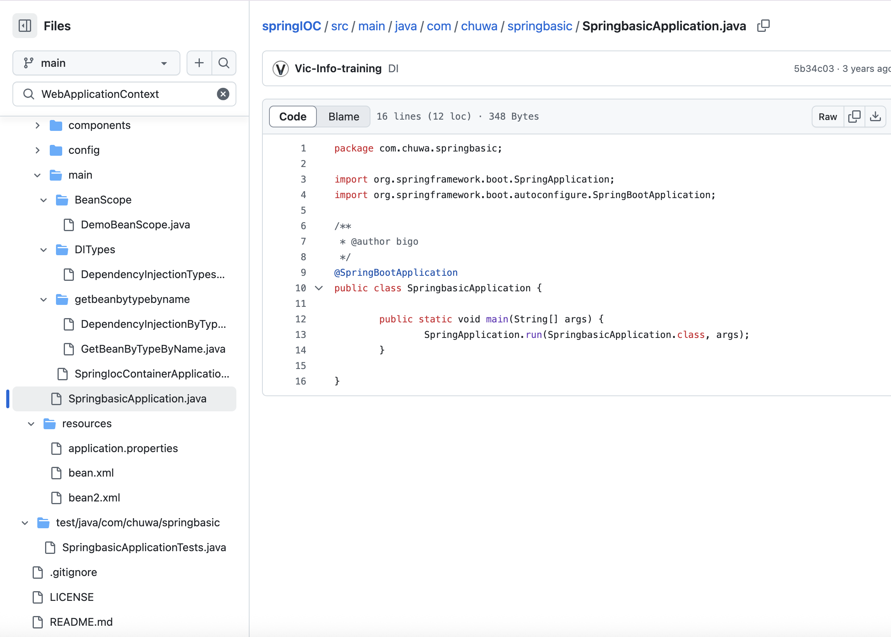

## Add newly learned annotations to your previous cheatsheet, add explainations for these annotations. Yes

## Walkthrough sample codes under https://github.com/CTYue/springboot-redbook/commits/06_mapper-exception, you are supposed to bring up the application on your local. Yes

## Explain why do we need model mappers in Spring, and in what scanrios we need it.
- Model Mappers automatically convert between Entity and DTO objects. It can hide sensitive fields (passwords, internal IDs) from API responses; no manual field-by-field copying; send only necessary data to frontend.
- Main Scenarios: 
API Responses: Convert Comment entity to CommentDto for JSON response.
Request Processing: Convert PostDto from request to Post entity for database.
Different API Versions: Same entity mapped to different DTO formats.


## Provide 3 examples in which model mapper will NOT map succesfully, explain why.
- 1. unmatching filed names: ModelMapper can't guess that fullName = firstName + lastName.
```java
// Entity
public class User {
    private String firstName;
    private String lastName;
}

// DTO  
public class UserDto {
    private String fullName;  // No matching field in Entity
}
```
- 2. Complex Data Type Conversion: ModelMapper can't convert Date to human-readable "time ago" format.
```java
//Entity
public class User{
	private Date createdAt;
}

//DTO
public class User{
	private String timeAgo; // like 2 hrs ago
}
```
- 3. Nested Object Flattening: ModelMapper doesn't know to extract author.name into authorName.
```java
// Entity - 复杂结构（对象里面有对象）
public class Comment {
    private Long id;
    private String body;
    private User author;  // 这里是完整的 User 对象
}

public class User {
    private String name;
    private String email;
}
// DTO - 简单结构（只要基本字段）
public class CommentDto {
    private Long id;
    private String body;
    private String authorName;  // 只要 User 的 name，不要整个 User
}
```


## Explain how model mapper cast different data types between source object and target class.
- Model Mapper uses reflection and type matching to automatically handle simple conversions, but complex business logic requires custom configuration.
- Automatic Conversions: int → String: 25 becomes "25"
						 Date→ String: Converts to default string format
						 List<Entity> → List<DTO>: Maps each element individually
- Manual Configuration Needed: Complex String Formatting(Date → "2 hours ago"; User → "John Doe" (needs field selection); Status.PUBLISHED → "Published")


## Add your own API exceptions so that when something wrong happens in service layer, your rest API will return your customized response and status code.



## Explain how Controller Advices work, is there any other approach to do same/similar global API exception handling?
- Controller Advices is Global Exception Interceptor. @ControllerAdvice creates a global handler that catches exceptions from ALL controllers in application.
- inheritance-based exception handling：
```java
public class GlobalExceptionHandler extends ResponseEntityExceptionHandler{}
```


## What's the difference between throwing a regular exception and a customized API exception that will be eventually thrown to Controller Advice codes? Please provide screenshots to explain your findings.
- Regular exceptions are generic and non-specific(default 500 status codes), while customized API exceptions are more precise and detailed (404, 409, 401).




## Write some regular expression to restrict the value of attributes that your Post or Comment can have. You may use https://regex101.com/ to construct and test/validate your regular expression.
@Pattern(regexp = "^[a-zA-Z0-9\\s.,!?-]{3,20}$", message = "Title must be 3-20 characters, only letters, numbers, space, punctations")
@Pattern(regexp = "^[a-zA-Z0-9_]{3,20}$", message = "Username must be 3-20 characters, only letters, numbers and underscore")
@Pattern(regexp = "^[^<>]{3,20}$", message = "Content cannot contain HTML tags" )


@Pattern(regexp = "^[^<>]*$", message = "Content cannot contain HTML tags"
## Explain Spring framework fundamental principles. And how can they help build business applications?
- Spring framework provides convenient wrapped methods and tools to help structure our code and build applications more efficiently. Core principles like dependency injection, inversion of control and aspect-oriented programming.
- How They Help Business Applications:
Faster Development - Pre-built components and minimal configuration
Better Structure - Clear separation of layers (Controller, Service, Repository)
Enterprise Ready - Built-in security, database access, and web services


## Explain different types of dependency injection, explain their suitable use cases, and why fielde injection is not recommended in general. Please provide necessary code snippets and screenshots if possible.
- constructor injection: It injects dependencies through the class constructor and is used for mandatory dependencies that the class cannot function without. 
```java
@Service
public class PostService {
    private final PostRepository postRepository;
    
    public PostService(PostRepository postRepository) {
        this.postRepository = postRepository;
    }
}
```
- setter injection: It injects dependencies through setter methods and is suitable for optional.
```java
@Service
public class PostService {
    private EmailService emailService;
    
    @Autowired
    public void setEmailService(EmailService emailService) {
        this.emailService = emailService;
    }
}
```
- filed injection: directly injects dependencies into class fields using @Autowired annotation, but this approach is not recommended because it makes unit testing difficult.
```java
@Service
public class PostService {
    @Autowired
    private PostRepository postRepository;  // Not recommended
}
```


## Explain different types of application context in Spring framework, with screenshots. You may take https://github.com/CTYue/springIOC for reference.
- ClassPathXmlApplicationContext: (Loads configuration from XML files in the classpath）
- AnnotationConfigApplicationContext：(Loads configuration from Java classes with annotations)
- WebApplicationContext:(Automatically created by Spring Boot for web applications)




## Compare @Component and @Bean and in which scenario they should be used.
- @Bean: is a method-level annotation used inside @Configuration classes where you manually write the code to create and configure objects. 
When to use @Bean: For third-party library objects, database connections, or any bean that requires custom configuration logic during creation.
- @Component：is a class-level annotation that you put directly on your own classes to tell Spring "automatically create and manage an instance of this class." 
When to use @Component: For your own simple classes like services, repositories, or controllers that don't need complex setup.


## Explain Spring bean scopes and how to pick the correct bean scope.
- Bean scope: determines how many instances of a bean Spring creates and how long they live in the application context.
- Singleton (default) - one instance for entire app, used for stateless services. Prototype - new instance every time, used for stateful objects. Request - one per HTTP request, for request data. Session - one per user session, for user data.
- How to choose: If the object doesn't store changing data, use singleton. If it stores data that shouldn't be shared, use prototype. For web-specific data, use request or session scopes.


## Explain the difference between bean id and bean class.
- bean id: is the unique name to identify the bean
- bean class: is the actual Java class type that defines the bean's structure and behavior
```java
@Component("postService")  // "postService" is the bean ID
public class PostService {  // PostService is the bean class
}

// Usage: (id, class)
PostService service = context.getBean("postService", PostService.class);
//  
```


## Explain that when a bean has multiple alternative implementations, how will Spring decide which bean implementation to inject/autowire?
Spring decides which one to inject based on this priority order:
- @Qualifier (highest priority) - explicitly specifies which bean to inject
- @Primary - marks the default bean when no qualifier is specified
- Bean name matching - matches variable name with bean ID
- Exception - throws error if none of the above resolve the conflict
- （ Only one @Primary is allowed per interface, but multiple @Qualifiers can be used for different injection points.）