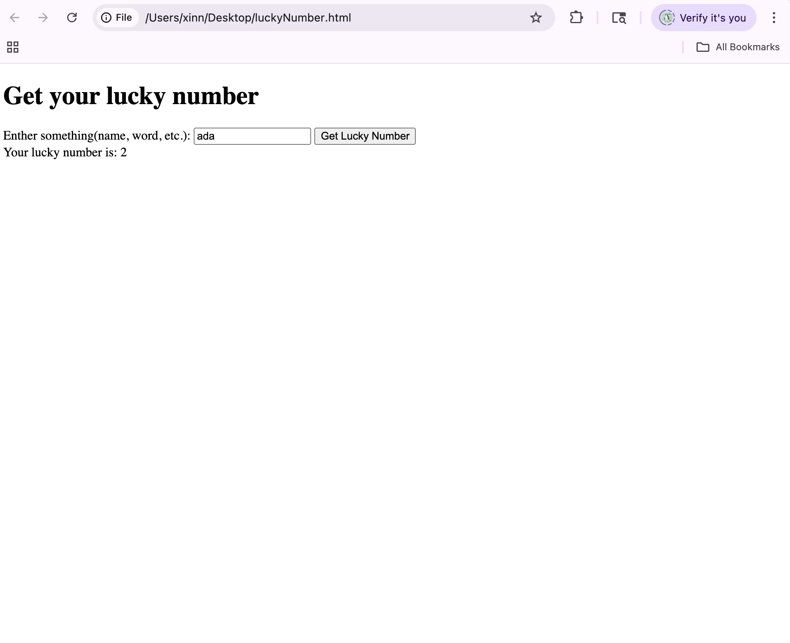
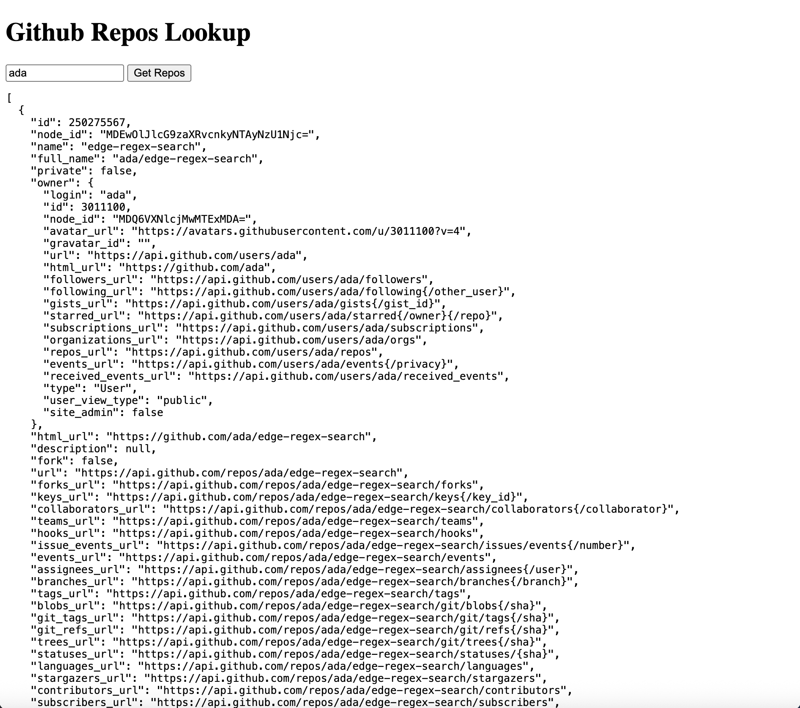

- 1. Read and practice all sample codes from 71-Dom-Bom-JavaScript-Typescript-Node.md on your local browser or an online compiler.
- 2. Resolve 5 leetcode problems using Javascript.

- 3. Compare let vs var , explain variable hosting with your own code examples.
var: Hoisted + initialized to undefined immediately → usable before declaration
let: Hoisted but uninitialized → error before declaration.

```javascript
console.log(a); // undefined
var a = 10;
console.log(a); // 10
```
```javascript
var a;          // hoisted and initialized to undefined
console.log(a); // undefined
a = 10;
console.log(a); //
```
```javascript
console.log(a); // ❌ Error
let a = 10;
console.log(a); // 10
```
```javascript
let a;          // hoisted but NOT initialized yet
console.log(a); // Error: can't access before initialization
a = 10;
console.log(a); //10
```


- 4. Explain closure with code example
Closure: happens when a function “remembers” the variables from the scope where it was created, even after that scope has finished running.
```javascript
function outer() {
	let counter = 0; //a variable in outer scope

	fcuntion inner(){
		counter++; // inner function can access to counter
		console.log(counter);
	}
	return inner;
}

const fn = outer();
fn(); //1
fn(); //2
fn(); //3
```


- 5. Explain Callback Hell with code example
Callback Hell: It’s when you have callbacks nested inside other callbacks, because each task depends on the result of the previous one.
```javascript
getUser(1, function(user){
	console.log("User:", user);

	getOrders(user.id, function(orders){
		console.log("Orders:", orders);

		getOrderDetails(orders[0], function(details){
			console.log("Order details:", details);

			processPayment(details, function(paymentResult){
				console.log("payment result:", paymentResult);
			});
		});
	});
});
```
how to avoid callback hell? 
With Promises (flatten the pyramid)
With async/await (looks like synchronous code)


- 6. Explain Promise, Async, Await with code examples.
Promise: is a object, which is a value that will be available later.
Async: async marks a function that returns a Promise.
Await: await pauses in that async function until the Promise settles.

```javascript
const p = new Promise((resolve, reject) => {
	setTimeOut(() => resolve("done"), 1000);
});
p.then(result => console.log(result));
````
```javascript
async function run(){
	const res = await p; //先等p完成
	console.log(res); //再进行这一行
}
run();
````


- 7. Write an HTML page that generates a lucky number based on the date, time, and user inputs. Users should be able to get their random lucky numbers by clicking a button or using the enter key after typing the input.

luckyNumber.html



- 8. Write an HTML page that returns a user's GitHub repos (https://api.github.com/users/{user_id}/repos) in JSON format. The web page should have a text box and a submit button where users can provide the GitHub user ID. The fetch call should be asynchronous. If the call to the above API fails for any reason, you should return a customized, user-friendly error message. If you know more than one approach to implement the asynchronous call, please do it using different approaches.

githubRepo.html



- 9. Explain how Javascript implement asynchronous non-blocking feature
	1. Particularly: Event Loop, Macrotask, and Microtask with code samples. Please submit code, answers, and screenshots to your GitHub branch.
JS is single-threaded; when you start an async operation, its callback goes into a task queue, and the event loop continuously checks the queue and runs tasks when the call stack is empty.（asynchronous non-blocking)
(JS implement asynchronous non-blocking: async/await through the event loop.)

Macrotask:
Macrotasks include events like setTimeout, setInterval, I/O tasks. They are processed one by one.

Microtask:
Microtasks include Promises (.then, .catch, .finally). They are executed after the current task and before the next macrotask.

```javascript
console.log('Start');  // Synchronous code

setTimeout(() => {
  console.log('Macrotask 1'); // Macrotask
}, 0);

Promise.resolve().then(() => {
  console.log('Microtask 1'); // Microtask
}).then(() => {
  console.log('Microtask 2'); // Microtask
});

setTimeout(() => {
  console.log('Macrotask 2'); // Macrotask
}, 0);

console.log('End');  // Synchronous code
```
```
Start            // 执行同步代码
End              // 执行同步代码
Microtask 1      // 执行micro队列中的第一个任务
Microtask 2      // 执行micro队列中的第二个任务
Macrotask 1      // 执行宏任务队列中的第一个任务
Macrotask 2      // 执行宏任务队列中的第二个任务
```


