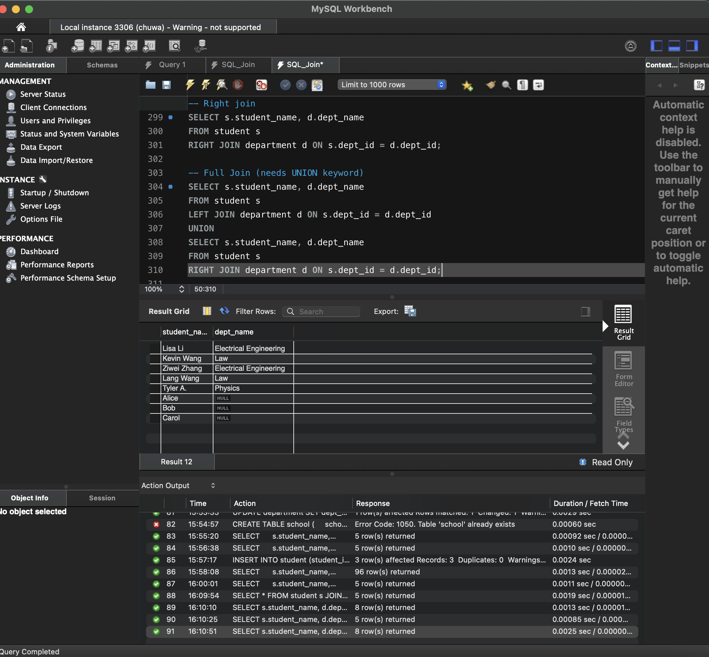

### Please try attached SQL queries (with same data and schema setup as above), explain why we need join keyword, and compare inner join, left join, right join, and full join.
Write your answers with screenshots in your markdown file. 

The `JOIN` keyword helps combine rows from multiple tables based on related columns. It makes relationships between tables clear and organized. JOIN compares values from a column in two tables, like dept_id, and decides which rows to keep in the result.

Assume we have `table1` and `table2`:
Inner Join: keeps rows where the column values match in both tables.
Left Join: keeps all rows from `table1`, and matches from `table2` if available.
Right Join: keeps all rows from `table2`, and matches from `table1` if available.
Full Join:  Keeps all rows from both `table1` and `table2`, matching where possible, and using `NULL` where not matched.

-- Manual Join: what will happen?
This manual join results in a Cartesian product of the three tables. Every row from student will be combined with every row from department and every row from school — regardless of any relationship.

-- With Join: compare results with above manual join
The JOIN gives the correct results by mapping the actual relationships between the tables, unlike the manual join which shows all combinations.

