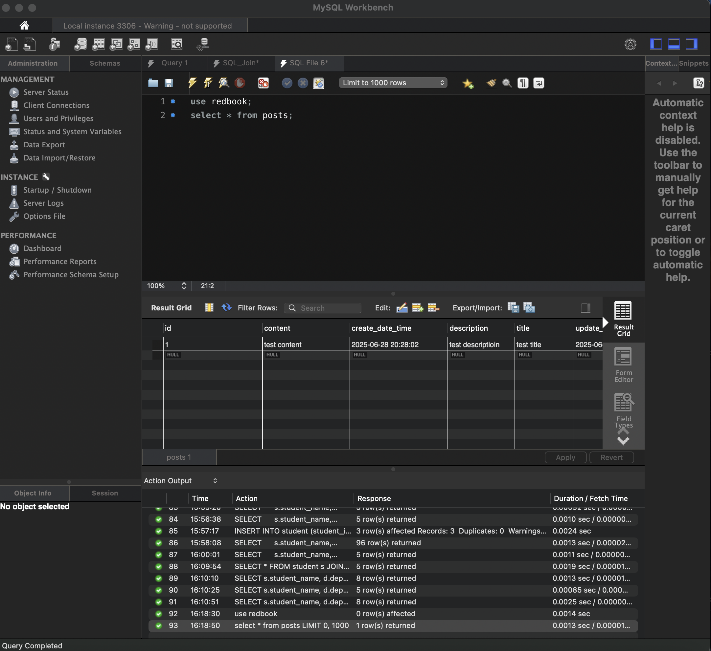

### posts screenshoot:


## Questions:
### 1. Did you create the table POSTS in the database? if not, who did it for you? Can I change this behavior? (Hint: look at the application.properties file)

No, the posts table was automatically created by Hibernate based on the @Entity class Post.java. This behavior can be controlled through the spring.jpa.hibernate.ddl-auto property in the application.properties file.


### 2. Is your id in the database same as what you set in your request? why does this happen? (Hint: search the annotations used in your code)

No, the databse id is generated by system, not taken from the request body. This happens because in the Post.java entity, the id field is annotated with:

```java
@Id
@GeneratedValue(strategy = GenerationType.IDENTITY)
private Long id;
```
This tells Hibernate to auto-generate the primary key.