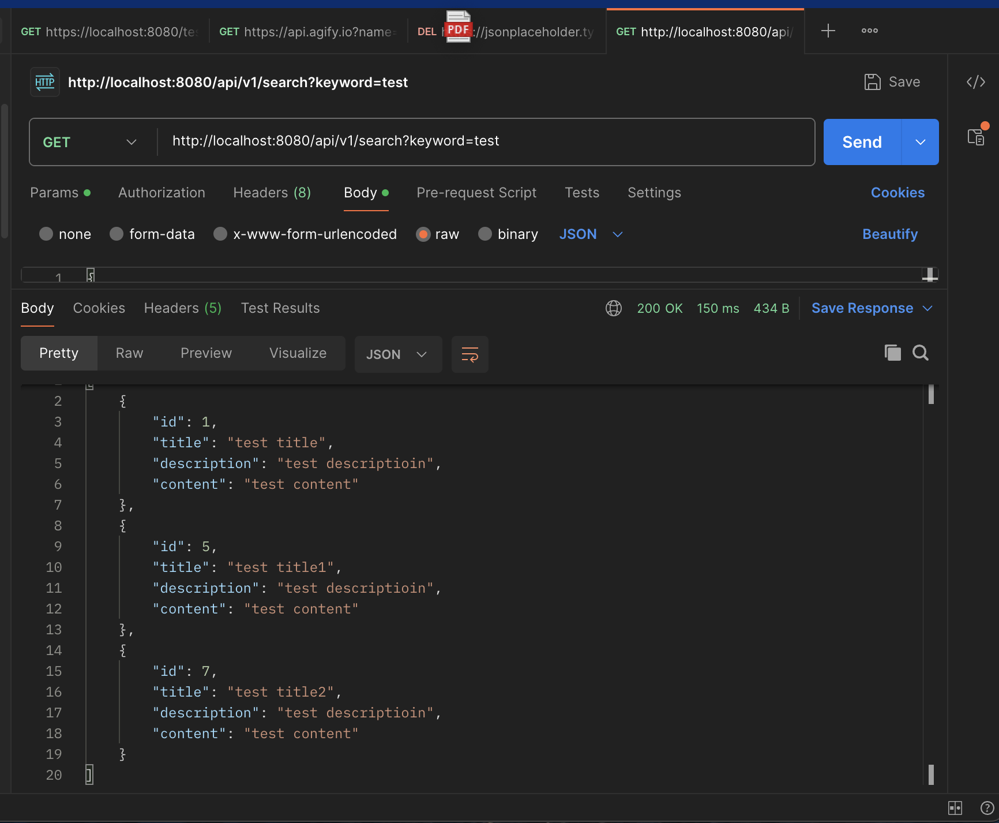

# Questions
### Why is it better to use a custom exception class (e.g. ResourceNotFoundException ) in your application?
Custom exception classes provide precise error handling, better code readability, and enable specific catch blocks for different error scenarios.

### Explain how @Table , @Column , and @Id work. What is the default behavior if you don’t use them?
In Java Persistence API (JPA), the annotations @Table, @Column, and @Id are essential for mapping Java entity classes to database tables and columns. 
@Table: defines the database table mapping(table name, schema)
@Column: maps an entity attribute to a database column with constraints(name, nullable, length, etc.).
@Id: specifies the primary key. (mandatory for all entities)

@Table uses class name as table name, @Column uses field name as column name, but @Id is always mandatory for entity mapping.

### What happens if you don’t annotate a class with @Entity , but still try to save it with JPA?
JPA throws an IllegalArgumentException with "Unknown entity" message because the class is not registered as a managed entity without the @Entity annotation.

### What happens if we forget to annotate a controller with @RestController and only use @RequestMapping ?
Spring won't recognize the class as a controller without @RestController,causing all @RequestMapping annotations to be ignored. It will result in 404 Not Found errors for all endpoints.

### What is the default naming strategy of JPA for tables and columns when no explicit name is given?
JPA uses the class name as the table name and field names as column names by default, maintaining the exact same formatting.

### How does @PathVariable differ from @RequestParam ?
@PathVariable extracts values from the URL path template, like /users/{id}; 
@RequestParam extracts values from query parameters, like ?name=john.

# Hands on:
### Write a method in a repository to find all posts with the title containing a certain keyword. (Create some
test posts if necessary)

