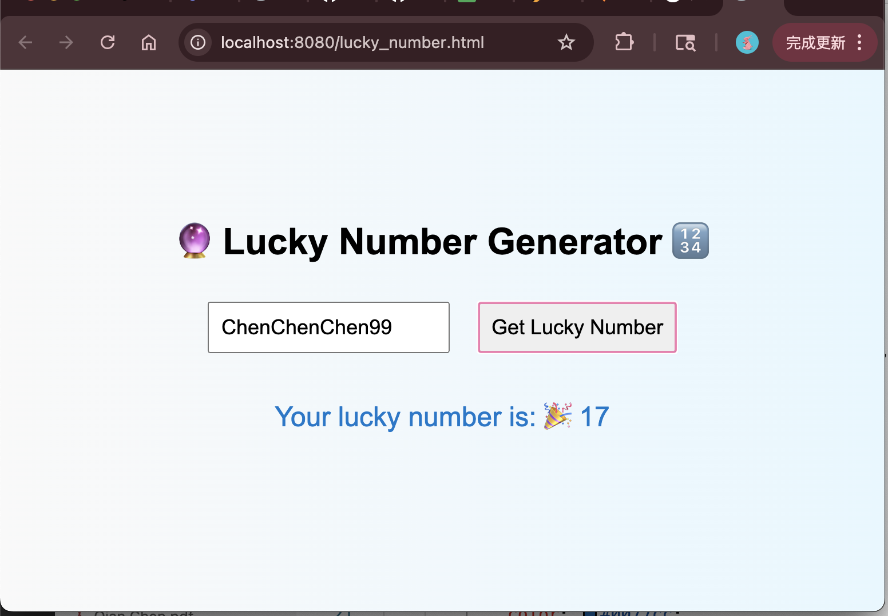
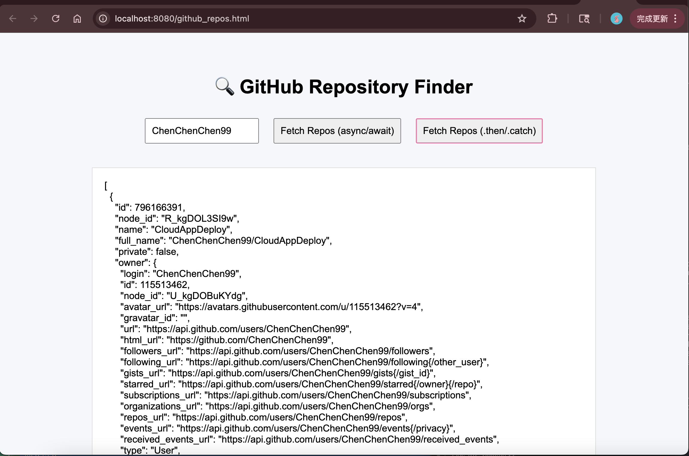

1. Read and practice all sample codes from 71-Dom-Bom-JavaScript-Typescript-Node.md on your local browser or an online compiler.

2. Resolve 5 leetcode problems using Javascript.

https://leetcode.com/problems/two-sum/submissions/1726597454

https://leetcode.com/problems/add-two-numbers/submissions/1726599593

https://leetcode.com/problems/longest-substring-without-repeating-characters/submissions/1726601113

https://leetcode.com/problems/median-of-two-sorted-arrays/submissions/1726610536

https://leetcode.com/problems/longest-palindromic-substring/submissions/1726611411

3. Compare let vs var , explain variable hosting with your own code examples.

Scope Differences:

```
function testScope() {
    if (true) {
        var x = 10;
        let y = 20;
    }
    console.log(x); // 10 (function scoped)
    console.log(y); // ReferenceError (block scoped)
}

testScope();
```
Re-declaration:

```
var a = 1;
var a = 2; // No error
console.log(a); // 2

let b = 1;
let b = 2; // SyntaxError: Identifier 'b' has already been declared

```

Hoisting:

```
// var is hoisted and initialized to undefined
console.log(a); // undefined
var a = 5;

let is hoisted but not initialized
console.log(b); // ReferenceError: Cannot access 'b' before initialization
let b = 5;
```

4. Explain closure with code example

A closure is created when a function remembers and accesses variables from its lexical scope, even after the outer function has finished executing. A closure allows a function to remember variables from the place where it was defined, not where it was called.

```
function outerFunction() {
    let count = 0;

    function innerFunction() {
        count++;
        console.log("Count:", count);
    }

    return innerFunction;
}

const myCounter = outerFunction();

myCounter(); // Count: 1
myCounter(); // Count: 2
myCounter(); // Count: 3
```

Each call to outerFunction() creates a new closure with its own private count.

```
const counterA = outerFunction();
const counterB = outerFunction();

counterA(); // Count: 1
counterA(); // Count: 2
counterB(); // Count: 1
```

5. Explain Callback Hell with code example

Callback Hell happens when you have many nested callback functions, making your code: hard to read, hard to debug and hard to maintain

```
function getUser(userId, callback) {
    setTimeout(() => {
        console.log("Fetched user");
        callback({ id: userId, name: "Alice" });
    }, 1000);
}

function getPosts(user, callback) {
    setTimeout(() => {
        console.log("Fetched posts for", user.name);
        callback(["Post 1", "Post 2"]);
    }, 1000);
}

function getComments(post, callback) {
    setTimeout(() => {
        console.log("Fetched comments for", post);
        callback(["Comment A", "Comment B"]);
    }, 1000);
}

// Callback hell 
getUser(1, function(user) {
    getPosts(user, function(posts) {
        getComments(posts[0], function(comments) {
            console.log("Comments:", comments);
        });
    });
});

// Output:
// Fetched user
// Fetched posts for Alice
// Fetched comments for Post 1
// Comments: [ 'Comment A', 'Comment B' ]
```

6. Explain Promise , Async , Await with code examples.

A Promise is an object representing the eventual completion or failure of an asynchronous operation.

```
function getUser(userId) {
    return new Promise(resolve => {
        setTimeout(() => {
            console.log("Fetched user");
            resolve({ id: userId, name: "Alice" });
        }, 1000);
    });
}

function getPosts(user) {
    return new Promise(resolve => {
        setTimeout(() => {
            console.log("Fetched posts for", user.name);
            resolve(["Post 1", "Post 2"]);
        }, 1000);
    });
}

function getComments(post) {
    return new Promise(resolve => {
        setTimeout(() => {
            console.log("Fetched comments for", post);
            resolve(["Comment A", "Comment B"]);
        }, 1000);
    });
}

// Chaining promises
getUser(1)
    .then(user => getPosts(user))
    .then(posts => getComments(posts[0]))
    .then(comments => console.log("Comments:", comments));
```

async and await

* async makes a function always return a Promise.

* await pauses the execution of an async function until the Promise is resolved.

```
async function main() {
    const user = await getUser(1);
    const posts = await getPosts(user);
    const comments = await getComments(posts[0]);
    console.log("Comments:", comments);
}

main();
```

7. Write an HTML page that generates a lucky number based on the date, time, and user inputs. Users should be able to get their random lucky numbers by clicking a button or using the enter key after typing the input.



[lucky_number](../../Coding/HW19/lucky_number.html)

8. Write an HTML page that returns a user's GitHub repos (https://api.github.com/users/{user_id}/repos) in JSON format. The web page should have a text box and a submit button where users can provide the GitHub user ID. The fetch call should be asynchronous. If the call to the above API fails for any reason, you
should return a customized, user-friendly error message. If you know more than one approach to implement the asynchronous call, please do it using different approaches.



[github_repos](../../Coding/HW19/github_repos.html)

9. Explain how Javascript implement asynchronous non-blocking feature
	1. Particularly: Event Loop, Macrotask, and Microtask with code samples.
Please submit code, answers, and screenshots to your GitHub branch.


