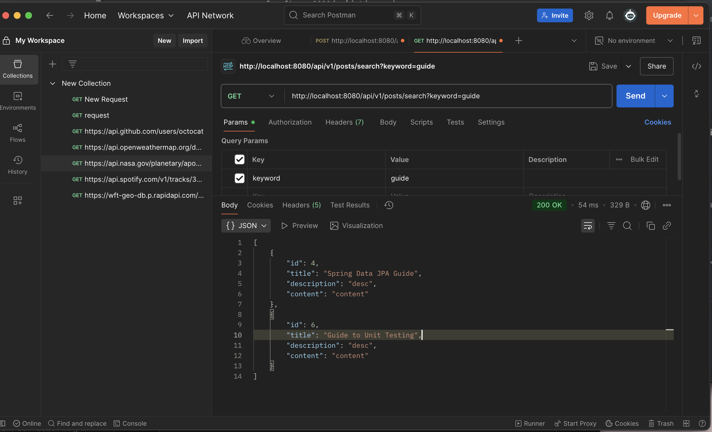

# Spring & JPA Interview Q&A

## 1. Why is it better to use a custom exception class (e.g. `ResourceNotFoundException`)?

**Answer**

- **Semantic clarity** – The class name communicates the business meaning of the error.
- **Granular error handling** – Callers can catch just that exception.
- **API contract** – Declaring the custom exception documents method behavior.
- **Framework mapping** – e.g., in Spring Boot, annotate with `@ResponseStatus(HttpStatus.NOT_FOUND)` to map to HTTP 404.
- **Maintainability** – Future metadata (correlation id, extra fields) can be added in one place.

> *Avoid flooding the codebase with dozens of single‑use exceptions; group logically related cases.*

## 2. Explain how `@Table`, `@Column`, and `@Id` work. What is the default behavior if you don’t use them?

**Answer**

| Annotation            | Purpose                                                      | Default if omitted                                           |
| --------------------- | ------------------------------------------------------------ | ------------------------------------------------------------ |
| `@Table(name = "…")`  | Maps the entity to a specific database table.                | Table name = entity class name converted by the JPA naming strategy (e.g., `UserAccount` → `user_account`). |
| `@Column(name = "…")` | Maps a field to a specific column; allows length, nullability, etc. | Column name = field name converted by naming strategy; column definition inferred from Java type. |
| `@Id`                 | Marks the primary‑key attribute; often combined with `@GeneratedValue`. | **Required**. Without it, the provider cannot determine the primary key and will throw `MappingException` at startup. |

## 3. What happens if you don’t annotate a class with `@Entity`, but still try to save it with JPA?

**Answer**

The class is **not managed** by the persistence provider. Attempting to persist such an instance results in `IllegalArgumentException: Unknown entity: com.example.MyClass` (Hibernate) during runtime, because the provider’s metadata does not contain that class.

## 4. What happens if we forget to annotate a controller with `@RestController` and only use `@RequestMapping`?

**Answer**

- Without `@RestController` (or `@Controller`), Spring **does not detect the class as a controller bean** during component scan, so no request mappings are registered → requests return 404.
- Annotating with `@Controller` but not `@ResponseBody` results in Spring treating return values as **view names** instead of HTTP bodies, leading to `404 View` errors unless matching views exist.

## 5. What is the default naming strategy of JPA for tables and columns when no explicit name is given?

**Answer**

Since Hibernate 5 / Spring Boot 2:

1. **PhysicalNamingStrategyStandardImpl**  
   - Transforms Java identifiers to *snake_case*, preserving dots for embedded paths.  
     `UserAccount.emailAddress` → table `user_account`, column `email_address`.

2. **ImplicitNamingStrategyJpaCompliantImpl**  
   - If no explicit name is declared, table = entity name, column = attribute name before physical conversion.

Different providers may vary, but the general rule is *camelCase → snake_case* with lowercase.

## 6. How does `@PathVariable` differ from `@RequestParam`?

| Aspect          | `@PathVariable`                                              | `@RequestParam`                                     |
| --------------- | ------------------------------------------------------------ | --------------------------------------------------- |
| Source          | Segment of the **URL path**                                  | Key‑value pair in the **query string** or form data |
| Syntax example  | `/users/{id}` → `/users/42`                                  | `/users?id=42`                                      |
| Use case        | Identifies a specific resource as part of hierarchy (RESTful) | Optional filters, pagination, search params         |
| Encoding        | Must fit path rules; often not encoded                       | URL‑encoded key/value                               |
| Multiple values | Typically one per variable                                   | `?tag=a&tag=b` maps to `List<String>`               |

---

## Hands on

Write a method in a repository to find all posts with the title containing a certain keyword. (Create some test posts if necessary)

