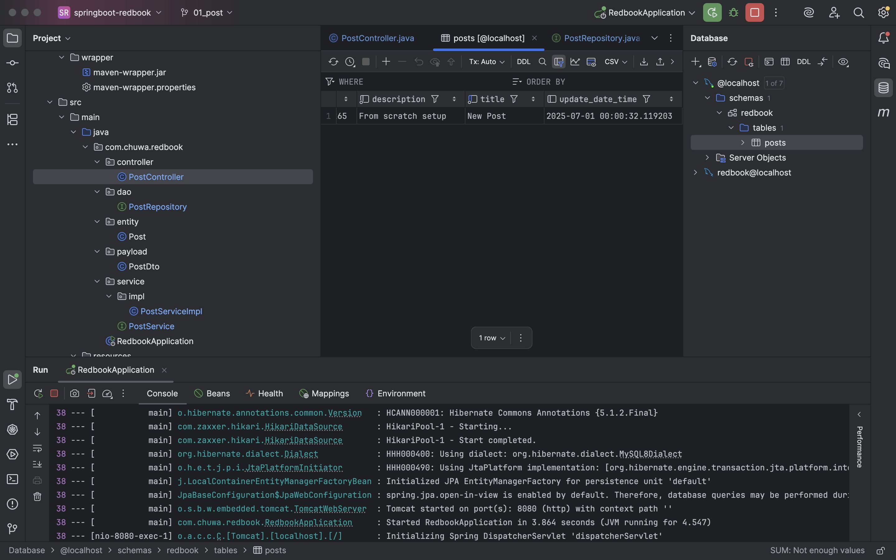
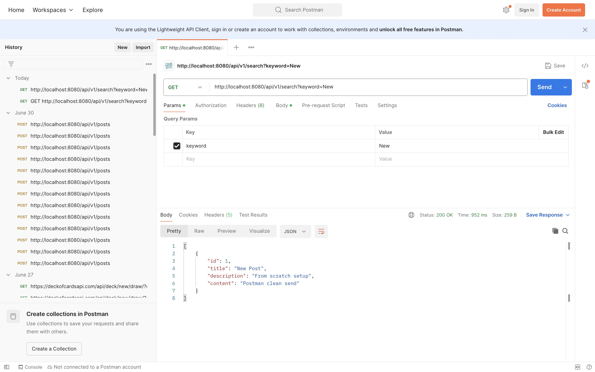

# Chuwa hw9

## Question 1

- **Clear and Meaningful Errors**
    - Expresses the exact problem (e.g., "Post with ID 42 not found").
- **Centralized Error Handling with `@ControllerAdvice`**
    - Allows mapping specific exceptions to HTTP responses like `404 Not Found`.
- **Cleaner and Reusable Code**
    - Prevents duplication and makes error handling consistent across layers.
- **Easier Debugging and Logging**
    - Custom fields (e.g., resource name, ID) help pinpoint issues quickly.
- **Improved API Experience**
    - Produces user-friendly and consistent JSON error responses for frontend/API consumers.

## Question 2

| Annotation | Purpose | Default If Omitted |
| --- | --- | --- |
| `@Table` | Maps entity to table | Uses class name as table name |
| `@Column` | Maps field to column | Uses field name as column name |
| `@Id` | Marks primary key | ❌ Required — error if missing |

## Question 3

If you try to `save()` a class that is **not annotated with `@Entity`**, JPA/Hibernate will **throw a runtime exception** at startup or when trying to persist.

## Question 4

**Spring will NOT detect it as a controller**, and your endpoints will not be exposed at all.

## Question 5

| Java Class or Field | Maps To (DB Name) |
| --- | --- |
| `Post` | `post` (table) |
| `PostCategory` | `post_category` (table) |
| `createDateTime` | `create_date_time` (column) |
| `title` | `title` (column) |

## Question 6

| Annotation | Used for... | Example URL |
| --- | --- | --- |
| `@PathVariable` | Capturing **values from the path** | `/posts/42` |
| `@RequestParam` | Capturing **values from query params** | `/posts?id=42` or `/search?title=hello` |

| Feature | `@PathVariable` | `@RequestParam` |
| --- | --- | --- |
| Comes from | URL path segment | URL query string |
| Typical use case | Resource IDs, nested resources | Search/filter parameters |
| Example | `/posts/5` | `/posts?id=5&sort=desc` |
| Optional? | Not optional unless specified | Optional by default (can add `required=false`) |

# Hands On

