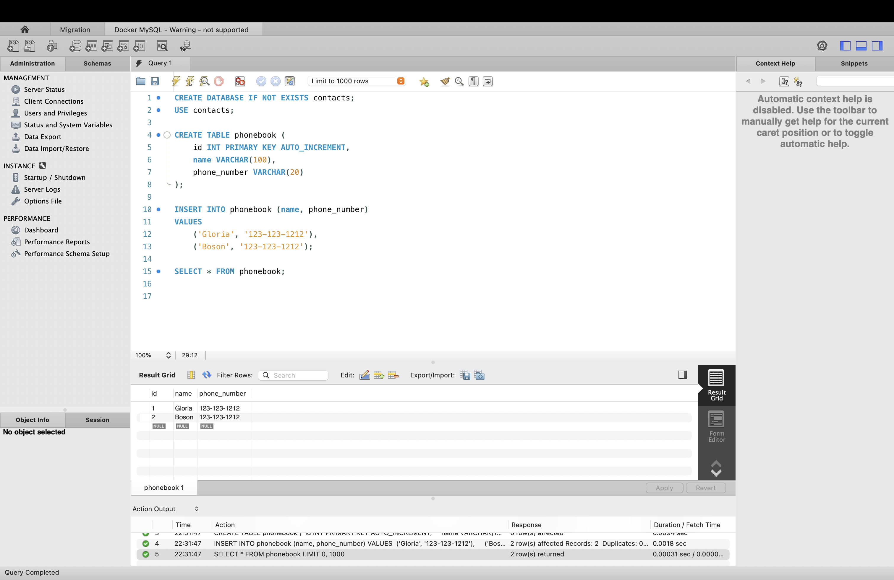
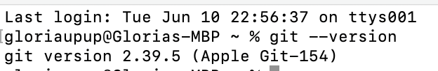

# HW1: Git Tool Setup & Practice

## ✅ 1. All Tools Setup

- Setup necessary tools
  - Except for Maven, all tools have been successfully installed

  - **Contacts Table** completed in MySQL Workbench. ⬇️
  

---

## ✅ 2. Git CLI Setup
📸 Screenshot: 
- 
---

## ✅ 3. Practiced Git Branching

Used: [https://learngitbranching.js.org/?locale=en_US](https://learngitbranching.js.org/?locale=en_US)

- Completed basic and advanced Git branching exercises
- Understood commit trees, branching, merging

📸 Screenshot:

---

## ✅ 4. Submission

- This file and screenshots were committed and pushed to:
  > 🔗 `ruihan_wang` on `Josh J's repo`