# Ryan Ma HW10 Answers


### 1. Spring Annotation Cheatsheet
[springAnnotationCheatsheet.md](springAnnotationCheatsheet.md)

### 2. Setup Starter Project & Test APIs
2.1 Clone the following repository: [Repo](https://github.com/CTYue/springboot-redbook/tree/05_02_slides_JPQL_EntityManager_Session)

2.2 Make the necessary code/configuration changes to bring up the application.
- Edit application.properties file
```properties
server.port=8088
# datasource
spring.datasource.url=jdbc:mysql://localhost:3306/redbook?useSSL=false&serverTimezone=UTC
spring.datasource.username=root
spring.datasource.password=mysqlroot

# hibernate properties
spring.jpa.properties.hibernate.dialect = org.hibernate.dialect.MySQL5InnoDBDialect

# hibernate ddl auto (create, create-drop, validate, update)
spring.jpa.hibernate.ddl-auto=update
```
- Connect to database
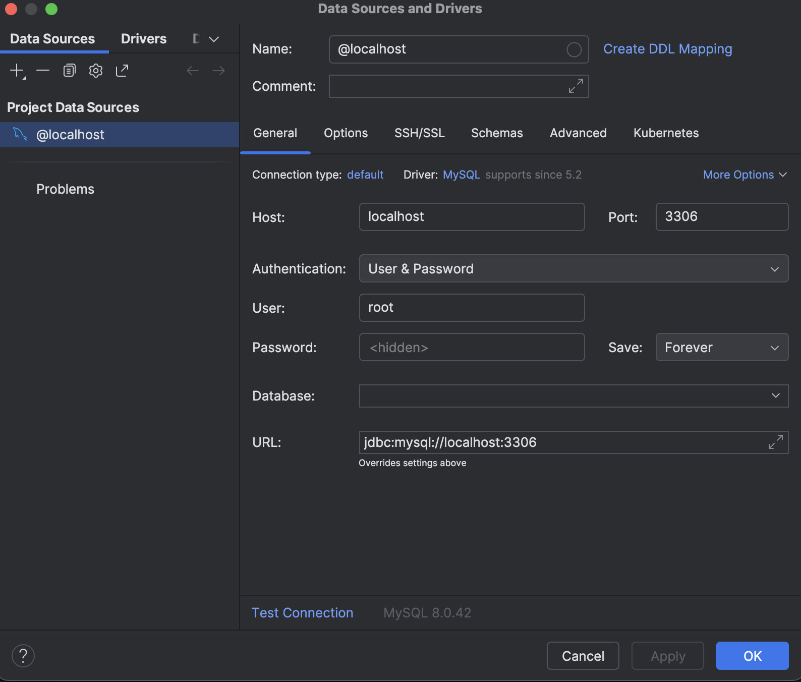

2.3 Test each controller using Postman and take screenshots.
- getAllPost
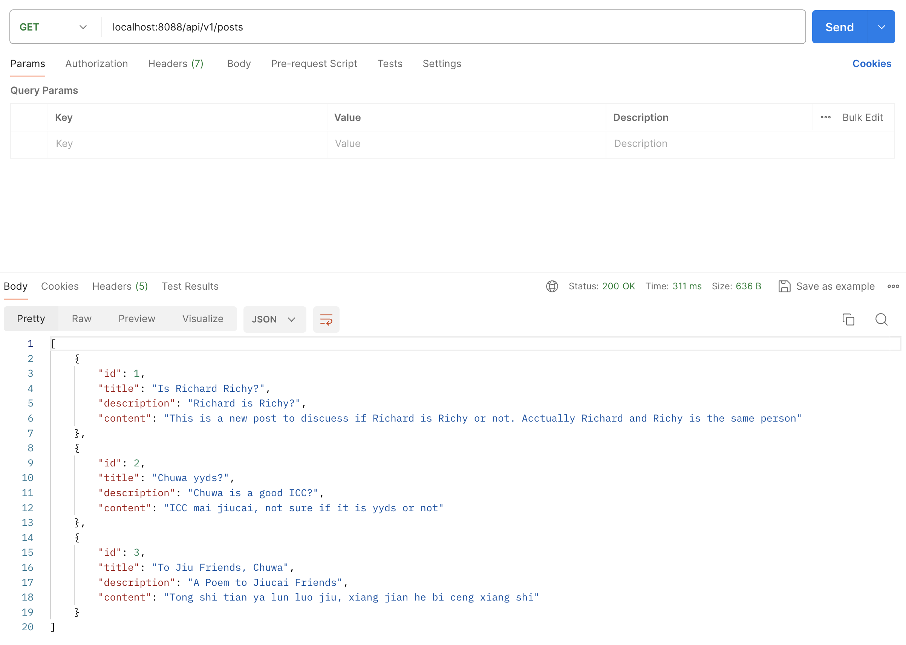
- getPostById
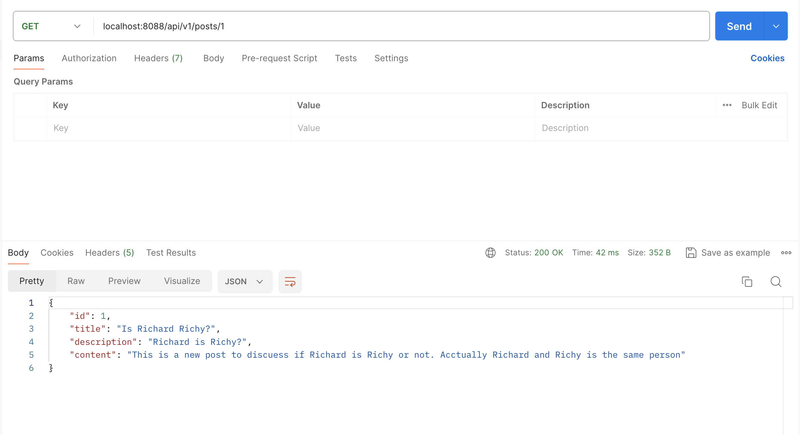
- createPost
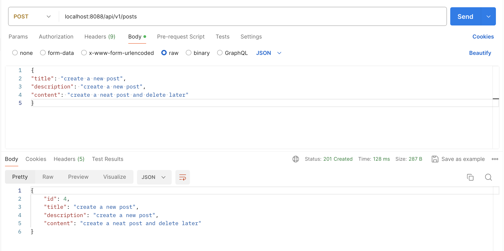
- updatePost
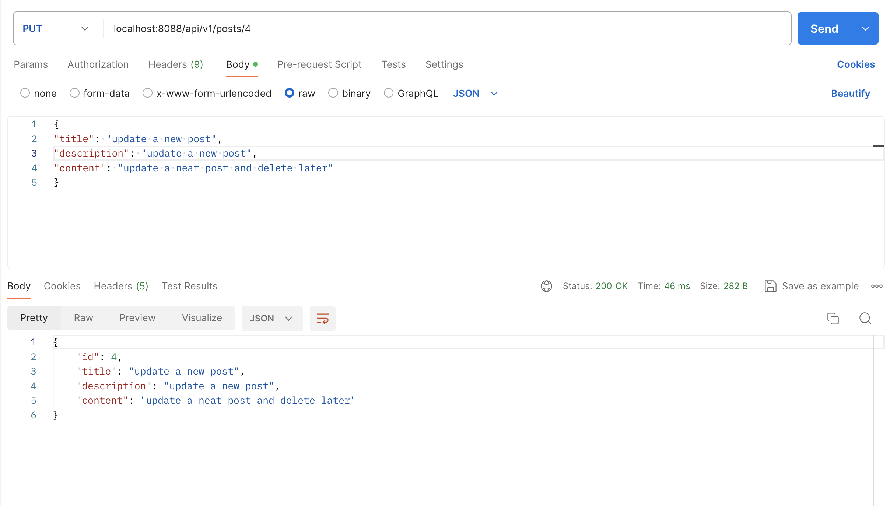
- deletePost
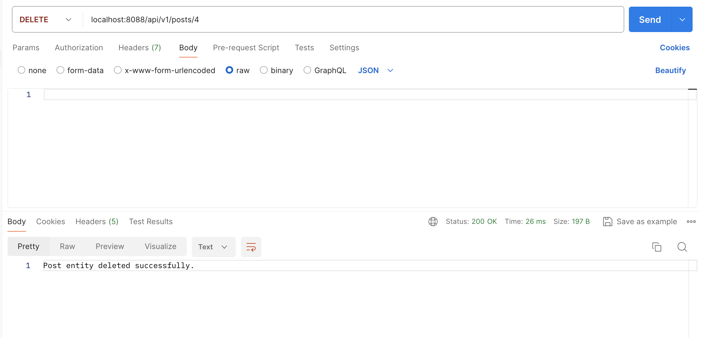
- getAllPostsJPQL
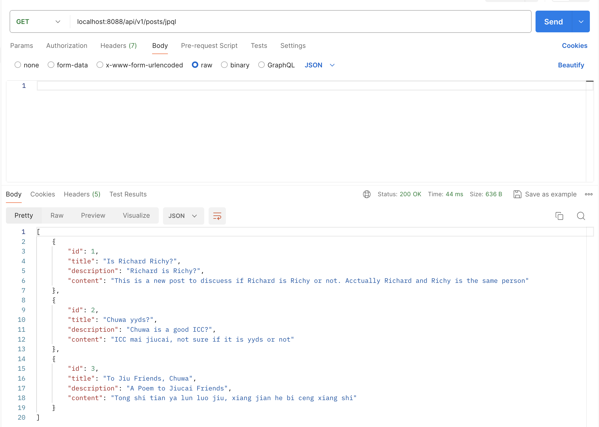
- getPostByIdJPQLIndexParameter
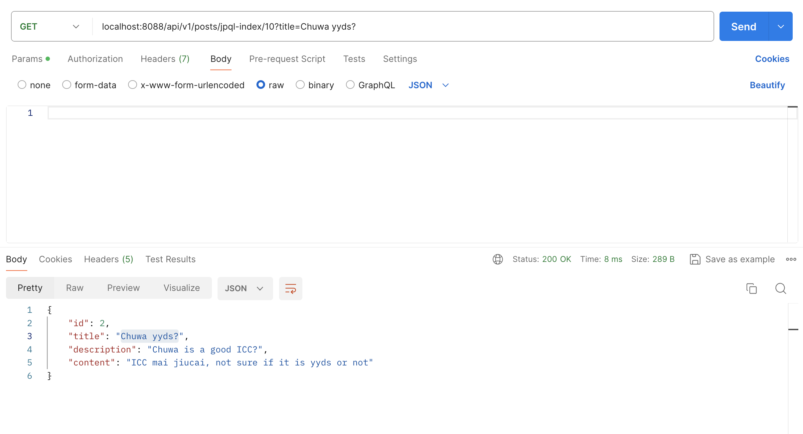
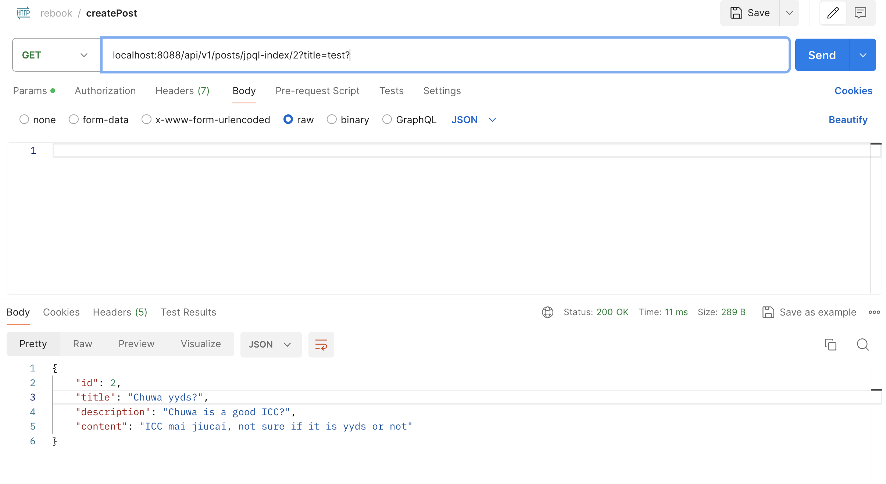
- getPostByIdJPQLNameParameter
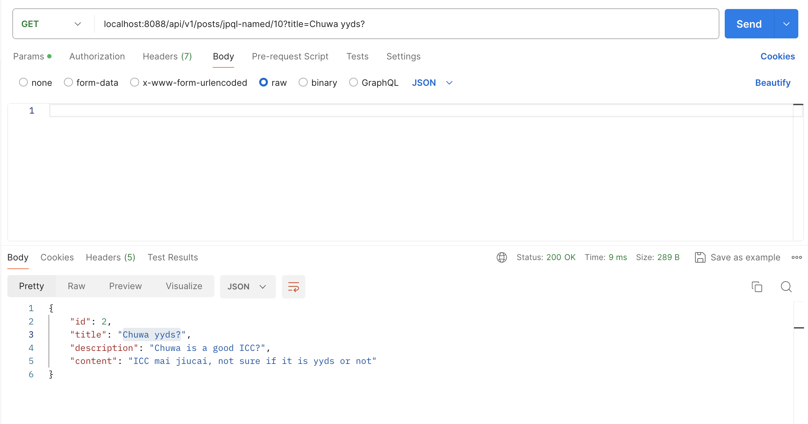

- getPostByIdSQLIndexParameter

- getPostByIdSQLNamedParameter
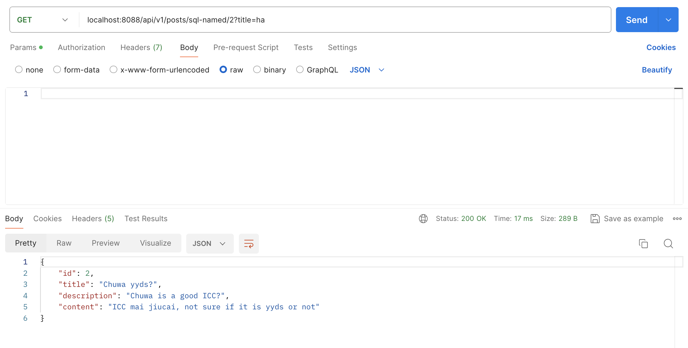

### 3. Write Custom JPA Methods and Validate Syntax
3.1 Write custom JPA methods using Spring Data JPA naming conventions.
```java
List<Post> findByTitle(String title);
```
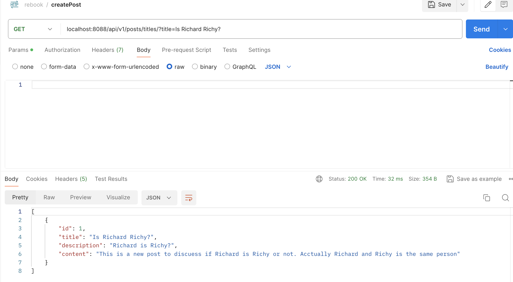
3.2 Demonstrate how JPA performs compile-time syntax checks on method names.
- Spring Data JPA parses repository method names during application startup.
- If method name does not match the property names in the entity, it will throw an error at startup.
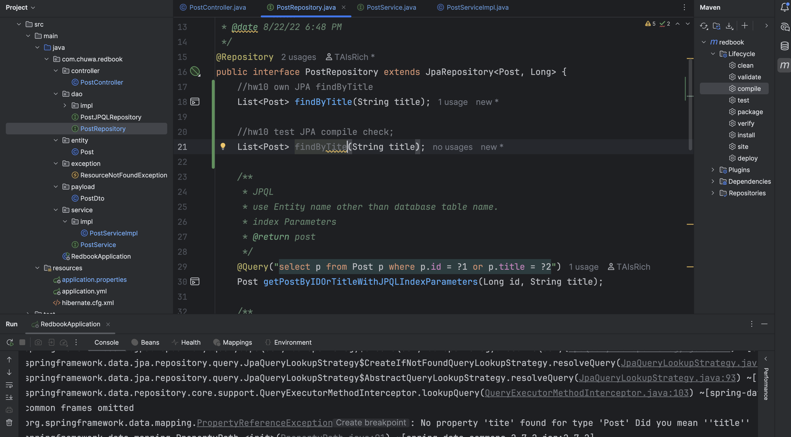

### 4. Implement JPQL and Native SQL Queries
4.1 One JPQL query using the @Query annotation
```java
    @Query("select p from Post p where p.title LIKE %:keyword%")
    List<Post> findPostsByTitleContainingJPQL(@Param("keyword") String keyword);
```
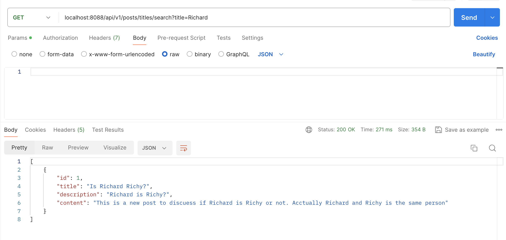
4.2 One native SQL query using @Query(nativeQuery = true)
```java
    @Query(value = "select * from posts p where p.description LIKE %:keyword%", nativeQuery = true)
    List<Post> findPostsByDescriptionContainingSQL(@Param("keyword") String keyword);
```
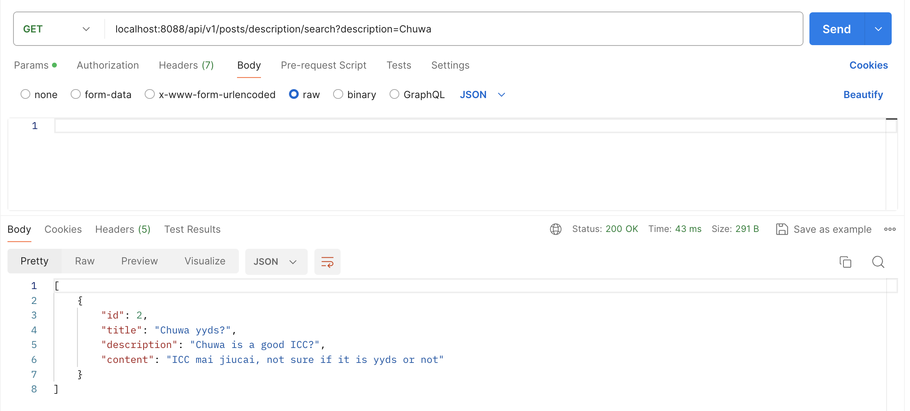

### 5. Technology Comparison
In Spring Boot app:
- We use Spring Data JPA to write clean repository interfaces.
- Spring Data JPA uses Hibernate under the hood for ORM.
- Hibernate uses JDBC to communicate with your database.
- HikariCP efficiently manages the JDBC connections for Hibernate.

5.1 Spring Data JPA
- A Spring module that simplifies JPA (Java Persistence API) usage with repositories and automatic query generation.
- Reduces boilerplate CRUD code with interfaces like JpaRepository, CrudRepository.
- Relationship with Hibernate: Spring Data JPA requires a JPA implementation, and Hibernate is the default JPA implementation in Spring Boot. Spring Data JPA provides the abstraction; Hibernate performs the actual ORM work.
- Relationship with JDBC: Indirect. Spring Data JPA → Hibernate (JPA provider) → JDBC.
- Relationship with HikariCP: Spring Boot auto-configures HikariCP as the connection pool used by Hibernate (via JDBC) when using Spring Data JPA.

5.2 Hibernate
- A popular Object-Relational Mapping (ORM) framework for Java.
- Maps Java objects relational database tables automatically.
- Supports JPQL (Hibernate Query Language) and Criteria API for abstracted querying.
- Relationship with JDBC: Hibernate uses JDBC under the hood to execute SQL statements and manage connections.

5.3 HikariCP
- A high-performance JDBC connection pool library.
- Manages a pool of open database connections for reuse, improving performance.
- Relationship with JDBC: HikariCP manages JDBC Connection objects efficiently. When Hibernate or Spring Data JPA needs a connection, it requests it from HikariCP, which hands out an available connection.

5.4 JDBC (Java Database Connectivity)
- A low-level Java API to connect and execute SQL queries directly against relational databases.
- Manual SQL writing.
- Manual mapping from ResultSet to Java objects.
- Manual resource management (Connection.close(), Statement.close()).

### 6. JPA Relationships
6.1 @OneToMany: 

6.1.1 Defines a one-to-many relationship
- One entity instance relates to many instances of another entity.
- E.g., One Post has many Comments.
```java
@Entity
public class Post {
    @Id
    @GeneratedValue
    private Long id;

    private String title;

    @OneToMany(mappedBy = "post", cascade = CascadeType.ALL, fetch = FetchType.LAZY)
    private List<Comment> comments = new ArrayList<>();
}

@Entity
public class Comment {
  @Id
  @GeneratedValue
  private Long id;

  private String content;

  @ManyToOne
  @JoinColumn(name = "post_id")
  private Post post;
}
```
6.1.2 Key Properties:
- mappedBy: Indicates that the Post entity is not the owner of the relationship. "post" refers to the field name in Comment that owns the relationship.
The owner (Comment) has the foreign key (post_id).
- cascade: Defines operations that should cascade to child entities. Examples:
  - CascadeType.ALL: propagate all operations (persist, merge, remove, refresh, detach).
  - CascadeType.PERSIST: saving Post will persist Comments.
  - CascadeType.REMOVE: deleting Post will delete Comments.
- fetch: Specifies loading strategy:
  - FetchType.LAZY (default): comments are loaded when accessed.
  - FetchType.EAGER: comments are loaded immediately with the post.

6.2 @ManyToOne:

6.2.1 Defines a many-to-one relationship:
- Many instances of the entity relate to one instance of another entity.
- E.g., Many Comments belong to one Post.
```java
  @ManyToOne
  @JoinColumn(name = "post_id")
  private Post post;
```

6.2.2 Key Properties:
- @JoinColumn(name = "post_id"): Specifies the foreign key column (post_id) in the Comment table.

6.3 @ManyToMany:

6.3.1 Defines a many-to-many relationship:
- Many instances of one entity relate to many instances of another entity.
- E.g., Many students belong to many courses
```java
@Entity
public class Student {
    @Id
    @GeneratedValue
    private Long id;

    private String name;

    @ManyToMany
    @JoinTable(
        name = "student_course",
        joinColumns = @JoinColumn(name = "student_id"),
        inverseJoinColumns = @JoinColumn(name = "course_id")
    )
    private Set<Course> courses = new HashSet<>();
}

@Entity
public class Course {
  @Id
  @GeneratedValue
  private Long id;

  private String name;

  @ManyToMany(mappedBy = "courses")
  private Set<Student> students = new HashSet<>();
}
```
6.3.2 Key Properties:
- mappedBy: Used on the inverse side of the relationship. Indicates that the Course entity is not the owner; the Student entity owns the relationship.
- @JoinTable: Defines the join table and columns to handle the many-to-many relationship.

### 7. Cascade Options in JPA
7.1 Explain cascade = CascadeType.ALL and orphanRemoval = true.

```java
@OneToMany(mappedBy = "post", cascade = CascadeType.ALL, orphanRemoval = true)
private List<Comment> comments = new ArrayList<>();
```
- CascadeType.ALL means: Any operation performed on the parent entity will also be applied to the child entities in the relationship.
- orphanRemoval = true means: Automatically deletes child entities from the database when they are removed from the parent’s collection.

7.2 Describe all other CascadeType values.
- CascadeType.PERSIST: When the parent is saved (EntityManager.persist(parent)), the child entities are also saved automatically.
- CascadeType.MERGE: When the parent is merged (EntityManager.merge(parent)), the child entities are also merged automatically.
Used when you want to update detached entities and their children in the DB.
- CascadeType.REMOVE: When the parent is removed (EntityManager.remove(parent)), the child entities are also removed automatically.
- CascadeType.DETACH: When the parent entity is detached (EntityManager.detach(parent)), the child entities are also detached.
Detaching means the entities are no longer managed by the EntityManager and will not be tracked for further changes.
- CascadeType.REFRESH: When the parent entity is refreshed (EntityManager.refresh(parent)), the child entities are also refreshed, meaning Reloaded from the database and Overwriting any in-memory changes not yet flushed.

7.3 Key takeaways for the project.
Key Takeaways for your project:
- Use cascade = CascadeType.ALL if you want full lifecycle propagation from parent to child.
- Use orphanRemoval = true when: You want automatic deletion of child entities when removed from the parent collection.
Useful in @OneToMany and @OneToOne mappings.
- Use cascade = CascadeType.PERSIST and MERGE if you want only save/update propagation, but not delete propagation.

### 8. Fetch Types in JPA
8.1 FetchType.LAZY
- The related entities are not loaded from the database immediately. They are loaded only when accessed.
```java
@Entity
public class Post {
    @OneToMany(mappedBy = "post", fetch = FetchType.LAZY)
    private List<Comment> comments;
}

//When you fetch a Post, the comments list is not loaded immediately.
//When you call post.getComments(), JPA will execute a separate SQL query to fetch the comments.
```
- When to use
  - The related data is large or rarely needed immediately.
  - You want control over when the data is loaded.
  - You aim to optimize performance in large, complex domains.
  
8.2 FetchType.EAGER
- The related entities are loaded immediately along with the parent entity in the same query (via joins or additional selects).
```java
@Entity
public class Post {
    @OneToMany(mappedBy = "post", fetch = FetchType.EAGER)
    private List<Comment> comments;
}
// When you fetch a Post, JPA immediately loads its comments.
```
- When to use?
  - The related data is always required immediately with the parent entity
  - The related data is small and not performance-heavy.
  - You want to avoid LazyInitializationException and do not need fine control over fetch timing.

### 9. Explain what JPQL is and how it differs from SQL. Include examples.
9.1 What is JPQL (Java Persistence Query Language)?
- An object-oriented query language used in JPA to query entities, attributes, and relationships, not database tables directly.

9.2 Compare between JPQL and SQL

9.2.1 Using SQL
```sql
SELECT * FROM posts p where p.title = 'chuwa';
```
- Queries the posts table directly.
- Uses table and column names as defined in the database schema.

9.2.2 Using JPQL
```java
@Query("SELECT p FROM Post p WHERE p.title = 'Spring Boot'")
List<Post> findPostsByTitle();
```
- Queries the Post entity, not the table directly.
- Uses entity (Post) and its field (title) names.

### 10. Explain what the @Query annotation does, where it is used, and how to use it for both JPQL and native queries.
10.1 What the @Query annotation does?
- It is a Spring Data JPA used to define customer queries directly in the repository interface method.

10.2 Where is @Query used?
- It used in repository interface
```java
@Repository
public interface PostRepository extends JpaRepository<Post, Long> {
    @Qurey("SELECT p FROM Post p WHERE p.title = :title")
    List<Post> getPostByTitle(@param("title") String title);
}
```

10.3 Using @Query with JPQL
```java
@Query("select p from Post p where p.title like %:keyword%")
List<Post> getPostByTitleContainingKeywordJPQL(@Param("keyword") String keyword);
```

10.4 Using @Query with native SQL queries
```java
@Query("select * from posts p where p.title like %:keyword%", ativeQuery = true)
List<Post> getPostByTitleContainingKeywordNative(@Param("keyword") String keyword);
```

### 11. Compare EntityManager and SessionFactory. Include screenshots from the codebase to illustrate their relationship.
11.1 EntityManager
- Part of JPA (Java Persistence API) standard.
- Responsible for:
  - Managing the persistence context.
  - CRUD operations (persist, merge, remove, find).
  - Query creation (createQuery, createNamedQuery).
  - Transaction management integration.

11.2 SessionFactory
- Part of Hibernate (a JPA implementation), specific to Hibernate’s native API.
- Responsible for:
  - Creating Session objects for DB operations.
  - Managing caching (first-level, second-level).
  - Holding configuration and mapping metadata.
  - Connection management via underlying connection pool.

11.3 Comparison

| Aspect                 | `EntityManager` (JPA)                | `SessionFactory` (Hibernate)                   |
|------------------------|--------------------------------------|------------------------------------------------|
| Part of                | JPA Specification                    | Hibernate (native API)                         |
| Used for               | Managing persistence context, CRUD   | Creating `Session` objects for DB operations   |
| Scope                  | Lightweight, per transaction/request | Heavyweight, singleton per app                 |
| Caching                | First-level via persistence context  | First & second-level caching managed centrally |
| Implementation         | Hibernate, EclipseLink, etc.         | Hibernate only                                 |
| Transaction management | Integrated with JPA / Spring         | Managed via Hibernate APIs / Spring            |

11.4 RelationShip
- EntityManager provides a JPA-standard interface, and when using Hibernate, it internally uses a Session created and managed by SessionFactory to perform actual database operations.
- From the codebase, I didn't see explicit call SessionFactory in EntityManger.

### 12. Explain the role of Session and how it differs from SessionFactory
12.1 Session

12.1.1 What is Session?
- Session is a Hibernate interface representing a single unit of work with the database.
- It is analogous to a connection, but it also manages the persistence context (first-level cache).
- It is used to perform CRUD operations, execute queries, manage transactions, and track entity states.

12.1.2 Key Characters
- Short-lived: Created per client request, per transaction, or per unit of work.
- Manages persistence context: Keeps track of entities loaded or saved within the session, ensuring identity and managing automatic dirty checking (tracking changes).
- Thread-unsafe: Should not be shared across multiple threads.
- Provides methods like: save(), update(), merge(), delete(), createQuery(), createCriteria(), beginTransaction(), getTransaction()

12.2 SessionFactory

12.2.1 What is SessionFactory?
- SessionFactory is a Hibernate interface responsible for creating and managing Session objects.
- It is heavyweight and designed to be a singleton per application.
- It is built during application startup using Hibernate configurations and mappings.

12.2.2 Key Characters
- Long-lived: Created once and reused throughout the application lifecycle.
- Thread-safe: Can be safely used by multiple threads to create Session instances.
- Caches configuration and mapping metadata.
- Manages second-level caching (optional) and connection pooling (via HikariCP or others).
- Provides: openSession(), getCurrentSession(), getStatistics()

12.3 Comparison: SessionFactory is a factory that produces Session objects. It is configured once and can then be used repeatedly to obtain Session instances for database operations.

| Aspect           | `SessionFactory`                                       | `Session`                                              |
|------------------|--------------------------------------------------------|--------------------------------------------------------|
| What it is       | Factory for creating `Session` instances               | Represents a unit of work with DB                      |
| Lifecycle        | Long-lived, singleton per application                  | Short-lived, per request/transaction                   |
| Thread safety    | Thread-safe                                            | Not thread-safe                                        |
| Responsibilities | Holds configuration, manages caches, creates `Session` | Manages persistence context, executes CRUD and queries |
| Caching          | Manages second-level cache (optional)                  | Manages first-level (session) cache                    |
| Usage frequency  | Used during startup, then reused                       | Created/closed frequently per transaction              |

### 13. Explain what a transaction is in the context of relational databases, and how Spring/Hibernate manage transactions.
13.1 What is transaction in the context of relational database?
- A transaction is a sequence of one or more SQL operations executed as a single, atomic unit of work.
- It follows ACID properties:
  - Atomicity: All operations succeed or all fail; no partial changes.
  - Consistency: Transitions the database from one valid state to another.
  - Isolation: Concurrent transactions do not interfere with each other.
  - Durability: Once committed, changes persist even after a system crash.

13.2 How Hibernate manage transactions.
- Hibernate uses the Transaction interface, tied to the Session
```java
Session session = sessionFactory.openSession();
Transaction tx = session.beginTransaction();

try {
    // DB operations (save, update, delete)
    tx.commit(); // Commit if successful
} catch (Exception e) {
    tx.rollback(); // Rollback on failure
} finally {
    session.close();
}
```
- Transactions are explicitly started and committed/rolled back.
- Hibernate translates entity changes into SQL statements, executed upon commit() or flush().

13.3 How Spring manage transactions.
- Spring provides declarative transaction management using: @Transactional annotation and integration with JPA/Hibernate or JDBC transparently.
- A transaction is automatically started before the method executes.
- If an unchecked exception occurs, Spring rolls back the transaction.

### 14. Explain Hibernate’s caching mechanisms.
14.1 What is Hibernate Caching.
Caching reduces database hits by storing frequently accessed data in memory during the entity lifecycle and across sessions, improving performance.
Hibernate provides:
- First-Level Cache (Session Scope) – always enabled
- Second-Level Cache (Shared/Global Scope) – optional

14.2 First-Level Cache
What it is:
- A mandatory, built-in cache within a single Hibernate Session.
- All entities loaded, saved, or updated are stored in this cache during the session.

Scope:
- Session-specific: valid only within a single session, cleared when the session is closed.

How it works:
- If you fetch the same entity multiple times within the same session, Hibernate will return it from the cache instead of hitting the database again.
```java
Session session = sessionFactory.openSession();

Post post1 = session.get(Post.class, 1L); // Hits DB
Post post2 = session.get(Post.class, 1L); // Returns from first-level cache, no DB hit

session.close();
```

14.3 Second-Level Cache
What it is:
- An optional, configurable cache that persists entity data across multiple sessions.
- Enables sharing cached entities among different sessions and transactions.

Scope:
- SessionFactory scope (application-level scope).

How it works:
- Hibernate checks the second-level cache before querying the database:
- If found in cache → returned directly.
- If not found → queries DB and stores the entity in the cache.

14.4 Comparison

| Aspect                 | First-Level Cache                                    | Second-Level Cache                                          |
|------------------------|------------------------------------------------------|-------------------------------------------------------------|
| Scope                  | `Session` (per request)                              | `SessionFactory` (application/global)                       |
| Configuration          | Always enabled, no config needed                     | Optional, requires explicit configuration                   |
| Shared Across Sessions | ❌ No                                                 | ✅ Yes                                                       |
| Use Cases              | Prevent redundant DB queries within the same session | Reduce DB hits across sessions for frequently accessed data |
| Lifecycle              | Cleared when session closes                          | Persists across sessions, until eviction/expiry             |
| Implementation         | Built into Hibernate                                 | Uses external cache providers (Ehcache, Infinispan)         |

14.5 Summary
First-Level Cache:
- Always enabled.
- Per session.
- Reduces duplicate queries in the same session.

Second-Level Cache:
- Optional.
- Shared across sessions.
- Reduces database load globally.
- Requires explicit configuration.