Part1:

Annotations are listed in file annotations.md

Part 2: 

2.

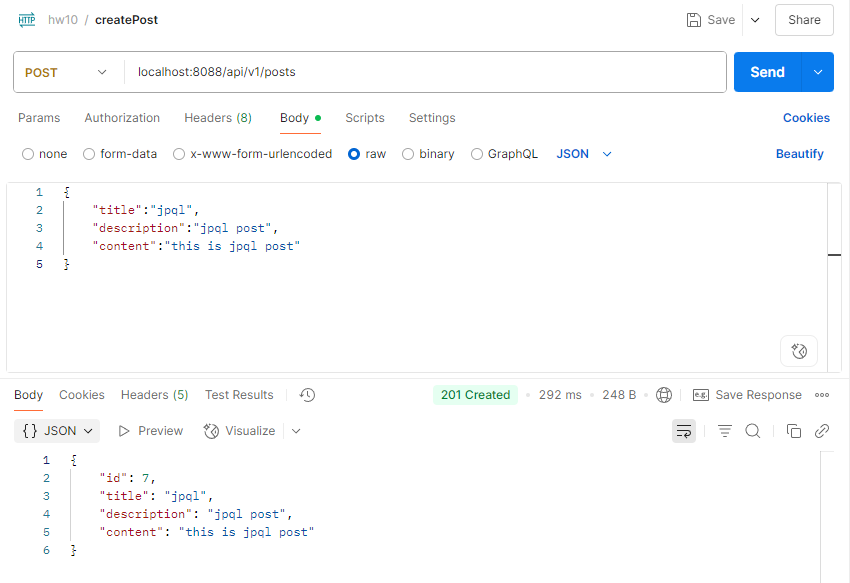

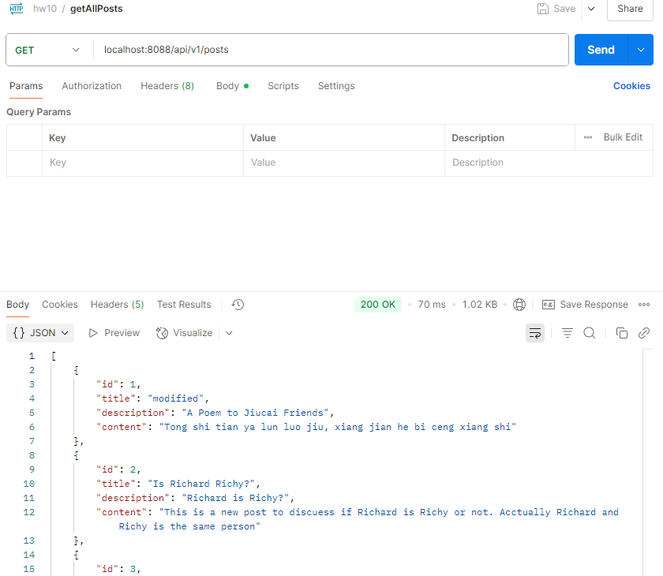

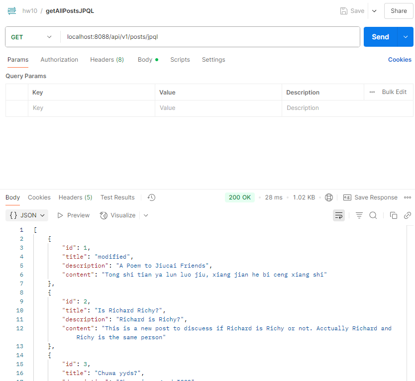

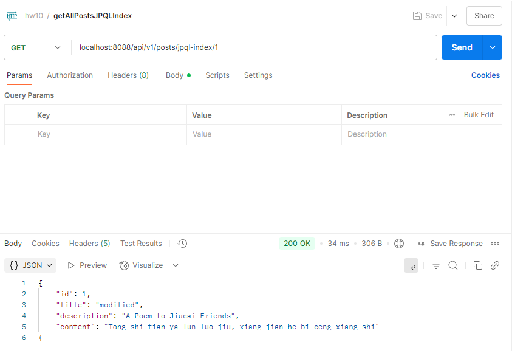

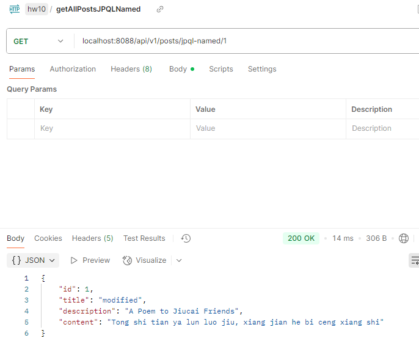

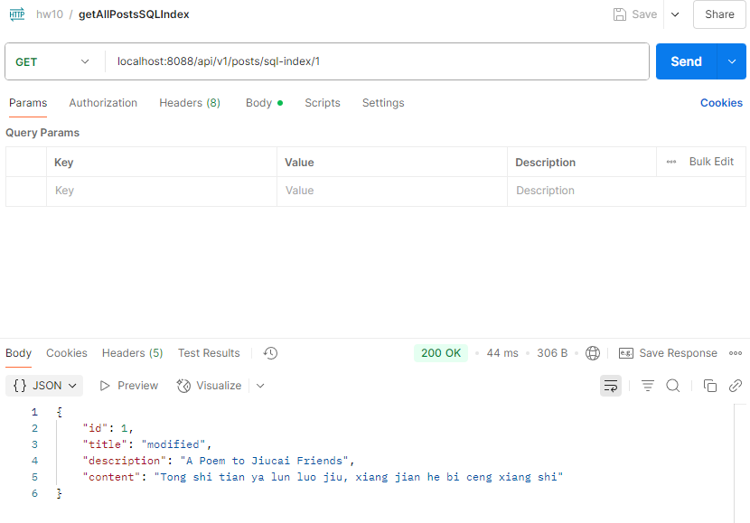

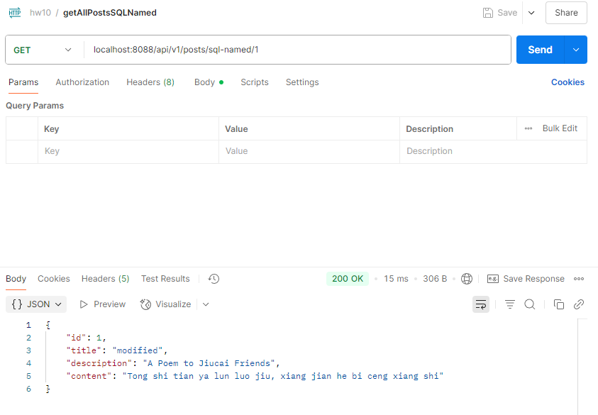

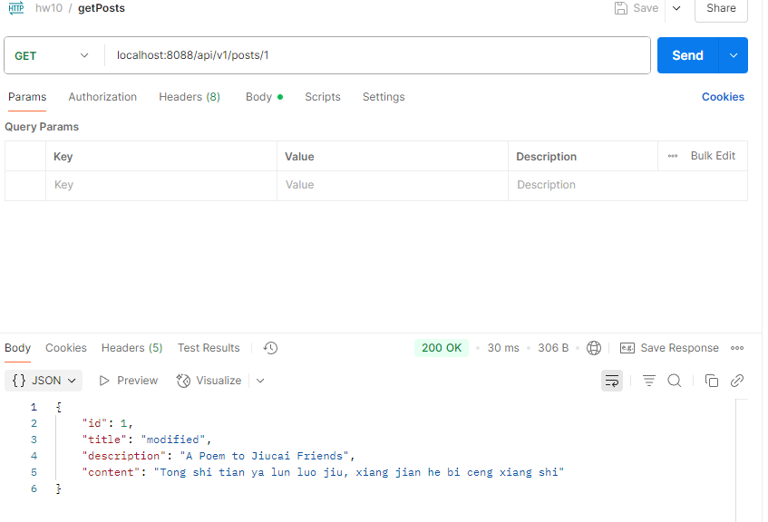

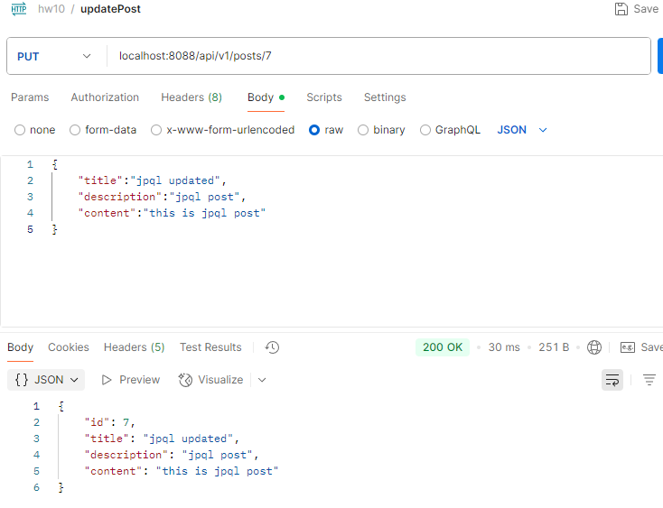

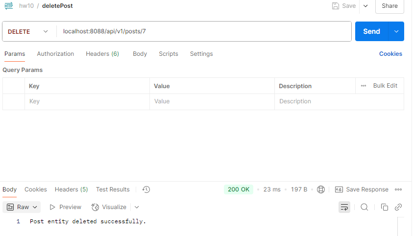

3.

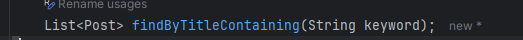

Added a method using jpa to find all posts that title contains a specific keyword.

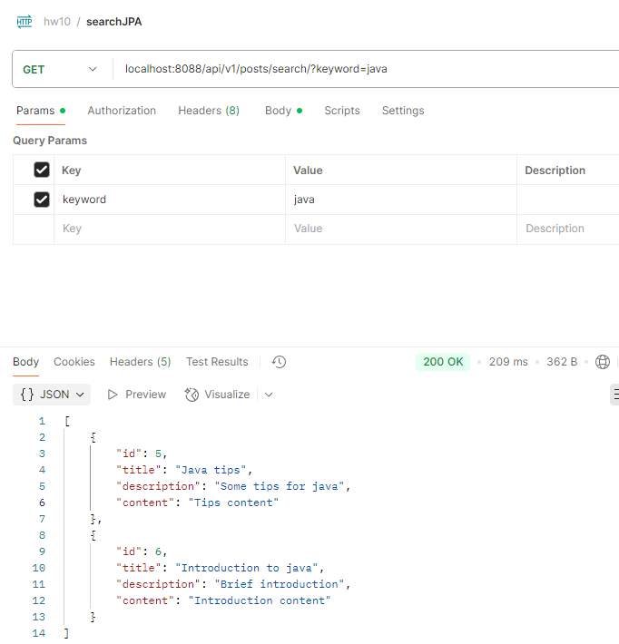

If misspelled the column name in jpa method name, it will have error when compile.

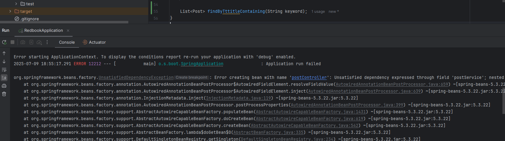

4.

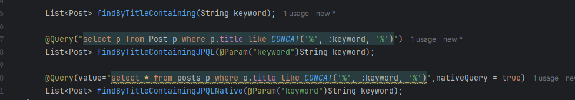

Create methods to find posts that title contains a keyword using both JPQL and JPQL with nativeQuery=true

Service layer:

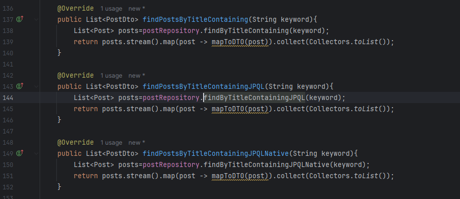


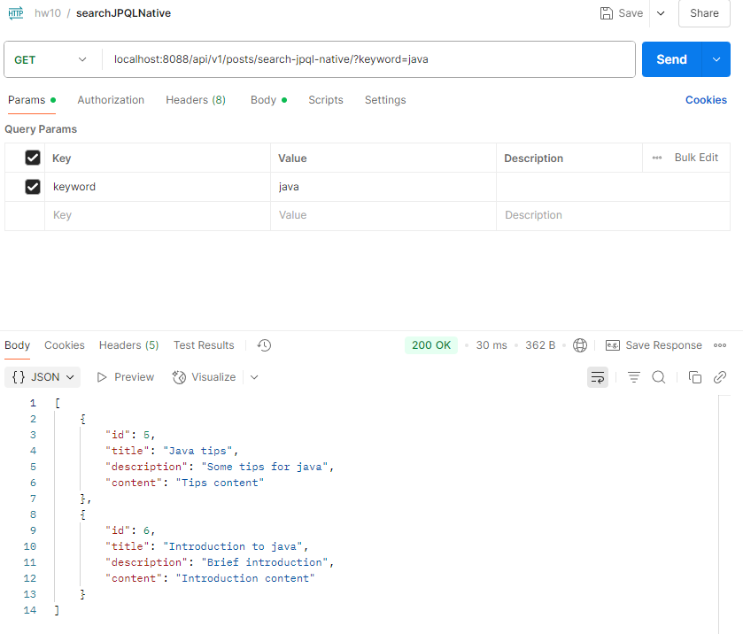

Part 3:

Spring Data JPA: A high level abstraction of database query provided by spring framework. It have repository interface with built in curd methods.

Hibernate: The most common JPA implementation. It is behaved as a ORM framework.

HikariCP: A connection pool for JDBC.

JDBC: Low level api for java code to connect with relational database.


Relationship: 

High level to low level: JPA->Hibernate->HikariCP->JDBC, each layer use the below layer to implement.


Part 4:

@OneToMany

One to many means current entity is related to many child entities.

```java
@Entity
public class Department {
    @Id @GeneratedValue
    private Long id;

    private String name;

    @OneToMany(
        mappedBy = "department",            
        cascade   = CascadeType.ALL,       
        fetch     = FetchType.LAZY,       
        orphanRemoval = true              
    )
    private List<Employee> employees = new ArrayList<>();
}
```


@ManyToOne

Many to one means many current entities related to one parent

```java
@Entity
public class Employee {
    @Id @GeneratedValue
    private Long id;

    private String name;

    @ManyToOne(
        fetch = FetchType.LAZY,    
        optional = false              
    )
    @JoinColumn(name = "department_id")
    private Department department;
}
```

@ManyToMany

Many to many means many current entities related to many other entities, using a join table.

```java
@Entity
public class Student {
    @Id @GeneratedValue
    private Long id;

    private String name;

    @ManyToMany(
        cascade = { CascadeType.PERSIST, CascadeType.MERGE },  
        fetch   = FetchType.LAZY
    )
    @JoinTable(
        name               = "student_course", 
        joinColumns        = @JoinColumn(name = "student_id"),
        inverseJoinColumns = @JoinColumn(name = "course_id")
    )
    private Set<Course> courses = new HashSet<>();
}

@Entity
public class Course {
    @Id @GeneratedValue
    private Long id;

    private String title;

    @ManyToMany(
        mappedBy = "courses",  
        fetch    = FetchType.LAZY
    )
    private Set<Student> students = new HashSet<>();
}

```

mappedBy: Shows that the side of bidirectional relationship is inverse side, points to the field on the owning side that manage foreign key.

cascade: Determine what operations should automatically done on related entities when applied to the parent.

fetch: Determine when to load the table of associated entity, either EAGER: load immediately or LAZY: load when first accessed.

7.

CascadeType.ALL is meant for all cascade type (persist, merge, remove, detach, refresh) are applied.

orphanRemoval=true means that when removing a child from parent's collection(like List< Employee> employees) , JPA will delete the correspond child record from database.

Other cascade type:

PERSIST: When add a new child to parent list and call em.persist(parent), jpa will persist(child)

MERGE: When having a detached parent and call em.merge(parent), jpa will merge(child)

REMOVE: When deleting the parent using em.remove(parent), jpa will remove(child)

DETACH: When call em.detach(parent) , jpa will detach all the children , make the children unmanaged.

REFRESH: When call em.refresh(parent), jpa will reload both parent and children from database, overwriting in memory change.


8.

FetchType.LAZY:

When load the current entity, JPA does not immediately load the related data from the other entity of the relationship mapping. Only when the query must use the data, the data is loaded.

Good to use when some query need the data from other entity and some not need. 


FetchType.EAGER

When load the current entity, JPA immediately load the related data from the other entity of the relationship mapping.

Good to use when all query need data from the other entity, frequently in OneToOne


Part 4:

9.JPQL is a query language like SQL, but it operate on JPA entity objects rather than directly query database table like SQL does.

Example:

jpql:

```sql
select p from Post p where p.id = :key
```

sql:

```sql
select * from posts p where p.id = 1
```


10.

@Query annotation is used to specify what jpql query (or native sql query) will be perform.

JPQL query syntax:

```sql
@Query("select p from Post p where p.title like CONCAT('%', :keyword, '%')")
List<Post> findByTitleContainingJPQL(@Param("keyword")String keyword);
```

native query syntax:

```sql
@Query(value="select * from posts p where p.title like CONCAT('%', :keyword, '%')",nativeQuery = true)
List<Post> findByTitleContainingJPQLNative(@Param("keyword")String keyword);
```

11.

EntityManager :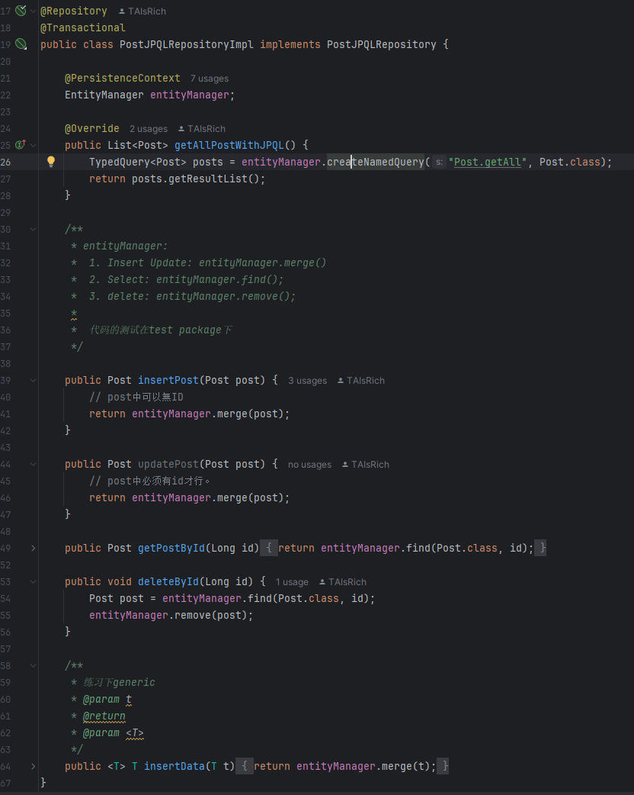

EntityManager is part of JPA api. It could help to manage persistence context, which is first-level cache of loaded entity instances. 


SessionFactory:

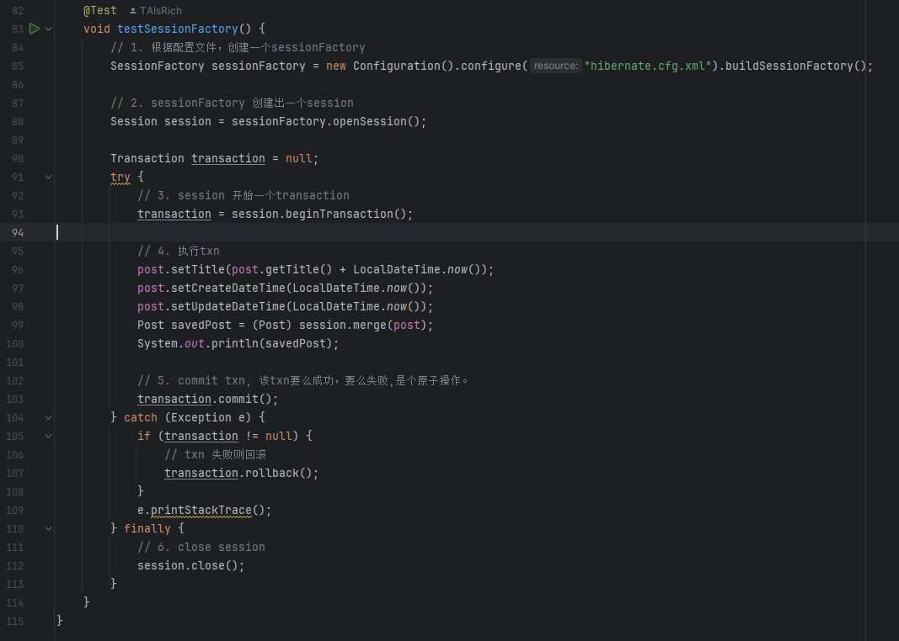

Session factory is the api provided by hibernate. SessionFactory build Session instances, which could support transaction

12.

The role of session is to represent a single unit of work with the database. It is a non thread safe object that could use to open/close transactions and perform CRUD operations.

The role of sessionFactory is to act as a thread safe factory to create Session instance. It manage the second level cache and JDBC connection pooling.

Part 6:

13.

Transaction in relational db is a set of database operations that will all done successfully or failed and completely rollback. It's impossible for some operation success and change db, while other operations failed inside a same transaction.

In spring, transaction could implement by annotate beans/method with @Transactional

In hibernate, transaction could implement by create a Session instance and use the session.beginTransaction() method.


14.

First level cache is tied to a single Session. Any operations within the same session is stored in the first level cache. It lives as long as session persist, and cleared when the session closed.

Second level cache is tied to the SessionFactory. it is shared across all sessions, lives as long as factory is up. By default it is disabled and need to enable explicitly.
