## Part2: Hands-on Project Work

2. Setup Starter Project & Test APIs

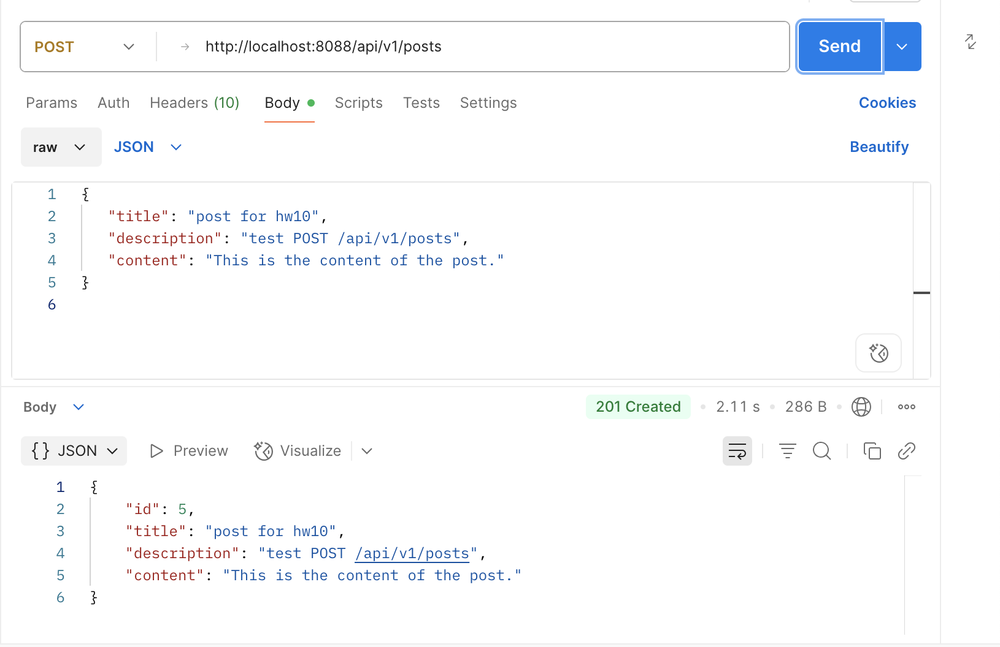

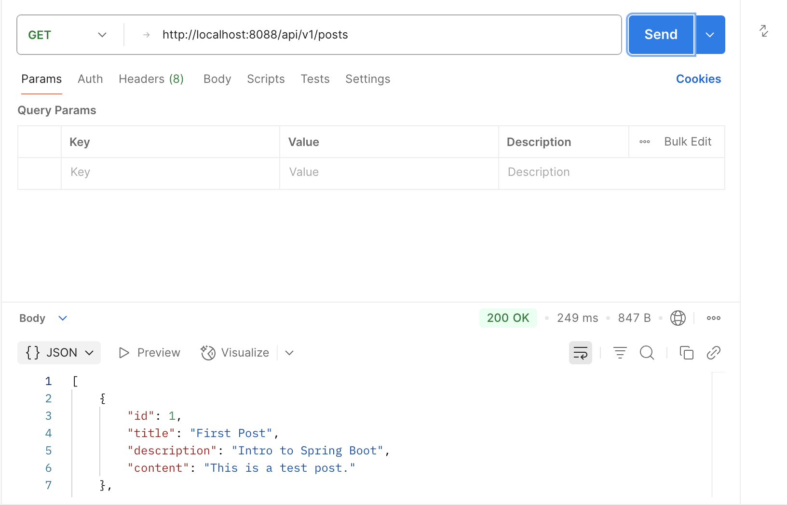

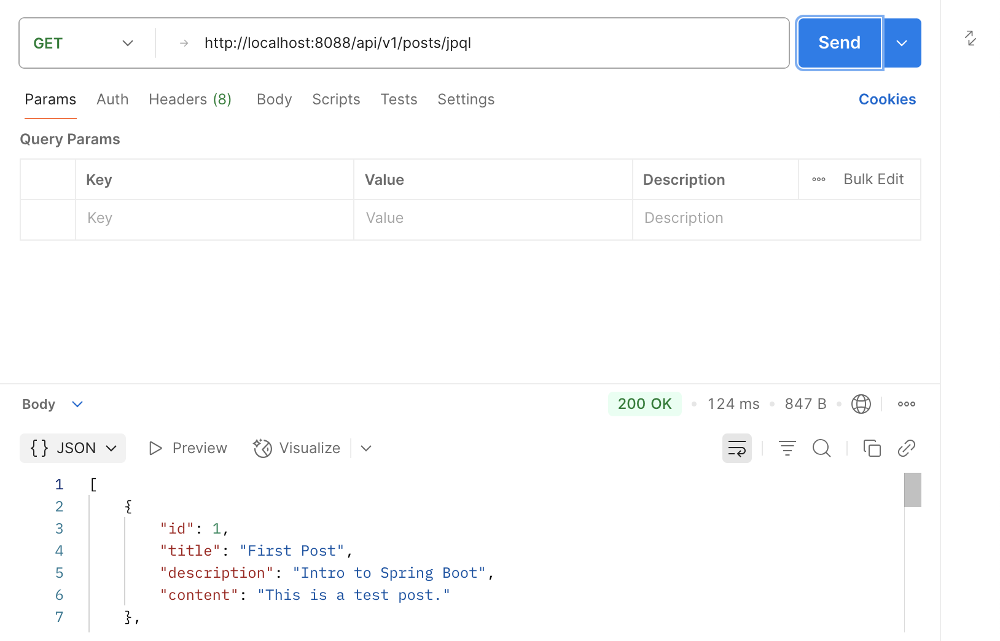


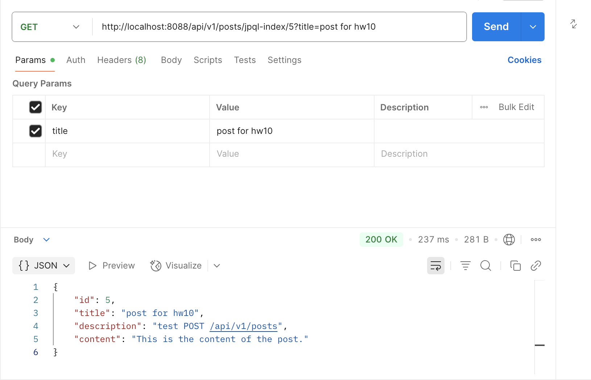


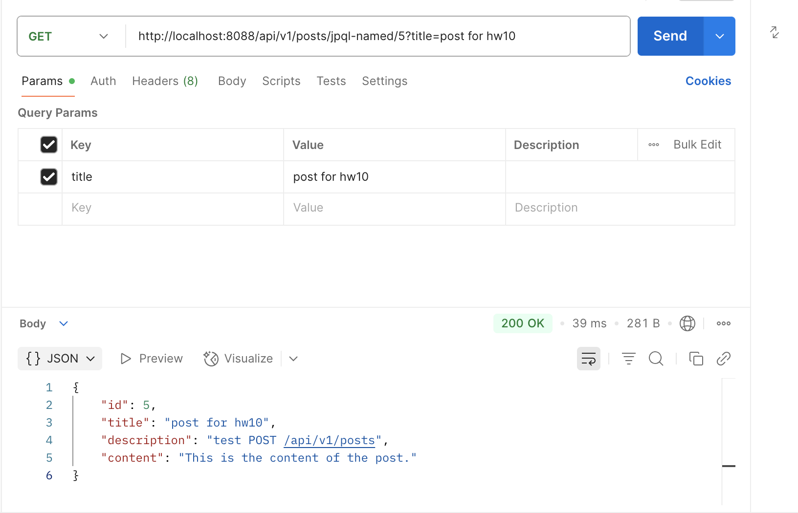

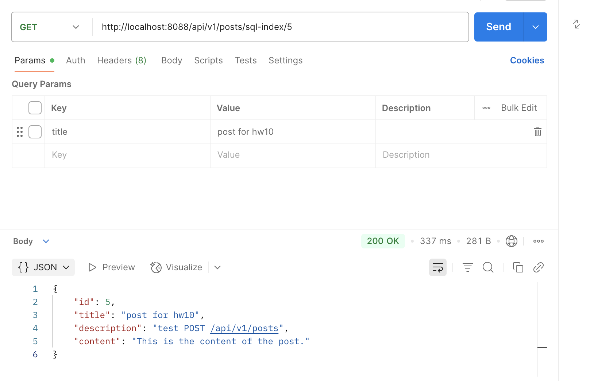


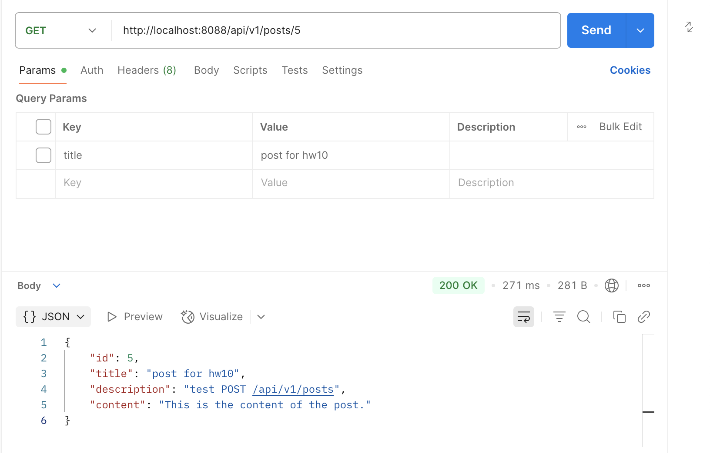

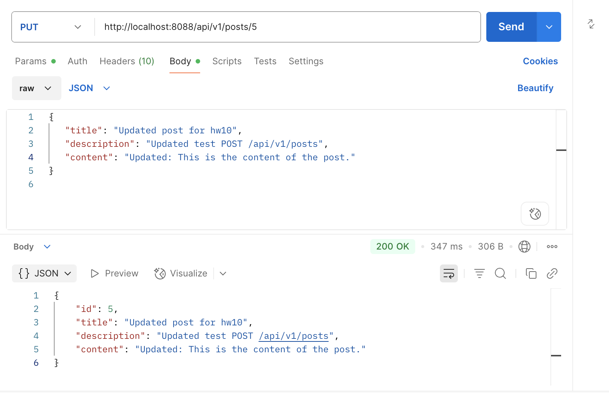

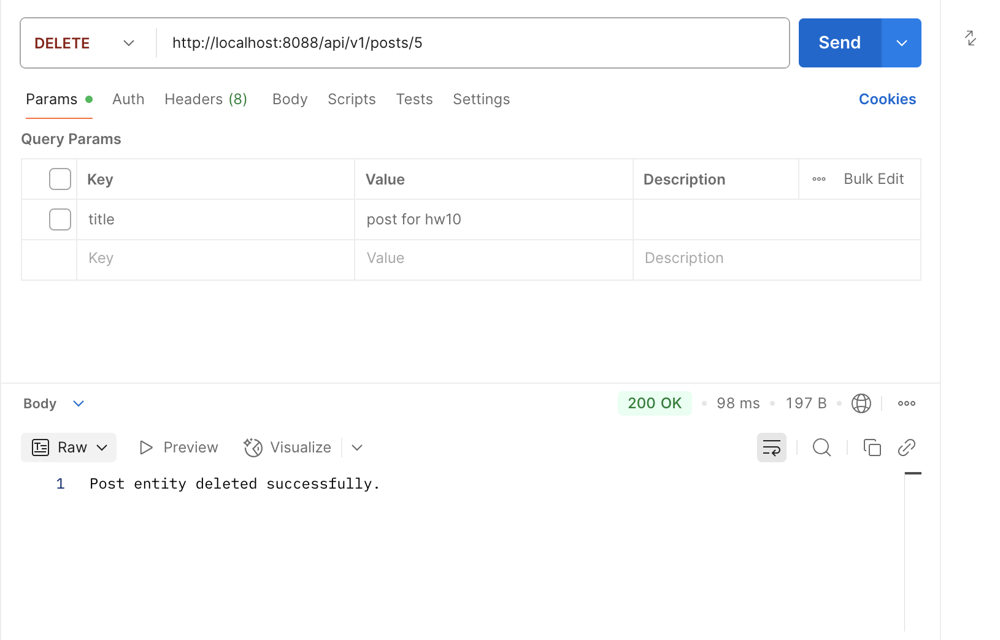

3. Write Custom JPA Methods and Validate Syntax

Write custom JPA methods using Spring Data JPA naming conventions

```
@Repository
public interface PostRepository extends JpaRepository<Post, Long> {

    // Find by title
    Optional<Post> findByTitle(String title);

    // Find all by title containing keyword (like %keyword%)
    List<Post> findByTitleContaining(String keyword);

    // Find by title and description
    Optional<Post> findByTitleAndDescription(String title, String description);

    // Find all by createDateTime after a certain date
    List<Post> findByCreateDateTimeAfter(LocalDateTime dateTime);

    // Count all posts with specific title
    Long countByTitle(String title);

    // Delete posts by title
    void deleteByTitle(String title);
}
```

Demonstrate how JPA performs compile-time syntax checks on method names.

Spring Data JPA parses and validates your method names when the application starts. If the method name doesn't conform to supported keywords or entity attributes, it will return a compile-time or startup-time error.

4. Implement JPQL and Native SQL Queries

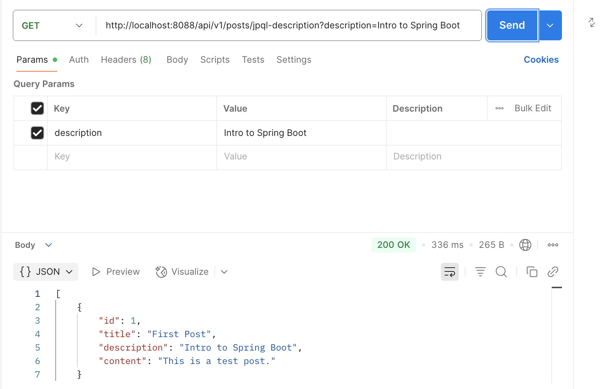

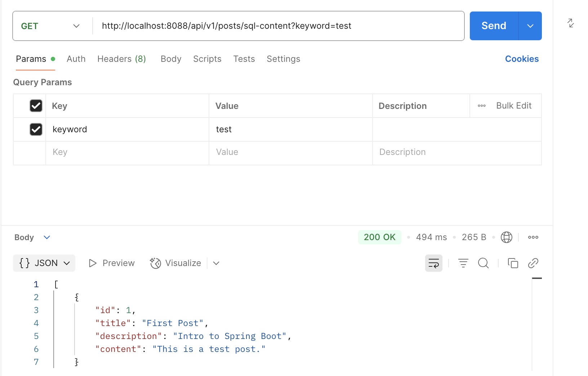

## Part 3: Core Conceptual Understanding

5. Technology Comparison

Explain the differences and relationships among: Spring Data JPA, Hibernate, HikariCP, JDBC

| Component       | Layer      | Description                                                              | Depends On           |
| --------------- | ---------- | ------------------------------------------------------------------------ | -------------------- |
| JDBC            | Low-level  | Raw DB interaction API in Java                                           | Direct DB access     |
| HikariCP        | Utility    | Fast connection pooling for JDBC                                         | JDBC                 |
| Hibernate       | ORM        | Object ↔ Table mapping, JPA implementation, uses JDBC internally         | JDBC, HikariCP       |
| Spring Data JPA | High-level | Spring abstraction over JPA, auto-generates queries and repository logic | Hibernate, JPA, JDBC |

Data flow in DB Operation: 
Java App -> Spring Data JPA (JpaRepository, @Query, etc.) -> JPA API (e.g., EntityManager) -> Hibernate (JPA provider + ORM) -> JDBC -> HikariCP (manages JDBC connections efficiently) -> Database


6. JPA Relationships
Explain the following annotations with examples: 
@OneToMany
@ManyToOne
@ManyToMany
Also describe and explain the configuration properties inside each, such as mappedBy, cascade, and fetch.

@OneToMany: One entity (parent) is related to many of another entity (child).

```
@Entity
public class Author {
    @Id
    private Long id;

    @OneToMany(mappedBy = "author", cascade = CascadeType.ALL, fetch = FetchType.LAZY)
    private List<Book> books;
}
```

* mappedBy: Tells JPA this side is not the owner of the relationship; it’s mapped by the author field in Book. Prevents a join table.

* cascade: Automatically performs operations (e.g., PERSIST, REMOVE) on children when done on the parent.

* fetch: How data is loaded: LAZY (default) or EAGER. Lazy fetch defers loading until needed.

@ManyToOne: Many entities share the same single parent.

```
@Entity
public class Book {
    @Id
    private Long id;

    @ManyToOne(fetch = FetchType.LAZY, cascade = CascadeType.PERSIST)
    @JoinColumn(name = "author_id")
    private Author author;
}

@Entity
public class Book {
    @Id
    private Long id;

    @ManyToOne
    @JoinColumn(name = "author_id")
    private Author author;
}
```

* cascade: Propagates operations from child to parent (less common). Be careful with REMOVE.

* fetch: Often LAZY for performance; EAGER loads the parent immediately.

* @JoinColumn: Specifies the foreign key column (e.g., author_id).

@ManyToMany: Both sides have many of the other side.

```
@Entity
public class Student {
    @Id
    private Long id;

    @ManyToMany
    @JoinTable(
        name = "student_course",
        joinColumns = @JoinColumn(name = "student_id"),
        inverseJoinColumns = @JoinColumn(name = "course_id")
    )
    private List<Course> courses;
}

@Entity
public class Course {
    @Id
    private Long id;

    @ManyToMany(mappedBy = "courses")
    private List<Student> students;
}
```

* @JoinTable: Specifies the join table and column names.

* mappedBy: Indicates the owning side (only one side should define the @JoinTable).

* cascade: Useful if you want to persist or remove the relationships together.

* fetch: LAZY by default to avoid loading huge collections unnecessarily.

7. Cascade Options in JPA
Explain cascade = CascadeType.ALL and orphanRemoval = true.
Also describe all other CascadeType values:
PERSIST
MERGE
REMOVE
DETACH
REFRESH

* cascade = CascadeType.ALL: Apply all types of cascade operations to the associated entities. Use this when child entities should be fully managed by the parent.

* orphanRemoval = true: If a child entity is removed from a collection, delete it from the database. Use this if child entities don’t make sense on their own once removed from the parent (orphans).

| CascadeType | What it does                                                            | Example Use Case                        |
| ----------- | ----------------------------------------------------------------------- | --------------------------------------- |
| **PERSIST** | When you save the parent (`persist()`), also save the child.            | Add new child when saving parent        |
| **MERGE**   | When you update the parent (`merge()`), also update child.              | Update detached entities with new state |
| **REMOVE**  | When you delete the parent (`remove()`), also delete the child.         | Auto-delete child with parent           |
| **DETACH**  | When you detach the parent from persistence context, also detach child. | Rarely used                             |
| **REFRESH** | When you reload parent from DB (`refresh()`), also reload child.        | Re-sync in-memory entity with DB        |
| **ALL**     | Applies all of the above.                                               | Fully-managed relationships             |


8. Fetch Types in JPA

Explain FetchType.LAZY and FetchType.EAGER, and describe when to use each

FetchType.LAZY — Load On-Demand

Lazy loading:

* The related entity is NOT loaded immediately with the parent.

* It is only fetched when accessed for the first time.

* Better performance, especially for large collections or rarely-used data

* Reduces initial SQL load

FetchType.EAGER — Load Immediately

Use it when:

* Large collections

* Optional or rarely-used relation

Eager loading:

* The related entity is fetched immediately with the parent via JOIN.

* Useful when the related data is always needed

* Avoids lazy-loading issues outside of transactions

Use it when:

* Always-needed small relation

## Part 4: Querying and Data Access

9. JPQL Overview

Explain what JPQL is and how it differs from SQL. Include examples.

JPQL (Java Persistence Query Language) is an object-oriented query language used in JPA to query entity objects, not database tables. JPQL is like SQL — but for Java entities (classes), not database tables.

| Feature       | JPQL                                | SQL                             |
| ------------- | ----------------------------------- | ------------------------------- |
| Operates On   | **Entity classes** and fields       | **Database tables** and columns |
| Language Type | Object-oriented                     | Relational                      |
| Syntax        | Java-style (`User.name`)            | DB-style (`users.name`)         |
| Portability   | Database-independent                | DB-specific                     |
| Typed Queries | Supports entity-based typed queries | Raw result sets                 |

JPQL:
```
String jpql = "SELECT u FROM User u WHERE u.name = :name";

String jpql = "SELECT p FROM Post p JOIN p.user u WHERE u.name = :name";
```

10. Using the @Query Annotation

Explain what the @Query annotation does, where it is used, and how to use it for both JPQL and native queries.

@Query is an annotation provided by Spring Data JPA that allows you to write custom queries directly in your repository interface. It can use to define either JPQL or native SQL queries.

It is used in Spring Data repository interfaces, such as JpaRepository or CrudRepository.

```
public interface UserRepository extends JpaRepository<User, Long> {
    
    @Query("SELECT u FROM User u WHERE u.name = :name") // JPQL
    User findByName(@Param("name") String name);

    @Query(value = "SELECT * FROM users WHERE email = :email", nativeQuery = true)
    User findByEmailNative(@Param("email") String email);
}
```

Using @Query with JPQL:

* User = entity class, not a table name

* u.email = field in the User entity

* :email = named parameter

Using @Query with Native SQL:

* "users" = actual table name

* SQL syntax required

* Useful for DB-specific queries or performance tuning

## Part 5: Hibernate and Entity Management

11. EntityManager vs SessionFactory

Compare EntityManager and SessionFactory. Include screenshots from the codebase to illustrate their relationship.

EntityManager is part of JPA specification. Main interface for managing persistence context (create, read, update, delete). Provided by JPA providers (Hibernate)

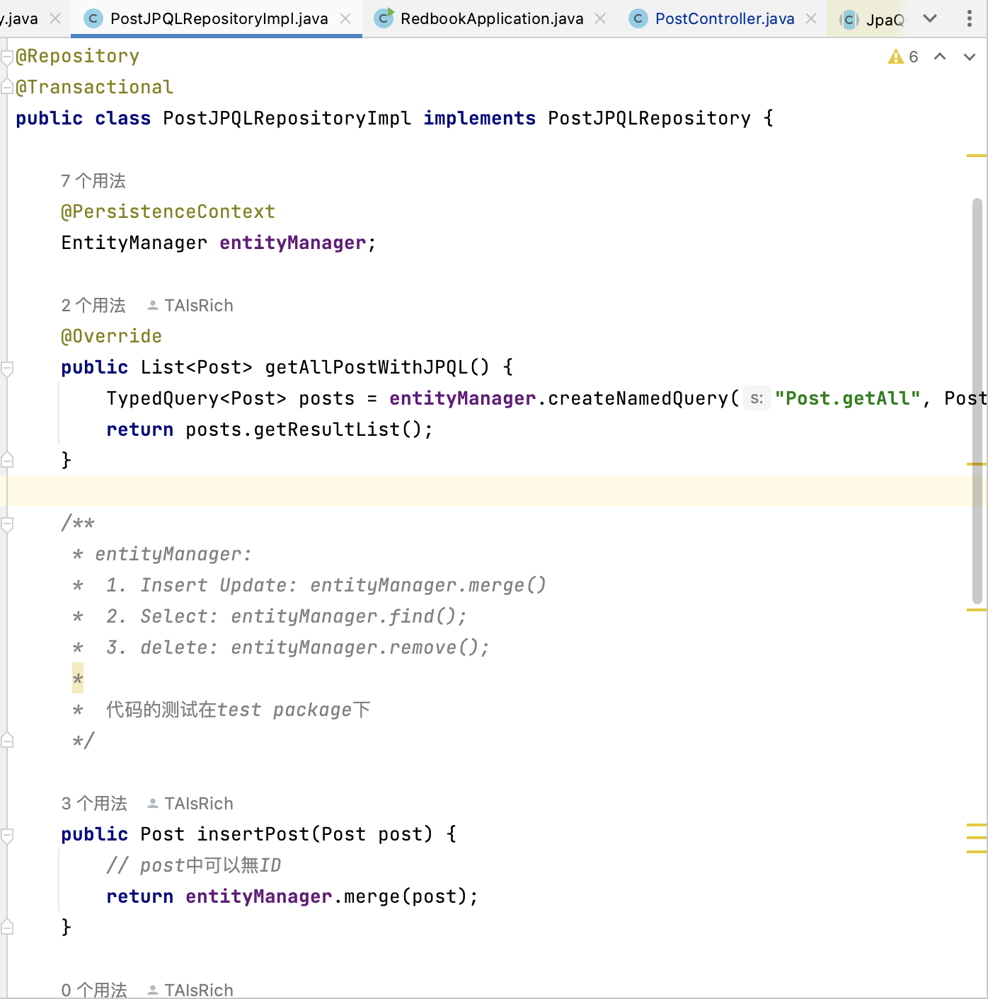

SessionFactory is Hibernate-specific API. It used to create Session objects, which are like Hibernate’s version of EntityManager. It in lower-level, more flexible, but less portable.


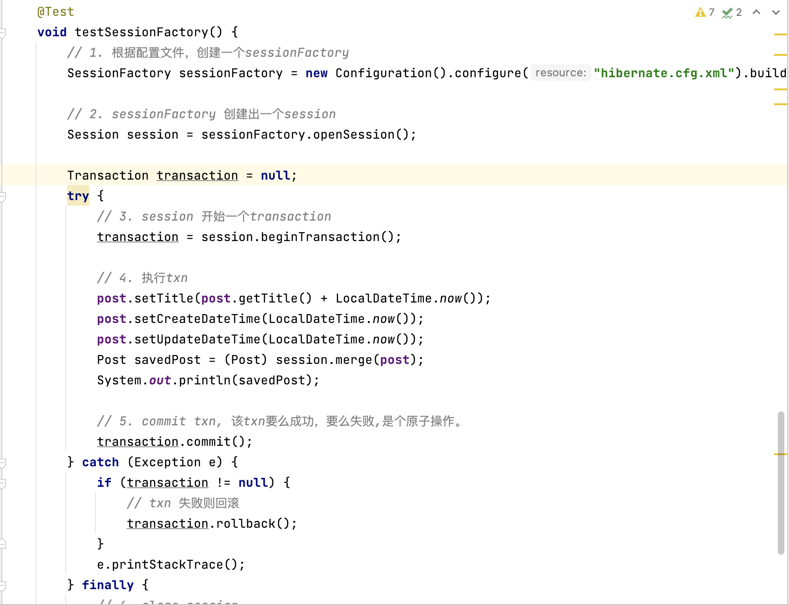

12. SessionFactory vs Session

Explain the role of Session and how it differs from SessionFactory.

SessionFactory:

* A heavyweight, thread-safe, and singleton-like object

* Created once at application startup

* Responsible for creating Session instances

* Internally manages connection pooling, caching, metadata, etc.

Session:

* A lightweight, non-thread-safe object

* Represents a single unit of work (a single DB interaction context)

* Handles:

    * Saving, updating, deleting entities

    * Query execution

    * Managing the first-level cache (persistence context)

## Part 6:Database Fundamentals

13. SQL Transactions
Explain what a transaction is in the context of relational databases, and how Spring/Hibernate manage transactions.

A transaction is a sequence of one or more database operations that are executed as a single logical unit of work.

Properties of a Transaction (ACID):

* Atomicity: All operations succeed or none do.

* Consistency: DB moves from one valid state to another.

* Isolation: Transactions don’t interfere with each other.

* Durability: Once committed, changes are permanent.

Spring Manages Transactions: Using @Transactional

```
@Service
public class BankService {

    @Autowired
    private AccountRepository accountRepo;

    @Transactional
    public void transfer(Long fromId, Long toId, int amount) {
        Account from = accountRepo.findById(fromId).get();
        Account to = accountRepo.findById(toId).get();

        from.withdraw(amount);
        to.deposit(amount);

        // If any exception occurs here, transaction will roll back
    }
}
```

Hibernate Works with Transactions: uses a Session object tied to a transaction.

```
Session session = sessionFactory.openSession();
Transaction tx = session.beginTransaction();

try {
    // Do operations
    tx.commit(); // saves changes
} catch (Exception e) {
    tx.rollback(); // undoes changes
}
```

14. Hibernate Caching
Explain Hibernate’s caching mechanisms. 
Compare:
First-Level Cache (session scope)
Second-Level Cache (shared/global scope)

First-Level Cache (Session Cache):

* Built-in, automatic, and mandatory

* Associated with the Hibernate Session (or JPA EntityManager)

* Caches entities within a single session

* One session → One first-level cache

* Objects are loaded only once per session; repeated calls return the same object reference

* Cleared when the session is closed

Second-Level Cache (Shared Cache):

* Optional, configurable

* Shared across multiple sessions

* Used to persistently cache entities or query results beyond the lifespan of one session


