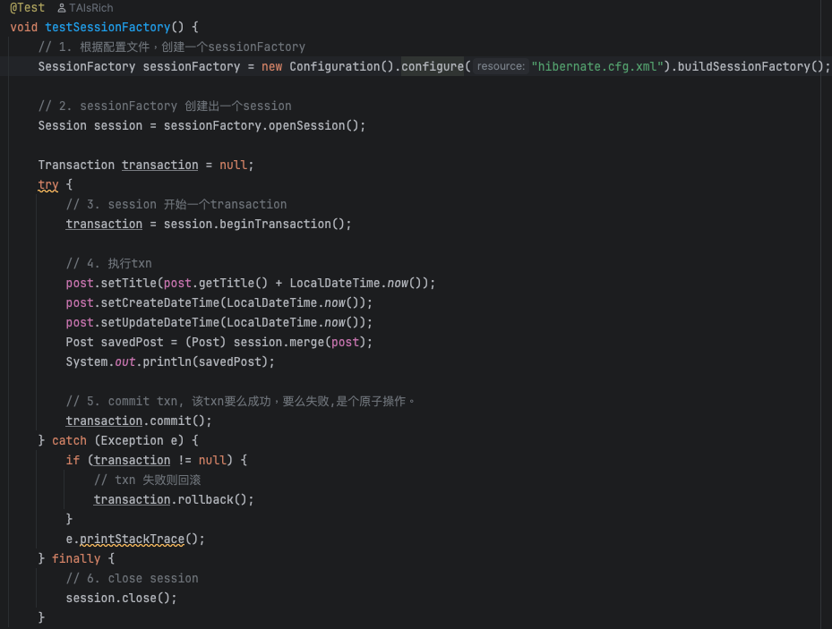
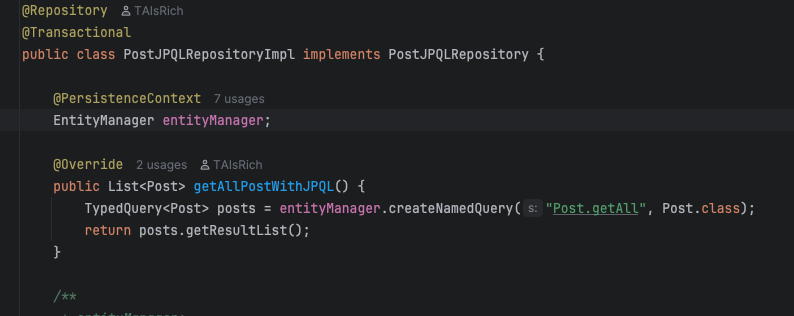

**1. List all of the annotations you’ve learned from class and homework in a file named annotations.md.
This will serve as your Spring annotation reference.**'

Refer to annotation.md

**2. Setup Starter Project & Test APIs
Clone the following repository:
https://github.com/CTYue/springboot-redbook/tree/05_02_slides_JPQL_EntityManager_Session
Make the necessary code/configuration changes to bring up the application.
Test each controller using Postman and take screenshots.**

**3. Write Custom JPA Methods and Validate Syntax
Based on the codebase from Task 2:
Write custom JPA methods using Spring Data JPA naming conventions.
Demonstrate how JPA performs compile-time syntax checks on method names.**

**4. Implement JPQL and Native SQL Queries
In your repository interface, add:
One JPQL query using the @Query annotation
One native SQL query using @Query(nativeQuery = true)
Update your service layer to use these queries.
Test both using Postman and capture screenshots.**

2 3 4 refer to screenshots under img/Q2 img/Q3 img/Q4

**5. Explain the differences and relationships among: Spring Data JPA, Hibernate, HikariCP, JDBC**

- **JDBC(Java Database Connectivity)** Low-level Java API to run SQL against a database. Requires manual handling of connections and queries.
- **Hibernate** A powerful `ORM framework` that maps Java objects to database tables. It uses JDBC under the hood to execute SQL
- **Spring Data JPA** A Spring abstraction over JPA (usually using Hibernate) that lets you write repository interfaces and query methods without low-level setup code
- **HikariCP** A high-performance JDBC connection pool manager. It efficiently manages DB connections for frameworks like Hibernate and Spring Data JPA.


- How they work together?

Spring Data JPA
    ↓
Hibernate (JPA implementation)
    ↓
JDBC (low-level API)
    ↓
Database Driver (e.g., MySQL)
    ↕
HikariCP (manages pooled JDBC connections)


**6. Explain the following annotations with examples: @OneToMany, @ManyToOne, @ManyToMany Also describe and explain the configuration properties inside each, such as mappedBy, cascade, and fetch.**

- `@OneToMany` Represents one entity related to many others (e.g., one user has many posts).
```java
@Entity
public class User {
    @OneToMany(mappedBy = "user", cascade = CascadeType.ALL, fetch = FetchType.LAZY)
    private List<Post> posts;
}
```
  - `mappedBy`: Specifies that Post.user owns the relationship.
  - `cascade`: Operations (like persist/delete) on User will cascade to Post.
  - `fetch`: 
    - LAZY (default): Posts are loaded only when accessed.
    - EAGER: Posts are loaded with the User.

- `@ManyToOne` Represents many entities related to one (e.g. many posts belong to one user)
```java
@Entity
public class Post {
    @ManyToOne(fetch = FetchType.LAZY)
    @JoinColumn(name = "user_id")
    private User user;
}
```
  - `@JoinColumn` defines the foreign key.
  - No `mappedBy` is needed.

- `@ManyToMany` Represents a **many-to-many** relationship (e.g., users and roles)
```java
@Entity
public class User {
    @ManyToMany(fetch = FetchType.LAZY, cascade = CascadeType.PERSIST)
    @JoinTable(
        name = "user_roles",
        joinColumns = @JoinColumn(name = "user_id"),
        inverseJoinColumns = @JoinColumn(name = "role_id")
    )
    private Set<Role> roles;
}
```
  - `@JoinTable` defines the join table and key columns
  - `cascade` allows persisting related roles when saving a user

**7. Cascade Options in JPA Explain cascade = CascadeType.ALL and orphanRemoval = true. Also describe all other CascadeType values: `PERSIST`, `MERGE`, `REMOVE`, `DETACH`, `REFRESH`**

- `cascade = CascadeType.ALL` Applies all types of cascade operations (persist, merge, remove, etc.) from the parent entity to its children.
  - e.g. when saving, updating, or deleting a `User`, it also applies to related `Post` objects.
- `orphanRemoval = true` Automatically **removes child entities** that are no longer referenced in the parent collection.
  - e.g. if a `Post` is removed from the `posts` list, it will also be deleted from the database.

| CascadeType | Description                                                                 | Example Behavior                                                                 |
|-------------|-----------------------------------------------------------------------------|----------------------------------------------------------------------------------|
| `PERSIST`   | Saves child entities when the parent is saved                               | Saving a `User` also saves all new `Post`s in `user.getPosts()`                 |
| `MERGE`     | Updates child entities when the parent is updated                           | Updating a detached `User` will also update its `Post`s                         |
| `REMOVE`    | Deletes child entities when the parent is deleted                           | Deleting a `User` will also delete all `Post`s in its list                      |
| `DETACH`    | Detaches child entities when the parent is detached from the persistence context | `EntityManager.detach(user)` will also detach associated `Post`s           |
| `REFRESH`   | Reloads child entities when the parent is refreshed from the database        | `EntityManager.refresh(user)` will also refresh all `Post`s                    |
| `ALL`       | Applies all of the above operations                                          | Shortcut for applying `PERSIST`, `MERGE`, `REMOVE`, `DETACH`, and `REFRESH`    |

**8. Fetch Types in JPA: Explain FetchType.LAZY and FetchType.EAGER, and describe when to use each**

- `FetchType.LAZY` loading is typically used when related data isn't always needed. It improves performance by delaying database queries until the relationship is accessed. 
- `FetchType.EAGER` loading is useful when you always need the related data with the parent, but it can lead to performance issues if overused (e.g. unnecessary joins)
- Best Practice: Use `LAZY` by default and switch to `EAGER` only when you consistently require related data at the time of loading the parent.

**9. JPQL Overview: Explain what JPQL is and how it differs from SQL. Include examples.**

- **JPQL** lets you write queries using Java entity and field names, not raw SQL tables or columns.
It’s translated by the JPA provider (like `Hibernate`) into native SQL at runtime.
- **JPQL** is more portable, safer, and object-centric, while SQL gives more low-level control.

```java
@Query("SELECT p FROM Post p WHERE p.title = :title")
Post findByTitle(@Param("title") String title);
```
- `Post` is a Java entity
- `p.title` refers to the field in the Java class

- Equivalent SQL:
```sql
SELECT * FROM posts WHERE title = 'Spring Boot';
```
- `posts` is the table name
- `title` is the column in the database

**10. Using the `@Query` Annotation: Explain what the `@Query` annotation does, where it is used, and how to use it for both JPQL and native queries.**
- The @Query annotation is used in Spring Data JPA to define custom queries directly on repository methods.
- It is placed above a method in a repository interface to override default query generation.
- It supports both JPQL (default) and native SQL by setting nativeQuery = true.

**11. EntityManager vs SessionFactory. Compare EntityManager and SessionFactory. Include screenshots from the codebase to illustrate their relationship.**
- `EntityManager` is the **JPA-standard API** for managing persistence and queries.
- `SessionFactory` is **Hibernate-specific** and used to create Sessions for DB access.
- In modern Spring Boot apps using JPA, EntityManager is preferred and auto-managed.



- Direct usage of Hibernate’s API
- Manually configure SessionFactory, open Sessions, and manage Transactions
- Used when working directly with Hibernate (without JPA abstraction)



- Standard JPA API (portable across different JPA providers like Hibernate, EclipseLink)
- EntityManager is automatically injected and managed by Spring
- Provides a higher-level abstraction over Hibernate's Session

**12. SessionFactory vs Session: Explain the role of Session and how it differs from SessionFactory.**
`SessionFactory` as a factory (or connection manager) that creates `Session` instances.
`Session` is used to actually **persist, query, update, or delete entities.**
We would need one `SessionFactory` per application, but you'll use many `Sessions`, often one per transaction or HTTP request.

| Aspect           | `SessionFactory`                                     | `Session`                                              |
|------------------|------------------------------------------------------|--------------------------------------------------------|
| Role             | Factory for `Session` objects                        | A single unit of work for interacting with the DB      |
| Lifecycle        | Long-lived, shared across the app                    | Short-lived, per request/transaction                   |
| Thread Safety    | Thread-safe                                          | Not thread-safe                                   	   |
| Responsibility   | Creates `Session`s, manages DB connection pool       | Executes CRUD operations, manages transactions         |
| Typical Use      | Initialized once at app startup                      | Opened/closed per DB operation or user request         |

**13. SQL Transactions: Explain what a transaction is in the context of relational databases, and how Spring/Hibernate manage transactions.**

A **transaction** in relational databases is a sequence of operations executed as a single unit of work. It ensures **ACID** properties:
- **A**tomicity: All or nothing.
- **C**onsistency: DB remains valid before and after.
- **I**solation: Concurrent transactions don’t interfere.
- **D**urability: Committed changes persist.

- Spring + Hibernate provide declarative transaction management, so we don’t need to manage transactions manually.
```java
@Transactional
public void createPost(Post post) {
    postRepository.save(post);
}
```
The @Transactional annotation tells Spring to:

- Open a transaction at the start of the method
- Commit it if everything succeeds
- Roll it back automatically if an exception occurs

**Hibernate** When we call `EntityManager.persist()` or `session.save()`:
- Hibernate tracks changes in the persistence context
- It flushes and commits the SQL only at the end of the transaction
```java
Session session = sessionFactory.openSession();
Transaction tx = session.beginTransaction();

session.save(post);

tx.commit();
session.close();
```
- But in Spring Boot, this is handled automatically via @Transactional.

**14. Hibernate Caching:Explain Hibernate’s caching mechanisms. Compare: First-Level Cache (session scope) vs Second-Level Cache (shared/global scope)**

Hibernate provides powerful caching mechanisms to reduce database access and improve performance. It supports two main levels of caching:

| Feature                | First-Level Cache (L1)                          | Second-Level Cache (L2)                             |
|------------------------|------------------------------------------------|-----------------------------------------------------|
| **Scope**              | Session-level (per `Session`)                 | SessionFactory-level (shared across sessions)       |
| **Enabled by Default** | ✅ Yes                                          | ❌ No (requires manual configuration)                |
| **Lifetime**           | Active during the lifespan of a session       | Survives across multiple sessions                   |
| **Shared Across Sessions** | ❌ No                                       | ✅ Yes                                               |
| **Purpose**            | Avoids redundant DB access within a session   | Reuses data globally to improve scalability         |
| **Storage**            | In-memory within the session                  | External cache (e.g., Redis, EhCache, Infinispan)   |
| **Configuration Needed** | No                                           | Yes (e.g., via Hibernate or Spring configs)         |
| **Usage**              | Always active, cannot be disabled             | Optional, good for frequently accessed entities     |

**First-level cache (L1)**
```java
Session session = sessionFactory.openSession();
Post post1 = session.get(Post.class, 1L); // hits DB
Post post2 = session.get(Post.class, 1L); // served from L1 cache
```

**Second-level cache (L2)**
```java
@Entity
@Cacheable
@org.hibernate.annotations.Cache(usage = CacheConcurrencyStrategy.READ_WRITE)
public class Post {
    @Id
    private Long id;

    private String title;
    // ...
}

```

- Common Providers: Redis (with Hibernate plugins)... `spring.cache.type=redis`
- Hibernate’s First-Level Cache is always on and scoped to a session.
- Second-Level Cache is optional and shared across sessions.
- Use L2 cache for read-heavy applications to minimize repeated DB queries across users/sessions.
