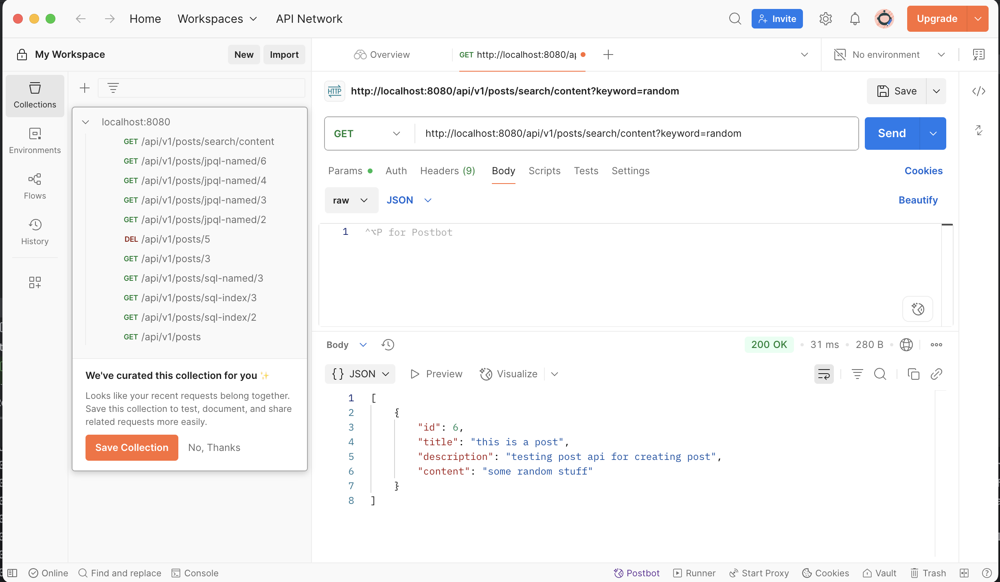
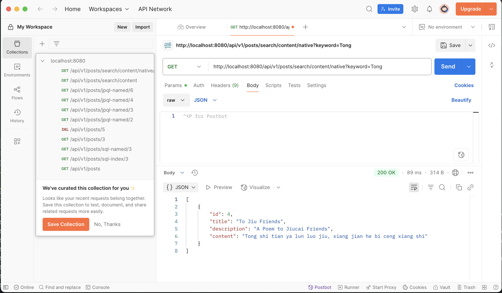

3. Inside PostRepository.java the following works:

Misnaming findPostByTtitle will give:
Error creating bean with name 'postController': Unsatisfied dependency expressed through field 'postService';

4. 



5. 
JDBC is the most basic way Java talks to a database. You write raw SQL, open connections, run queries, and close everything yourself — it's powerful but very manual.

Hibernate sits on top of JDBC and handles a lot of that grunt work. It maps your Java classes to database tables, so you can work with objects instead of writing SQL all the time.

Spring Data JPA goes one step further. It builds on top of Hibernate (or any JPA provider) and lets you define queries just by writing method names, like findByTitle(). It’s all about reducing boilerplate and speeding up development.

HikariCP doesn’t deal with queries or mapping — it handles the connection pool underneath. It makes sure your app gets fast, efficient database connections when needed. Spring Boot uses it by default because it’s lightweight and fast.

6.
@OneToMany
Used when one entity has a collection of another entity.
```angular2html
@Entity
public class Post {
    @OneToMany(mappedBy = "post", cascade = CascadeType.ALL, fetch = FetchType.LAZY)
    private List<Comment> comments;
}

```
@ManyToOne
The flip side — used when many entities relate to one entity.
```angular2html
@Entity
public class Comment {
    @ManyToOne(fetch = FetchType.LAZY)
    @JoinColumn(name = "post_id")
    private Post post;
}
```

@ManyToMany
Used when both sides can have multiple relationships with each other.
```angular2html
@Entity
public class Student {
    @ManyToMany
    @JoinTable(
        name = "student_course",
        joinColumns = @JoinColumn(name = "student_id"),
        inverseJoinColumns = @JoinColumn(name = "course_id")
    )
    private Set<Course> courses;
}
```

7. cascade = CascadeType.ALL
   This means: any action you perform on the parent (save, update, delete, etc.), will also be applied to the child.
   
orphanRemoval = true
   This means: if you remove a child from the collection, and it no longer belongs to another parent, it will be deleted from the database automatically.

🔸PERSIST - Saves the child when you save the parent.
Example: if post is new and comment is new, saving post also saves comment.

🔸 MERGE - Updates child when parent is merged (updated).
Used in detached entity updates (e.g., after mapping from DTO).

🔸 REMOVE - Deletes child when parent is deleted.

🔸 DETACH - Detaches child entities from persistence context when parent is detached.
Rarely used directly.

🔸 REFRESH - Reloads child entities from DB when parent is refreshed.
Useful when you want the latest state from DB.

8. FetchType.LAZY means related entities are loaded only when explicitly accessed, while FetchType.EAGER means related entities are loaded immediately with the parent.

LAZY is preferred for large or optional relationships to improve performance and reduce unnecessary data loading. EAGER is used when related data is always needed together with the main entity. Misuse of EAGER can lead to performance issues such as the N+1 query problem.

9. JPQL (Java Persistence Query Language) is an object-oriented query language used in JPA to query entity objects, not database tables. It is similar to SQL but works with Java classes and fields, not table names and columns.

Key Differences from SQL:

-JPQL queries Java entities (Post, User) instead of table names (posts, users).

-JPQL uses entity field names (title, author) instead of column names.

-JPQL supports navigation through object relationships (e.g., post.author.name).

```angular2html
SELECT p FROM Post p WHERE p.title = 'Hello'
```
```angular2html
SELECT * FROM posts WHERE title = 'Hello'
```

10. The @Query annotation is used in Spring Data JPA to define custom queries directly on repository methods. It is placed above a method in a repository interface to override default query generation.

11. EntityManager is part of the JPA specification and is used to interact with the persistence context in a database-agnostic way. It provides methods to persist, remove, find, and query entity objects. It is lightweight and typically injected by the container using @PersistenceContext.

SessionFactory is a Hibernate-specific API used to create Session instances, which manage the connection with the database. It is heavyweight and usually created once for the entire application. While EntityManager is part of standard JPA, SessionFactory belongs to the Hibernate implementation.

12. Session is a Hibernate interface that represents a single unit of work with the database. It is responsible for managing the persistence of entities, executing queries, and handling transactions. A Session is lightweight and short-lived, typically tied to a single user request or transaction.

In contrast, SessionFactory is a heavyweight object responsible for creating Session instances. It is initialized once when the application starts and serves as a factory for producing Sessions. It also holds the configuration and database connection details.

13. A transaction in relational databases is a sequence of operations performed as a single logical unit of work. It follows the ACID properties — Atomicity, Consistency, Isolation, and Durability — which ensure that either all operations succeed or none take effect, preserving data integrity.

In Spring and Hibernate, transactions are managed to ensure that database operations are executed reliably. Spring provides declarative transaction management using the @Transactional annotation. When a method annotated with @Transactional is called, Spring opens a transaction before the method starts and commits it after the method completes. If any exception occurs, the transaction is automatically rolled back.

14. First-Level Cache is enabled by default and scoped to a single Session. Any entity loaded within a session is stored in memory, so repeated access to the same entity within that session does not hit the database again. The cache is cleared when the session is closed.

Second-Level Cache is optional and scoped to the entire application. It is shared across sessions and stores entities in external cache providers like Ehcache or Redis. It helps reduce database access even across different sessions, especially for frequently read, rarely changed data.

