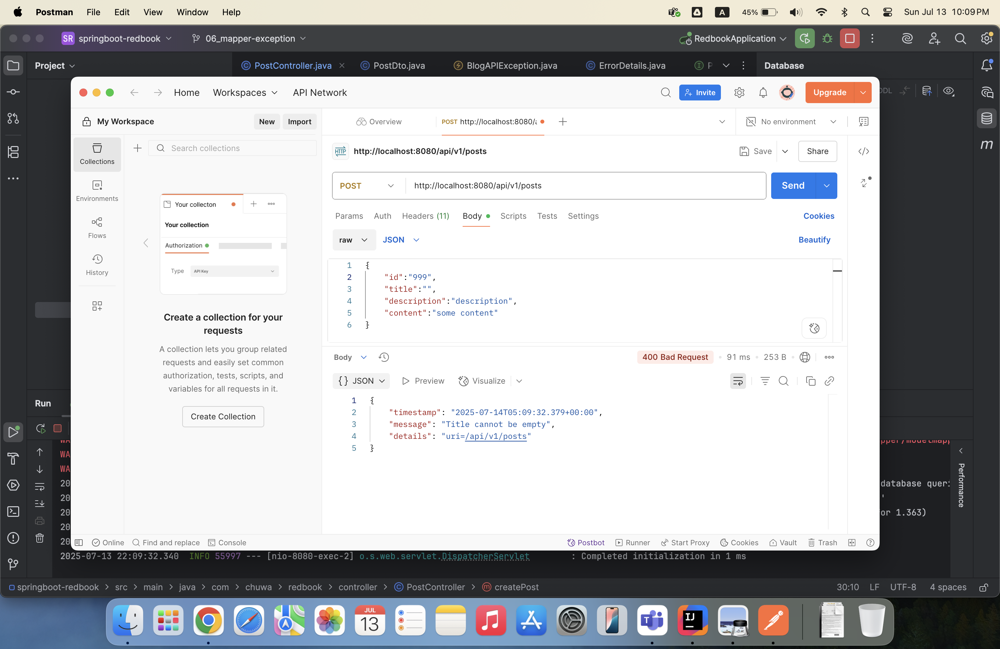

3. 
1) Separation of Concerns: Entities are designed to represent database structure, while DTOs are designed for API consumers. model mappers can keep them separate, which avoids leaking internal data structures.
2) Decoupling: It reduces coupling between database schema and API contracts, making code more maintainable and resilient to changes.
3) Performance: We can transfer only the required fields via DTOs, reducing payload size and serialization/deserialization costs.

4. 
1) 
```angular2html
List<UserEntity> users = List.of(
    new UserEntity(1L, "Alice"),
    new UserEntity(2L, "Bob")
    ); 
    
    List<UserDto> dtos = modelMapper.map(users, List.class);
```
ModelMapper cannot infer the destination generic type due to Java's type erasure.

2) 
```angular2html
Department dept = new Department("Engineering");
Employee emp = new Employee("Alice");

dept.setEmployees(List.of(emp));
emp.setDepartment(dept);

DepartmentDto dto = modelMapper.map(dept, DepartmentDto.class);
```
Bi-directional relationships between objects (common in JPA) cause infinite recursion.

3) 
```angular2html
public class UserEntity {
    private Long id;
    private String fullName;
    private LocalDate dateOfBirth;
}

public class UserDto {
    private String name;          // Doesn't match "fullName"
    private String dateOfBirth;   // Type mismatch: expects String, not LocalDate
}

UserEntity entity = new UserEntity(1L, "Alice Johnson", LocalDate.of(1990, 5, 20));
UserDto dto = modelMapper.map(entity, UserDto.class);
```
Mismatched Property Names and Types

5. ModelMapper uses reflection to match source and target properties by name and type. For basic type mismatches (e.g. String to Integer, LocalDate to String), it applies built-in converters. If no suitable converter exists, the field is skipped or causes a runtime error. For complex cases, such as formatting dates or mapping custom types, custom converters must be registered explicitly using addConverter().
6. 
7. @ControllerAdvice is a Spring annotation that allows centralized exception handling across all controllers. Combined with @ExceptionHandler, it intercepts exceptions and returns custom HTTP responses (e.g., error message, timestamp, status code). It promotes cleaner controllers and consistent API error responses. An alternative is using ResponseEntityExceptionHandler (a Spring base class) to override methods like handleMethodArgumentNotValid. However, @ControllerAdvice remains the most flexible and widely used approach for global API exception handling.
8. Throwing a regular exception (e.g. NullPointerException) results in a generic 500 response with no meaningful message. In contrast, throwing a customized exception like BlogAPIException lets us define the HTTP status and user-friendly error message. @ControllerAdvice catches this and returns a structured JSON response (ErrorDetails).

9. 

10. Spring Framework is built on core principles like Inversion of Control (IoC), Dependency Injection (DI), and Aspect-Oriented Programming (AOP). IoC and DI reduce coupling and promote modular design, while AOP separates cross-cutting concerns like logging and security. These principles enable scalable, testable, and maintainable business applications by organizing code into loosely coupled components. Spring also provides built-in support for data access, transactions, and REST APIs, speeding up enterprise development.
11. 
1) Constructor Injection (Recommended): Dependencies are passed via constructor.
```angular2html
@Component
public class OrderService {
    private final PaymentService paymentService;

    @Autowired
    public OrderService(PaymentService paymentService) {
        this.paymentService = paymentService;
    }
}
```
2) Setter Injection: Dependency injected via setter method.
```angular2html
@Component
public class NotificationService {
    private EmailService emailService;

    @Autowired
    public void setEmailService(EmailService emailService) {
        this.emailService = emailService;
    }
}
```

3) Field Injection: Dependency injected directly into fields using @Autowired.
```angular2html
@Component
public class UserService {
    @Autowired
    private UserRepository userRepository;
}
```

Field injection is not preferred because:

-Breaks encapsulation (private fields modified externally)

-Harder to unit test (no easy way to mock via constructor)

-Less readable and maintainable in large codebases

12.
1) ClassPathXmlApplicationContext
Loads configuration from an XML file on the classpath

Mainly used in older Spring projects

Not commonly used in modern Spring Boot applications

```angular2html
<beans>
    <bean id="myService" class="com.example.MyService"/>
</beans>
```

2) FileSystemXmlApplicationContext

Loads XML config from any location in the file system
```angular2html
ApplicationContext context = new FileSystemXmlApplicationContext("C:/config/beans.xml");
```

3) AnnotationConfigApplicationContext
   
Loads beans via @Configuration and @Bean annotations

Most commonly used in modern Spring and Spring Boot projects

```
@Configuration
public class AppConfig {
    @Bean
    public MyService myService() {
        return new MyService();
    }
}

ApplicationContext context = new AnnotationConfigApplicationContext(AppConfig.class);
MyService service = context.getBean(MyService.class);
```

4) GenericApplicationContext

A flexible context that can register beans manually or via readers

Used in frameworks or dynamically defined beans
```angular2html
GenericApplicationContext context = new GenericApplicationContext();
context.registerBean(MyService.class);
context.refresh();

MyService service = context.getBean(MyService.class);
```

13. 
@Component is a class-level annotation that marks a class as a Spring-managed bean and is automatically detected via component scanning. @Bean is a method-level annotation used inside @Configuration classes to manually define and return a Spring bean. Use @Component for your own classes with simple dependencies, and @Bean when you need full control over bean creation, such as for third-party classes or when customizing constructor parameters. Both result in beans being registered in the Spring context.

14. Spring defines bean scopes to control the lifecycle and visibility of beans. The most common are singleton (default, one instance per Spring container) and prototype (a new instance each time it’s requested). Web applications also support request, session, and application scopes. Choose singleton for shared stateless services, and prototype for stateful or short-lived objects. In web apps, use request or session scope to tie bean lifecycle to HTTP context. Picking the right scope ensures efficiency and proper state management.
15. In Spring, the bean class refers to the fully qualified Java class that defines the object’s behavior (e.g., com.example.MyService), while the bean id is a unique name used to identify and retrieve that bean from the Spring container. The class determines the logic, and the id is used for wiring or lookup. If not explicitly set, the id defaults to the class name with a lowercase first letter. Clear separation of id and class supports modular design and flexible configuration.
16. When multiple implementations of a bean interface exist, Spring cannot autowire them unambiguously and will throw a NoUniqueBeanDefinitionException unless a specific one is marked with @Primary or qualified using @Qualifier. Use @Primary on the preferred implementation to make it the default choice. Alternatively, use @Qualifier("beanName") in the injection point to explicitly select the desired bean. This ensures precise control when multiple beans of the same type exist in the container.


