Project is in the Projects/HW11/springboot-redbook directory

1.Annotations are listed in annotations.md

2.App started successfully

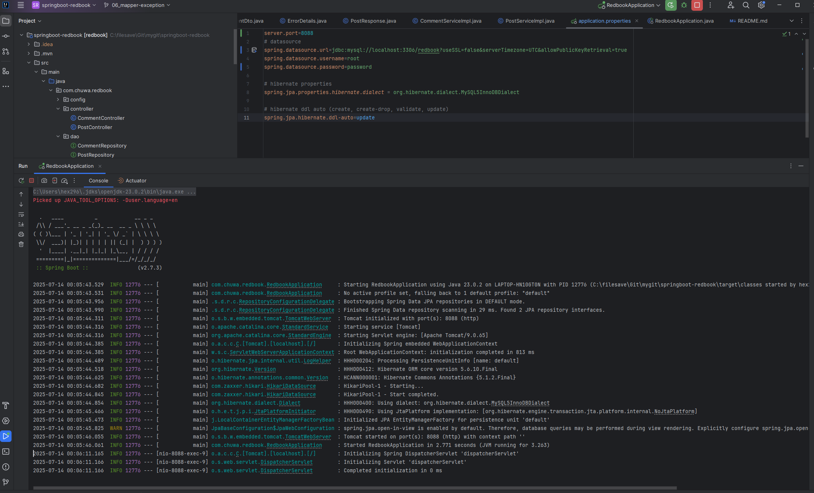

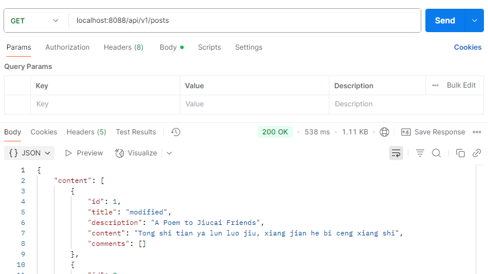

3.We need to map between different types of object, like JPA entity and API DTO in service layer, but manually writing these methods is tedious. Model mapper could automatic do these converts to reduce the extra code and potential error.

4.

When property name of fields in dto and entity mismatch, Modelmapper will fail without explicit  setting

```
Dto:
private String descriptionDTO;
Entity:
private String description;
```


When the dto only contain foreign key, and entity have nested object belongs to that key. Modelmapper will fail without explicit  setting

```
Dto:
private Long userId;
Entity:
private User author;
```

When type of fields mismatch and no default converter, Modelmapper will fail without explicit  setting

```
Dto:
private String time;
Entity:
private LocalDateTime time;
```

5.

ModelMapper will first inspect the type of source and destination, then find a converter to try to convert. If nothing found, it will skip the value and leave the destination default value.

Coverters could be added by modelMapper.addConverter method.


6.

add custom exception in exception folder:

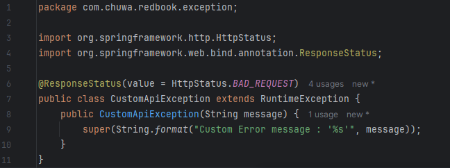


add handler in GlobalExceptionHandler.java

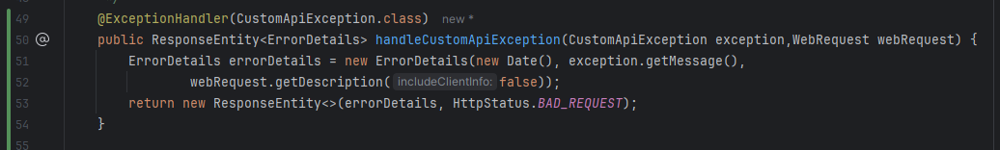

add usage in service

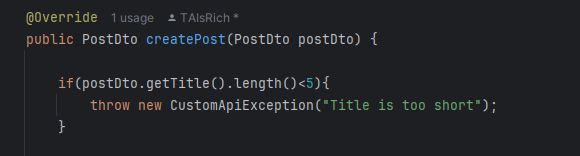

Test with postman

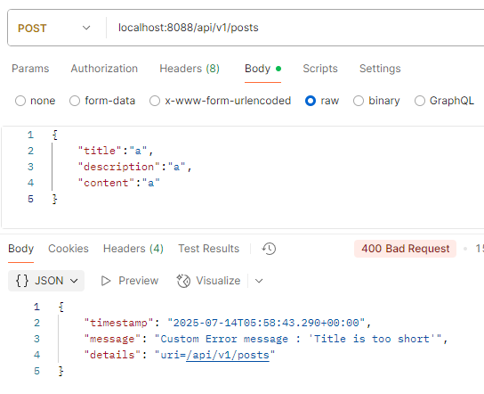

7.

When the @ControllerAdvice annotation is added to a class, it will make it a spring bean, and when declare methods annotated with @ExceptionHandler, The exception handling will apply to all controller beans.

One other approach is WebExceptionHandler in Webflux, which could provide non blocking global error handling

8.

If just throw RuntimeException("message"), it will handled with the default exception Handler for general exception, like this

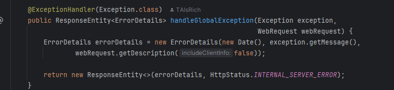

It will have Internal server error status code. Could not customize the status code and message format, which make not clear and hard for debugging


If throw custom exception, The return status code and message format could be customized with exception and custom handler. This make the error handling more clear.

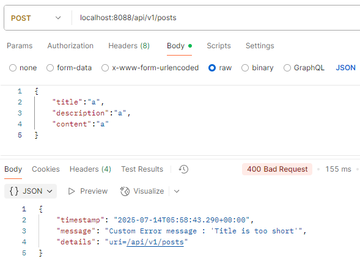


9.

Add the @Pattern in dto

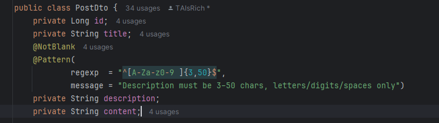

Add @Valid in Controller

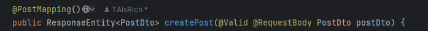

Test

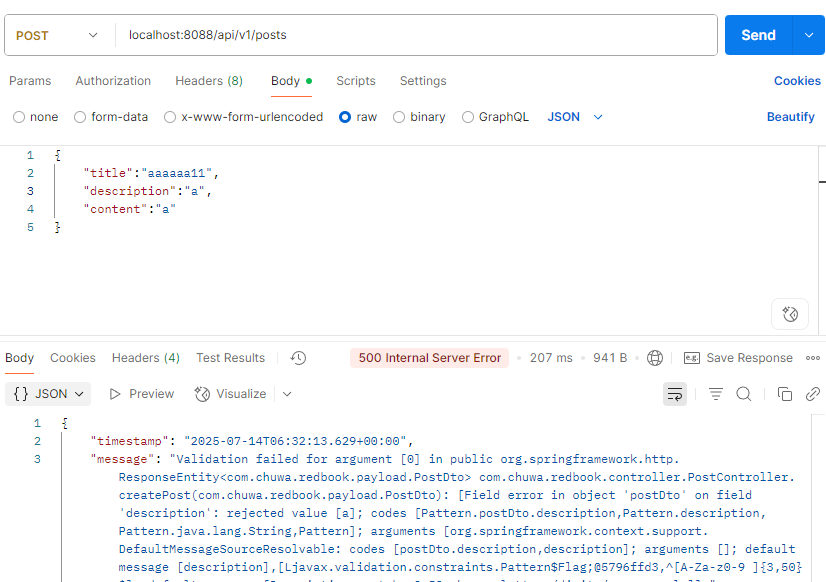

10.

The Spring framework fundamental principle is loose coupling. It helps manage dependencies, make the code not need to change when dependency implementation changes, make easier to write and debug code.

11.

Dependency injection have such types:

Field injection:

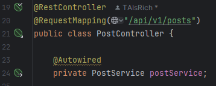

Constructor Injection

```
public class PostController{
private PostService postService;
public PostController(PostService postService){
this.postService=postService;
}
}
```

Setter Injection

```
public class PostController{
private PostService postService;
@Autowired
public void setPostService(PostService postService){
this.postService=postService;
}
}
```

The field injection is not recommended because it hide the dependencies, and the time to inject the dependency is not clear. Hard to write unit test(may need reflection)


12.

There are many types of Application Context. like 

ClassPathXmlApplicationContext: Loads bean definitions from one or more XML files on the classpath

AnnotationConfigApplicationContext: Configuration via `@Configuration` classes:


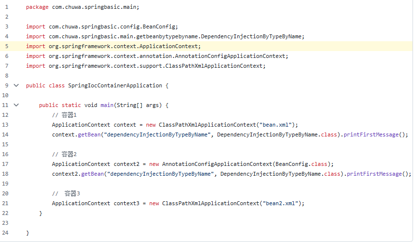

13.

@Component and @Bean both could register a bean in Spring. @Component generally used when source code of the class is inside the application. @Bean could used when use third party library and register it as bean.

14.

Spring default bean scope is Singleton, which is used when only a single , shared instance per ApplicationContext. Used in stateless services

Prototype is another bean scope, used when a brand new instance is needed when inject each time. Used in stateful objects.

15.

Bean id Is name of bean, config using @Bean(name = "userService") or @Component("userService"). It is used when lookup by name.


Bean Class is class type of bean, used when lookup by type/className.

16.

step 1:type Spring will search all available beans whose type or subtype matches the variable type in the injection point. If only one, inject it

step 2: @Primary If multiple beans of corresponding type found, spring will check for bean marked as @Primary

step 3: bean name: If no @Primary is setted, Spring will compare bean id/name/qualifier with the name of variable in the injection point. If match, it will be injected. If no bean matches, Spring will raise an error.


