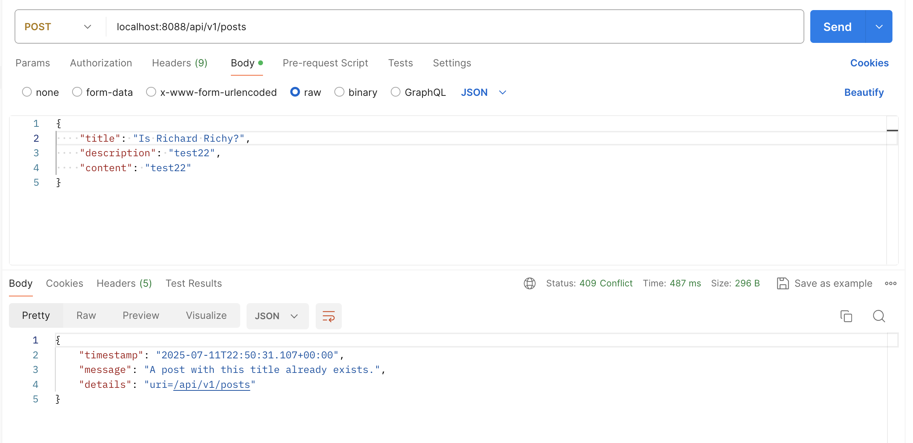
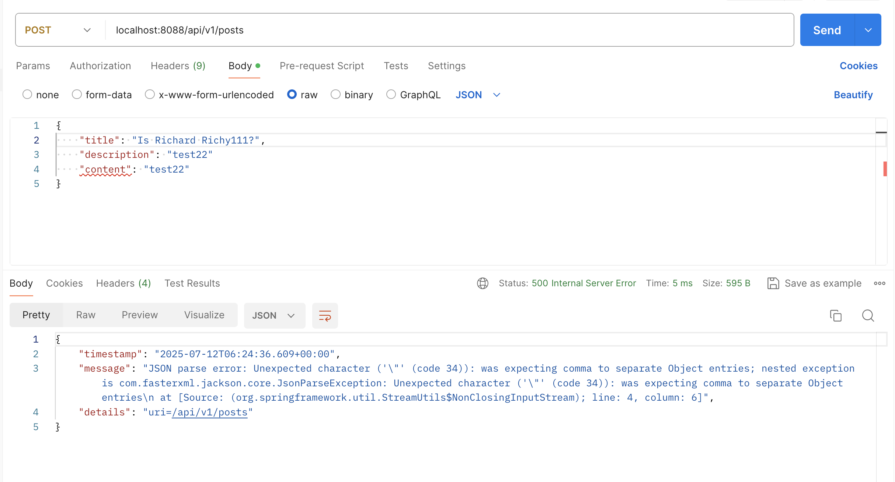

# Ryan Ma HW11 Answers


### 1. Add newly learned annotations to your previous cheatsheet, add explanations for these annotations.
Added [springAnnotationCheatsheet.md](../HW10/springAnnotationCheatsheet.md)

### 2. Walkthrough sample codes under [Repo](https://github.com/CTYue/springboot-redbook/commits/06_mapper-exception), you are supposed to bring up the application on your local.
- After editing the application.properties file, everything works.
```properties
server.port=8088

spring.datasource.username=***
spring.datasource.password=***
```
### 3. Explain why do we need model mappers in Spring, and in what scenarios we need it.
3.1 Why we need model mappers in Spring?
```java
ModelMapper modelMapper = new ModelMapper();
PostDTO postDto = modelMapper.map(post, PostDto.class);
```
- Model Mapper help us convert between Entity and Dto Class.
- Model mappers help you avoid repetitive, error-prone manual mapping, enforce clean separation between API and persistence layers, and improve maintainability in layered Spring applications.

3.2 In what scenarios we need?
- You have different representations for API and database (typical in RESTful API design).
- You need to sanitize or transform data before sending it to the client.
- You need to flatten nested structures (e.g., mapping user.getAddress().getCity() to UserDTO.city).
- You are building clean, layered architecture with controllers, services, and repositories separated.
- You have complex objects requiring consistent conversion logic across the project.

### 4. Provide three examples in which model mapper will NOT map successfully, explain why.
```java
class PostEntity {
    private Long id;
    private String title;
    private LocalDateTime createdAt;
}

class PostDto {
    private Long id;
    private String postTitle;
    private String summary;
    private String createdAt;
    
}
```
- Example 1: Mismatched Field Names
Scenario:

PostEntity:
- title

PostDTO:
- postTitle

Issue:
- ModelMapper cannot map title to postTitle automatically because: Their names differ.
- By default, ModelMapper requires exact field name matching.

Result:
- postTitle will remain null unless explicitly configured with:

Example 2: DTO Field Missing in Entity
Scenario:

PostDTO has:
- summary

PostEntity has:
- No summary field.

Issue:
- ModelMapper will not know how to populate summary in PostDTO since:
- There is no matching field or method in PostEntity.

Result:
- summary will remain null in PostDTO after mapping.

Example 3: Incompatible Types for Mapping
Scenario: 

PostDTO has:
- LocalDateTime createdAt

PostEntity has:
- String createdAt;

Issue:
- PostEntity.createdAt is LocalDateTime, while PostDTO.createdAt is String.
- ModelMapper: Does not automatically convert LocalDateTime to String with a formatted date.

Result:
- Will throw an error or leave the field null unless a custom converter is provided.

### 5. Explain how model mapper cast different data types between source object and target class.
5.1 Basic Principle
ModelMapper automatically maps matching property names, and for data type differences, it attempts implicit type conversion if:
- There is a direct, compatible type conversion between the source and target field types.
- A registered converter exists to handle the conversion.

5.2 What type conversions ModelMapper can handle automatically
- Primitive → Wrapper types, e.g., 
  - int → Integer; 
  - double → Double
- Compatible numeric types, e.g., 
  - Integer → Long; 
  - Short → Integer; 
  - Enums ↔ String, if the string matches the enum name exactly.
- String ↔ Primitive types, e.g., 
  - "123" → Integer; 
  - "true" → Boolean
- Collection element type mapping (if element types are compatible).

5.3 What ModelMapper cannot handle automatically
- Complex type conversions like:
    - LocalDateTime ↔ String with formatting.
    - String ↔ CustomObject.
    - Flattening nested objects to primitives or strings.
- Incompatible structures:
  - Mapping List<ComplexType> → List<String> by extracting a specific field requires explicit configuration.

5.4 How to handle incompatible conversions: Using Converters
- Define a custom Converter to tell ModelMapper explicitly how to transform the data.
```java
// Example: LocalDateTime → String
ModelMapper modelMapper = new ModelMapper();

Converter<LocalDateTime, String> localDateTimeToString = ctx -> 
    ctx.getSource() == null ? null : ctx.getSource().format(DateTimeFormatter.ISO_LOCAL_DATE_TIME);

modelMapper.addConverter(localDateTimeToString);
```

5.5 Summary

ModelMapper casts different data types by:
- Using automatic, built-in type conversions for simple, compatible types.
- Requiring custom converters for complex or incompatible type conversions.

### 6. Add your own API exceptions so that when something wrong happens in service layer, your rest API will return your customized response and status code.
- In coding folder


### 7. Explain how Controller Advices work, is there any other approach to do same/similar global API exception handling?
7.1 What is @ControllerAdvice?
- It is a Spring annotation that allows you to handle exceptions, bind data, and add model attributes globally across all @Controller and @RestController classes.

7.2 How does it work for Exception Handling?

When you throw following code in your controller or service layer;
```java
throw new ResourceConflictException("A post with this title already exists.");
```
- Spring checks for @ExceptionHandler methods inside classes annotated with @ControllerAdvice that match this exception type.
- If a match is found: That method is invoked. You can prepare a structured response (ErrorDetails) and return the appropriate ResponseEntity with a status code.
- The client receives clean, consistent error messages.

### 8. What's the difference between throwing a regular exception and a customized API exception that will be eventually thrown to Controller Advice codes? Please provide screenshots to explain your findings.
8.1 What's the difference between throwing a regular exception and a customized API exception?

| Type              | Regular Exception                                                     | Customized API Exception                                                     |
|-------------------|-----------------------------------------------------------------------|------------------------------------------------------------------------------|
| **Examples**      | `NullPointerException`, `IllegalArgumentException`, `IOException`     | `ResourceNotFoundException`, `BlogAPIException`, `ResourceConflictException` |
| **Thrown By**     | Java or Spring system code, or developer code                         | Developer-defined in application logic                                       |
| **Handled By**    | `@ExceptionHandler(Exception.class)` or default Spring error response | Specific `@ExceptionHandler(CustomException.class)` in `@ControllerAdvice`   |
| **Status Code**   | Often 500 Internal Server Error (unless mapped)                       | Can return 400, 404, 409, etc. — **customized**                              |
| **Error Message** | Often generic (`"Internal Server Error"`)                             | Clean, meaningful (`"Post not found"`, `"Duplicate title"`)                  |
| **Use Case**      | Unexpected bugs or programming errors                                 | Business logic validation errors in your app                                 |
| **Control**       | Low – handled generically unless you catch it                         | High – you design the message and status                                     |

8.2 Screenshots
- Customized API Exception

- Regular Exception


### 9.Write some regular expression to restrict the value of attributes that your Post or Comment can have. You may use https://regex101.com/ to construct and test/validate your regular expression.
```java
@Pattern(regexp = "^[A-Za-z0-9 ]{3,100}$", message = "Title must be 3-100 characters and contain only letters, digits, and spaces")
private String title;
```

### 10. Explain Spring framework fundamental principles. And how can they help build business applications?
10.1 Inversion of Control (IoC)
- Principle: 
  - Objects do not create or manage their dependencies.
  - Instead, Spring injects dependencies at runtime (a.k.a. Dependency Injection).
- How it helps:
  - Promotes loose coupling between classes.
  - Makes code easier to test, mock, and maintain.
  - Encourages modular design for business services (e.g., UserService depends on UserRepository but doesn't create it).

10.2 Dependency Injection (DI)
- Principle:
  - Spring automatically wires beans (components, services) based on configuration or annotations (@Autowired, @Component, etc).
- How it helps:
  - Developers focus on business logic, not boilerplate wiring.
  - DI enables easy layer separation (Controller → Service → Repository).

### 11. Explain different types of dependency injection, explain their suitable use cases, and why field injection is not recommended in general. Please provide necessary code snippets and screenshots if possible.
11.1 Constructor Injection (Recommended)
```java
@Service
public class PostServiceImpl {

    private final PostRepository postRepository;

    // Spring automatically injects PostRepository here
    @Autowired
    public PostServiceImpl(PostRepository postRepository) {
        this.postRepository = postRepository;
    }
}
```
- Use Case
  - When the dependency is mandatory.
  - Ideal for immutability and unit testing.

11.2 Setter Injection
```java
@Service
public class PostServiceImpl {

    private PostRepository postRepository;

    @Autowired
    public void setPostRepository(PostRepository postRepository) {
        this.postRepository = postRepository;
    }
}
```
- Use Case
  - When the dependency is optional.
  - Good when beans need to be configured or changed after construction.

11.3 Field Injection ❌ (Not Recommended)
```java
@Autowired
private PostRepository postRepository;
```

11.4 Why Field Injection is not recommended?

| Problem                   | Explanation                                                                                |
|---------------------------|--------------------------------------------------------------------------------------------|
| ❌ **Hard to test**        | You can't inject mocks easily in unit tests because there's no constructor or setter.      |
| ❌ **No immutability**     | Field stays mutable and may be accidentally overwritten.                                   |
| ❌ **Hidden dependencies** | Dependencies are not visible in constructor; violates the principle of explicit contracts. |
| ❌ **Reflection required** | Spring has to use reflection to inject fields — less clear, slower, less safe.             |

### 12. Explain different types of application context in Spring framework, with screenshots.
12.1 AnnotationConfigApplicationContext
- Use for Java-based configuration (@Configuration and @Bean)
```java
@Configuration
@ComponentScan(basePackages = {"com.chuwa.springbasic"})
public class BeanConfig {

    /**
     * bean 名是方法名
     */
    @Bean
    public JpaChuwa myDataNucleus() {
        return new DataNucleusChuwaNoComponent();
    }
}
```
```java
import org.springframework.context.annotation.AnnotationConfigApplicationContext;
ApplicationContext context2 = new AnnotationConfigApplicationContext(BeanConfig.class);
context2.getBean("dependencyInjectionByTypeByName", DependencyInjectionByTypeByName.class).printFirstMessage();
```
12.2 ClassPathXmlApplicationContext
- Use When your configuration is in XML file inside classpath
```xml
<?xml version="1.0" encoding="UTF-8"?>
<beans xmlns="http://www.springframework.org/schema/beans"
       xmlns:xsi="http://www.w3.org/2001/XMLSchema-instance"
       xmlns:context="http://www.springframework.org/schema/context"
       xsi:schemaLocation="http://www.springframework.org/schema/beans http://www.springframework.org/schema/beans/spring-beans.xsd http://www.springframework.org/schema/context https://www.springframework.org/schema/context/spring-context.xsd">

        <context:component-scan base-package="com.chuwa.springbasic"/>
        <bean id="dataNucleusChuwaNoComponent"  class="com.chuwa.springbasic.components.impl.DataNucleusChuwaNoComponent"></bean>

</beans>
```
```java
ApplicationContext context = new ClassPathXmlApplicationContext("bean.xml");
context.getBean("dependencyInjectionByTypeByName", DependencyInjectionByTypeByName.class).printFirstMessage();
```

### 13. Compare @Component and @Bean and in which scenario they should be used.
13.1 @Component — Used for automatic scanning
- Use Case: You annotate your own class so that Spring automatically detects and registers it.
- Works well for service, DAO, controller classes: @Service， @Repository, @Controller. These are just specializations of @Component.
```java
@Component
public class UserService {
    ...
}
```
13.2 @Bean — Used for manual bean declaration
- Use case: You want to register a third-party class or customize instantiation logic.
```java
@Configuration
public class AppConfig {
    @Bean
    public DataSource dataSource() {
        return new HikariDataSource(); // External class you can't annotate
    }
}

```

13.3 When to use which

| Scenario                                             | Use          |
|------------------------------------------------------|--------------|
| You wrote the class yourself                         | `@Component` |
| You want Spring to scan and register it              | `@Component` |
| You can’t modify the source (e.g., external lib)     | `@Bean`      |
| You need custom config / constructor args            | `@Bean`      |
| You want full control over how the object is created | `@Bean`      |

13.4 Comparison

| Feature            | `@Component`                                    | `@Bean`                                      |
|--------------------|-------------------------------------------------|----------------------------------------------|
| **Level**          | Class-level annotation                          | Method-level annotation                      |
| **Who manages it** | Spring auto-scans via `@ComponentScan`          | Manually defined in a `@Configuration` class |
| **Usage style**    | For your own classes                            | For third-party or external classes          |
| **Customization**  | Less flexible                                   | More flexible (can pass args manually)       |
| **Where to use**   | On classes like `@Service`, `@Repository`, etc. | Inside `@Configuration` classes              |

### 14. Explain Spring bean scopes and how to pick the correct bean scope.
14.1 Common Bean Scope in Spring
- In Spring, bean scope defines how many instances of a bean Spring creates and how long they live. Choosing the correct scope helps ensure your application is efficient, thread-safe, and behaves as expected.

| Scope Name    | Description                                       | Typical Use                           |
|---------------|---------------------------------------------------|---------------------------------------|
| `singleton`   | **Default**. One shared instance per container    | Most service and business logic beans |
| `prototype`   | A **new instance every time** it's requested      | State-full or short-lived objects     |
| `request`     | One instance per HTTP request (web only)          | Web controllers, request data holders |
| `session`     | One instance per HTTP session (web only)          | User session-scoped data              |
| `application` | One instance per web application (ServletContext) | Shared web application resources      |
| `websocket`   | One instance per WebSocket                        | WebSocket handler beans               |

14.2 How to pick the correct bean scope

| If your bean is...                        | Use this scope        |
|-------------------------------------------|-----------------------|
| Stateless, shared across app              | `singleton` (default) |
| Needs a new instance each use             | `prototype`           |
| Request-specific (e.g. form data)         | `request`             |
| Session-specific (e.g. login user)        | `session`             |
| Shared app-level object (e.g. app config) | `application`         |

### 15. Explain the difference between bean id and bean class.
15.1. What is a Bean Class?
- The class of the bean defines what object Spring should create and manage.
```java
public class UserService {
  ...
}
```

15.2 What is a Bean ID?
- The ID (or name) is the unique identifier Spring uses to reference the bean in the container.
```xml
<bean id="userService" class="com.example.UserService" />
```

15.3 Example
```java
@Component("myService")
public class MyService {}

ApplicationContext ctx = new AnnotationConfigApplicationContext(AppConfig.class);

MyService service1 = ctx.getBean("myService", MyService.class);  // ✅ preferred
MyService service2 = ctx.getBean(MyService.class);               // ✅ if only one of this type exists

```
15.4 Comparison

| Concept    | Bean ID                             | Bean Class                  |
|------------|-------------------------------------|-----------------------------|
| Definition | Identifier in the Spring container  | The type of the bean object |
| Uniqueness | Must be unique within the container | Can be used by many IDs     |
| Required?  | Optional in annotation-based config | Always required             |
| Usage      | Used with `getBean(String)`         | Used with `getBean(Class)`  |

### 16. Explain that when a bean has multiple alternative implementations, how will Spring decide which bean implementation to inject/autowire?
| Situation                                           | What to do                                 |
|-----------------------------------------------------|--------------------------------------------|
| Only one implementation                             | No issue — Spring injects it automatically |
| Multiple implementations, and one should be default | Use `@Primary`                             |
| You want to choose by name                          | Use `@Qualifier("beanName")`               |
| You want all beans of a type                        | Inject `List<T>` or `Map<String, T>`       |

16.1 @Primary
```java
@Component
@Primary
public class PaypalPaymentService implements PaymentService {
    ...
}

@Autowired
private PaymentService paymentService; // Injects Paypal

```

16.2 @Qualifier
```java
@Component("teacherService")
public class TeacherService implements UserService {...}

@Component("studentService")
public class StudentService implements UserService {...}

@Autowired
@Qulifier("teacherService")
private UserService userService;
```
