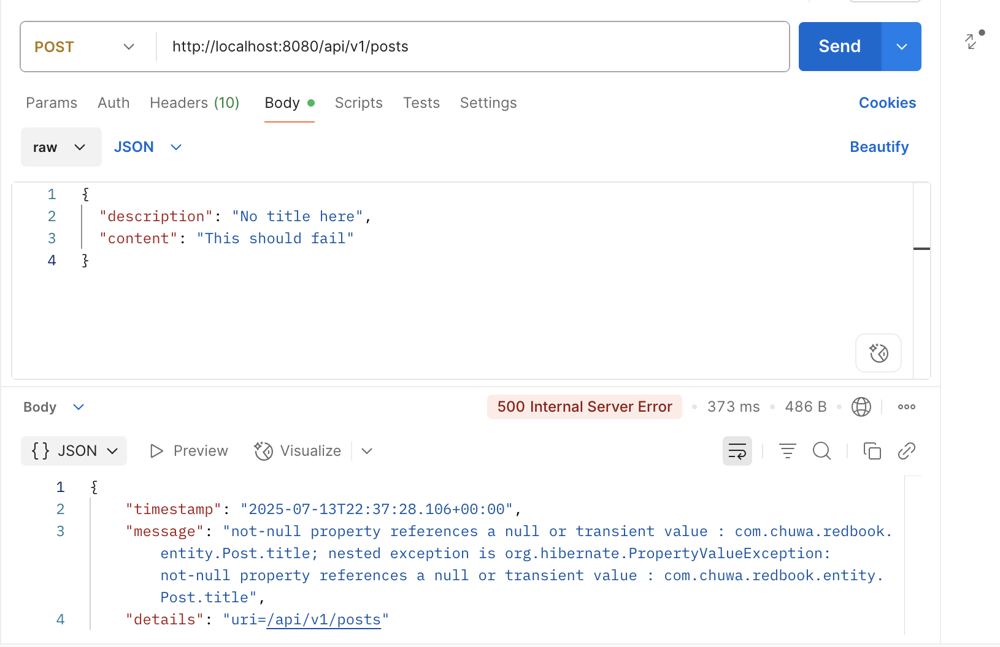
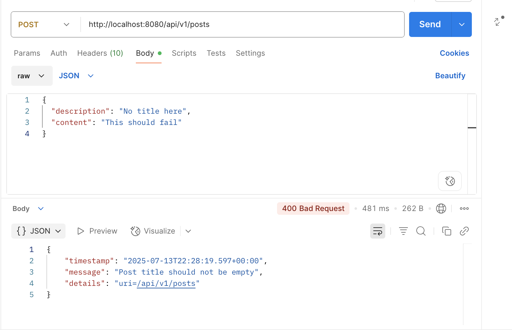
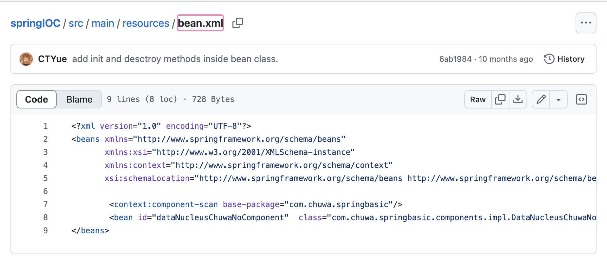
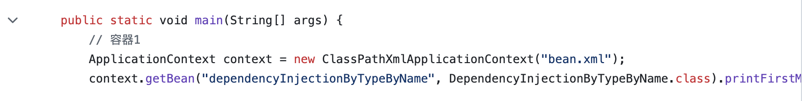
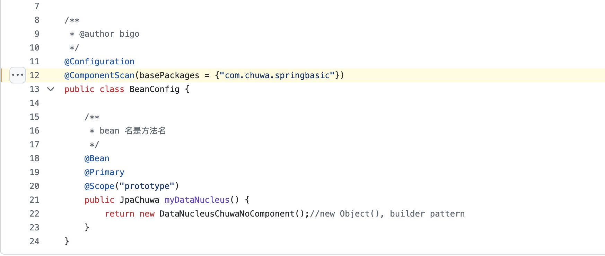

1. Add newly learned annotations to your previous cheatsheet, add explainations for these annotations.

2. Walkthrough sample codes under https://github.com/CTYue/springboot-redbook/commits/06_mapper-exception, you are supposed to bring up the application on your local.

3. Explain why do we need model mappers in Spring, and in what scanrios we need it.

Model Mappers are used to convert between different object models. The most common scenario is mapping between: Entity classes (which represent database tables) and DTOs (Data Transfer Objects) (which represent the data sent to/from clients). Manually converting between these models leads to repetitive, error-prone boilerplate code. Model Mappers like ModelMapper or MapStruct automate this conversion.

We typically use model mappers when:

* Exposing APIs: Controllers send/receive DTOs, not entities. Use a model mapper to convert between them.

* Securing sensitive fields: You don’t want to expose internal fields like passwords, IDs, or internal audit info in DTOs.

* Optimizing data: DTOs are often lighter (only necessary fields), which reduces payload size in APIs.

* Decoupling layers: Avoid coupling your web layer with JPA entity definitions.

* Improving testability: DTOs can be mocked/tested separately without depending on database-related entities.

4. Provide 3 examples in which model mapper will NOT map succesfully, explain why.

* Different Field Names: ModelMapper uses convention-based matching—by default, it maps fields with the same names.

```
// Source entity
public class User {
    private String firstName;
    private String lastName;
}

// Target DTO
public class UserDTO {
    private String givenName;
    private String surname;
}
```

* Nested Objects and Flattened DTO: ModelMapper doesn't automatically flatten order.getCustomer().getName() into orderDTO.customerName. It can't infer nested-to-flat relationships unless explicitly configured.

```
// Entity
public class Order {
    private Customer customer;
}

public class Customer {
    private String name;
}

// DTO
public class OrderDTO {
    private String customerName;
}
```

* Custom Transformations (e.g., Date to String): ModelMapper can't automatically format LocalDateTime into a human-readable string. It doesn't know how to convert complex types into different formats without a custom converter.

```
// Entity
public class Event {
    private LocalDateTime timestamp;
}

// DTO
public class EventDTO {
    private String timestamp; // formatted string like "2025-07-12 10:00"
}
```

5. Explain how model mapper cast different data types between source object and target class.

* Built-in Type Converters: ModelMapper includes default converters for many common type pairs, such as:

	* int ↔ Integer

	* String ↔ Long, Double, Boolean (if parsable)

	* Date ↔ String (basic formatting)

	* Enum ↔ String (using name() and valueOf())

* Custom Converters for Complex Type Casting: When types are too different or need special handling (like formatting dates or flattening objects), we must define custom converters or mappings.

```
Converter<LocalDateTime, String> dateToString = ctx ->
    ctx.getSource() == null ? null : ctx.getSource().format(DateTimeFormatter.ISO_LOCAL_DATE_TIME);

modelMapper.addConverter(dateToString);
```

6. Add your own API exceptions so that when something wrong happens in service layer, your rest API will return your customized response and status code.

```
@ResponseStatus(HttpStatus.BAD_REQUEST)
public class InvalidRequestException extends RuntimeException {
    public InvalidRequestException(String message) {
        super(message);
    }
}
```

7. Explain how Controller Advices work, is there any other approach to do same/similar global API exception handling?

@ControllerAdvice allows you to define global exception handlers, data binders, and model attribute processors across all your controllers. When a controller throws an exception, Spring checks whether there’s a @ControllerAdvice class that handles it.

```
@ControllerAdvice
public class GlobalExceptionHandler {

    @ExceptionHandler(ResourceNotFoundException.class)
    public ResponseEntity<String> handleNotFound(ResourceNotFoundException ex) {
        return ResponseEntity.status(HttpStatus.NOT_FOUND).body(ex.getMessage());
    }

    @ExceptionHandler(Exception.class)
    public ResponseEntity<String> handleGeneric(Exception ex) {
        return ResponseEntity.status(HttpStatus.INTERNAL_SERVER_ERROR)
                             .body("An unexpected error occurred.");
    }
}
```

Alternative Approaches to Global Exception Handling:

* Custom HandlerExceptionResolver:

	* Implement HandlerExceptionResolver or extend ResponseEntityExceptionHandler

	* Lower-level, gives you full control over how exceptions are resolved

```
@Component
public class MyExceptionResolver implements HandlerExceptionResolver {
    @Override
    public ModelAndView resolveException(HttpServletRequest req, HttpServletResponse res, Object handler, Exception ex) {
        // Custom logic to set response status and message
        res.setStatus(HttpStatus.BAD_REQUEST.value());
        return new ModelAndView(); // or return null to fall back
    }
}
```

* Filter or Interceptor

	* Add global logic in Filter or HandlerInterceptor

	* Useful for logging, but not ideal for fine-grained exception mapping

```
@Component
public class ErrorLoggingFilter implements Filter {
    public void doFilter(ServletRequest req, ServletResponse res, FilterChain chain)
        throws IOException, ServletException {
        try {
            chain.doFilter(req, res);
        } catch (Exception e) {
            // Logging or rerouting logic
        }
    }
}
```

* Spring Boot ErrorController

	* Customize the /error endpoint

	* Works well with BasicErrorController or Whitelabel Error Page

	* Can be overridden to return custom error responses for unhandled exceptions

8. What's the difference between throwing a regular exception and a customized API exception that will be eventually thrown to Controller Advice codes? Please provide screenshots to explain your findings.

Throwing a regular exception results in generic, uncontrolled error responses (typically 500), which are not user-friendly. On the other hand, using custom API exceptions and handling them with @ControllerAdvice gives you full control over the HTTP status codes, error structure, and consistency across your API—making it the preferred approach for building clean, maintainable RESTful services.

Regular Exception:



Customized API Exception:



9. Write some regular expression to restrict the value of attributes that your Post or Comment can have. You may use https://regex101.com/ to construct and test/validate your regular expression.

[Post](../../Coding/HW11/springboot-redbook/src/main/java/com/chuwa/redbook/payload/PostDto.java)


[Comment](../../Coding/HW11/springboot-redbook/src/main/java/com/chuwa/redbook/payload/CommentDto.java)


10. Explain Spring framework fundamental principles. And how can they help build business applications?

	1. Dependency Injection (DI) / Inversion of Control (IoC): Objects do not create their dependencies; instead, dependencies are provided externally. Through annotations like @Autowired, @Component, @Service, and XML or Java-based configuration. Promotes loose coupling, testability, and code reusability.

	Example: A service class doesn’t need to instantiate a repository—it gets injected.

	2. Aspect-Oriented Programming (AOP): Separates cross-cutting concerns (like logging, security, transactions) from business logic. Using annotations like @Aspect, @Before, @Around, etc. Improves modularity and clean code, reducing boilerplate and duplication.

	Example: Add logging to methods across the app without changing their core logic.

	3. Declarative Programming: Developers define what to do, not how to do it. Through annotations and XML configuration (e.g., @Transactional, @Scheduled). Encourages concise and readable code, reducing configuration overhead.

	Example: Marking a method with @Transactional adds transaction handling without manual logic.

	4. Modularity and Layered Architecture: Encourages a clean separation between layers (controller, service, repository). Through annotations like @RestController, @Service, @Repository. Makes applications maintainable, scalable, and testable.

	Example: Business logic in the service layer, data access logic in the repository layer.

	5. Convention Over Configuration: Sensible defaults reduce the need for extensive configuration. Automatically configures beans based on classpath and properties. Speeds up development, especially in bootstrapping apps.

	Example: Just add Spring Web dependency, and a REST API works with almost no configuration.

	6. Integration with Other Technologies: Spring plays well with databases (JPA, JDBC), messaging (Kafka, RabbitMQ), cloud platforms, and more. Through starter dependencies and interfaces. Makes it easy to build enterprise-grade apps without low-level setup.

	Example: spring-boot-starter-data-jpa handles database setup and interaction with minimal code.

11. Explain different types of dependency injection, explain their suitable use cases, and why fielde injection is not recommended in general. Please provide necessary code snippets and screenshots if possible.

Constructor Injection: Dependencies are passed via the class constructor.

Suitable For:
	
* Mandatory dependencies (required for class to work)

* Immutability

* Unit testing (can inject mocks easily)

* Final fields (enforced by constructor)

```
@Service
public class UserService {
    private final UserRepository userRepository;

    @Autowired 
    public UserService(UserRepository userRepository) {
        this.userRepository = userRepository;
    }
}
```

Setter Injection: Dependencies are set through public setters.

Suitable For:

* Optional dependencies

* When using JavaBeans pattern or libraries requiring setters

```
@Service
public class UserService {
    private UserRepository userRepository;

    @Autowired
    public void setUserRepository(UserRepository userRepository) {
        this.userRepository = userRepository;
    }
}
```

Field Injection: Dependencies are injected directly into the field.

```
@Service
public class UserService {

    @Autowired
    private UserRepository userRepository;
}
```

12. Explain different types of application context in Spring framework, with screenshots. You may take https://github.com/CTYue/springIOC for reference.

ClassPathXmlApplicationContext: Loads the context definition from an XML file located in the classpath.

* Loads XML configuration file from the classpath.

* Most common in legacy Spring applications.



FileSystemXmlApplicationContext: Loads context definition from an XML file in the file system.

* Similar to ClassPathXmlApplicationContext, but loads the XML file from the file system, not the classpath.



AnnotationConfigApplicationContext: Loads Spring context using Java-based annotations instead of XML.

* Used for Java-based configuration with annotations like @Configuration, @ComponentScan, @Bean.



WebApplicationContext: Specialized for web applications, integrates with the ServletContext.

* A child of ApplicationContext designed specifically for web applications.

* Integrated with Spring MVC and tied to the lifecycle of a servlet.

13. Compare @Component and @Bean and in which scenario they should be used.

@Component is used to automatically detect and register your own classes (like services or repositories) in the Spring context via component scanning. @Bean, on the other hand, is used inside @Configuration classes when you need to manually create and configure objects—especially for third-party or legacy classes that you cannot annotate. In general, prefer @Component for your own components and @Bean for external or configurable dependencies.

14. Explain Spring bean scopes and how to pick the correct bean scope.

Spring provides various bean scopes to control how long a bean lives and who accesses it. The default singleton scope ensures one shared instance, ideal for services and configuration. The prototype scope creates a new instance per request, useful for short-lived, stateless objects. Web-specific scopes like request, session, and application allow fine-grained control for request and session lifecycles. Choosing the corre

15. Explain the difference between bean id and bean class.

The bean ID is the name or key used to refer to a bean in the Spring container, while the bean class is the Java class that defines the behavior of that bean. You can have multiple beans with the same class but different IDs (e.g., two DataSource beans), but each ID must be unique. Together, they allow Spring to manage and inject beans correctly throughout your application.

16. Explain that when a bean has multiple alternative implementations, how will Spring decide which bean implementation to inject/autowire?

When multiple implementations of the same interface exist, Spring cannot decide which to inject automatically and will throw an error. To resolve this, use @Primary to mark one as the default, or use @Qualifier to explicitly specify which one to use. 
