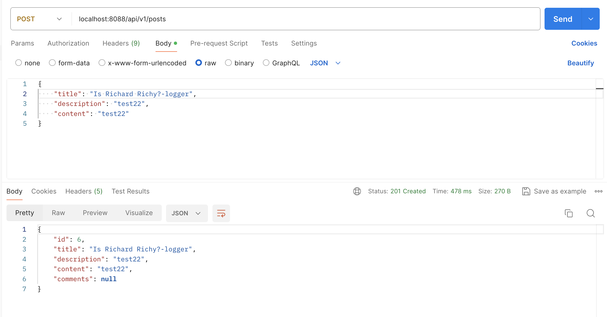
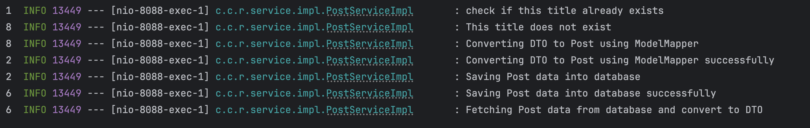
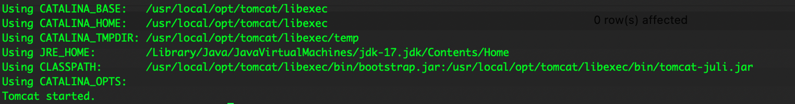
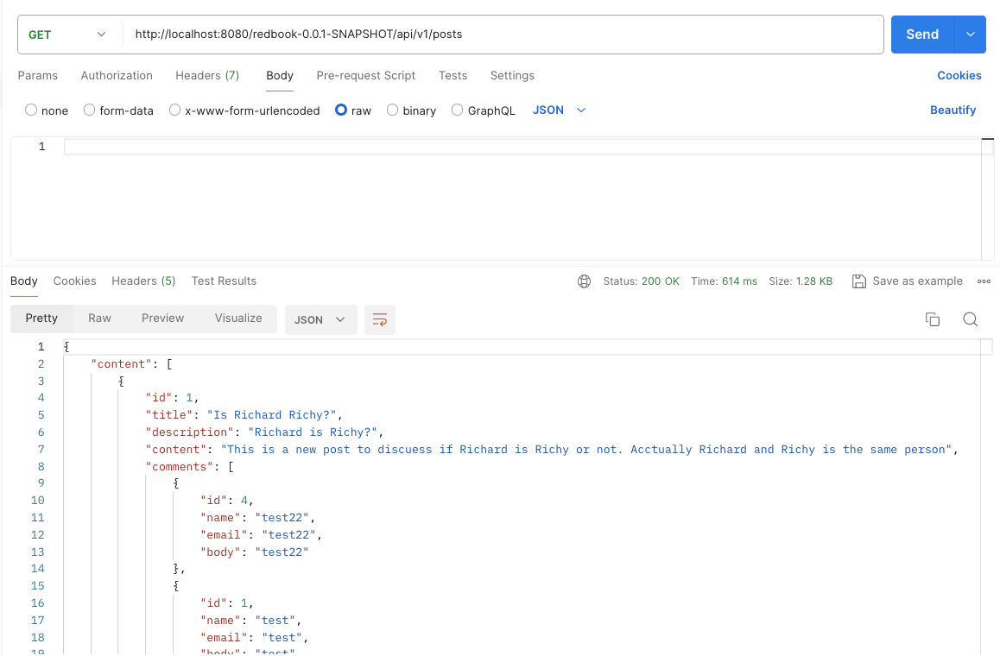

# Ryan Ma HW12 Answers


### 1. Add proper logging statements for this project, please use slf4j as your logger and set up proper logging level.
1.1 Coding Part
```java
    import org.slf4j.Logger;
    import org.slf4j.LoggerFactory;    

    private static final Logger logger = LoggerFactory.getLogger(PostServiceImpl.class);

    @Override
    public PostDto createPost(PostDto postDto) {
        //hw12
        logger.info("check if this title already exists");
        //hw11
        if (postRepository.existsByTitle(postDto.getTitle())) {
            throw new ResourceConflictException("A post with this title already exists.");
        }
        logger.info("This title does not exist");
        // covert DTO to Entity
//        Post post = mapToEntity(postDto);
        //hw12
        logger.info("Converting DTO to Post using ModelMapper");

        Post post = modelMapper.map(postDto, Post.class);
        logger.info("Converting DTO to Post using ModelMapper successfully");

        // 调用Dao的save 方法，将entity的数据存储到数据库MySQL
        // save()会返回存储在数据库中的数据
        // hw12
        logger.info("Saving Post data into database");
        Post savedPost = postRepository.save(post);
        // hw12
        logger.info("Saving Post data into database successfully");

        // 将save() 返回的数据转换成controller/前端 需要的数据，然后return给controller
        // PostDto postResponse = mapToDTO(savedPost);
        // hw12
        logger.info("Fetching Post data from database and convert to DTO");
        return modelMapper.map(savedPost, PostDto.class);
    }
```

1.2 Postman


1.3 Log Screenshot


### 2. Instead of using embedded tomcat, setup an external tomcat server to bring up above application
2.1 Coding files
```java
package com.chuwa.redbook;

import org.springframework.boot.SpringApplication;
import org.springframework.boot.autoconfigure.SpringBootApplication;
import org.springframework.boot.builder.SpringApplicationBuilder;
import org.springframework.boot.web.servlet.support.SpringBootServletInitializer;

@SpringBootApplication
public class RedbookApplication extends SpringBootServletInitializer {

	@Override
	protected SpringApplicationBuilder configure(SpringApplicationBuilder builder) {
		return builder.sources(RedbookApplication.class);
	}

	public static void main(String[] args) {
		SpringApplication.run(RedbookApplication.class, args);
	}

}

```
```xml
<?xml version="1.0" encoding="UTF-8"?>
<project xmlns="http://maven.apache.org/POM/4.0.0"
		 xmlns:xsi="http://www.w3.org/2001/XMLSchema-instance"
		 xsi:schemaLocation="http://maven.apache.org/POM/4.0.0 https://maven.apache.org/xsd/maven-4.0.0.xsd">
	<modelVersion>4.0.0</modelVersion>

	<parent>
		<groupId>org.springframework.boot</groupId>
		<artifactId>spring-boot-starter-parent</artifactId>
		<version>2.7.3</version>
		<relativePath/>
	</parent>

	<groupId>com.chuwa</groupId>
	<artifactId>redbook</artifactId>
	<version>0.0.1-SNAPSHOT</version>
	<name>redbook</name>
	<description>Demo project for Spring Boot</description>

	<!-- 🔥 Change packaging to WAR -->
	<packaging>war</packaging>

	<properties>
		<java.version>11</java.version>
	</properties>

	<dependencies>
		<dependency>
			<groupId>org.springframework.boot</groupId>
			<artifactId>spring-boot-starter-data-jpa</artifactId>
		</dependency>

		<!-- Exclude embedded Tomcat -->
		<dependency>
			<groupId>org.springframework.boot</groupId>
			<artifactId>spring-boot-starter-web</artifactId>
			<exclusions>
				<exclusion>
					<groupId>org.springframework.boot</groupId>
					<artifactId>spring-boot-starter-tomcat</artifactId>
				</exclusion>
			</exclusions>
		</dependency>

		<!-- External Tomcat provided -->
		<dependency>
			<groupId>org.springframework.boot</groupId>
			<artifactId>spring-boot-starter-tomcat</artifactId>
			<scope>provided</scope>
		</dependency>

		<!-- modelmapper -->
		<dependency>
			<groupId>org.modelmapper</groupId>
			<artifactId>modelmapper</artifactId>
			<version>2.4.5</version>
		</dependency>

		<!-- mysql connector -->
		<dependency>
			<groupId>mysql</groupId>
			<artifactId>mysql-connector-java</artifactId>
			<scope>runtime</scope>
		</dependency>

		<!-- test -->
		<dependency>
			<groupId>org.springframework.boot</groupId>
			<artifactId>spring-boot-starter-test</artifactId>
			<scope>test</scope>
		</dependency>
	</dependencies>

	<build>
		<plugins>
			<plugin>
				<artifactId>maven-war-plugin</artifactId>
				<version>3.3.2</version>
				<configuration>
					<failOnMissingWebXml>false</failOnMissingWebXml>
				</configuration>
			</plugin>
		</plugins>
	</build>

</project>
```

2.2 Screenshots



