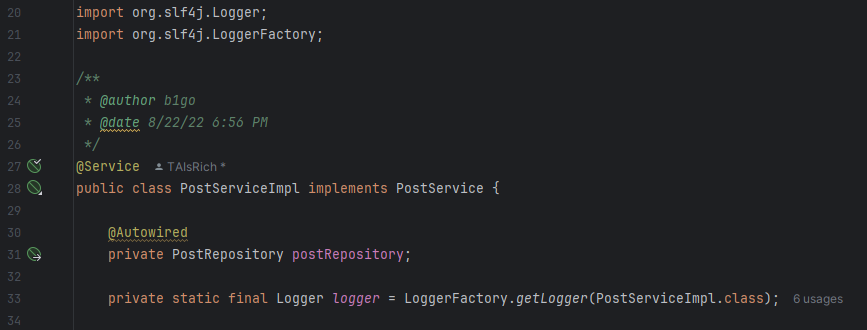
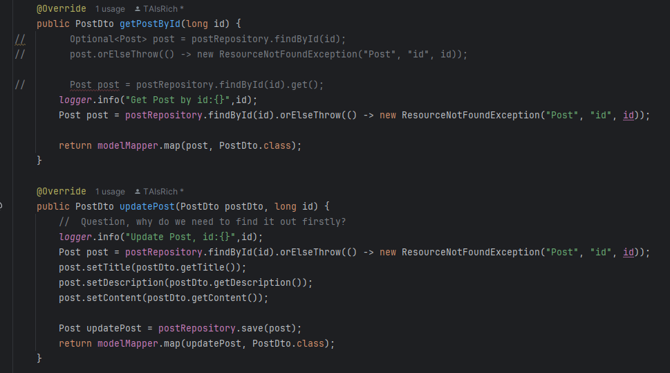
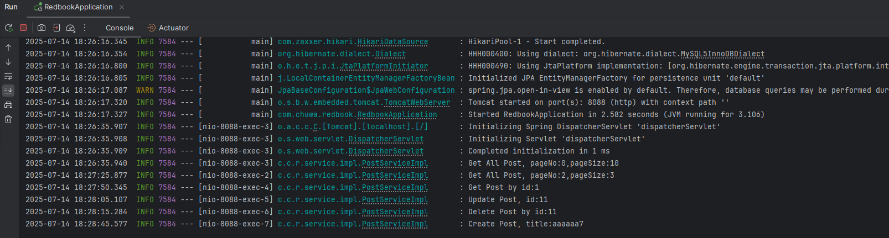
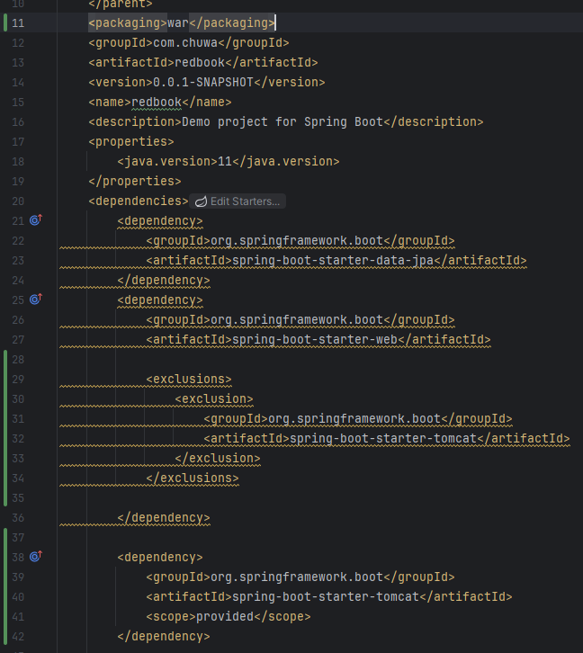
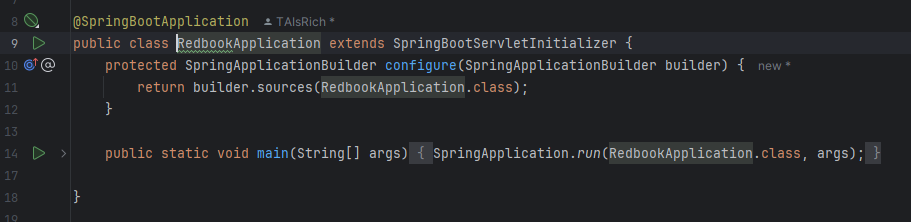
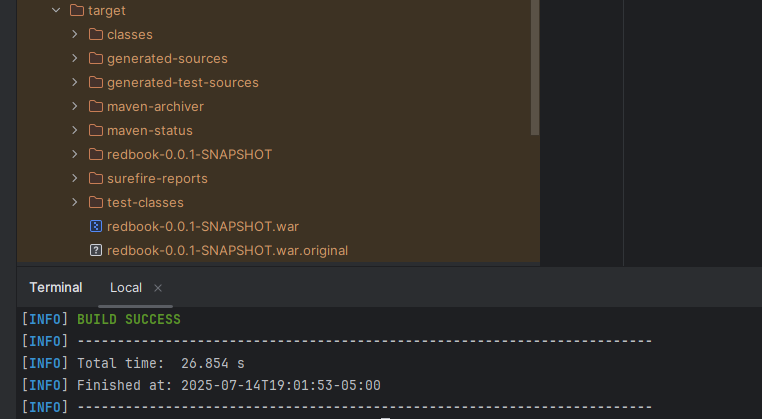
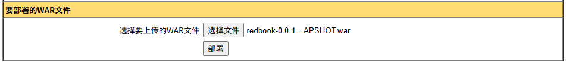
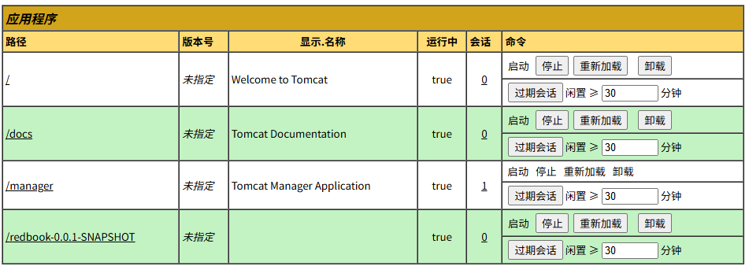
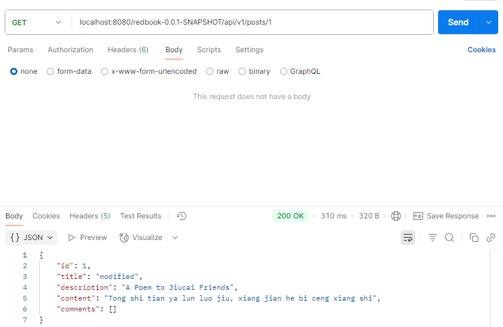

1.Import slf4j logger and add logger in service

2.Add logging statement in service with logging level INFO

3.Test api with postman, the log is output to the console.

4.

In pom.xml, change packaging to war, remove original tomcat dependency in springframework.boot, add new tomcat dependency

Update application to make it extends SpringBootServletInitializer

mvn clean package

Deploy the .war file

Test with postman

