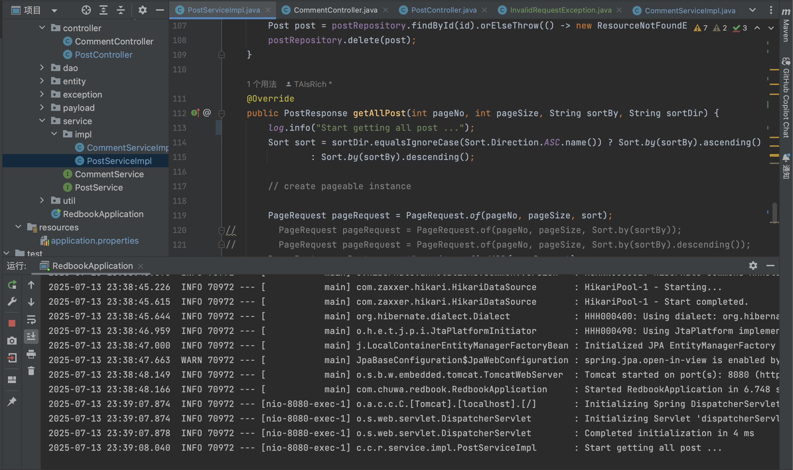
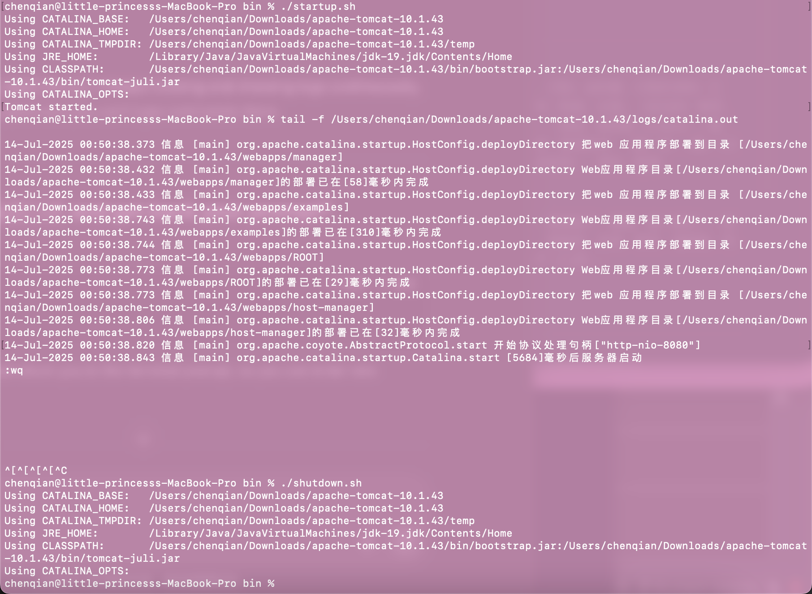

1. Add proper logging statements for this project, please use slf4j as your logger.

2. Set up proper logging level.

```
logging.level.root=INFO
logging.level.com.chuwa.redbook=DEBUG
logging.level.org.hibernate.SQL=DEBUG
```

3. Take screenshots



4. Instead of using embeded tomcat, setup an external tomcat server to bring up above application. Take screenshots.



