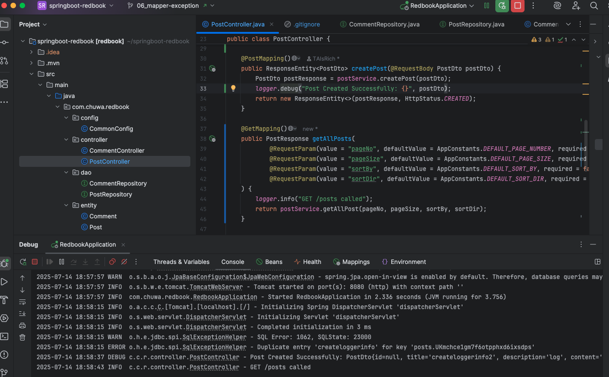
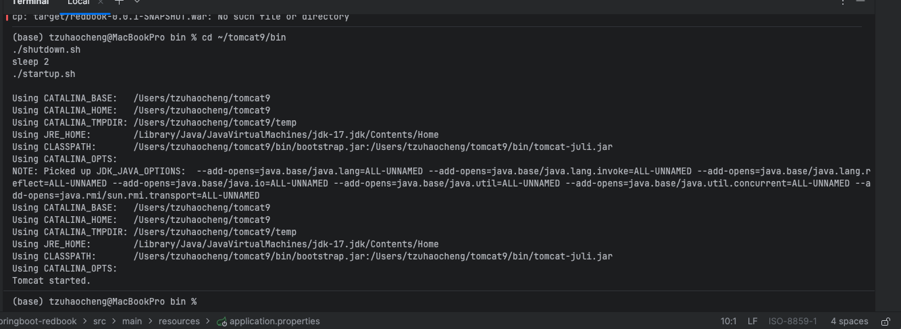

1. Add proper logging statements for this project, please use slf4j as your logger.

2. Set up proper logging level.

```properties
# Set the root logging level
logging.level.root=INFO

# Set INFO for Spring framework logs
logging.level.org.springframework=INFO

# Enable DEBUG logging only for your package
logging.level.com.chuwa.redbook=DEBUG

# Log format customization
logging.pattern.console=%d{yyyy-MM-dd HH:mm:ss} %-5level %logger{36} - %msg%n
```
3. Take screenshots



4. Instead of using embeded tomcat, setup an external tomcat server to bring up above application. Take screenshots.


