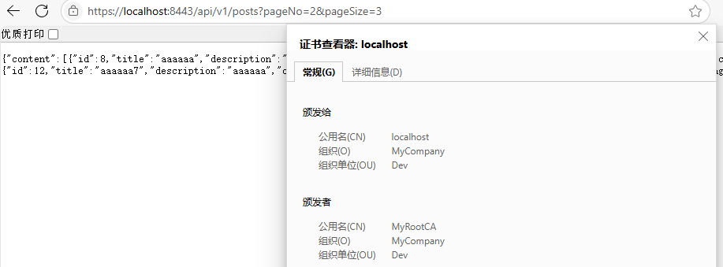

1.Annotations are listed in annotations.md

2.

TLS: Security protocol in the transport layer, like https

PKI: The hierarchy of public key trust, like root CA->mid level->server certificate

Certificate: A document that bind public key to an identity, like a specific domain name

public key: A distributed key to anyone, could used to encrypt data and verify signature

private key: A secret key belongs to the owner, could used to decrypt data and generate signature

signature: A message that encrypted with the owner's private key, could verified with public key and prove the identity.

3.

Add the .jks format key to src/main/resources and add config in application.properties


Test with postman. It could not be verified since it is a self signed certificate and not associate with a trust CA certificate.


Generate a self signed CA certificate, use the CA certificate to sign the server certificate, add proper domain name(localhost), add CA certificate to System and postman trust CA


Test the api, works properly.


Test with browser



4.

401 Unauthorized

Request need user authorization, but it is not provided

403 Forbidden

Authorization may have succeed, but the user is not allowed to access.

5.

Authorization is about the permission management, while Authentication is about verifying the identity.

Authorization could be done with GrantedAuthority component in Spring. It could grant a specific role to user.

Authentication could be done with AuthenticationManager. It is central component in spring authentication , could use authenticate() method to authenticate users

6.

HTTP session is a server side data store. When a user first interacts, the server could create session object, store it at server, and generate a session id send to client. Client could send the session id back to server in subsequent requests.

7.

Cookie is a client side storage of a small piece data. Server could ask to browser to store cookie and in the subsequent requests it is send back to server

8.

Session data is stored at server, only transfer session id to client. Cookie data is stored at client, and need to send back to server at any subsequent requests. Session could have arbitrary size only limited by server storage, cookie must be small.

9.


The application will send a request to https://accounts.google.com/o/oauth2/auth, with the logged in google account information in the cookie. It will return  redirect the user to a callback url. 

10.

In the first connection, we could generate a session object to store information, and request the client to store the session key into the cookie. In future connection, the session key in the cookie will be in request header and we could find the information using the key.

11.

The spring security filter is a chain of checking done before the endpoints. Authentication of request user could be done with the filter.

12.

Bearer token is a token string that whoever hold and present the token is assumed to be authorized as the linked user.

JWT is a kind of bearer token that contains the header, payload and signature. The signature could be used to check if the payload is modified. When issuing, the issuer create the signature using the private key. In the future connection, the signature could be re computed and if match, the payload is valid.

13.

We could generate a random salt for each user, and hash the sensitive information along with the salt. The attacker could not revert the information since the hash is one way.

14.

UserDetailsService is to load user specific data by username.

AuthenticationProvider is to give an authentication token and validate it.

AuthenticationManager could delegate to a list of AuthenticationProvider to do authentication request.

AuthenticationFilter is the filter do before the controller. It could call the AuthenticationManager to do authentication.

15.

The session is stored at server side, so server should give extra resources to store the session information. Server also need efforts to properly manage the session info. If server crash or restart, the in memory session will lost.

It could overcome by add resource limit to prevent too many resource used in server, or change to stateless solution like JWT token

16.

The setting in application.properties is loaded automatically in the spring environment, so it could be accessed with @Value

```
@Value("${security.jwt.secret}")
private String jwtSecret;
```


17.

The role of configure(HttpSecurity http) is to define the http level security, like what url need what specific roles, and the login and logout process.

The role of configure(AuthenticationManagerBuilder auth) is to define the authentication machanisms, which related to how to load user credentials and verify them. It build the AuthenticationManager.


19.

The practices to store secrets is 

a. Never hard code the secret into the source. 

b. Make the secret short lived if possible, automatically renew the secret

c. Use minimal privilege, only store secret that truly need.


