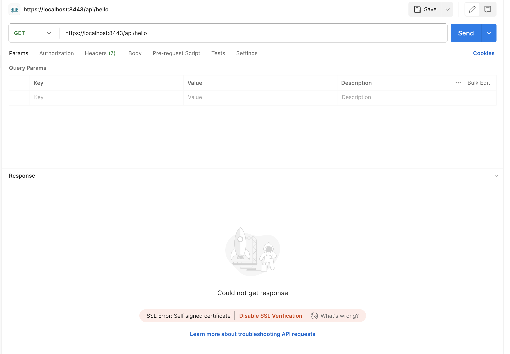
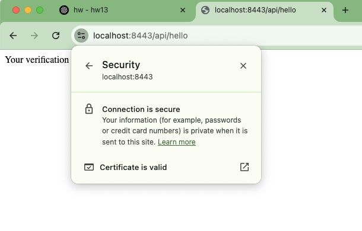
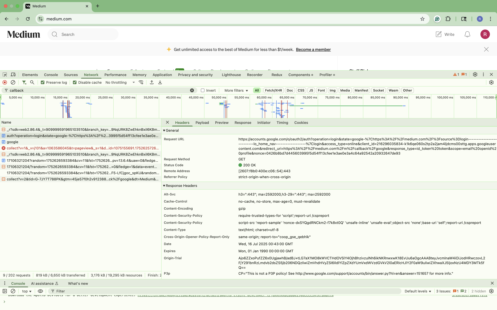
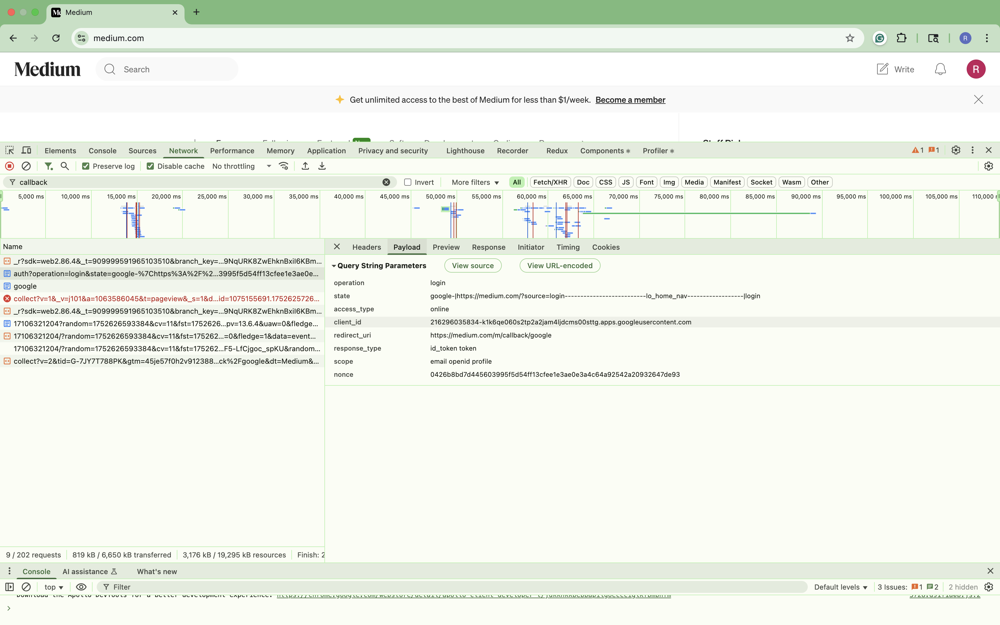

# Ryan Ma HW13 Answers

### 1. List all of the annotations you learned from class and homework to annotations.md
[Spring Annotation Cheat Sheet](../HW10/springAnnotationCheatsheet.md)

### 2. Explain TLS, PKI, certificate, public key, private key, and signature.
2.1 TLS (Transport Layer Security)
- A security protocol used to encrypt data between two parties (e.g., browser and server).
- Ensures confidentiality, integrity, and authentication.
- HTTPS uses TLS.

2.2 PKI (Public Key Infrastructure)
- A system managing public-key encryption and digital certificates.
- Components:
  - Certificate Authorities (CAs)
  - Certificates
  - Public/Private Keys
- PKI ensures trust by verifying the identity of entities via certificates.

2.3 Certificate (Digital Certificate)
- A file proving the ownership of a public key.
- Issued by a Certificate Authority (CA).
- Contains:
  - Public key
  - Owner's identity info (domain name, organization, etc.)
  - CA’s signature over the certificate content.
- Example: SSL/TLS certificate for a website.

2.4 Public Key
- A cryptographic key shared openly.
- Used to:
  - Encrypt data (only the private keyholder can decrypt).
  - Verify digital signatures created with the private key.

2.5 Private Key
- Secret key known only to the owner.
- Used to:
  - Decrypt data encrypted with its corresponding public key.
  - Create digital signatures to prove authenticity.

2.6 Signature (Digital Signature)
- A cryptographic proof that:
  - Data hasn’t been tampered with.
  - It came from the expected sender.
- Created by encrypting a hash of the data with the sender’s private key.
- Verified using the sender’s public key.

### 3. Spring security based application
[Repo](https://github.com/blueran21/hw13)

3.1 Pack your self-signed certificate in the form of jks file, as part of your application, name it properly.
```bash
keytool -genkeypair \
  -alias myssl \
  -keyalg RSA \
  -keysize 2048 \
  -validity 3650 \
  -storetype JKS \
  -keystore keystore.jks \
  -storepass changeit \
  -dname "CN=localhost, OU=Development, O=MyCompany, L=Sunnyvale, ST=California, C=US" \
  -ext SAN=dns:localhost,ip:127.0.0.1
```

3.2 Test if you can verify your HTTPs api without importing the self-signed certificate to your local
certificate chain, if not, explain why.
- I can not get the response


3.3 Explain what did you do to make https call work, do NOT bypass TLS/SSL verification in Postman (this is cheating)!
- Import the self-signed certificate to my local trusted certificate store 
```bash
keytool -export \
  -alias myssl \
  -keystore keystore.jks \
  -file mycert.cer \
  -storepass changeit
```
- Drag and drop the mycert.cer into System keychain
- I can get correct request from chrome


### 4. list all http status codes that related to authentication and authorization failures.
| **Status Code** | **Name**                          | **Meaning**                                                                   |
|-----------------|-----------------------------------|-------------------------------------------------------------------------------|
| **401**         | **Unauthorized**                  | Missing or invalid authentication. Client must log in (provide credentials).  |
| **403**         | **Forbidden**                     | Authentication may be valid, but client is not authorized to access resource. |
| **407**         | **Proxy Authentication Required** | Like 401, but for authenticating with a proxy server.                         |

### 5. Compare authentication and authorization? Name and explain important components in Spring security that undertake authentication and authorization 
5.1 Comparison

| **Aspect**            | **Authentication**                  | **Authorization**                |
|-----------------------|-------------------------------------|----------------------------------|
| **Meaning**           | Proving who you are                 | Deciding what you can do         |
| **Question Answered** | Who are you?                        | Are you allowed to do this?      |
| **Occurs When?**      | Before authorization                | After authentication             |
| **Result**            | Identity verified                   | Access granted or denied         |
| **Example**           | Logging in with username & password | Accessing admin page after login |

5.2 Authentication Components

| **Component**              | **Role / Explanation**                                                                                    |
|----------------------------|-----------------------------------------------------------------------------------------------------------|
| **AuthenticationManager**  | Core interface for authentication. Delegates to AuthenticationProvider(s).                                |
| **AuthenticationProvider** | Actual implementation that checks credentials (e.g., DAOAuthenticationProvider checks username/password). |
| **UserDetailsService**     | Loads user-specific data. Often retrieves user info from database.                                        |
| **UserDetails**            | Represents user identity and roles/authorities.                                                           |
| **SecurityContextHolder**  | Stores authentication info (thread-local) after successful login.                                         |

5.3 Authorization Components

| **Component**                                | **Role / Explanation**                                                |
|----------------------------------------------|-----------------------------------------------------------------------|
| **AccessDecisionManager**                    | Makes final access control decisions based on user roles/authorities. |
| **GrantedAuthority**                         | Represents a single role or permission assigned to a user.            |
| **SecurityFilterChain**                      | Controls which URLs are protected and what rules apply.               |
| **@PreAuthorize / @Secured / @RolesAllowed** | Annotations used to apply method-level security checks.               |

### 6. Explain HTTP Session?
6.1 What is Session?
- HTTP Session is a way to track and maintain state (user-specific data) across multiple HTTP requests, even though HTTP itself is stateless by design.

6.2 Why need Sessions?
- HTTP treats every request as independent.
- But in real-world applications, we need to:
  - Know if a user is logged in.
  - Remember a shopping cart.
  - Maintain other user-specific data between requests.

6.3 Simple Example
```java
HttpSession session = request.getSession();
session.setAttribute("user", userObject);
```

6.4 Core features of HTTP Sessions
- Session ID: Unique identifier stored in a cookie (JSESSIONID in Java/Spring).
- Session Data: Server-side storage of user data (shopping cart, user info).
- Session Timeout: Sessions expire after inactivity (configurable).
- State Management: Enables applications to track logged-in users.

### 7. Explain Cookie?
7.1 What is Cookies?
A cookie is a small piece of data that the server sends to the browser, which the browser stores and automatically sends back to the server with every future request to the same domain.

7.2 Why cookie exists?
- Because HTTP is stateless, cookies help:
  - Identify returning users.
  - Maintain session continuity (session ID).
  - Store small client-side data (preferences, language, tracking info).

7.3 Types of Cookies
- Session Cookies:
  - Temporary.
  - Deleted when the browser closes.
  - Often used for session IDs (JSESSIONID).
- Persistent Cookies:
  - Stored even after closing the browser.
  - Controlled by Max-Age or Expires.
- HttpOnly Cookies:
  - Cannot be accessed via JavaScript (XSS protection).
- Secure Cookies:
  - Only sent over HTTPS.

### 8. Compare Session and Cookie
| Cookies (Client-side)          | Session (Server-side)               |
|--------------------------------|-------------------------------------|
| Stored in browser              | Stored on server                    |
| Limited data (usually <4KB)    | Can store larger, complex data      |
| Browser sends it automatically | Controlled fully by server          |
| User can inspect/modify        | User cannot access server-side data |

### 9. Find at least TWO websites who can be logged in using your Google Account, explain in detail on how Google SSO works with screenshots like below, find SSO-related Rest calls in Chrome developer tool:
When I log in using my Google account, Medium sends a request to Google’s OAuth endpoint, as shown below.

After I successfully log in on Google’s side, Google returns an id_token back to Medium via a redirect URL.
Medium then uses this token to verify my identity and complete the login process.


### 10. How do we use session and cookie to keep user information across the application?
10.1 Basic Idea
- Cookie: Stored in the user's browser. Used to store the session ID.
- Session: Stored on the server. Stores actual user data linked to the session ID.

10.2 Step-by-Step Process
- User logs in.
- Server creates a session:
  - Generates a unique Session ID.
  - Store user info(like user ID, roles, shopping cart) on the server side, linked to that Session ID.
- Server sends a cookie to the browser with Session ID
- Browser stores the cookie
- On every future request, the browser automatically sends the cookie.
- Server reads the Session ID from the cookies:
  - Uses it to look up the corresponding session data on the server.
  - Restores user context(who you are, your permissions, etc).

### 11. What is the spring security filter?
- Intercepts HTTP requests. Extracts credentials (like username/password, JWT), and passes them to AuthenticationManager for authentication.

### 12。 Explain bearer token and how JWT works.
12.1 what is a Bearer Token?
- A Bearer Token is simply a token used in HTTP request to prove the client's identity.
- It's called "Bearer" because whoever holds the token is treated as authenticated.

12.2 What is JWT(JSON Web Token)?
- A JWT is a type of Bearer Token.
- It's a self-contained token that:
  - Carries identity and claims information
  - Is digitally signed
  - Can be validated by any server that has the secret key or public key.
- JWT Structure (three parts, seperated by dots): Header.Payload.Signature

  | Part          | Description                                   |
  |---------------|-----------------------------------------------|
  | **Header**    | Algorithm + token type (e.g. HS256, JWT)      |
  | **Payload**   | Claims: user info (e.g. userId, roles, email) |
  | **Signature** | HMAC or RSA signature to prevent tampering    |

12.3 How JWT works
- Login:
  - Client authenticates (username/password)
  - Server generates a JWT with user data inside (e.g. userId, role).
  - Server signs the JWT using a secret or private key.
  - Server returns the JWT to the client.
- Storing JWT:
  - Client stores JWT (usually) in: localStorage, sessionStorage, http cookie.
- Future Requests:
  - Client sends the JWT in the HTTP Authorization header as a Bearer token
- Server Verification
  - Server validates JWT signature using secret/public key.
  - If valid, reads the payload to identify the user and process the request.

### 13 Explain how do we store sensitive user information such as password and credit card number in DB?
13.1 Password Storage: Never store passwords as plain text
- Correct Approach: Hash + Salt
- Password never need to be decrypted.

13.2 Credit Card Storage: Encrypt, Not Hash
- Credit card numbers need to be retrievable for legitimate business reasons, so hashing doesn't work.
- Encryption + Key Management

13.3 Best Practices for Both
- Use parameterized SQL (prevent SQL Injection).
- Restrict DB access using least privilege principle.
- Use HTTPS for all communication.
- Regularly rotate encryption keys (for credit cards).
- Monitor and log database access.

### 14. Compare UserDetailService, AuthenticationProvider, AuthenticationManager, AuthenticationFilter?
14.1 Comparison

| **Component**              | **Role / Responsibility**                                                                                                                  | **Who Uses It?**                    |
|----------------------------|--------------------------------------------------------------------------------------------------------------------------------------------|-------------------------------------|
| **UserDetailsService**     | Loads user-specific data (username, password, roles) from DB or memory.                                                                    | Used inside AuthenticationProvider. |
| **AuthenticationProvider** | Performs actual authentication (password check, etc.) using UserDetailsService.                                                            | Used by AuthenticationManager.      |
| **AuthenticationManager**  | Central coordinator for authentication. Delegates to one or more AuthenticationProviders.                                                  | Used by AuthenticationFilter.       |
| **AuthenticationFilter**   | Intercepts HTTP requests. Extracts credentials (like username/password, JWT), and passes them to AuthenticationManager for authentication. | Entry point in HTTP request cycle.  |

14.2 Process Flow
- HTTP Request comes in → AuthenticationFilter intercepts it.
- AuthenticationFilter calls AuthenticationManager.
- AuthenticationManager delegates to AuthenticationProvider.
- AuthenticationProvider uses UserDetailsService to load user data.
- If valid, Authentication is successful.

### 15. What is the disadvantage of Session? how to overcome the disadvantage?

| Problem                    | Solution                                                    |
|----------------------------|-------------------------------------------------------------|
| Server memory load         | Store sessions in **Redis** or external DB (Session Store). |
| Scalability limitation     | Use **stateless authentication** (e.g., JWT).               |
| Synchronization complexity | Use centralized session storage (e.g., Redis).              |
| Session hijacking          | Use **Secure**, **HttpOnly** cookies + HTTPS.               |

### 16. how to get value from application.properties in Spring security?
16.1 Use `@Value` Annotation
- Example
```properties
# application.properties
jwt.secret = tooLongTooLongTooLongTooLongTooLongSecretKey
```
```java
@Value("${jwt.secret}")
private string jwtSecret;
```
- Usage:
  - Works in any Spring-managed bean.
  - You can use this in your Security configuration class, service class, etc

16.2 Use `ConfigurationProperties`
- Example
```properties
#application.properties
security.jwt.secret=tooLongTooLongTooLongTooLongTooLongSecretKey
security.jwt.expiration=3600
```
```java
@Component
@ConfigurationProperties(prefix = "security.jwt")
public class JwtProperties {
    private String secret;
    private int expiration;
    
    // getters and setters;
}
```
- Usage
```java
@Autowired
private JwtProperties jwtProperties;
```

### 17. What is the role of configure(HttpSecurity http) and configure(AuthenticationManagerBuilder auth)?
17.1 Comparison

| **Method**                                     | **Role / What it Configures**                                                                 |
|------------------------------------------------|-----------------------------------------------------------------------------------------------|
| `configure(HttpSecurity http)`                 | Configures **HTTP request security** (who can access what URLs, login/logout, filters, etc.). |
| `configure(AuthenticationManagerBuilder auth)` | Configures **authentication sources** (where and how user data is loaded and authenticated).  |

17.2 `Configure(HttpSecurity http)`
- Controls web-level security:
  - URL access rules.
  - From login/Basic Auth/JWT filters.
  - Session Management
  - CSRF protection
  - Custom filters.
- Example:
```java
@Override
protected void configure(HttpSecurity http) throws Exception {
    http
        .authorizeRequests()
            .antMatchers("/admin/**").hasRole("ADMIN")
            .anyRequest().authenticated()
        .and()
        .formLogin()
            .loginPage("/login")
        .and()
        .logout();
}
```

17.3 `configure(AuthenticationMangerBuilder auth)`
- Controls authentication sources:
  - How Spring Security knows who the users are.
  - You define:
    - In-memory users.
    - Custom UserDetailsService.
    - Password encoder.
- Example:
```java
@Override
protected void configure(AuthenticationManagerBuilder auth) throws Exception {
    auth
        .userDetailsService(myUserDetailsService)
        .passwordEncoder(new BCryptPasswordEncoder());
}
```

### 18. [Reading](https://www.interviewbit.com/spring-security-interview-questions/#is-security-a-cross-cutting-concern)
Done 1 - 12; 17 - 30

### 19. Explain best practices to securely store secrets in applications.
| Best Practice                   | Why?                         |
|---------------------------------|------------------------------|
| Never hardcode secrets          | Prevent source code leaks    |
| Use environment variables       | Basic isolation              |
| Use secret managers             | Secure, centralized control  |
| Encrypt configuration files     | Protect local storage        |
| Least privilege access          | Reduce attack surface        |
| Rotate secrets regularly        | Limit exposure time          |
| Never store secrets client-side | Prevent public exposure      |
| Monitor secret access           | Detect and respond to misuse |

