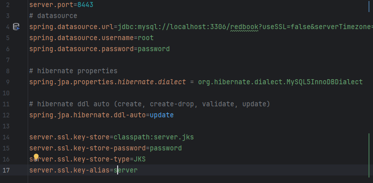
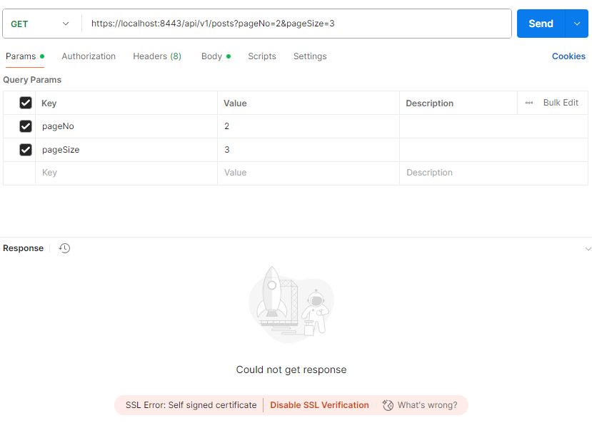
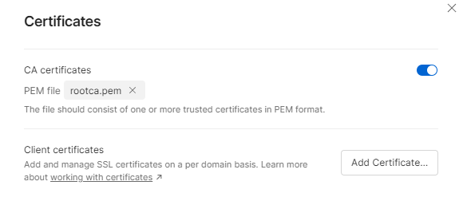
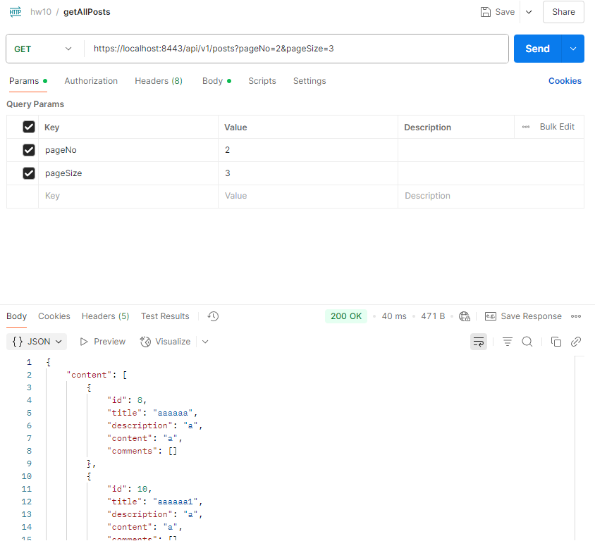
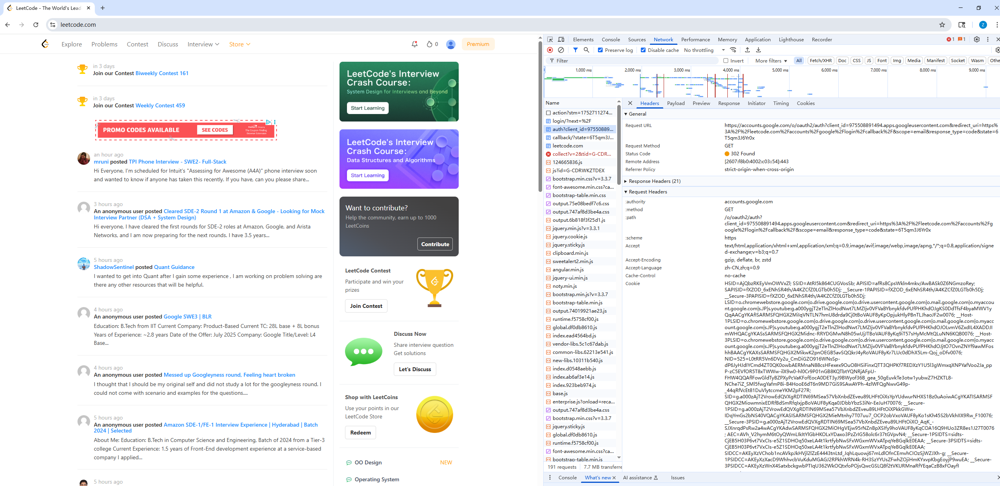
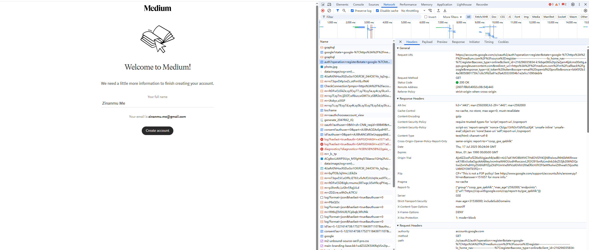

3.

Add the .jks format key to src/main/resources and add config in application.properties

Test with postman. It could not be verified since it is a self signed certificate and not associate with a trust CA certificate.

Generate a self signed CA certificate, use the CA certificate to sign the server certificate, add proper domain name(localhost), add CA certificate to System and postman trust CA

Test the api, works properly.

9.

The application will send a request to https://accounts.google.com/o/oauth2/auth, with the logged in google account information in the cookie. It will return  redirect the user to a callback url. 

