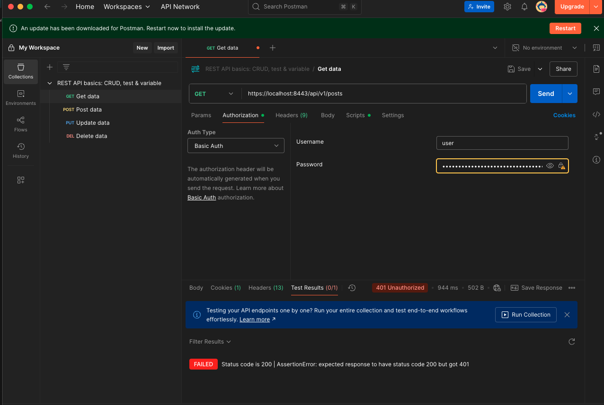
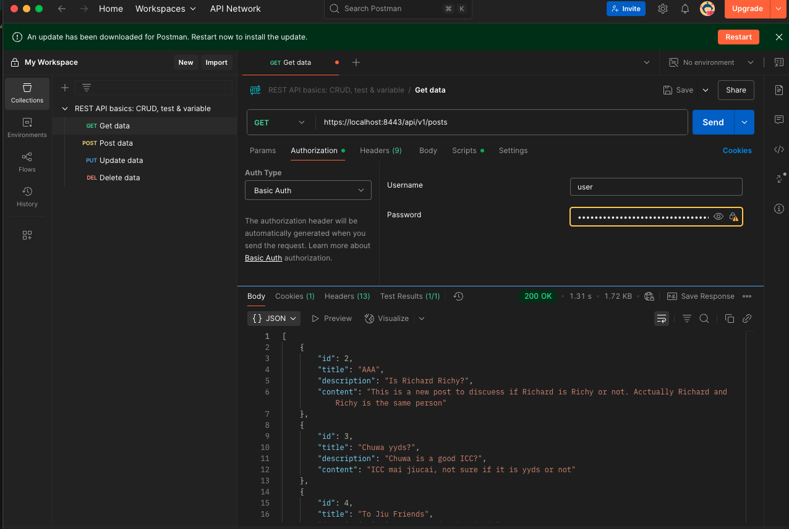
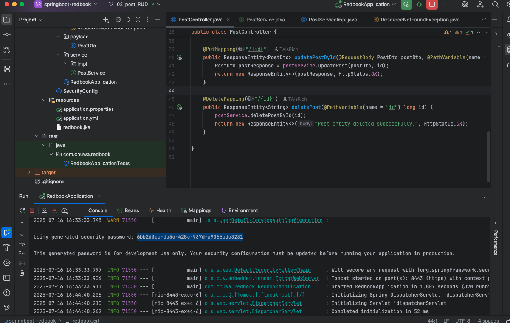

**2. Explain TLS, PKI, certificate, public key, private key, and signature.**
- **TLS (Transport Layer Security)**  is a protocol that secures data transmission over networks by encrypting communication between clients and servers
- **PKI (Public Key Infrastructure)** is the system that manages keys and digital certificates to enable secure communication using public-key cryptography
- **Certificate** is the digital file issued by a trusted Certificate Authority (CA) that verifies the identity of a server or user and contains their **public key**.
- **Public Key** is shared openly and used to **encrypt** data or **verify digital signatures**.
- **Private Key** is kept secret and used to **decrypt** data or **create digital signatures**.
- **Signature** is a cryptographic proof, generated using a private key, that verifies the authenticity and integrity of a message or certificate.

---

**3. Write a Spring security based application, which provides https APIs (one simple get controller with empty response is good enough )instead of http, please generate a self-signed certificate to make your https TLS verfication work.**

- Generate the .jks file (self-signed certificate)
```bash 
keytool -genkeypair \
  -alias redbook \
  -keyalg RSA \
  -keysize 2048 \
  -storetype JKS \
  -keystore redbook.jks \
  -validity 365 \
  -storepass changeit \
  -keypass changeit \
  -dname "CN=localhost, OU=Dev, O=Redbook, L=City, S=State, C=US"
``` 

```bash
mv redbook.jks src/main/resources/

```

- Set `application.properies`
```properties
server.port=8443
server.ssl.key-store=classpath:redbook.jks
server.ssl.key-store-password=changeit
server.ssl.key-alias=redbook
```
- Start the application with HTTPS enabled
- Exported the certificate using
```bash
keytool -export -alias redbook -keystore src/main/resources/redbook.jks -rfc -file redbook.crt
```

- Imported the certificate into Postman → Settings → Certificates → CA Certificates (to avoid bypassing TLS)

- Sent HTTPS requests in Postman with SSL certificate verification enabled, Basic Auth using Spring’s generated user password. Then result in receiving secure 200 OK response from the API.





---

**4. list all http status codes that related to authentication and authorization failures.**

- **401 Unauthorized** – Authentication failed or missing credentials
- **403 Forbidden** – Authenticated but not authorized to access the resource
- **407 Proxy Authentication Required** – Authentication with proxy server failed

---

**5. Compare authentication and authorization? Name and explain important components in Spring
security that undertake authentication and authorization**

- **Authentication** Verifies who the user is
- **Authorization** Verifies what the authenticated user is allowed to do

---

**6. Explain HTTP Session?**

An HTTP session is a server-side mechanism to persist user data across multiple requests. It uses a session ID (usually stored in a cookie) to identify users and store temporary state like login status.

---

**7. Explain Cookie?**

A cookie is a small piece of data stored in the browser and sent with every request to the server. It can hold session IDs or other client specific info and supports client-side persistence.

---

**8. Compare Session and Cookie?**
| Feature  | Session                        | Cookie                          |
|----------|--------------------------------|----------------------------------|
| Storage  | Server-side                    | Client-side (browser)           |
| Capacity | Large (complex objects)        | Small (typically <4KB)          |
| Security | More secure                    | Can be vulnerable if not secure |
| Usage    | Tracks authenticated users     | Stores small data, e.g. token   |

---

**9. Find at least TWO websites who can be logged in using your Google Account, explain in detail on how Google SSO works with screenshots like below, find SSO-related Rest calls in Chrome developer tool**

- Websites:
  - GitHub
  - Airbnb

- How Google SSO Works?
  - Clicks “Sign in with Google”
  - Browser is redirected to Google Auth endpoint `https://accounts.google.com/o/oauth2/auth`
  - User logs in and consents
  - Google returns an `authorization code` to the app
  - App exchanges the code for an `access_token` via REST API
    - POST to `https://oauth2.googleapis.com/token`
  - The app uses the `access_token` to fetch user info
    - GET to `https://www.googleapis.com/oauth2/v2/userinfo`
  - User is now authenticated in the target app

---

**10. How do we use session and cookie to keep user information across the application?**
- After login, **the server creates a session** to store user data
- A session ID is stored in a cookie (`JSESSIONID`) and sent to the client
- On each request, the browser sends the cookie back, allowing the server to **retrieve user info from the session**.

---

**11. What is the spring security filter?**

A Spring Security filter is part of the filter chain that intercepts HTTP requests to apply authentication and authorization logic.

Key filters include:
  - `UsernamePasswordAuthenticationFilter` handles login
  - `BasicAuthenticationFilter` handles HTTP Basic auth
  - `BearerTokenAuthenticationFilter` handles JWT/bearer tokens

---

**12. Explain bearer token and how JWT works.**

- A bearer token is an access token included in the `Authorization` header:
```makefile
Authorization: Bearer <token>
```
- A **JWT (JSON Web Token)** is a signed token that includes user data (e.g., userId, roles). Used for stateless authentication(no server-side session needed). It consists of `Header`, `Payload`, `Signature`.

---

**13. Explain how do we store sensitive user information such as password and credit card number in DB?**

- Passwords
  - Never store plain text.
  - Hash with a strong algorithm like **BCrypt**, and **store the hash**.
- Credit Cards
  - Use encryption (e.g., AES), and manage **encryption keys** securely.
  - Or delegate to a PCI-compliant payment provider (e.g., Stripe) and store only a reference token.

---

**14. Compare UserDetailService, AuthenticationProvider, AuthenticationManager, AuthenticationFilter?**

- **UserDetailsService** Loads user data (username, password, roles) from DB or memory.
- **AuthenticationProvider** Verifies credentials using `UserDetailsService`
- **AuthenticationManager** Delegates authentication to one or more `AuthenticationProviders`.
- **AuthenticationFilter** Intercepts HTTP requests and extracts login credentials

---

**15. What is the disadvantage of Session? how to overcome the disadvantage?**
- **Disadvantage**: Not scalable for distributed systems (server stores state).
- **Solution**: Use stateless authentication like JWT, or use distributed session storage and load balancers (e.g. Redis).

---

**16. how to get value from application.properties in Spring security?**
Use `@Value` or `@ConfigurationProperties.`

```java
@Value("${security.jwt.secret}")
private String jwtSecret;
```

```java
// Inject via config class
@Component
@ConfigurationProperties(prefix = "security.jwt")
public class JwtConfig {
    private String secret;
    // getter/setter
}
```

---

**17. What is the role of configure(HttpSecurity http) and configure(AuthenticationManagerBuilder auth)?**
- **configure(HttpSecurity http)**: Defines authorization rules (e.g., endpoints, CSRF, CORS).
- **configure(AuthenticationManagerBuilder auth)**: Sets up authentication logic (e.g., in-memory, JDBC, LDAP).

---

**18. Reading,1. 1-12, 2. 17 - 30**

- [Spring Security Interview Questions](https://www.interviewbit.com/spring-security-interview-questions/#is-security-a-cross-cutting-concern)
- Core Spring Security Concepts
  - Security is a cross-cutting concern → handled via filters and aspects.
  - Authentication vs Authorization:
    - Authentication = identity verification
    - Authorization = access control after authentication
  - `UserDetails` and `UserDetailsService` are used to load and represent user info.
  - `GrantedAuthority` represents roles/permissions.
  - `AuthenticationProvider` validates authentication requests.
  - `SecurityContextHolder` holds current user context (thread-local).
  - Filters like `UsernamePasswordAuthenticationFilter` sit in the filter chain.
  - @PreAuthorize`, `@Secured`, `@RolesAllowed` used for method-level access.
  - Stateless security via JWT avoids sessions.
  - CSRF protection is enabled by default for state-changing operations.
- Advanced Config & Best Practices
  - `HttpSecurity` configures authorization rules, form login, CSRF, etc.
  - `AuthenticationManagerBuilder` sets up authentication (DB, in-memory, etc.).
  - Session limitations: don't scale easily; can use **JWT or Redis**.
  - Password storage: hash using BCrypt, never store plaintext.
  - Access control: use role-based or permission-based strategies.
  - Filter ordering matters — they run before controllers.
  - Use environment variables or secret vaults (e.g., AWS Secrets Manager) to store credentials securely.
  - Avoid hardcoding secrets, and use @Value or @ConfigurationProperties to access configs securely.
  - CORS and CSRF need special attention for APIs.

---

**19. Explain best practices to securely store secrets in applications.**
- Use environment variables or secret management tools like AWS Secrets Manager, Azure Key Vault, or HashiCorp Vault.
- Avoid hardcoding secrets (e.g., passwords, tokens, keys) in code or configuration files.
- Use **Spring Cloud Config with encryption** to manage secrets securely across microservices.
- Set strict **access control** and audit logging on wherever secrets are stored.
- Regularly rotate credentials and use least privilege access principles.

