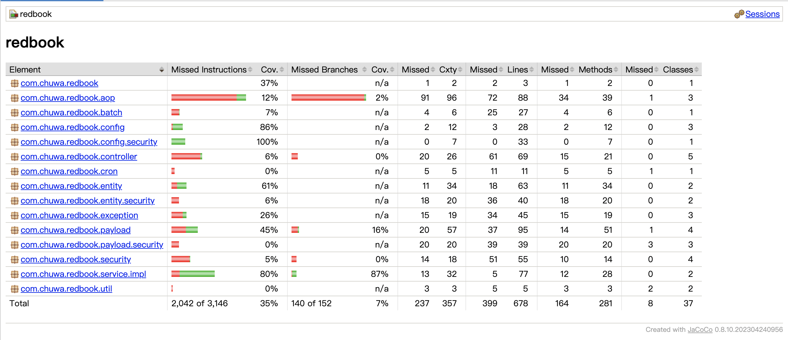

Explain and compare following concepts, provide specific examples when doing comparison:

Testing related:

1. Unit Testing: Unit testing involves testing the smallest testable parts of an application, typically individual functions or methods, in isolation. The goal is to ensure that each unit of code performs as expected independently from the rest of the system. For example, in an e-commerce application, you might write a unit test for a function calculateTotalPrice(cartItems) that verifies it returns the correct sum when given different inputs. Unit tests are usually automated and are run frequently during development to catch bugs early.

2. Functional Testing: Functional testing verifies that a specific feature or function of an application behaves according to the requirements. This type of testing focuses on inputs and expected outputs rather than the internal workings of the code. For instance, a functional test for a login feature would input a valid username and password and check that the user is redirected to the dashboard. It could also include negative tests, like entering the wrong password and expecting an error message.

3. Integration Testing: Integration testing checks that different modules or services in an application work together as expected. Unlike unit tests, which test individual components in isolation, integration tests ensure that the components interact correctly. For example, after developing a new API endpoint for creating users, an integration test might check that a POST request results in a new record in the database and that the response includes the correct user information.

4. Regression Testing: Regression testing is performed to ensure that recent code changes have not adversely affected existing functionality. Whenever developers fix a bug or add a feature, regression tests are run to confirm that the changes didn’t break other parts of the application. For example, if you added a "Remember Me" checkbox to a login form, regression tests would retest login, logout, and password recovery features to ensure they still function properly.

5. Smoke Testing: Smoke testing is a high-level set of tests run after a new build or deployment to determine if the system is stable enough for more detailed testing. It is often called a "build verification test" and is usually a small subset of the full test suite. For example, after deploying a new version of a web application, a smoke test might verify that the homepage loads, users can log in, and the main dashboard is accessible.

6. Performance Testing: Performance testing evaluates how a system behaves under expected workloads, focusing on responsiveness, speed, and stability. It answers questions like "How fast does the site load with 500 concurrent users?" For instance, in an online bookstore, performance testing might measure how long it takes to search for a book or complete a purchase when the site has 1,000 active users.

7. Stress Testing: Stress testing takes performance testing further by pushing the system beyond its limits to see how it behaves under extreme conditions. The goal is to find the breaking point and see how the system recovers from failure. For example, you might simulate 10,000 users trying to check out at once to observe whether the application crashes, slows down, or gracefully handles the overload.

8. A/B Testing: A/B testing is used to compare two versions of a feature to determine which one performs better based on user behavior. It is commonly used in marketing and UI/UX optimization. For instance, you might show half of your users a green "Sign Up" button (Version A) and the other half a red one (Version B) to see which one gets more clicks. A/B testing is usually conducted in a production environment with real user data.

9. End-to-End Testing: TEnd-to-End testing simulates real user scenarios to test the entire flow of an application, from the user interface down to the database and back. It ensures that the complete system works as expected. For example, an E2E test might start with a user signing up, receiving a confirmation email, logging in, creating a post, and verifying that the post appears on their profile. These tests are more complex and time-consuming but valuable for catching bugs in real-world usage flows.

10. User Acceptance Testing: User Acceptance Testing is the final stage of testing where actual users validate that the system meets their requirements and is ready for production. It often involves manual testing based on real-world business scenarios. For example, a sales team might test a new invoicing feature by creating test invoices to ensure that the workflow matches their needs and calculations are correct. UAT is critical for ensuring the software meets user expectations before going live.

Environment related:

1. Development Environment: The development environment is where software engineers write and test their code. It is typically set up on a developer’s local machine or a shared dev server. In this environment, developers perform unit tests and experiment with new features. For example, a developer working on a shopping cart might write and test a discount calculation function locally, using mock data and stubs instead of connecting to real services.

2. QA (Quality Assurance) Environment: The QA environment is where testers validate the application through functional, integration, and regression testing. It simulates a production-like environment but is often less resource-intensive. For instance, after a feature is merged into the main branch, automated and manual tests are run in the QA environment to verify that it works correctly and hasn’t broken anything else.

3. Pre-prod/Staging Environment: The staging (or pre-prod) environment closely mirrors the production environment in terms of configuration, services, and sometimes data. It’s used for final testing before deployment to production, including End-to-End testing and UAT. For example, after finishing the QA phase, the team might deploy the app to staging and invite stakeholders to test it with near-real data and verify that the business workflows are correct.

4. Production Environment: The production environment is the live version of the application used by real end-users. It must be stable, secure, and performant, as any issues directly impact users. For example, if you release a new feature like online payment in production, it must work flawlessly under real-world conditions, as a bug here could lead to financial loss or customer dissatisfaction. Monitoring, logging, and incident response are crucial parts of managing the production environment.

Write unit test for CommentServiceImpl.java: https://github.com/CTYue/springboot-redbook/blob/10_testing/src/main/java/com/chuwa/redbook/service/impl/CommentServiceImpl.java

```
package com.chuwa.redbook.service.impl;

import com.chuwa.redbook.dao.CommentRepository;
import com.chuwa.redbook.dao.PostRepository;
import com.chuwa.redbook.entity.Comment;
import com.chuwa.redbook.entity.Post;
import com.chuwa.redbook.exception.BlogAPIException;
import com.chuwa.redbook.exception.ResourceNotFoundException;
import com.chuwa.redbook.payload.CommentDto;
import org.junit.jupiter.api.BeforeEach;
import org.junit.jupiter.api.Test;
import org.junit.jupiter.api.extension.ExtendWith;
import org.mockito.*;
import org.modelmapper.ModelMapper;
import org.springframework.http.HttpStatus;
import org.mockito.junit.jupiter.MockitoExtension;

import java.util.*;

import static org.junit.jupiter.api.Assertions.*;
import static org.mockito.Mockito.*;

@ExtendWith(MockitoExtension.class)
public class CommentServiceImplTest {

    @Mock
    private CommentRepository commentRepository;

    @Mock
    private PostRepository postRepository;

    @Mock
    private ModelMapper modelMapper;

    @InjectMocks
    private CommentServiceImpl commentService;

    private Post post;
    private Comment comment;
    private CommentDto commentDto;

    @BeforeEach
    void setUp() {
        post = new Post();
        post.setId(1L);

        comment = new Comment();
        comment.setId(100L);
        comment.setPost(post);
        comment.setName("Test Name");
        comment.setEmail("test@example.com");
        comment.setBody("This is a test comment");

        commentDto = new CommentDto();
        commentDto.setId(100L);
        commentDto.setName("Test Name");
        commentDto.setEmail("test@example.com");
        commentDto.setBody("This is a test comment");
    }

    @Test
    void testCreateComment() {
        when(postRepository.findById(1L)).thenReturn(Optional.of(post));
        when(modelMapper.map(commentDto, Comment.class)).thenReturn(comment);
        when(commentRepository.save(comment)).thenReturn(comment);
        when(modelMapper.map(comment, CommentDto.class)).thenReturn(commentDto);

        CommentDto result = commentService.createComment(1L, commentDto);

        assertNotNull(result);
        assertEquals(commentDto.getName(), result.getName());
        verify(commentRepository, times(1)).save(comment);
    }

    @Test
    void testGetCommentsByPostId() {
        List<Comment> comments = Arrays.asList(comment);
        when(commentRepository.findByPostId(1L)).thenReturn(comments);
        when(modelMapper.map(comment, CommentDto.class)).thenReturn(commentDto);

        List<CommentDto> result = commentService.getCommentsByPostId(1L);

        assertEquals(1, result.size());
        assertEquals(commentDto.getName(), result.get(0).getName());
    }

    @Test
    void testGetCommentById_Success() {
        when(postRepository.findById(1L)).thenReturn(Optional.of(post));
        when(commentRepository.findById(100L)).thenReturn(Optional.of(comment));
        when(modelMapper.map(comment, CommentDto.class)).thenReturn(commentDto);

        CommentDto result = commentService.getCommentById(1L, 100L);

        assertNotNull(result);
        assertEquals("Test Name", result.getName());
    }

    @Test
    void testGetCommentById_ThrowsBlogAPIException() {
        Post anotherPost = new Post();
        anotherPost.setId(2L);
        comment.setPost(anotherPost); // comment does not belong to given postId

        when(postRepository.findById(1L)).thenReturn(Optional.of(post));
        when(commentRepository.findById(100L)).thenReturn(Optional.of(comment));

        BlogAPIException exception = assertThrows(BlogAPIException.class, () -> {
            commentService.getCommentById(1L, 100L);
        });

        assertEquals("Comment does not belong to post", exception.getMessage());
    }

    @Test
    void testUpdateComment_Success() {
        CommentDto updatedDto = new CommentDto();
        updatedDto.setName("Updated Name");
        updatedDto.setEmail("updated@example.com");
        updatedDto.setBody("Updated body");

        when(postRepository.findById(1L)).thenReturn(Optional.of(post));
        when(commentRepository.findById(100L)).thenReturn(Optional.of(comment));
        when(commentRepository.save(comment)).thenReturn(comment);
        when(modelMapper.map(comment, CommentDto.class)).thenReturn(updatedDto);

        CommentDto result = commentService.updateComment(1L, 100L, updatedDto);

        assertEquals("Updated Name", result.getName());
        assertEquals("updated@example.com", result.getEmail());
        assertEquals("Updated body", result.getBody());
    }

    @Test
    void testDeleteComment_Success() {
        when(postRepository.findById(1L)).thenReturn(Optional.of(post));
        when(commentRepository.findById(100L)).thenReturn(Optional.of(comment));

        commentService.deleteComment(1L, 100L);

        verify(commentRepository, times(1)).delete(comment);
    }

    @Test
    void testDeleteComment_BlogAPIException() {
        Post anotherPost = new Post();
        anotherPost.setId(2L);
        comment.setPost(anotherPost);

        when(postRepository.findById(1L)).thenReturn(Optional.of(post));
        when(commentRepository.findById(100L)).thenReturn(Optional.of(comment));

        BlogAPIException exception = assertThrows(BlogAPIException.class, () -> {
            commentService.deleteComment(1L, 100L);
        });

        assertEquals("Comment does not belong to post", exception.getMessage());
    }
}
```

Try to cover as many lines/branches as possible.

Prove your code coverage using Jacoco Report.



