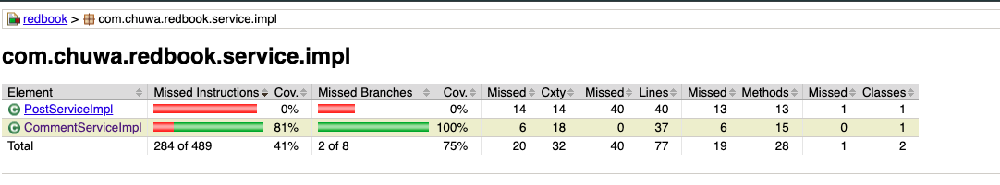
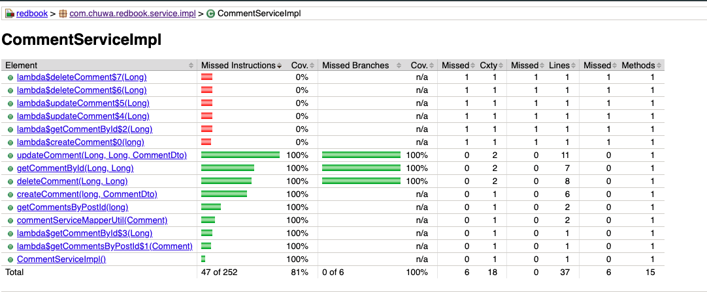

## TESTING 

### 1. Unit Testing
- **What it tests**: Individual methods or functions
- **Scope**: Narrow (typically one class or function)
- **Example**: Test `calculateDiscount(price, tax)` function to ensure correct discount logic
- **Tools**: JUnit (Java), PyTest (Python), Jest (JavaScript)
---

### 2. Functional Testing
- **What it tests**: Business logic against functional requirements
- **Scope**: Medium (typically a single feature or endpoint)
- **Example**: Test if submitting a user registration form results in successful account creation
- **Tools**: Selenium, Cypress
---

### 3. Integration Testing
- **What it tests**: Interactions between modules or services
- **Scope**: Medium to broad
- **Example**: Test that placing an order invokes inventory and payment services correctly
- **Tools**: Postman, REST Assured, JUnit/TestNG (with mocks)
---

### 4. Regression Testing
- **What it tests**: Verifies that new changes don't break existing functionality
- **Scope**:  Broad (usually entire system or module)
- **Example**: Rerun all test suites after modifying `UserService`
- **Tools**: Test suites, CI/CD tools (e.g., Jenkins, GitHub Actions)

---

### 5. Smoke Testing
- **What it tests**: A quick check to ensure critical paths are working before deeper testing
- **Scope**:  Shallow and wide
- **Example**: Launch Spring Boot app, login as user, and fetch dashboard data
- **Tools**: CI pipelines, lightweight scripts
---

### 6. Performance Testing
- **What it tests**: Speed, responsiveness, and stability under expected load
- **Scope**: Non-functional
- **Example**: Measure how the product search API performs under 1000 simultaneous requests
- **Tools**: JMeter, Locust, Gatling

---

### 7. Stress Testing
- **What it tests**: System behavior under extreme load or limits
- **Scope**: Non-functional
- **Example**: Simulate 10,000 concurrent users to test system crash/recovery

---

### 8. A/B Testing
- **What it tests**: Compare two versions for user preference/behavior
- **Scope**: Real-world users
- **Example**: Show version A (blue button) and B (green button); measure clicks

---

### 9. End-to-End (E2E) Testing
- **What it tests**: Entire user journey across the system
- **Scope**: Full system
- **Example**: Simulate a customer login, add items to cart, proceed to checkout, and receive order confirmation
- **Tools**: Cypress, Selenium, Playwright

---

### 10. User Acceptance Testing (UAT)
- **What it tests**: Final test by real users or stakeholders to validate business requirements
- **Scope**: Final validation before production
- **Example**: Sales team verifies that monthly report generation works as per their requirements

---

## ENVIRONMENT

### 1. Development
- **Definition**: Where developers write and test their code.
- **Purpose**: Fast iteration, debugging, unit testing.
- **Access**: Usually limited to individual or team use.
- **Example**: Developer tests a feature using a local database and mock APIs.

---

### 2. QA (Quality Assurance)
- **Definition**: Environment for testers to run integration, functional, and regression tests.
- **Purpose**: Controlled testing with realistic data.
- **Access**: Test automation runs here; bug tracking.
- **Example**: QA team runs automated Selenium test suite on deployed test build.

---

### 3. Pre-Prod / Staging
- **Definition**: Production-like environment used for final validation.
- **Purpose**: Simulates production — for load testing, UAT, smoke tests.
- **Data**: May use sanitized production data.
- **Access**: Cross-functional teams, including QA, product managers, and sometimes clients.
- **Example**: Perform end-to-end checkout test using real payment gateway in sandbox mode.

---

### 4. Production
- **Definition**: Live environment where end-users interact with the real application.
- **Purpose**: Revenue-generating or business-critical usage.
- **Monitoring**: Logs, alerts, observability tools (e.g., Grafana, Datadog)
- **Access**: Highest risk — only tested and approved code should reach here.
- **Example**: Website is live, handling real user signups and transactions.

---
## Write unit test for CommentServiceImpl.java: 
### https://github.com/CTYue/springboot-redbook/blob/10_testing/src/main/java/com/chuwa/redbook/service/impl/CommentServiceImpl.java
### Try to cover as many lines/branches as possible.
### Prove your code coverage using Jacoco Report.

