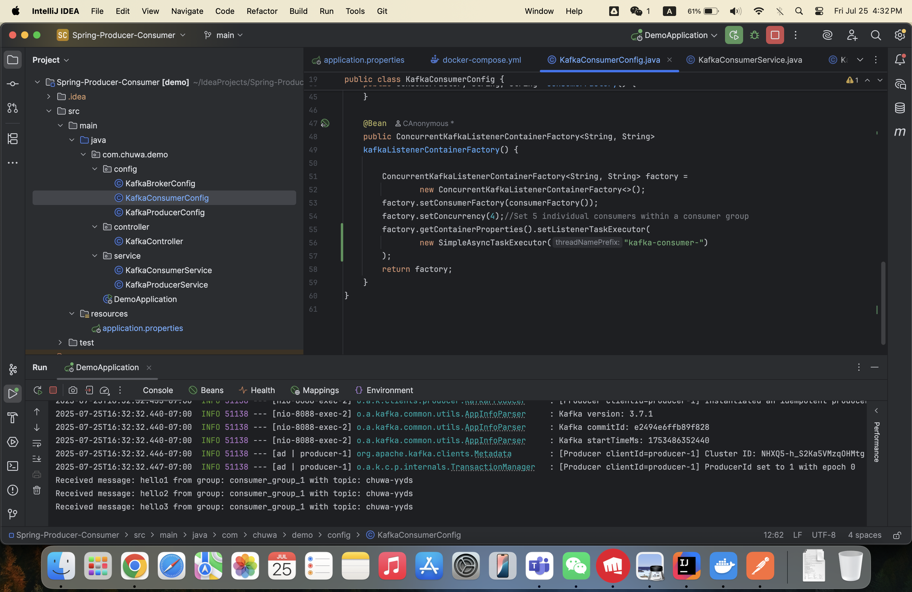

## 1. Explain following concepts, and how they coordinate with each other:

### Topic
A topic is a category/feed name to which records are published. Topics are split into partitions.

### Partition
A partition is an ordered, immutable sequence of records. Each partition is a unit of parallelism.

### Broker
A broker is a Kafka server that stores data and serves clients. Multiple brokers form a Kafka cluster.

### Consumer Group
A group of consumers sharing a group ID. Each consumer in the group reads from exclusive partitions.

### Producer
A client that publishes records to a Kafka topic.

### Offset
A unique ID assigned to each record within a partition. Used to track the consumer's position.

### Zookeeper
Used for managing and coordinating Kafka brokers (older versions), including metadata and leader election.

## 2. Given N (number of partitions) and M (number of consumers,) what will happen when N>=M and N<M
respectively?
- **N >= M**: Each consumer handles at least one partition; some consumers may handle multiple partitions.
- **N < M**: Some consumers will be idle, as each partition can only be consumed by one consumer in the group.

## 3. Explain how brokers work with topics?
- Brokers store topic partitions.
- Each broker may host zero or more partitions.
- Brokers coordinate with Zookeeper to manage partition metadata.

## 4. Are messages pushed to consumers or consumers pull messages from topics?
- Kafka uses a **pull model**: consumers pull messages from brokers.

## 5. How to avoid duplicate consumption of messages?
- Enable idempotent producers.
- Use exactly-once semantics (EOS).
- Track and commit offsets properly.

## 6. What will happen if some consumers are down in a consumer group? Will data loss occur? Why?
- Partitions are reassigned to remaining consumers.
- **No data loss**; data is retained in partitions.

## 7. What will happen if an entire consumer group is down? Will data loss occur? Why?
- **No data loss** (if retention period not exceeded).
- Offsets remain until expiration; new group members can resume.

## 8. Explain consumer lag and how to resolve it?
- Difference between latest offset and consumer's committed offset.
- Resolve by scaling consumers or optimizing processing logic.

## 9. Explain how Kafka tracks message delivery?
- Tracked via offsets.
- Consumers commit offsets after processing.
- Kafka supports at-least-once, at-most-once, and exactly-once semantics.

## 10. Compare Kafka vs RabbitMQ, compare messageing frameworks vs MySql (Why Kafka)?

| Feature            | Kafka                            | RabbitMQ                         | MySQL                          |
|--------------------|----------------------------------|----------------------------------|--------------------------------|
| Model              | Log-based                        | Queue-based                      | Table-based                    |
| Throughput         | High                             | Medium                           | Low for messaging              |
| Persistence        | Yes                              | Optional                         | Yes                            |
| Use Case           | Real-time stream processing       | Task queues, pub/sub             | Data storage, not messaging    |
| Ordering           | Partition-level                   | Queue-level                      | Row-level                      |
| Why Kafka?         | Scalability, performance, replay  | Lower latency for small tasks    | Not ideal for pub/sub systems  |

## 11. 
1) 
2) Kafka assigns one partition to one consumer within the same group.

If there are more consumers than partitions, the extra consumers stay idle.

3) Each group reads independently.

Consumers within a group share load (i.e., partitions divided).

Offsets per group are tracked separately.