1.

N>M: some consumers will assigned multiple partitions and receive message from them

N=M: Each consumer assigned to a single partition and receive from it

N<M: Extra consumers are not active

2.

Broker will split the topic into one or more partitions. When topic is created, the controller assigns each partition to one or more brokers according to the replication factor. One broker is leader for each partition and serve requests from consumer, others is follower

3.

Consumer poll the messages from topics

4.

To avoid duplicate consumption, we could enable "at most once" strategy at the consumer, that is when the message enter the listener function, it is immediately commited to broker. 

5.

If some consumer is down, the message is stored in broker and not consumed, the consumer offset will grow. After consumer is alive, the messages could be consumed. No data loss since all messages are stored at broker

6.

Similar to some consumers down, the message is still stored in broker and after consumer is alive it could be consumed. No data loss

7.

The consumer lag is offset at log end minus offset commited by consumer, it is the message count the not yet be consumed. Consumer lag could reduce by add more consumer(not greater than partition), reduce commit overhead, make the consumer robust and reduce down time.

8.

Kafka will use offset to ensure the message is delivered to the consumer. After a message received and processed by the consumer, the consumer will commit the offset to the broker and the broker could ensure it is delivered.

9.

Comparing to the RabbitMQ, the kafka provide a more distributed, pub/sub based message delivery mechanics. Compare with Mysql, Kafka is easier to scale and more distributed, optimized more for message delivery rather than complex queries like join.

10.

10.1

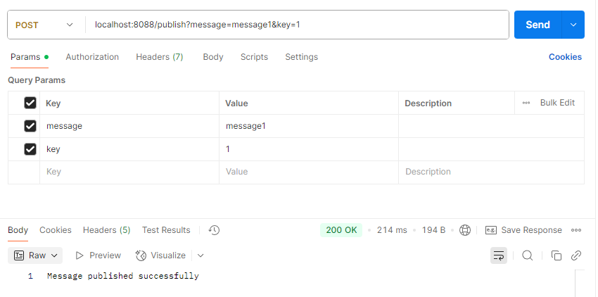

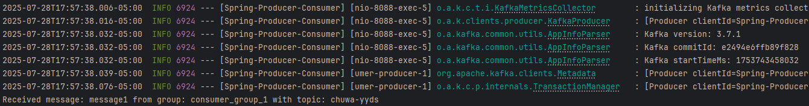

10.2

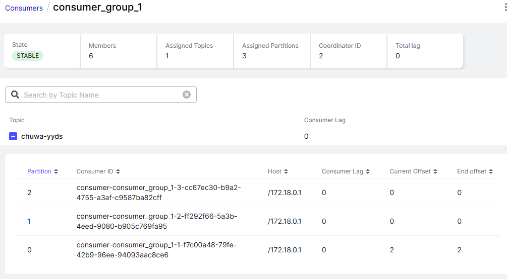

Although consumer count is larger than 3, there are only 3 partition, so only 3 of them are active

10.3,10.4

When sending message, it is received by both consumer group (both kafka listener) and printed in the console

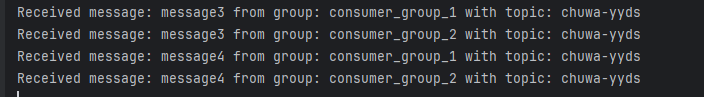

The consumer offset within two different group is same, since the offset is based on partition

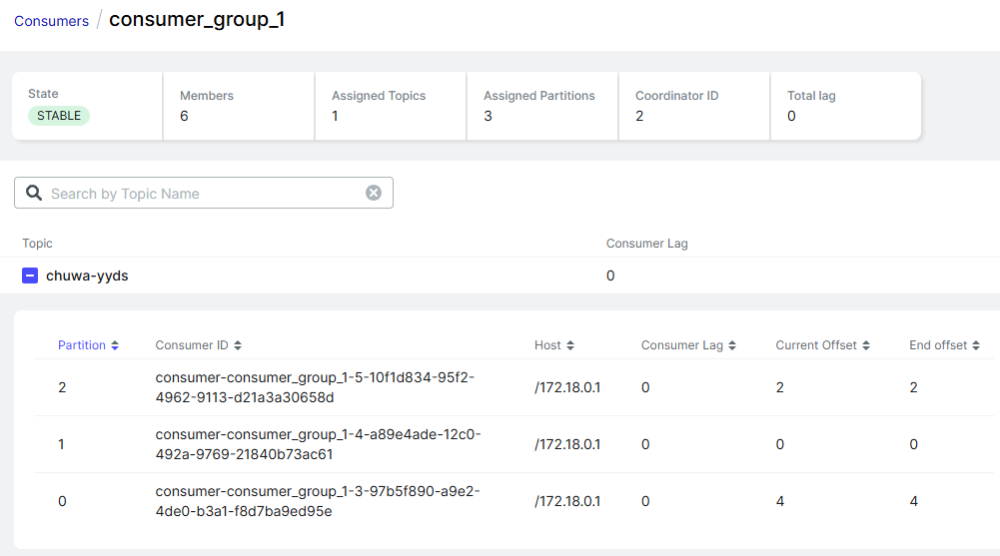

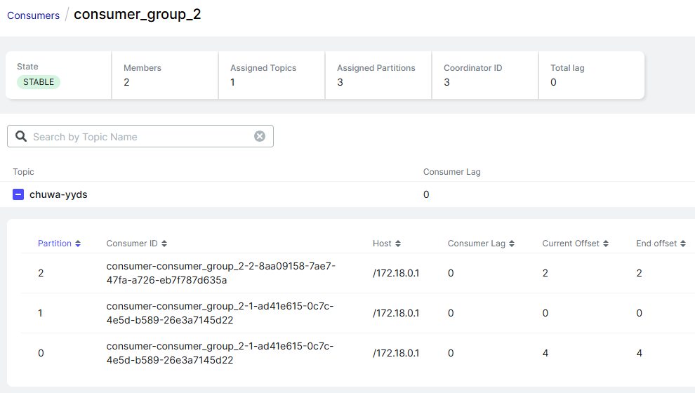

10.5

By default it is "at least once" strategy, which the consumer commit the offset to the broker when the listener method is called.

To change it to "at most once", we need to modify the setting to manual acknowledge

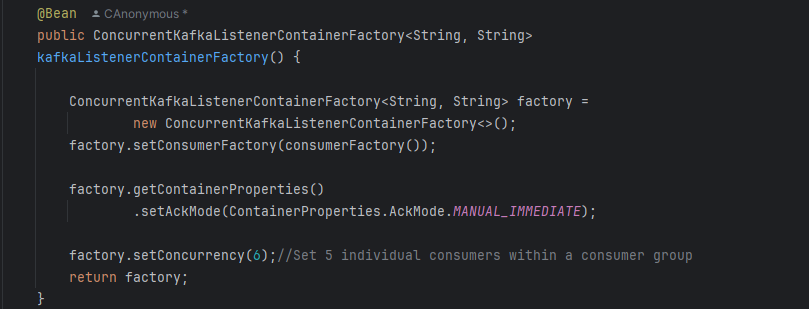

Then add a parameter in the listener, acknowledge manually

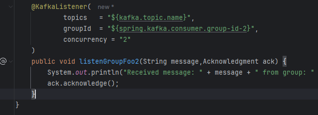

The new message is acknowledged successfully

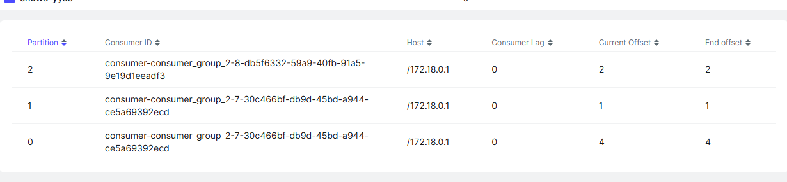

10.6

Modify the controller and producer service to make the key optional

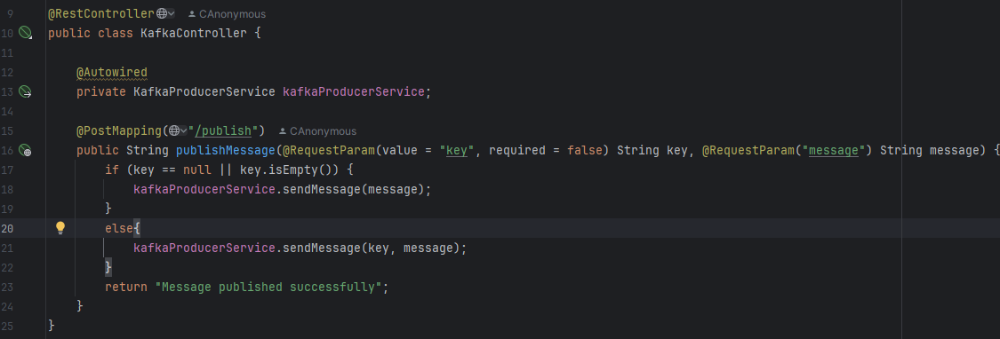

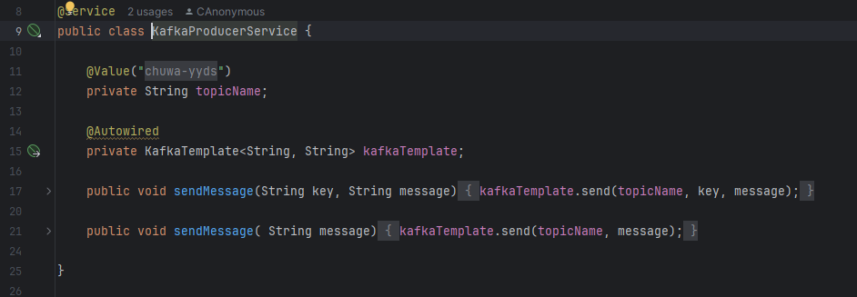

The message could be sent round robin without providing key

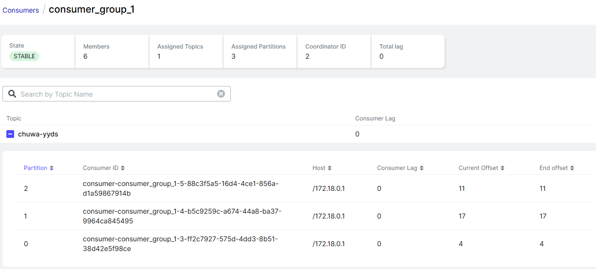

