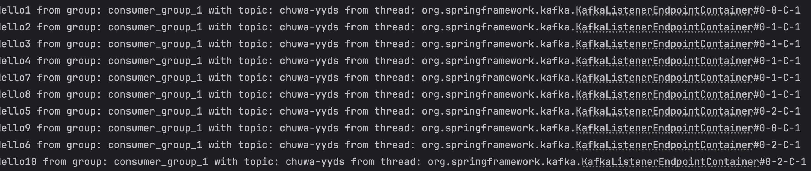
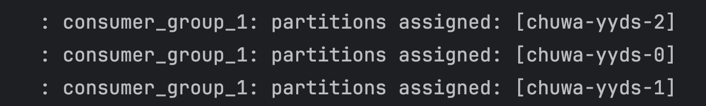
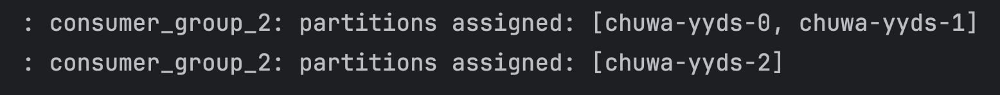
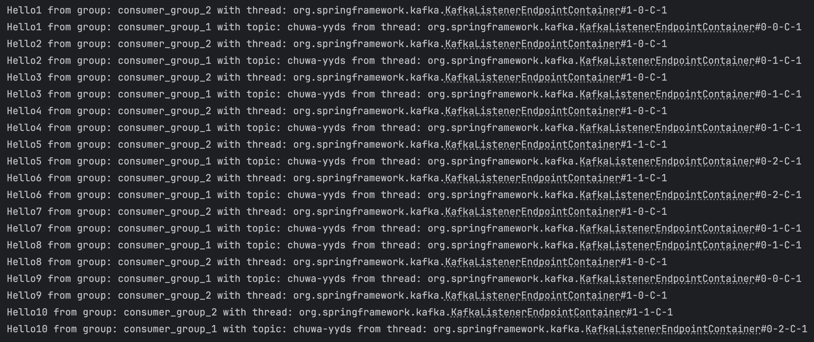
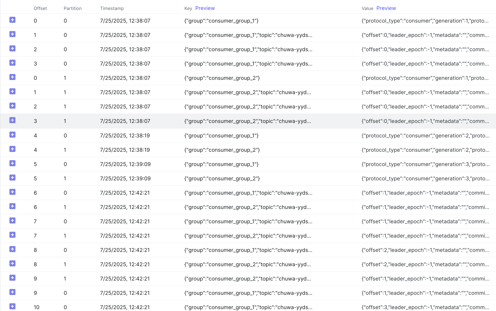
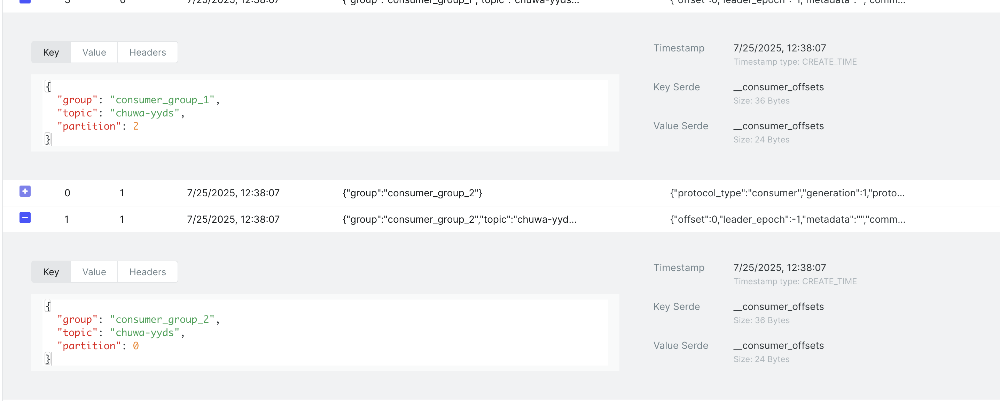
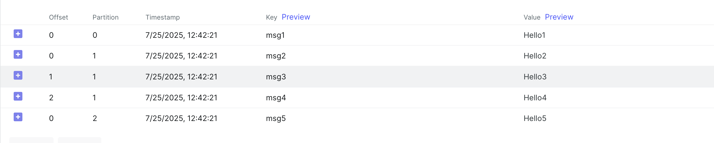

# Ryan Ma HW16 Answers

### 1.Explain following concepts, and how they coordinate with each other:
1.1 Topic
- A topic is a named stream of data in Kafka. Think of it as a category or feed name to which messages are published.
- Example: "user-signups" or "order-events".

Coordination:
- Producers send messages to a topic.
- Consumers subscribe to a topic to read messages.
- Topics are split into partitions for scalability and parallelism.

1.2 Partition
- A partition is a division of a topic. Each partition is an ordered, immutable sequence of records.
- Messages in a partition are assigned an offset, a unique ID that increases over time.

Coordination:
- Producers can write to specific partitions (round-robin or key-based).
- Consumers in a consumer group share the partitions for parallel reading.
- Partitions allow Kafka to scale horizontally and provide parallelism.

1.3 Broker
- A broker is a Kafka server that stores data and serves clients (producers and consumers).
- Each broker handles one or more partitions and participates in a Kafka cluster.

Coordination:
- Brokers manage data storage and handle client requests.
- Topics and partitions are distributed across brokers.
- Brokers send heartbeats to Zookeeper and rely on it for cluster metadata and leader election.

1.4 Consumer group:
- A consumer group is a group of one or more consumers that work together to consume messages from a topic.
- Each partition is consumed by only one consumer in the group at a time.

Coordination:
- Ensures load balancing and fault tolerance.
- Kafka tracks offsets for each partition in each consumer group.
- If a consumer fails, another can take over its partitions.

1.5 Producer
- A producer sends (publishes) messages to Kafka topics.
- It can choose a partition based on a key, or Kafka can assign partitions automatically.

Coordination:
- Sends records to the right topic/partition.
- Can ensure delivery guarantees: at-most-once, at-least-once, or exactly-once.

1.6 Offset
- An offset is a unique identifier for each message within a partition.
- It represents the position of a consumer in the log.

Coordination:
- Kafka does not delete consumed messages immediately.
- Consumers track their offsets (can be stored in Kafka, Zookeeper, or externally).
- This allows for reprocessing, fault recovery, and scaling.

1.7 Zookeeper
- Zookeeper is used by Kafka for cluster coordination, metadata management, and leader election.
- It stores:
  - Broker metadata
  - Topic configuration
  - Access control
  - Leader election info for partitions

Coordination:
- Keeps track of broker availability.
- Elects partition leaders.
- Without Zookeeper (prior to Kafka 2.8), Kafka cluster cannot operate. (Post 2.8: Kafka can use KRaft mode and operate Zookeeper-free.)

1.8 How they work together? Here’s a simplified workflow:
- Producer sends a message → Kafka chooses a topic and a partition → sends to the appropriate broker.
- Broker stores the message with a unique offset.
- Consumer group reads from the topic → each consumer reads from specific partitions → keeps track of offsets.
- Zookeeper manages brokers and partitions metadata, helps with leader election, and tracks the state of the Kafka cluster.

### 2. Understanding following questions
2.1 Given N (number of partitions) and M (number of consumers) what will happen when N>=M and N<M respectively?
- Scenario 1: N >= N
  - Each consumer can be assigned one or more partitions.
  - All partitions will be consumed.
  - Some consumer may handle multiple partitions.
  - Kafka will evenly(as possible) distribute positions across consumers.

- Scenario 2: N < M
  - Kafka can't assign more than one consumer to a single partition within a same consumer group.
  - So only N consumer get assigned a partition, and the rest will be idle.

2.2 Explain how brokers work with topics?
- Brokers store and manage data for topics.
- Each topic is split into partitions, and partitions are distributed across multiple brokers for load balancing and fault tolerance.
- e.g
```text
Partition: orders-0
- Leader: Broker 1
- Follower: Broker 2

Partition: orders-1
- Leader: Broker 2
- Follower: Broker 3

Partition: orders-2
- Leader: Broker 3
- Follower: Broker 1
```

2.3 Are messages pushed to consumers or consumers pull messages from topics?
- Kafka does not push message to consumers, instead Kafka consumers poll for data.

2.4 How to avoid duplicate consumption of messages?
- Method 1: At producer level - use Idempotence
  - Enable Kafka's built-in idempotent producer, so even if the producer retries, Kafka will not write duplicate messages.
  - Prevents duplicate writes
  - Works by assigning a Producer ID + sequence number to each message
```java
props.put("enable.idempotence", "true");
props.put("acks", "all");
props.put("retries", Integer.MAX_VALUE);
```

- Method 2: At Consumer level - use Idempotent processing
  - If a message is re-consumed (e.g. crash before offset commit), you should make your business logic idempotent:
  
    | Use case          | How to deduplicate                                         |
    |-------------------|------------------------------------------------------------|
    | Writing to a DB   | Use **unique constraint** (e.g., order\_id as primary key) |
    | Calling an API    | Track request IDs or add a deduplication token             |
    | Writing to a file | Check for existing record hash or ID                       |

- Method 3: Use Exactly-Once Semantics (EOS) — End-to-End
  - Kafka supports exactly-once semantics with transactional guarantees

2.5 What will happen if some consumers are down in a consumer group? Will data loss occur? Why?
- What will happen?
  - If some consumers in a consumer group go down, no data will be lost — Kafka will redistribute the partitions to the remaining consumers in the group.
Kafka’s design ensures high availability and no message loss, as long as the offsets are managed properly and Kafka is configured correctly.

- What actually happens when a customer goes down?
  - Kafka detects consumer failure. Kafka uses heartbeat signals sent from consumers to the Kafka Group Coordinator. If a consumer fails to send heartbeats within a timeout period (default ~10 sec), Kafka considers it dead.
  - Triggers a rebalance. The partitions assigned to the dead consumer are reassigned to other alive consumers in the same group. This is automatic and happens quickly (~few seconds, depending on your configs).
  - Remaining consumers resume work. Consumers resume processing from the last committed offset of the dead consumer. If the consumer committed offsets properly, no duplicate or lost messages occur.

2.6 What will happen if an entire consumer group is down? Will data loss occur? Why?
- What will happen?
  - No data will be lost, as long as Kafka’s retention period and replication are configured correctly. Kafka keeps messages in the topic for a fixed time, regardless of whether consumers are alive or not.
- What actually happens?
  - Kafka keeps storing incoming messages. Producers keep writing messages to topics/partitions. These messages are stored on disk and indexed by offset.
  - Consumer group does not consume anything. Since no active consumer in the group is polling data, offsets are not advancing. Kafka does not delete messages just because no one is consuming.
  - When the group comes back online (e.g., apps restart) Consumers resume from their last committed offsets. They pick up unprocessed messages from where they left off.

2.7 Explain consumer lag and how to resolve it?

2.7.1 What is consumer lag?
- Consumer lag is the difference between the lastest message in a partition and the last message a consumer has processed(commited offset)
- Formular: **Consumer Lag = Latest Offset in Partition - Last Committed Offset by Consumer**
- Example

  | Partition | Latest Offset | Consumer Offset | Lag |
  |-----------|---------------|-----------------|-----|
  | P0        | 105           | 100             | 5   |
  | P1        | 98            | 98              | 0   |

2.7.2 Why is consumer lag a problem?

| Problem                            | Impact                                                        |
|------------------------------------|---------------------------------------------------------------|
| ❗ Real-time delays                 | Consumers fall behind producers                               |
| ❗ Data freshness issues            | Users may see outdated data                                   |
| ❗ Overloaded consumer or network   | May indicate scaling problems                                 |
| ❗ Risk of **retention expiration** | Messages could be deleted before consumed if lag is too large |

2.7.3 Common Causes of Consumer Lag

| Cause                          | Description                                |
|--------------------------------|--------------------------------------------|
| ⏱ Slow consumer processing     | e.g., heavy DB writes, I/O latency         |
| 📉 Too few consumers           | Not enough parallelism to handle volume    |
| 🧠 High message volume         | Spike in producer rate or backlog build-up |
| 💥 Rebalancing                 | Frequent consumer crashes or restarts      |
| ⚙️ Manual offset commit issues | Delayed or skipped commits                 |

2.7.4 How to resolve Consumer Lag?
- Scale Horizontally
  - Add more consumer instances to the consumer group
  - Kafka will rebalance partitions across more consumers
- Optimize consumer performance
  - Process messages faster (e.g., reduce DB latency, parallelize logic)
  - Batch writes instead of per-message writes
  - Tune poll loop: increase max.poll.records, fetch.min.bytes
- Tune commit strategy
  - Use manual offset commit only after successful processing
  - Avoid committing too late or too early
  - Example:
```java
consumer.commitSync(); // after processing the batch
```
- Monitor Lag Actively
  - Use Kafka tools like:
  - Kafka CLI: kafka-consumer-groups.sh --describe
  - JMX metrics
  - Monitoring tools: Prometheus + Grafana, Confluent Control Center

- Add Partitions (last resort)
  - More partitions = more parallelism
  - But this is a structural change and may require topic reconfiguration

2.8 Explain how Kafka tracks message delivery?
2.8.1 Overview: message delivery tracking in Kafka

| Level                | Mechanism                           | Who tracks it?         |
|----------------------|-------------------------------------|------------------------|
| **Producer → Kafka** | ACKs and retries (write guarantees) | Kafka brokers          |
| **Kafka → Consumer** | **Offsets** (read/commit tracking)  | Kafka + Consumer Group |

2.8.2 Producer → Kafka: Broker confirms delivery
- Kafka uses ACKs and optional idempotence to track message delivery from producer to broker.
- How it works:
  - Producer sends message to broker (leader of a partition)
  - Broker appends the message to its log
  - Based on the acks config:
   - acks=0: Producer does not wait for confirmation
   - acks=1: Wait for leader only to write
   - acks=all: Wait for all replicas in ISR to confirm
- Kafka responds with an acknowledgment
- Producer retries if ACK is not received (with optional deduplication if enable.idempotence=true)
- This tracks whether the message was successfully received by Kafka.

2.8.3 Kafka → Consumer: Tracking via Offsets
- Kafka doesn’t push messages; consumers pull them and track their progress using offsets.
- How delivery is tracked:
  - Consumer polls messages (e.g., offset 100–104)
  - Processes messages
  - Commits offset after successful processing (e.g., offset 105)
  - Kafka stores the committed offset in an internal topic: __consumer_offsets
- Kafka does not delete messages after consumption. Instead, it remembers what the consumer has read.

2.9 Compare Kafka vs RabbitMQ, compare messaging frameworks vs MySql (Why Kafka)?
-  Kafka vs RabbitMQ (Messaging System vs Messaging System)

   | Feature                 | **Kafka**                                           | **RabbitMQ**                                 |
   |-------------------------|-----------------------------------------------------|----------------------------------------------|
   | **Type**                | Distributed **log-based** pub/sub system            | Centralized **queue-based** message broker   |
   | **Use Case**            | High-throughput, real-time streaming                | Reliable task queueing, async job handling   |
   | **Storage**             | Messages stored on disk with configurable retention | Messages typically deleted after consumption |
   | **Consumer Model**      | **Pull-based**, consumers poll data                 | **Push-based**, broker pushes to consumers   |
   | **Message Retention**   | Time-based (e.g., 7 days or forever)                | Deleted after acknowledged                   |
   | **Ordering**            | Guaranteed **within partition**                     | Guaranteed per queue                         |
   | **Replay Support**      | ✅ Yes (via offset rewind)                           | ❌ No, once consumed it's gone                |
   | **Scalability**         | Horizontally scalable (multi-broker)                | More limited, needs clustering               |
   | **Throughput**          | Extremely high (> millions/sec)                     | Moderate (\~10s of thousands/sec)            |
   | **Delivery Guarantee**  | At-most-once, at-least-once, exactly-once           | At-most-once, at-least-once                  |
   | **Built-in Stream API** | ✅ Kafka Streams                                     | ❌ No built-in streaming                      |
   | **Tooling**             | Good (Kafka CLI, Grafana, Confluent UI)             | Good (management UI, plugins)                |
   | **Complexity**          | Higher setup and learning curve                     | Easier to start with                         |

- Messaging Systems (Kafka/RabbitMQ) vs MySQL (Database)
- 
  | Feature               | **Kafka / RabbitMQ** (Messaging)               | **MySQL** (Database)                           |
  |-----------------------|------------------------------------------------|------------------------------------------------|
  | **Purpose**           | Asynchronous message delivery between services | Persistent structured data storage             |
  | **Data Access**       | **Stream-based (append only)**                 | Query-based (random access with SQL)           |
  | **Durability**        | Configurable, disk-based logs                  | Strong ACID guarantees                         |
  | **Real-time**         | ✅ Designed for real-time streaming             | ❌ Not ideal for real-time messaging            |
  | **Replay capability** | ✅ Kafka supports it, RabbitMQ doesn’t          | ❌ No concept of message replay                 |
  | **Decoupling**        | ✅ Producer/Consumer fully decoupled            | ❌ Tight coupling in data model                 |
  | **Scalability**       | Kafka highly scalable                          | MySQL scaling is harder (usually via sharding) |
  | **Best at**           | Moving/streaming data between systems          | Storing and querying data consistently         |

### 3 Coding based on [Repo](https://github.com/CTYue/Spring-Producer-Consumer)
3.1 Write your consumer application with Spring Kafka dependency, set up 3 consumers in a single consumer group. Prove message consumption with screenshots.
```java
factory.setConcurrency(3);
```


3.2 Increase number of consumers in a single consumer group, observe what happens, explain your observation.
- When I increased the number of consumers in the same consumer group to 4 (with only 3 partitions in the topic), only 3 consumer threads were actively consuming messages. The fourth one was idle because Kafka only allows one consumer per partition within the same group. Therefore, increasing consumers beyond partition count does not increase parallelism — the excess consumers remain idle.
```java
factory.setConcurrency(4);
```

3.3 Create multiple consumer groups using Spring Kafka, set up different numbers of consumers within each group, observe consumer offset.
- Group 1
```java
// consumer group 1
@KafkaListener(topics = "${kafka.topic.name}", groupId = "${spring.kafka.consumer.group-id}")
public void listenGroupFoo(String message) {
//        System.out.println("Received message: " + message + " from group: " + consumerGroupId + " with topic: " + topic);
    System.out.println("Received message: " + message + " from group: " + consumerGroupId + " with topic: " + topic + " from thread: " + Thread.currentThread().getName());
    // {"messageKey":1234 //idempotency key
    // }
//        try {
//            //process and persist message
//        } catch (Exception e) {
//            //send to dead letter queue
//        }
    //commit to offset here
    //return
}
```


- Group 2
```java
// consumer group 2
    @KafkaListener(topics = "${kafka.topic.name}", groupId = "consumer_group_2", concurrency = "2")
    public void listenConsumerFoo2(String message) {
        System.out.println("Received message: " + message + " from group: " + "consumer_group_2" + " with thread: " + Thread.currentThread().getName());
    }
```


- We created two consumer groups (group-1 with 3 consumers, group-2 with 2 consumers).
  Each group received all messages independently.
  Kafka tracked offsets per group — meaning group-a and group-b both started at offset 0, maintained their own progress, and did not interfere with each other.


- offset


3.4 Prove that each consumer group is consuming messages on topics as expected, take screenshots of offset records


3.5 Demo different message delivery guarantees in Kafka, with necessary code or configuration changes.
```bash
for i in {1..5}; do                                
  curl --location --request POST "http://localhost:8088/publish?message=Hello$i&key=msg$i"
done    
```


3.6 Write your own partitioning logic, to demo your messages will be assigned to different brokers, or
you can also demo kafka's default round-robin partition logic, with code changes.
- default round-robin
```java
@PostMapping("/publish")
public String publishMessage(@RequestParam("message") String message) {
    kafkaProducerService.sendMessage(message);
    return "Published with round-robin";
}

public void sendMessage(String message) {
    kafkaTemplate.send(topicName, message);  // no key
}
```


