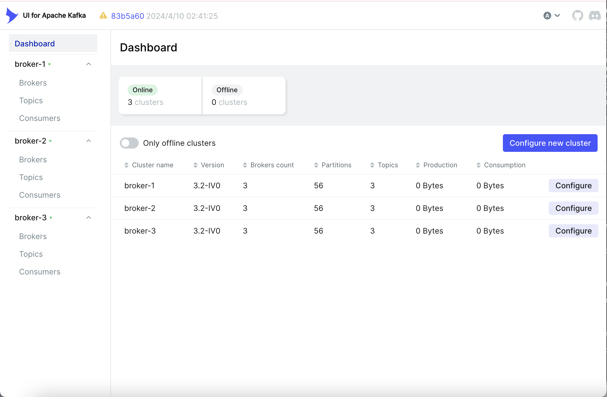
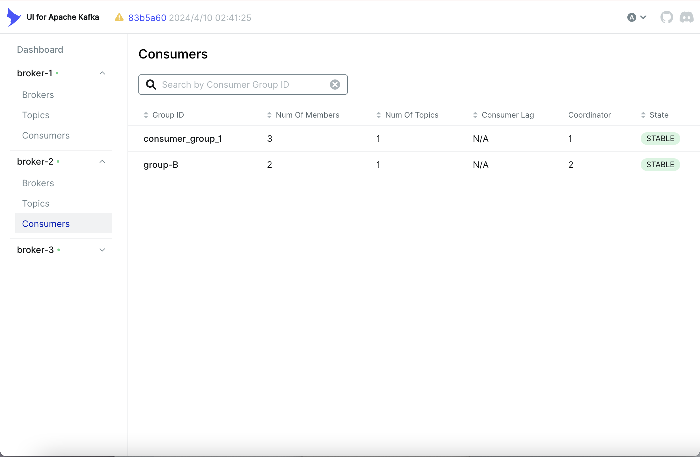

Explain following concepts, and how they coordinate with each other:

Topic: A Topic is a category or feed name to which messages are sent by producers. 

Partition: A Topic is split into one or more partitions for scalability and parallelism. Each partition is an ordered, immutable sequence of records, and new records are appended to it.

Broker: A Broker is a Kafka server that stores data and serves client requests. Each broker can handle multiple partitions from multiple topics.

Consumer group: A Consumer Group is a set of consumers that cooperate to consume records from one or more topics. Kafka assigns each partition to one consumer within a group (load balancing).

Producer: A Producer is a client that sends data (messages) to Kafka topics. Producers can choose which partition a message goes to (via a key or a custom partitioner), or Kafka can assign it randomly.

Offset: An Offset is a unique ID for each message within a partition. It denotes the position of a message in a partition log.

Zookeeper: Zookeeper is a centralized service used by Kafka to manage metadata, elect leaders, and coordinate the cluster. It keeps track of which brokers are alive, which broker is the leader for a partition, etc.

How They Coordinate Together:

Producer sends a message → Kafka assigns it to a partition → Message stored on a broker.

The partition is hosted by one broker (the leader) and replicated to others (followers) for fault tolerance.

A consumer group subscribes to a topic → Kafka assigns partitions to consumers → Each consumer reads from its assigned partitions.

Consumers maintain offsets to track how far they’ve read in each partition.

Zookeeper (if used) ensures the health and coordination of brokers and helps elect partition leaders.

Answer following questions:

1. Given N (number of partitions) and M (number of consumers,) what will happen when N>=M and N\<M respectively?

N ≥ M (Partitions ≥ Consumers):

Kafka will assign one or more partitions to each consumer. Each partition is consumed by only one consumer in a given consumer group (Kafka rule). Some consumers may get more than one partition (load is uneven if N is not divisible by M). All consumers are active.

Result:

Efficient parallel consumption. Good utilization of consumer group.

N < M (Partitions < Consumers)

Kafka will assign one partition to one consumer, but cannot assign more consumers than partitions. So, some consumers will be idle (i.e., they get assigned no partitions). Kafka guarantees only one consumer per partition in a consumer group.

Result:

Some consumers do nothing. Wasted resources unless you increase partition count.

2. Explain how brokers work with topics?

A Kafka broker is a server that handles the storage, processing, and retrieval of messages. Brokers host topics and their partitions, enabling producers to write data and consumers to read it.

Workflow:

Topic is created → Kafka assigns partitions across brokers.

Producer sends message to a topic → Kafka routes it to the appropriate partition (and thus broker).

Broker (leader) stores message in the partition log.

Followers replicate the message for fault tolerance.

Consumer reads from the broker hosting the partition's leader.

3. Are messages pushed to consumers or consumers pull messages from topics?

Consumers pull messages from topics. Consumers poll Kafka brokers to fetch messages from the topics/partitions they’re assigned. This is done via the poll() method in Kafka consumer clients. Kafka returns available records starting from the last committed or tracked offset.

4. How to avoid duplicate consumption of messages?

Commit Offsets Only After Processing (At-Least-Once)

* Process → Commit, not the other way around.

* Kafka default is at-least-once — duplicates possible if consumer crashes after processing but before committing offset.

Use Idempotent Processing：

* Design your application logic to handle duplicates gracefully.

* For example: Deduplicate using message keys。 Store a message ID in DB and skip if already processed.

Exactly-Once Semantics (EOS) with Kafka

* Use: Idempotent Producers (enable.idempotence=true), Transactional Producers, Kafka Streams API (has EOS support built-in)

Use Consumer Groups Properly

* Ensure only one consumer reads each partition in a group.

* Don't assign the same partition to multiple consumers manually.

Avoid auto.commit = true

* Kafka's auto-commit commits offsets at intervals regardless of processing success.

5. What will happen if some consumers are down in a consumer group? Will data loss occur? Why?

When a consumer in a consumer group goes down, Kafka will NOT lose any data, as long as the system is configured correctly.

Kafka Will Rebalance the Group: Kafka detects the consumer failure (via heartbeat timeout). A rebalance is triggered. Kafka reassigns the partitions of the failed consumer to the remaining active consumers in the group. The newly assigned consumers will resume consumption from the last committed offsets of those partitions.

6. What will happen if an entire consumer group is down? Will data loss occur? Why?

Kafka keeps all topic data in the partitions for a configured retention period (default is 7 days). Since consumption and storage are decoupled, Kafka does not delete messages after they are read — only after they expire based on retention settings. When the consumer group comes back online: It will rejoin the group, Kafka will rebalance partition assignments, each consumer will resume from the last committed offsets, no messages are lost, only possibly delayed.

Why Data Is Not Lost:

* Durable log: Kafka stores all records in a persistent log per partition.

* Retention-based deletion: Kafka deletes data based on time or size, not based on consumption.

* Offset tracking: Each consumer group tracks its own offsets, independent of the data itself.

* Idempotent consumption: Consumers can restart and reprocess without data loss (with proper config).

7. Explain consumer lag and how to resolve it?

Consumer lag is the difference between the latest message available in a Kafka partition and the last message that has been read (or committed) by the consumer.

How to resolve:

* Scale Out Consumers: Increase the number of consumers in the group (up to number of partitions). Each consumer gets fewer partitions → better throughput.

Optimize Consumer Processing: Make message handling faster: Reduce I/O blocking, Batch DB writes, Use asynchronous or parallel processing, Tune JVM GC (for Java consumers)

Increase Kafka Partition Count: More partitions → better parallelism. But requires consumer group rebalance and topic reconfiguration.

Commit Offsets Efficiently: Avoid auto-commit if it commits too frequently or too infrequently. Use manual commit after message is processed.

Tune Consumer Polling: Polling too slowly can cause rebalancing and lag.

Monitor and Alert on Lag: Use tools like: Kafka’s built-in JMX metrics, Kafka Exporter + Prometheus + Grafana, Burrow, Cruise Control, or Confluent Control Center.

8. Explain how Kafka tracks message delivery?

Kafka tracks message delivery using offsets, which are numerical markers assigned to each message in a partition. Instead of marking messages as "delivered," Kafka relies on consumers to commit offsets after processing messages. These committed offsets are stored in a special internal topic called consumer_offsets, enabling Kafka to know how far each consumer group has read. When a consumer restarts, it resumes from the last committed offset. This model ensures high throughput and scalability but requires careful offset management to avoid duplicates or data loss, depending on whether offsets are committed before or after processing.

9. Compare Kafka vs RabbitMQ, compare messageing frameworks vs MySql (Why Kafka)?

 Kafka vs RabbitMQ

| Feature                   | **Kafka**                                             | **RabbitMQ**                                   |
| ------------------------- | ----------------------------------------------------- | ---------------------------------------------- |
| **Message Model**         | Log-based **publish-subscribe**                       | Traditional **message queue** (push-based)     |
| **Delivery Semantics**    | At-least-once (default), exactly-once (optional)      | At-most-once, at-least-once, manual ACK        |
| **Message Ordering**      | Preserved **within partitions**                       | Preserved per queue                            |
| **Persistence**           | Durable log, configurable retention                   | Messages stored until acknowledged/expired     |
| **Backpressure Handling** | Consumers **pull** messages (poll)                    | Broker **pushes**, can overwhelm consumers     |
| **Throughput**            | Extremely high (millions/sec)                         | Medium-high (but lower than Kafka)             |
| **Latency**               | Low, but optimized for throughput                     | Lower latency, good for request-response       |
| **Scalability**           | Horizontally scalable (via partitions)                | Harder to scale (queue per consumer)           |
| **Replay Support**        | Yes — consumers can re-read via offsets               | No built-in replay (unless persisted manually) |
| **Use Cases**             | Event streaming, log aggregation, real-time analytics | Task queue, RPC, short-lived messaging         |

Messaging Frameworks (Kafka/RabbitMQ) vs MySQL

| Feature                   | **Messaging Systems (Kafka, etc.)**                    | **MySQL (or RDBMS)**                       |
| ------------------------- | ------------------------------------------------------ | ------------------------------------------ |
| **Purpose**               | Decoupling producers/consumers via **message passing** | Persistent structured data storage         |
| **Data Flow**             | Streaming, real-time pipelines                         | Query-based, request/response              |
| **Latency**               | Millisecond-level                                      | Slower for large insert/query ops          |
| **Replay/Time Travel**    | Kafka allows re-reading past messages                  | MySQL doesn’t support log replay natively  |
| **Throughput**            | Designed for massive ingestion                         | Not optimized for ingestion at scale       |
| **Schema Flexibility**    | Loose or dynamic schema (Avro/JSON/etc.)               | Rigid relational schema                    |
| **Real-time Analytics**   | Yes (with stream processors like Kafka Streams)        | No (batch-oriented, better for historical) |
| **Data Retention**        | Configurable (e.g., 7 days, forever)                   | Data lives until deleted                   |
| **Consumer Independence** | Yes — multiple consumers, offset-based                 | No — no independent reads from change logs |

10. On top of https://github.com/CTYue/Spring-Producer-Consumer

Write your consumer application with Spring Kafka dependency, set up 3 consumers in a single consumer group.

```
factory.setConcurrency(3);
```

Prove message consumption with screenshots.



Increase number of consumers in a single consumer group, observe what happens, explain your observation.

Topic has 3 partitions (partition-0, partition-1, partition-2):

Case 1: One Consumer

* All 3 partitions are assigned to 1 consumer.

* This single consumer does all the work (reads all messages).

Case 2: Three Consumers in the Group

* Each partition gets assigned to a different consumer.

* Throughput improves since consumers work in parallel.

Case 3: Five Consumers in the Group

* Only 3 consumers are active (since there are 3 partitions).

* The other 2 are idle.

* Kafka ensures exactly one consumer per partition in a group — no duplication.

Create multiple consumer groups using Spring Kafka, set up different numbers of consumers within each group, observe consumer offset.

```
    @Bean
    public ConcurrentKafkaListenerContainerFactory<String, String> newFactory(
            ConsumerFactory<String, String> defaultFactory) {
        ConcurrentKafkaListenerContainerFactory<String, String> factory =
                new ConcurrentKafkaListenerContainerFactory<>();
        factory.setConsumerFactory(defaultFactory);
        factory.setConcurrency(5); // 5 consumers in new consumer group
        return factory;
    }
```

* group-A (3 consumers, 3 partitions): each consumer gets 1 partition.

* group-B (2 consumers, 3 partitions): one consumer will get 2 partitions, the other 1.

* Each group maintains its own offset — independent message consumption.

Prove that each consumer group is consuming messages on topics as expected, take screenshots of offset records,



Demo different message delivery guarantees in Kafka, with necessary code or configuration changes.

At Most Once:

```
<!-- KafkaConsumerConfig.java -->

factory.getContainerProperties().setAckMode(ContainerProperties.AckMode.RECORD);
factory.getContainerProperties().setAckOnError(false); // Don't retry on error

<!-- application.properties -->

spring.kafka.listener.ack-mode: record
spring.kafka.listener.ack-on-error: false

<!-- KafkaConsumerService.java -->

@KafkaListener(topics = "${kafka.topic.name}", groupId = "${spring.kafka.consumer.group-id}")
public void listenGroupFoo(String message) {
    System.out.println("Processing message: " + message);
    if (message.contains("fail")) throw new RuntimeException("Simulated failure");
    // Processing logic (offset already committed)
}

```

At Least Once

```
<!-- KafkaConsumerConfig.java -->

factory.getContainerProperties().setAckMode(ContainerProperties.AckMode.MANUAL_IMMEDIATE);

<!-- KafkaConsumerService.java -->

@KafkaListener(topics = "${kafka.topic.name}", groupId = "${spring.kafka.consumer.group-id}")
public void listenGroupFoo(String message, Acknowledgment ack) {
    try {
        System.out.println("Processing: " + message);
        if (message.contains("fail")) throw new RuntimeException("Simulated failure");
        // Do something
        ack.acknowledge(); // Commit offset after success
    } catch (Exception e) {
        // Log error, will retry the message
        System.err.println("Error: " + e.getMessage());
    }
}
```

Exactly Once

```
<!-- KafkaProducerConfig.java -->

@Bean
public ProducerFactory<String, String> producerFactory() {
    Map<String, Object> configProps = new HashMap<>();
    configProps.put(ProducerConfig.BOOTSTRAP_SERVERS_CONFIG, bootstrapServers);
    configProps.put(ProducerConfig.KEY_SERIALIZER_CLASS_CONFIG, StringSerializer.class);
    configProps.put(ProducerConfig.VALUE_SERIALIZER_CLASS_CONFIG, StringSerializer.class);
    configProps.put(ProducerConfig.ENABLE_IDEMPOTENCE_CONFIG, true);
    configProps.put(ProducerConfig.TRANSACTIONAL_ID_CONFIG, "tx-id-1");
    return new DefaultKafkaProducerFactory<>(configProps);
}

@Bean
public KafkaTemplate<String, String> kafkaTemplate() {
    KafkaTemplate<String, String> template = new KafkaTemplate<>(producerFactory());
    template.setTransactionalIdPrefix("tx-id-");
    return template;
}

<!-- KafkaProducerService.java -->

@Autowired
private KafkaTemplate<String, String> kafkaTemplate;

public void sendMessage(String key, String message) {
    kafkaTemplate.executeInTransaction(kt -> {
        kt.send(topicName, key, message);
        return true;
    });
}

```

Write your own partitioning logic, to demo your messages will be assigned to different brokers, or you can also demo kafka's default round-robin paritioning logic, with code changes.

**Kafka Default Round-Robin Partitioning**

Only works if no key is provided → Kafka assigns partitions in round-robin order.

```
for (int i = 0; i < 10; i++) {
    kafkaTemplate.send("demo-topic", null, "Message-" + i);
}
```

**Custom Partitioning Logic**

Assign messages to partitions based on their content:

Messages containing "error" → partition 0

Messages containing "warn" → partition 1

All others → partition 2

```
<!-- CustomPartitioner.java -->

public class CustomPartitioner implements Partitioner {

    @Override
    public void configure(Map<String, ?> configs) {}

    @Override
    public int partition(
        String topic,
        Object key,
        byte[] keyBytes,
        Object value,
        byte[] valueBytes,
        Cluster cluster
    ) {
        int numPartitions = cluster.partitionCountForTopic(topic);

        String msg = value.toString().toLowerCase();
        if (msg.contains("error")) return 0;
        if (msg.contains("warn")) return 1;
        return 2 % numPartitions;
    }

    @Override
    public void close() {}
}

<!-- KafkaProducerConfig.java -->


@Configuration
public class KafkaProducerConfig {

    @Bean
    public ProducerFactory<String, String> producerFactory() {
        Map<String, Object> configProps = new HashMap<>();
        configProps.put(ProducerConfig.BOOTSTRAP_SERVERS_CONFIG, "localhost:9092");
        configProps.put(ProducerConfig.KEY_SERIALIZER_CLASS_CONFIG, StringSerializer.class);
        configProps.put(ProducerConfig.VALUE_SERIALIZER_CLASS_CONFIG, StringSerializer.class);
        configProps.put(ProducerConfig.PARTITIONER_CLASS_CONFIG, CustomPartitioner.class.getName());

        return new DefaultKafkaProducerFactory<>(configProps);
    }

    @Bean
    public KafkaTemplate<String, String> kafkaTemplate() {
        return new KafkaTemplate<>(producerFactory());
    }
}

<!-- MessageProducer.java -->


@Service
public class MessageProducer {

    @Autowired
    private KafkaTemplate<String, String> kafkaTemplate;

    public void sendTestMessages() {
        kafkaTemplate.send("demo-topic", "This is an error message");
        kafkaTemplate.send("demo-topic", "This is a warning");
        kafkaTemplate.send("demo-topic", "This is just info");
    }
}

<!-- KafkaDemoApplication.java -->

@SpringBootApplication
public class KafkaDemoApplication implements CommandLineRunner {

    @Autowired
    private MessageProducer messageProducer;

    public static void main(String[] args) {
        SpringApplication.run(KafkaDemoApplication.class, args);
    }

    @Override
    public void run(String... args) {
        messageProducer.sendTestMessages();
    }
}

```

Note: There's already a docker compose file in above git repo, you can start the 3 brokers (with zookeep) using docker-compose up command.
