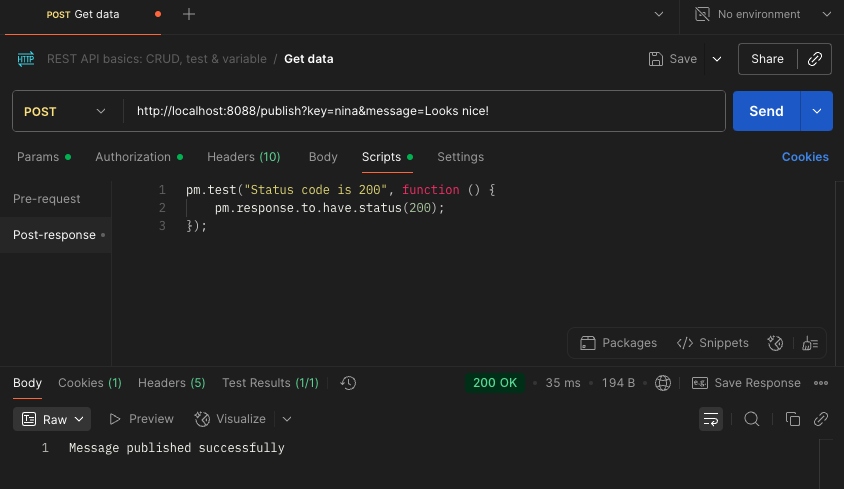
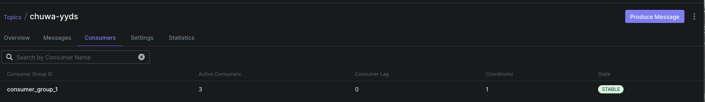
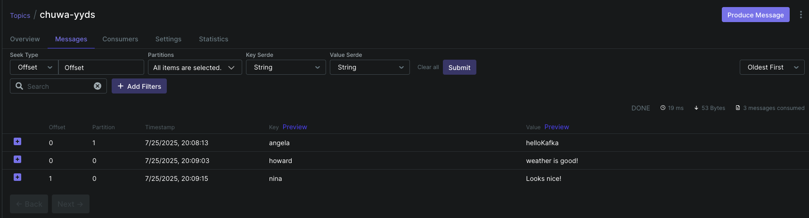
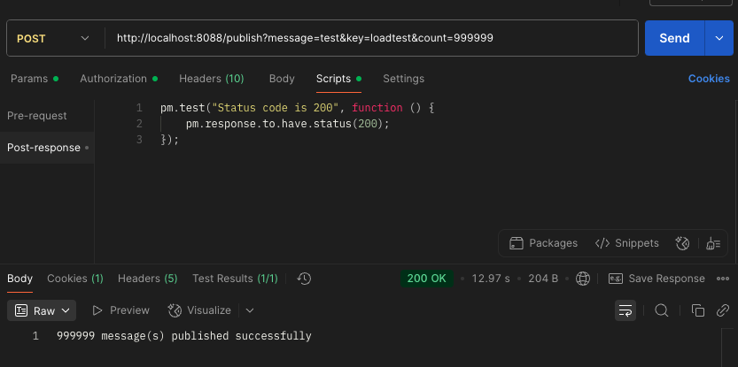
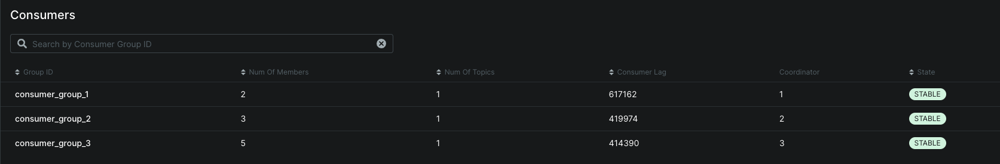
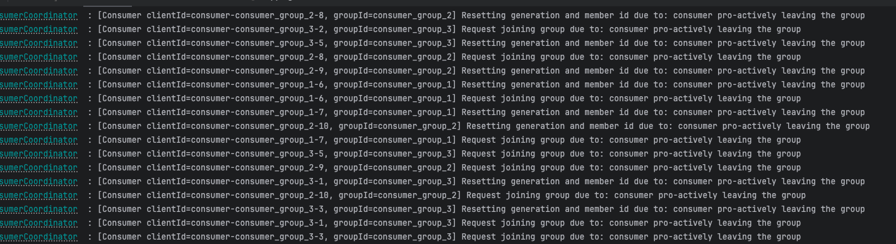
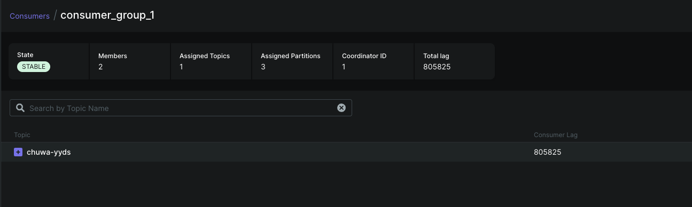
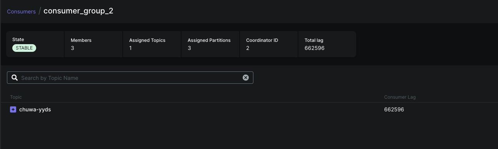
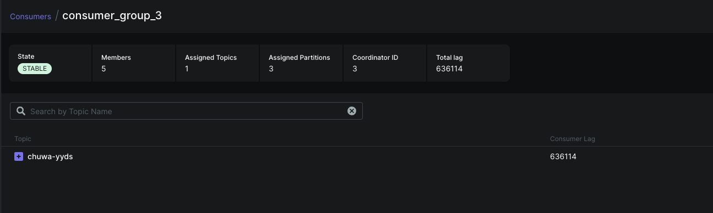
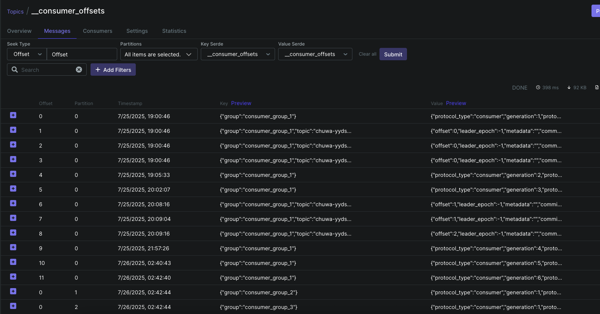

# Explain following concepts, and how they coordinate with each other:

## 1. **Topic**
- A *Topic* is a logical channel to which records (messages) are published.
- Think of it as a category or feed name, e.g., `"user-signups"` or `"order-events"`.

## 2. **Partition**
- Topics are split into one or more *Partitions* to enable parallelism and scalability.
- Each partition is an ordered, immutable sequence of records with a unique offset.
- Example: Topic "orders" may have 3 partitions distributed across brokers.

## 3. **Broker**
- A *Broker* is a Kafka server that stores topic data and serves client requests.
- A Kafka cluster consists of multiple brokers; each handles some partitions.

## 4. **Producer**
- A *Producer* is a client that writes (publishes) data to Kafka topics.
- Producers decide which partition to write to (based on key or round-robin).

## 5. **Consumer Group**
- A *Consumer Group* is a set of consumers that work together to read data from a topic.
- Kafka guarantees that each partition is read by **only one consumer in the group**.

## 6. **Offset**
- *Offset* is the unique ID for each record within a partition.
- Consumers use offsets to keep track of which messages they have read.

## 7. **Zookeeper**
- *Zookeeper* coordinates and manages Kafka metadata (e.g., broker info, controller election).
- Kafka 2.x uses Zookeeper, but newer Kafka (KRaft mode) can run without it.

---

## How They Work Together

1. **Producers** send messages to a **Topic**, which is split into **Partitions**.
2. Each **Partition** is stored on a **Broker**.
3. **Consumers** (grouped into **Consumer Groups**) read messages from partitions using **Offsets** to track progress.
4. **Zookeeper** helps manage cluster metadata and keeps brokers in sync (in older versions).

---

**1. Given N (number of partitions) and M (number of consumers,) what will happen when N>=M and N<M respectively?**

- **N ≥ M** (more partitions than consumers):
  - Some consumers will read from **multiple partitions**.
  - All partitions are consumed, good parallelism.

- **N < M** (more consumers than partitions):
  - Some consumers will be **idle**.
  - Kafka allows only **one consumer per partition** within a consumer group.

---

**2. How do brokers work with topics?**

- A *Kafka broker* hosts topic **partitions** and handles read/write requests.
- Each broker stores a subset of topic partitions.
- Kafka auto-balances partitions across brokers for **high availability and scalability**.
- One broker is the **leader** for each partition; others are replicas.

---

**3. Are messages pushed to consumers or consumers pull messages from topics?**

- Kafka uses a **pull model**.
- Consumers **pull** (poll) messages from brokers at their own pace.
- This gives better control over backpressure and processing rate.

---

**4. How to avoid duplicate consumption of messages?**

- Use **idempotent processing** on the consumer side.
- Ensure **offsets are committed only after successful processing**.
- Optionally use **Kafka’s transactional API** to ensure exactly-once semantics.

---

**5. What will happen if some consumers are down in a consumer group? Will data loss occur?Why?**

- Kafka will **rebalance** the consumer group.
- Remaining consumers will take over the lost consumer's partitions.
- **No data loss** if offsets are managed correctly and messages are not expired (within retention).

---

**6. What will happen if an entire consumer group is down? Will data loss occur? Why?**

- Kafka retains messages based on the topic's **retention policy** (e.g., 7 days).
- Once consumers come back, they can **resume from last committed offset**.
- **No data loss**, assuming retention window hasn’t expired.

---

**7. Explain consumer lag and how to resolve it?**

- **Consumer lag** means difference between the latest offset in a partition and the consumer's last committed offset.
- High lag is consumer is falling behind.
- Resolve by:
  - Scaling consumers (add more)
  - Speeding up processing
  - Ensuring no external bottlenecks (e.g., DB writes)

---

**8. Explain how Kafka tracks message delivery?**

- Kafka does **not track delivery status per message**.
- Responsibility is with **consumer offsets**:
  - Committed offsets = successfully processed messages.
  - Stored in Kafka (`__consumer_offsets` topic) or externally.
- Reliability is based on **consumer commit logic + retention policy**.

---

**9. Compare Kafka vs RabbitMQ, compare messageing frameworks vs MySql (Why Kafka)?**

| Feature               | Kafka                         | RabbitMQ                       | MySQL                        |
|----------------------|-------------------------------|--------------------------------|------------------------------|
| Model                | Distributed log (Pub/Sub)     | Message queue (Broker-based)   | Relational database          |
| Performance          | High throughput, scalable     | Lower throughput               | Not designed for streaming   |
| Message Ordering     | Per partition                 | Global (but weaker guarantees) | Not message-focused          |
| Replay Capability    | Yes (via offset rewind)       | Limited (requires persistence) | No native replay             |
| Persistence          | Long-term storage (log)       | Temporary (optional persistence) | Disk-based storage       |
| Use Case             | Streaming, pipelines, big data| Task queues, RPC, small apps   | Transactional data storage   |

> **Why Kafka?**  
> Ideal for large-scale, real-time data pipelines, log processing, and stream processing.  
> Decouples producers/consumers with high durability, ordering, and replayability.

---

**10. On top of https://github.com/CTYue/Spring-Producer-Consumer**
  - **Write your consumer application with Spring Kafka dependency, set up 3 consumers in a single consumer group. Prove message consumption with screenshots.**
  
  
  

  - **Increase number of consumers in a single consumer group, observe what happens, explain your observation.**
    - Only 3 consumers actively assigned partitions
    - 1 consumer is idle, doing nothing
    - Consumers tab will show Active Consumers = 4, but only 3 assigned
    - Topic chuwa-yyds has 3 partitions
    - Each partition in a topic can be assigned to only one consumer in a consumer group at a time

  - **Create multiple consumer groups using Spring Kafka, set up different numbers of consumers within each group, observe consumer offset,**
  
    I created three Spring Kafka consumer groups with different numbers of consumers:
    `KafkaConsumerConfig.java`
    ```java
      @Bean
      public ConcurrentKafkaListenerContainerFactory<String, String> kafkaListenerContainerFactory1() {
          ConcurrentKafkaListenerContainerFactory<String, String> factory =
                  new ConcurrentKafkaListenerContainerFactory<>();
          factory.setConsumerFactory(consumerFactory());
          factory.setConcurrency(2); // Set from application.yml or default
          return factory;
      }

      @Bean
      public ConcurrentKafkaListenerContainerFactory<String, String> kafkaListenerContainerFactory2() {
          ConcurrentKafkaListenerContainerFactory<String, String> factory =
                  new ConcurrentKafkaListenerContainerFactory<>();
          factory.setConsumerFactory(consumerFactory());
          factory.setConcurrency(3); // Set from application.yml or default
          return factory;
      }

      @Bean
      public ConcurrentKafkaListenerContainerFactory<String, String> kafkaListenerContainerFactory3() {
          ConcurrentKafkaListenerContainerFactory<String, String> factory =
                  new ConcurrentKafkaListenerContainerFactory<>();
          factory.setConsumerFactory(consumerFactory());
          factory.setConcurrency(5); // Set from application.yml or default
          return factory;
      }
    ```
    - Each consumer group independently consumes all messages from the topic `chuwa-yyds`.
    `KafkaConsumerService.java`
    ```java
        @KafkaListener(
            topics = "${kafka.topic.name}",
            groupId = "consumer_group_1",
            containerFactory = "kafkaListenerContainerFactory1"
        )
        public void consumeGroup1(String message) {
            System.out.println("Group1: " + message);
        }

        @KafkaListener(
                topics = "${kafka.topic.name}",
                groupId = "consumer_group_2",
                containerFactory = "kafkaListenerContainerFactory2"
        )

        public void consumeGroup2(String message) {
            System.out.println("Group2: " + message);
        }

        @KafkaListener(
                topics = "${kafka.topic.name}",
                groupId = "consumer_group_3",
                containerFactory = "kafkaListenerContainerFactory3"
        )
        public void consumeGroup3(String message) {
            System.out.println("Group3: " + message);
        }
    ```
    `KafkaController.java`
    ```java 
      @PostMapping("/publish")
      public String publishMessage(
              @RequestParam("key") String key,
              @RequestParam("message") String message,
              @RequestParam(value = "count", required = false, defaultValue = "1") int count) {

          for (int i = 0; i < count; i++) {
              kafkaProducerService.sendMessage(key + "-" + i, message + " #" + i);
          }
          return count + " message(s) published successfully";
      }

    ```
    - Publish the message
    
    - The **consumer offset** for each group progresses independently.
    
    - This behavior is expected because fewer consumers process messages more slowly, leading to higher lag.
    - Kafka does not duplicate messages across consumers within the same group, so partition load isn't shared beyond the consumer count.
    - More consumers → more parallelism → faster processing (up to the number of partitions).

  - **Prove that each consumer group is consuming messages on topics as expected, take screenshots of offset records,**
    
    
    
    
    

  - **Demo different message delivery guarantees in Kafka, with necessary code or configuration changes.**

  
  - **Write your own partitioning logic, to demo your messages will be assigned to different brokers, or you can also demo kafka's default round-robin paritioning logic, with code changes. Note: There's already a docker compose file in above git repo, you can start the 3 brokers (with zookeep) using docker-compose up command.**