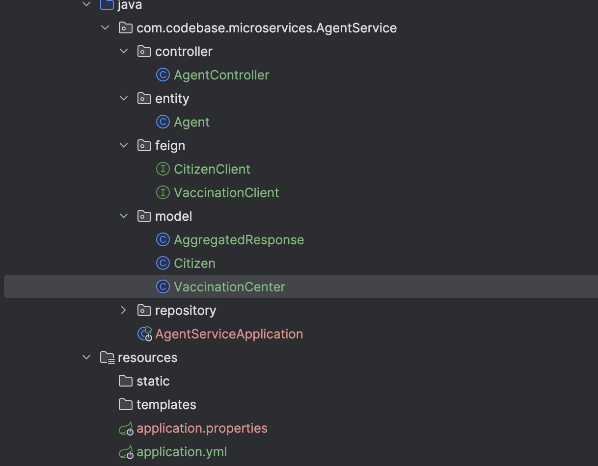
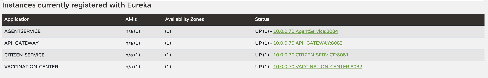
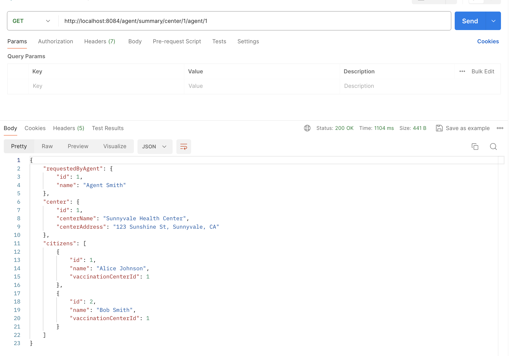
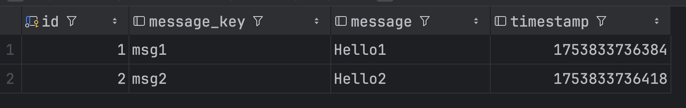

# Ryan Ma HW17 Answers

### 1. [microservice repo](https://github.com/CTYue/microservices): Create a new service called  AgentService and register it to Eureka server and API gateway. use open feign  in AgentService to make calls to both CitizenService and VaccinationService (any endpoint is fine). (create your database record as needed). Share your screen shot in markdown file.
1.1 Code Structure

1.2 Kafka Server

1.3 Controller
```java
package com.codebase.microservices.AgentService.controller;

import com.codebase.microservices.AgentService.entity.Agent;
import com.codebase.microservices.AgentService.feign.CitizenClient;
import com.codebase.microservices.AgentService.feign.VaccinationClient;
import com.codebase.microservices.AgentService.model.AggregatedResponse;
import com.codebase.microservices.AgentService.model.Citizen;
import com.codebase.microservices.AgentService.model.VaccinationCenter;
import com.codebase.microservices.AgentService.repository.AgentRepository;
import org.springframework.beans.factory.annotation.Autowired;
import org.springframework.http.HttpStatus;
import org.springframework.http.ResponseEntity;
import org.springframework.web.bind.annotation.*;

import java.util.List;

@RestController
@RequestMapping("/agent")
public class AgentController {

    @Autowired
    private AgentRepository agentRepository;

    @Autowired
    private CitizenClient citizenClient;

    @Autowired
    private VaccinationClient vaccinationClient;

    @PostMapping("/add")
    public ResponseEntity<Agent> addAgent(@RequestBody Agent newAgent) {
        Agent agent = agentRepository.save(newAgent);
        return  new ResponseEntity<>(agent, HttpStatus.OK);
    }

    @GetMapping("/summary/center/{centerId}/agent/{agentId}")
    public AggregatedResponse getSummary(
            @PathVariable int centerId,
            @PathVariable int agentId) {

        AggregatedResponse response = new AggregatedResponse();

        Agent agent = agentRepository.findById(agentId).orElse(null);
        response.setRequestedByAgent(agent);

        VaccinationCenter center = vaccinationClient.getCenterOnlyById(centerId);
        response.setCenter(center);

        List<Citizen> citizens = citizenClient.getCitizensByCenterId(centerId);
        response.setCitizens(citizens);

        return response;
    }
}
```
1.4 Postman Screenshot


### 2.[kafka repo](https://github.com/CTYue/Spring-Producer-Consumer.git): Create your database/DAO and save the message in the  consumer. Implement both At-Least-Once and At-Most-Once.Share your screenshot in the markdown file.
- AT Least Once example:

2.1 Entity Class
```java
package com.chuwa.demo.entity;

import jakarta.persistence.*;
import lombok.AllArgsConstructor;
import lombok.Data;
import lombok.NoArgsConstructor;


@Entity
@Data
@AllArgsConstructor
@NoArgsConstructor
public class KafkaMessage {

    @Id
    @GeneratedValue(strategy = GenerationType.IDENTITY)
    private Long id;

    @Column(name = "message_key")
    private String key;
    private String message;
    private Long timestamp;

}
```
2.2 Repository
```java
package com.chuwa.demo.repository;

import com.chuwa.demo.entity.KafkaMessage;
import org.springframework.data.jpa.repository.JpaRepository;


public interface KafkaMessageRepository extends JpaRepository<KafkaMessage, Long> {
}
```
2.3 ConsumerService
```java
package com.chuwa.demo.service;


import com.chuwa.demo.entity.KafkaMessage;
import com.chuwa.demo.repository.KafkaMessageRepository;
import org.apache.kafka.clients.consumer.ConsumerRecord;
import org.springframework.beans.factory.annotation.Autowired;
import org.springframework.kafka.annotation.KafkaListener;
import org.springframework.kafka.support.Acknowledgment;
import org.springframework.stereotype.Service;


@Service
public class KafkaConsumerService {

    @Autowired
    private KafkaMessageRepository kafkaMessageRepository;

    @KafkaListener(topics = "${kafka.topic.name}", groupId = "${spring.kafka.consumer.group-id}")
    public void listenGroupFoo(ConsumerRecord<String, String> record, Acknowledgment ack) {

        try {
            System.out.println(">>> Consumed message: key=" + record.key() + ", value=" + record.value());

            //process and persist message
            KafkaMessage kafkaMessage = new  KafkaMessage();

            kafkaMessage.setKey(record.key());
            kafkaMessage.setMessage(record.value());
            kafkaMessage.setTimestamp(System.currentTimeMillis());

            KafkaMessage out = kafkaMessageRepository.save(kafkaMessage);

            System.out.println("record from database =======" + out.getMessage());
            ack.acknowledge();

        } catch (Exception e) {
            System.err.println("Failed to process message" + e.getMessage());
        }
    }

}
```
2.4 application.properties
```properties
spring.application.name=Spring-Producer-Consumer
spring.kafka.bootstrap-servers=localhost:9092
spring.kafka.producer.key-serializer=org.apache.kafka.common.serialization.StringSerializer
spring.kafka.producer.value-serializer=org.apache.kafka.common.serialization.StringSerializer
kafka.topic.name=chuwa-yyds
spring.kafka.consumer.group-id=consumer_group_1

spring.kafka.consumer.enable-auto-commit=false
spring.kafka.consumer.auto-offset-reset=earliest
spring.kafka.listener.ack-mode=manual

spring.datasource.url=jdbc:mysql://localhost:3306/kafka_demo?useSSL=false&serverTimezone=UTC
spring.datasource.username=root
spring.datasource.password=ownpassword

# hibernate properties
spring.jpa.hibernate.ddl-auto=update

#Setup port for this Spring application
server.port=8088
```
2.5 Api Calling
```bash
 for i in {1..2}; do                                
  curl --location --request POST "http://localhost:8088/publish?message=Hello$i&key=msg$i"
done
```
2.6 Screenshot:

