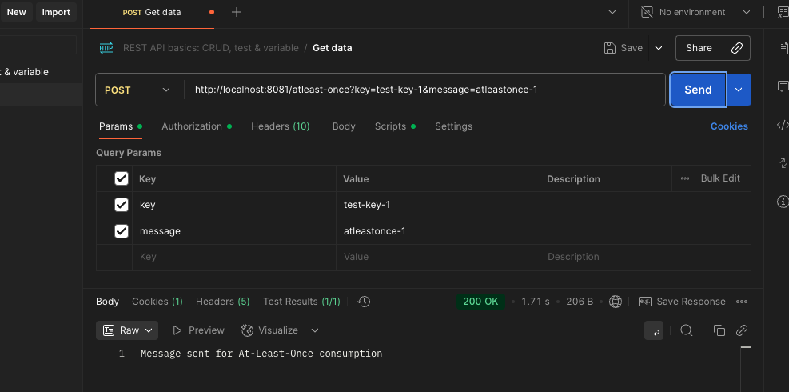
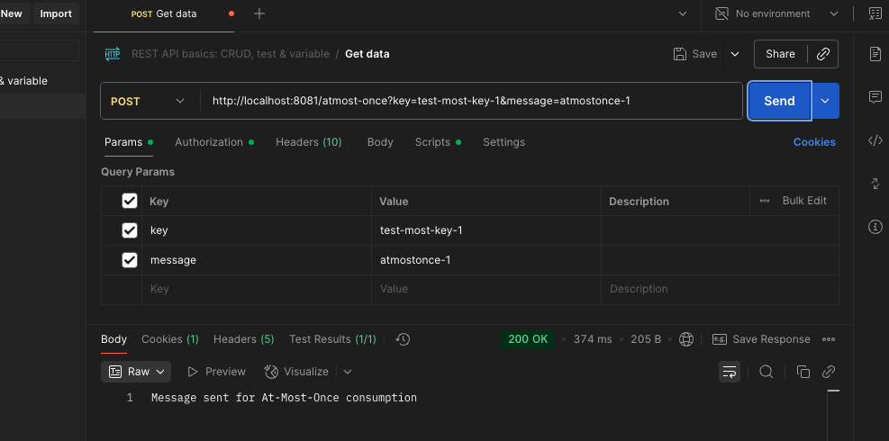
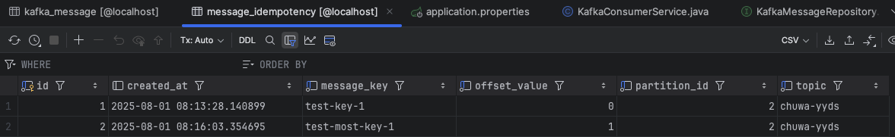
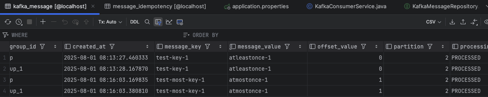

1. microservice repo: Create a new service called  `AgentService` and register it to `Euraka server` and `API gateway`. use open feign  in `AgentService` to make calls to both `CitizenService` and `VaccinationService`(any endpoint is fine).(create your database record as needed)


---
kafka repo: create your database/DAO and save the message in the  consumer. implement both At-Least-Once and At-Most-Once.  
share your screen shot in the markdown file

### At-Least-Once
- Message is acknowledged **after** processing.
- Guarantees **no message is lost**, but may process duplicates.
- Stored in `kafka_message` table.

### At-Most-Once
- Message is acknowledged **before** processing.
- Guarantees **no duplicates**, but message may be lost if processing fails.
- Idempotency enforced via `message_idempotency` table.

1. **Send At-Least-Once message**  
   `POST http://localhost:8081/atleast-once?key=test-key-1&message=atleastonce-1`

2. **Send At-Most-Once message**  
   `POST http://localhost:8081/atmost-once?key=test-most-key-1&message=atmostonce-1`

```java
 @Bean(name = "atLeastOnceListenerContainerFactory")
    public ConcurrentKafkaListenerContainerFactory<String, String> atLeastOnceListenerContainerFactory() {
        ConcurrentKafkaListenerContainerFactory<String, String> factory =
                new ConcurrentKafkaListenerContainerFactory<>();
        factory.getContainerProperties().setAckMode(ContainerProperties.AckMode.MANUAL); // At-Least-Once
        factory.setConsumerFactory(consumerFactory());
        factory.setConcurrency(4);

        return factory;
    }

    @Bean(name = "atMostOnceListenerContainerFactory")
    public ConcurrentKafkaListenerContainerFactory<String, String> atMostOnceListenerContainerFactory() {
        ConcurrentKafkaListenerContainerFactory<String, String> factory =
                new ConcurrentKafkaListenerContainerFactory<>();
        factory.setConsumerFactory(atMostOnceConsumerFactory());
        factory.setConcurrency(2);
        factory.getContainerProperties().setAckMode(ContainerProperties.AckMode.MANUAL_IMMEDIATE); // At-Most-Once
        return factory;
    }

    @Bean
    public ConsumerFactory<String, String> consumerFactory() {
        Map<String, Object> props = new HashMap<>();
        props.put(ConsumerConfig.BOOTSTRAP_SERVERS_CONFIG, bootstrapServers);
        props.put(ConsumerConfig.KEY_DESERIALIZER_CLASS_CONFIG, StringDeserializer.class);
        props.put(ConsumerConfig.VALUE_DESERIALIZER_CLASS_CONFIG, StringDeserializer.class);
        props.put(ConsumerConfig.GROUP_ID_CONFIG, consumerGroupId);
        // Manual commit
        props.put(ConsumerConfig.AUTO_OFFSET_RESET_CONFIG, "earliest");

        return new DefaultKafkaConsumerFactory<>(props);
    }

    // Separate factory for At-Most-Once delivery
    @Bean
    public ConsumerFactory<String, String> atMostOnceConsumerFactory() {
        Map<String, Object> props = new HashMap<>();
        props.put(ConsumerConfig.BOOTSTRAP_SERVERS_CONFIG, bootstrapServers);
        props.put(ConsumerConfig.GROUP_ID_CONFIG, consumerGroupId + "-at-most-once");
        props.put(ConsumerConfig.KEY_DESERIALIZER_CLASS_CONFIG, StringDeserializer.class);
        props.put(ConsumerConfig.VALUE_DESERIALIZER_CLASS_CONFIG, StringDeserializer.class);

        // At-Most-Once delivery configuration
        props.put(ConsumerConfig.ENABLE_AUTO_COMMIT_CONFIG, false); // Auto commit
        props.put(ConsumerConfig.AUTO_COMMIT_INTERVAL_MS_CONFIG, 1000);
        props.put(ConsumerConfig.AUTO_OFFSET_RESET_CONFIG, "earliest");

        return new DefaultKafkaConsumerFactory<>(props);
    }
```

    
    
    
    