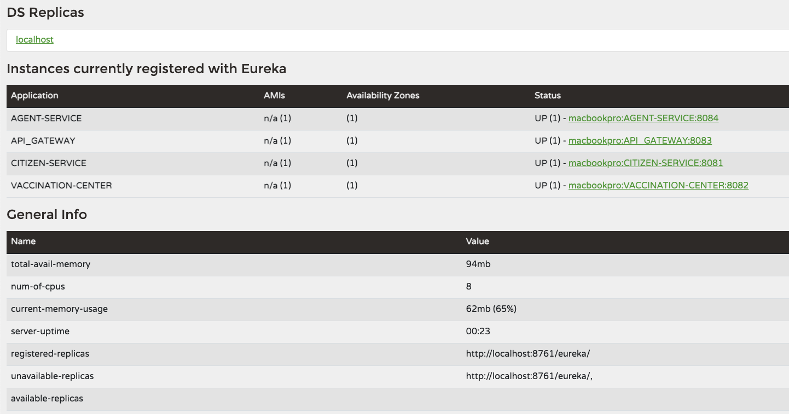
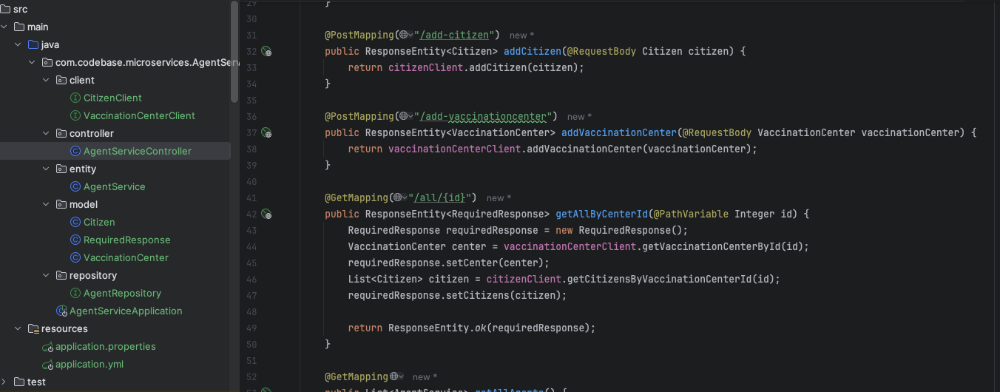
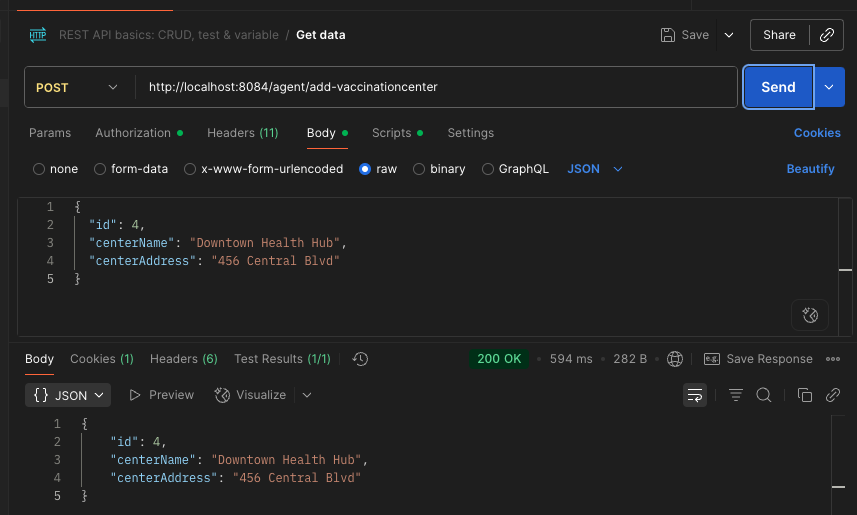
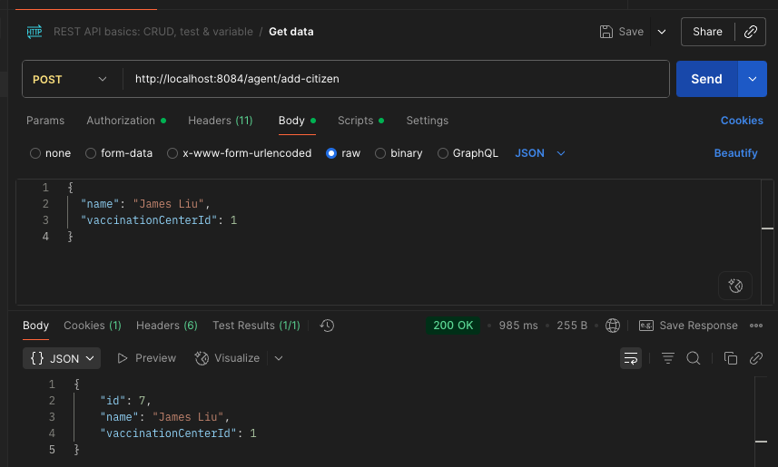
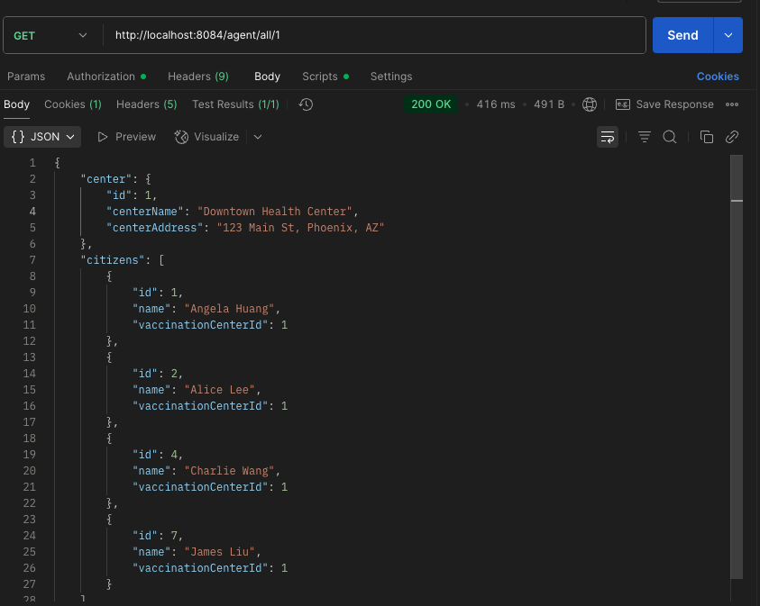

1. microservice repo: Create a new service called  `AgentService` and register it to `Euraka server` and `API gateway`. use open feign  in `AgentService` to make calls to both `CitizenService` and `VaccinationService`(any endpoint is fine).(create your database record as needed)

---
kafka repo: create your database/DAO and save the message in the  consumer. implement both At-Least-Once and At-Most-Once.  
share your screen shot in the markdown file