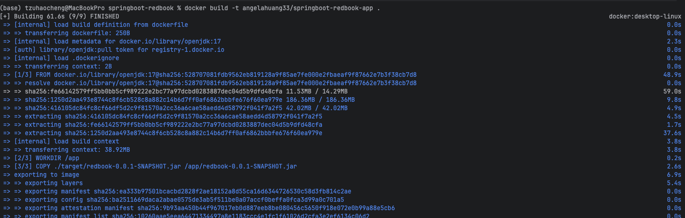
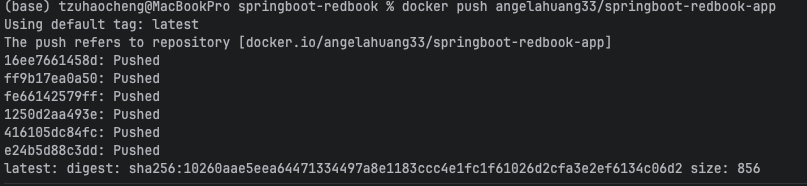
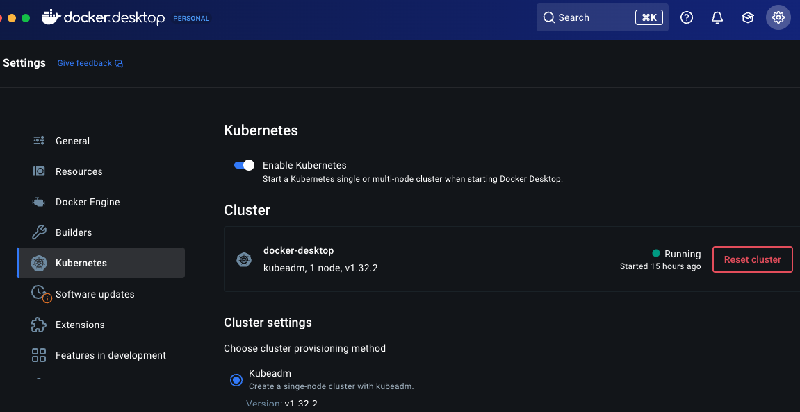
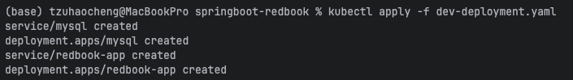
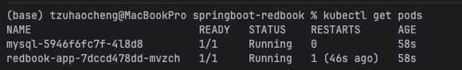
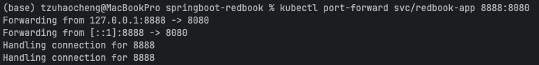
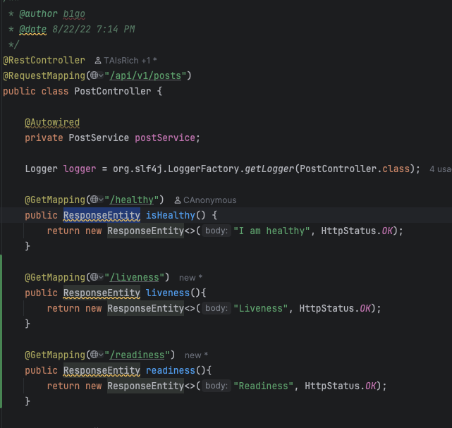
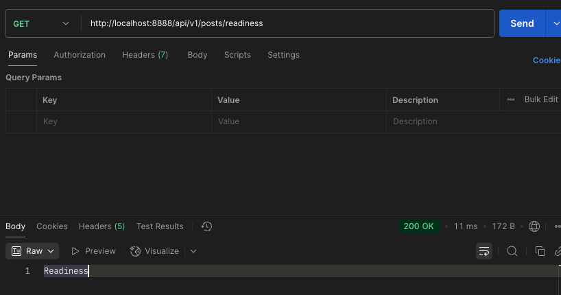
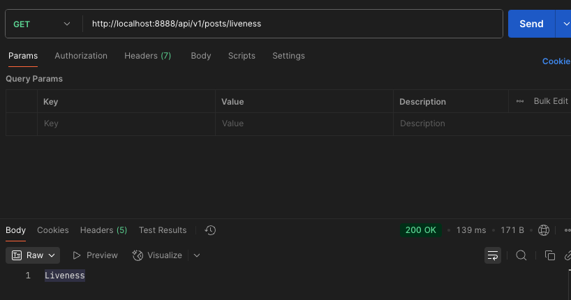

**3. Dockerize Spring-redbook application using https://github.com/CTYue/springboot-redbook/tree/docker**

Start your local kubernetes and deploy above dockerized image to it, with dev-deployment.yaml. 
The dev-deployment.yaml may not work, please update it accordingly.
Please do some research on how to start docker-kubernetes context.

Containerizing and deploying the springboot-redbook application to a local Kubernetes cluster.

**STEP-BY-STEP**

1. Update `application.properties` 

```properties
spring.datasource.url=jdbc:mysql://mysql:3306/redbook?allowPublicKeyRetrieval=true&useSSL=false&serverTimezone=UTC
spring.datasource.username=root
spring.datasource.password=secret
management.endpoint.health.probes.enabled=true
```

2. Build the Image: Create a Docker image from the application code.


3. Push to Registry: Push the newly created image to your Docker Hub repository.


4. Start Kubernetes: Enable the Kubernetes cluster in Docker Desktop settings.


5. Update `dev-deployment.yaml`: Ensure the deployment file uses your Docker image and includes the liveness and readiness probes.

6. Apply Deployment: Apply the Kubernetes manifest files to create the deployments for the application and the MySQL database.



7. Check Pod Status: Confirm that all pods are running successfully.



8. Port-Forward to Access: Use port-forwarding to access the application on your local machine.

You can now access the application at http://localhost:8888.





**Result**





