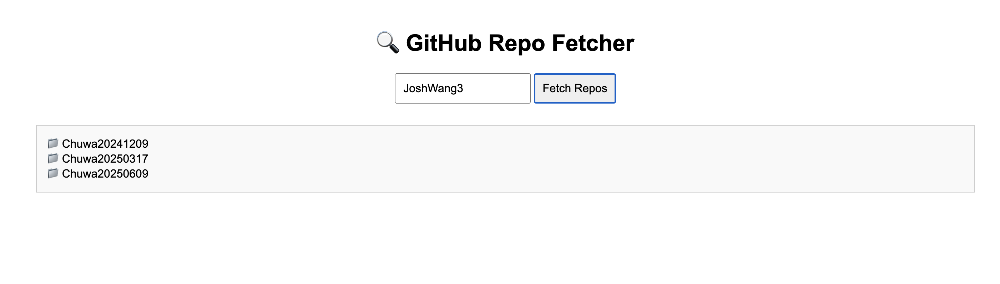

# Ryan Ma HW17 Answers

### 1. Read and practice all sample codes from 71-Dom-Bom-JavaScript-Typescript-Node.md on your local browser or an online compiler.
Done

### 2. Resolve 5 Leetcode problems using Javascript.
Done

### 3. Compare let vs var , explain variable hosting with your own code examples.
3.1 Comparison

| Feature                  | `var`                                      | `let`                                                   |
|--------------------------|--------------------------------------------|---------------------------------------------------------|
| Scope                    | Function-scoped                            | Block-scoped                                            |
| Hoisting                 | Hoisted and initialized with `undefined`   | Hoisted but **not initialized** (TDZ)                   |
| Redeclaration            | Allowed within the same scope              | **Not** allowed within the same scope                   |
| Global object binding    | Becomes a property of `window` in browsers | Does **not** bind to `window`                           |
| Temporal Dead Zone (TDZ) | No TDZ                                     | Has TDZ (ReferenceError if accessed before declaration) |

3.2 Variable Hosting
- var: JS moves var c to the top internally. So it's "hoisted" and initialized as undefined.
```javascript
console.log(c); // ✅ undefined
var c = 5;
```
- let: JS hoists let d, but does not initialize it. This period before initialization is called the Temporal Dead Zone (TDZ).
```javascript
console.log(d); // ❌ ReferenceError: Cannot access 'd' before initialization
let d = 10;
```

### 4. Explain closure with code example
4.1 What is closure?
- A closure is when a function remembers and accesses variables from its outer scope, even after that outer function has finished executing.

4.2 Code Example
```javascript
function outer() {
  let counter = 0;
  
  function inner() {
    counter++;
    console.log(counter);
  }

  return inner;
}

const countUp = outer(); // outer() returns inner

countUp(); // 1
countUp(); // 2
countUp(); // 3

```
- When outer() is called, it creates a variable counter and defines inner().
- It returns the inner() function.
- Even though outer() has finished running, the inner() function still has access to counter.
- That’s because of the closure — inner() "closes over" the counter variable.

### 5. Explain Callback Hell with code example
5.1 What is CallBack Hell?
- Callback Hell happens when callbacks are nested within callbacks, forming a pyramid-like structure that is:
  - Hard to read
  - Hard to debug
  - Hard to maintain
- It’s very common in older asynchronous JavaScript code using functions like setTimeout, AJAX, or file I/O (e.g. in Node.js).

5.2 Code Example
```javascript
loginUser('ryan', 'password', function(user) {
    getUserPosts(user.id, function(posts) {
        getPostComments(posts[0].id, function(comments) {
            saveToLocalCache(comments, function() {
                console.log("All done!");
            });
        });
    });
});

```

### 6. Explain Promise , Async , Await with code examples.
6.1 Promise
- A Promise is an object representing the eventual result (or failure) of an asynchronous operation.
```javascript
function loginUser(username, password) {
  return new Promise((resolve, reject) => {
    setTimeout(() => resolve({ id: 1, username }), 1000);
  });
}

function getUserPosts(userId) {
  return new Promise((resolve) => {
    setTimeout(() => resolve([{ id: 101, title: "Post A" }]), 1000);
  });
}

function getPostComments(postId) {
  return new Promise((resolve) => {
    setTimeout(() => resolve(["Nice!", "Great post!"]), 1000);
  });
}

function saveToLocalCache(data) {
  return new Promise((resolve) => {
    setTimeout(() => {
      console.log("Data cached:", data);
      resolve();
    }, 1000);
  });
}

loginUser('ryan', 'password')
    .then(user => getUserPosts(user.id))
    .then(posts => getPostComments(posts[0].id))
    .then(comments => saveToLocalCache(comments))
    .then(() => console.log("All done!"))
    .catch(err => console.error(err));

```
6.2 async/await
- async is a keyword that marks a function as asynchronous — it always returns a Promise.
- await pauses the execution of an async function until the awaited Promise resolves.
```javascript
async function handleFlow() {
  try {
    const user = await loginUser('ryan', 'password');
    const posts = await getUserPosts(user.id);
    const comments = await getPostComments(posts[0].id);
    await saveToLocalCache(comments);

    console.log("All done!");
  } catch (err) {
    console.error("Error:", err);
  }
}

handleFlow();

```

### 7. Write an HTML page that generates a lucky number based on the date, time, and user inputs. 
Users should be able to get their random lucky numbers by clicking a button or using the enter key after typing the input.


### 8. Write an HTML page that returns a user's GitHub repos (https://api.github.com/users/{user_id}/repos) in
JSON format. The web page should have a text box and a submit button where users can provide the
GitHub user ID. The fetch call should be asynchronous. If the call to the above API fails for any reason, you
should return a customized, user-friendly error message. If you know more than one approach to
implement the asynchronous call, please do it using different approaches.


### 9. Explain how Javascript implement asynchronous non-blocking feature, particularly: Event Loop, Macrotask, and Microtask with code samples.
| Concept          | Description                                                           |
|------------------|-----------------------------------------------------------------------|
| **Call Stack**   | Executes sync code line by line                                       |
| **Event Loop**   | Coordinates the execution of sync and async tasks                     |
| **Microtasks**   | Promise `.then`, `queueMicrotask` — high priority                     |
| **Macrotasks**   | `setTimeout`, `setInterval`, `DOM events` — lower priority            |
| **Non-blocking** | Long-running tasks offloaded (e.g. timers, network) — JS doesn’t wait |

```javascript
console.log("script start");

setTimeout(() => {
  console.log("setTimeout");  // 🟢 Macrotask
}, 0);

Promise.resolve().then(() => {
  console.log("promise 1");   // 🔴 Microtask
}).then(() => {
  console.log("promise 2");   // 🔴 Microtask
});

console.log("script end");

```
```text
script start
script end
promise 1
promise 2
setTimeout

```