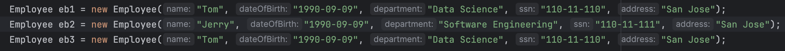
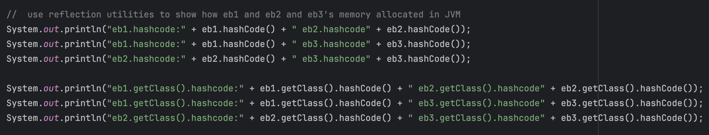
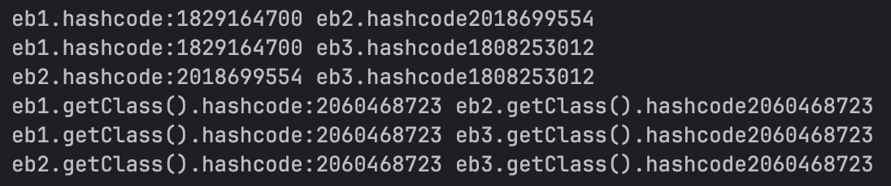

# Ryan Ma HW2 Short questions and Screenshots


## 2. Write code to instantiate at least two instances of above Employee class, use code snippets to explain how these Employee objects are allocated to JVM memory. You may use java utilities to demonstrate it.
- Create Three instances of Employee

- According to the .hashCode(), eb1, eb2 and eb3 have different hash values because they hold different (or possibly same) data
and represent distinct objects in the JVM heap memory.

- According to the .getClass().hashCode(), all three objects share the same class metadata, which is loaded once and shared across instances.
Therefore, their .getClass() returns the same class object, resulting in the same hash code. This class metadata is stored in the JVM's method area.


## 4. Explain why global variables are NOT recommended
- Any part of the program can access or modify the global variable.
Makes it hard to track who changed what, when.
- In multithreaded applications, global variables can lead to race conditions unless synchronized.
You might read/update a value while another thread is modifying it.

## 5. Explain why Strings in Java are considered "Immutable"?
- String Literal are stored in a special memory called the string constant pool in heap memory.

### 6. Write code snippets to explain what does 'Final' keyword do, and why we need it?
- Prevent modification of variable, method or class
- It improve code safety, readability, and design correctness.
```java
public class FinalWork {
    public static void main(String[] args) {
        final int goodEmployee = 10;
        // goodEmployee = 20; it can not reassign;
    }
}
```

### 7. Write code snippets to explain why Java is "pass-by-value", and why does some people think it might be "pass-by-reference"?
- Java is pass-by-value even for objects, the value of the reference is passed.
- People confuse this because you can modify object internals, but you cannot reassign the caller's reference inside a method.
```java
public class PassValue {
    public static void changeNumber(int x) {
        x = 100;
    }

    public static void main(String[] args) {
        int a = 10;
        changeNumber(a);
        System.out.println(a); // Output is 10
    }
}

```

### 8. Write code snippets to explain overloading in Java, explain how does java define method signature.
- Method overloading means defining multiple methods with the same name in the same class, but with different parameter lists.
- A method's signature = its name + parameter types (Return type is not part of the signature)
```java
public class OverloadPractice {
    public static class Practice {
        public int add(int a, int b) {
            return a + b;
        }

        public String add(String a, int b) {
            return a + b;
        }

        public String add(String a, String b) {
            return a + b;
        }
    }

    public static void main(String[] args) {
        Practice p1 = new Practice();
        System.out.println(p1.add(1, 2));
        System.out.println(p1.add("a", 3));
        System.out.println(p1.add("a", "b"));
    }
}
```
