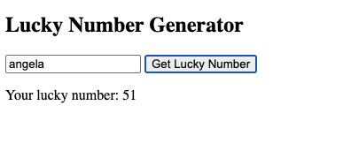
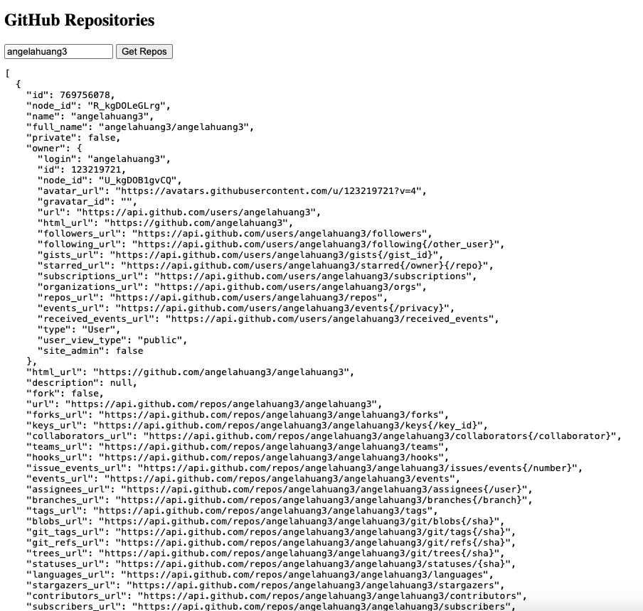

**1. Read and practice all sample codes from 71-Dom-Bom-JavaScript-Typescript-Node.md on your local browser or an online compiler.**

---

**2. Resolve 5 leetcode problems using Javascript.**
1. Two Sum
```javascript
function twoSum(nums, target){
    const idx = new Map();
    for(let i = 0; i < nums.length; i++){
        const need = target - nums[i];
        if(idx.has(need)) return [idx.get(need), i];
        idx.set(nums[i], i);
    }
    return [];
}
```

2. Valid Parentheses 
```javascript
function isValid(s){
    const map = {')':'(', ']':'[', '}':'{'};
    const st = [];
    for(const ch of s){
        if(ch in map){
            if(st.pop() != map[ch]) return false;
        } else {
            st.push(ch);
        }
    }
    return st.length === 0;
}
```

3. Merge Intervals
```javascript
function merge(intervals){
    intervals.sort((a, b) => a[0]-b[0]);
    const res = [];
    for(const [s,e] of intervals) {
    if (!res.length || s > res[res.length-1][1]) {
      res.push([s,e]);
    } else {
      res[res.length-1][1] = Math.max(res[res.length-1][1], e);
    }
  }
  return res;
}

```

4. Longest Substring Without Repeating Characters (Sliding Window) 
```javascript
function lengthOfLongestSubstring(s) {
  const last = new Map();
  let left = 0, best = 0;
  for (let right = 0; right < s.length; right++) {
    const ch = s[right];
    if (last.has(ch) && last.get(ch) >= left) left = last.get(ch) + 1;
    last.set(ch, right);
    best = Math.max(best, right - left + 1);
  }
  return best;
}
```

5. Product of Array Except Self (Prefix/Suffix)
```javascript
function productExceptSelf(nums) {
  const n = nums.length, res = Array(n).fill(1);
  let prefix = 1;
  for (let i = 0; i < n; i++) {
    res[i] = prefix;
    prefix *= nums[i];
  }
  let suffix = 1;
  for (let i = n-1; i >= 0; i--) {
    res[i] *= suffix;
    suffix *= nums[i];
  }
  return res;
}
```

---

**3. Compare let vs var , explain variable hosting with your own code examples.**
var → function-scoped, hoisted & initialized to undefined.
let → block-scoped, hoisted but in temporal dead zone until declared.

```js
function demo() {
  if (true) {
    var a = 1;   // function scoped
    let b = 2;   // block scoped
  }
  console.log(a); // 1
  // console.log(b); // ReferenceError: b is not defined
}
demo();
```

---

**4. Explain closure with code example**
Function remembers variables from outer scope even after that scope ends.
```js
function counter() {
  let c = 0;
  return () => ++c;
}
const inc = counter();
inc(); // 1
inc(); // 2
```

---

**5. Explain Callback Hell with code example**
Nested callbacks → unreadable.
```js
step1(data => step2(res => step3(final => console.log(final))));
```
Fix with Promise or async/await.
---

**6. Explain Promise, Async, Await with code examples.**
### **Promise**
- Represents a future value (success/failure).
- States: `pending` → `fulfilled` → `rejected`.
- Avoids callback hell.

```js
const getData = () => new Promise((resolve, reject) => {
  setTimeout(() => resolve("Data received"), 1000);
});

getData()
  .then(data => console.log(data))
  .catch(err => console.error(err));
```

### **Async/Await**
- Syntactic sugar over Promises.
- Makes async code look synchronous.
- await pauses until Promise resolves/rejects.

```js
async function fetchData() {
  try {
    const data = await getData();
    console.log(data);
  } catch (err) {
    console.error(err);
  }
}
fetchData();
```

---

**7. Write an HTML page that generates a lucky number based on the date, time, and user inputs. Users should be able to get their random lucky numbers by clicking a button or using the enter key after typing the input.**

refer to `lucky.html`



---

**8. Write an HTML page that returns a user's GitHub repos (https://api.github.com/users/{user_id}/repos) in JSON format. The web page should have a text box and a submit button where users can provide the GitHub user ID. The fetch call should be asynchronous. If the call to the above API fails for any reason, you should return a customized, user-friendly error message. If you know more than one approach to implement the asynchronous call, please do it using different approaches.**

refer to `githubrepo.html`



---

**9. Explain how Javascript implement asynchronous non-blocking feature**
   **1. Particularly: Event Loop, Macrotask, and Microtask with code samples.**

- JS runs single-threaded on a call stack. Long I/O (timers, network, DOM events) is handed to the Web APIs (browser/Node runtime) so JS doesn’t block.
- When those ops finish, their callbacks are queued. The event loop keeps checking:
  - 1. If the call stack is empty → Drain the microtask queue (Promise jobs, queueMicrotask, MutationObserver) until empty →
  - 2. Take one macrotask (a.k.a. task) from the task queue (setTimeout, setInterval, DOM events, message, some I/O) → repeat.

- Microtask before macrotask
```js
console.log('A');

setTimeout(() => console.log('B (macrotask: timeout 0)'), 0);

Promise.resolve().then(() => console.log('C (microtask: promise)'));

console.log('D');
// Output: A, D, C, B
```

- Draining all microtasks before next macrotask
```js
setTimeout(() => console.log('1) timeout (macrotask)'), 0);

Promise.resolve().then(() => {
  console.log('2) microtask 1');
  queueMicrotask(() => console.log('3) microtask 2'));
});

// Output: 2) microtask 1, 3) microtask 2, 1) timeout
```

- Typical flow with async work
```js
console.log('start');

fetch('https://example.com')                // Web API handles network
  .then(() => console.log('microtask: fetch .then'));

setTimeout(() => console.log('macrotask: timeout'), 0);

console.log('end');
// Output: start, end, microtask: fetch .then, macrotask: timeout
```

- Event loop schedules work.
- Microtasks (Promises, queueMicrotask) run right after the current stack and before any macrotask.
- Macrotasks (timers, I/O, UI events) run one at a time between microtask drains.
This design keeps JS asynchronous and non-blocking while staying single-threaded.