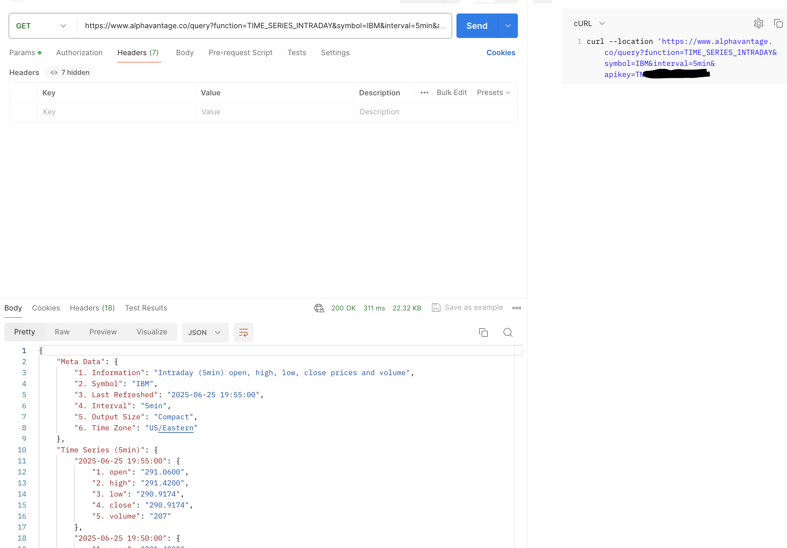

# Ryan Ma HW7 Answers and Sample code


## 1. Explain the concept of API (Application Programming Interface), why do we need APIs.
- An API is a set of rules adn protocols that allows different software applications to communicate with each other.
It defines the methods and data formats that applications can use to request and exchange.
- Modularity: API allows different parts of a system to work independently but still interact with each other.
- Reusability: APIs let developers reuse existing services instead of building from scratch.
- Integration: APIs make it possible for different systems or services work together - for example, integrating Google Maps into a travel app.
- Speed and Efficiency: APIs help developers build apps faster by leveraging existing tools or services.
- Security: APIs provide controlled access to certain parts of a program, allowing safe communication.

## 2. Compare developer API vs application API (normal APIs)
| **Aspect**              | **Developer API**                                                                                    | **Application API (Normal API)**                                       |
|-------------------------|------------------------------------------------------------------------------------------------------|------------------------------------------------------------------------|
| **Audience**            | Used by **developers** to build or extend applications                                               | Used by **applications** to interact with each other                   |
| **Purpose**             | Provides tools or services that developers can integrate into their own code (e.g., SDKs, libraries) | Enables communication between two systems or applications              |
| **Access Level**        | Often runs **inside the developer’s application or environment**                                     | Often connects **external services or systems over a network**         |
| **Examples**            | - Android SDK API  <br> - Java Collections API  <br> - TensorFlow API                                | - Twitter REST API  <br> - Stripe Payments API  <br> - OpenWeather API |
| **Communication Style** | Usually **local/in-process**, function/method calls                                                  | Usually **network-based**, like **HTTP requests/responses**            |
| **Use Case**            | Writing code with access to prebuilt tools                                                           | Consuming data or services provided by other apps or services          |
| **Output**              | Direct function/method results                                                                       | JSON/XML responses over the web                                        |

## 3. Name some different types of APIs
- REST API (HTTP)
- GraphQL API
- gRPC API
- WEB Socket
- MQTT
- MCP
- Soap API

## 4. Compare path variables VS. request parameters in REST API.
| **Aspect**           | **Path Variables** (`/users/{id}`)       | **Request Parameters** (`/users?id=123`)           |
|----------------------|------------------------------------------|----------------------------------------------------|
| **Location**         | Part of the **URL path**                 | Part of the **query string** (after `?`)           |
| **Usage**            | Used to **identify a specific resource** | Used to **filter, sort, or pass optional data**    |
| **Required?**        | Typically **required**                   | Usually **optional**                               |
| **Multiple values?** | Usually only one (per path segment)      | Can have **multiple key-value pairs**              |
| **Semantic Meaning** | Considered part of the **resource URI**  | Considered part of the **resource query/behavior** |

## 5. Explain the different components that make up a REST API and what does each part do?
- URL: The objects or data entities your API manages. It defines what data you are accessing.
- HTTP Methods: Actions that can be performed on resources.

  | Method   | Purpose           | Example              |
  |----------|-------------------|----------------------|
  | `GET`    | Retrieve data     | `GET /products`      |
  | `POST`   | Create a resource | `POST /products`     |
  | `PUT`    | Update/replace    | `PUT /products/5`    |
  | `PATCH`  | Partially update  | `PATCH /products/5`  |
  | `DELETE` | Remove resource   | `DELETE /products/5` |
- Headers: Metadata for the request or response. It can control content format, authentication, caching, etc
- Request Body: The date sent with POST, PUT OR PATCH request. It sends data to crate or update a resource.
- Status Codes: Standard HTTP codes that describe the result of the request.
- Response Body: The data the API sends back.

## 6. Explain what cURL is and why we use API testing tools like Postman instead of testing APIs directly with cURL.
- cURL (short for Client for URLs) is a command-line tool used to make HTTP requests to APIs or Web servers. It allows
you to send GET, POST, PUT, DELETE requests and see the responses directly in the terminal.
- While cURL is powerful API testing tools like Postman offer many advantages.

  | **Feature**                     | **cURL**            | **Postman (and similar tools)**                         |
  |---------------------------------|---------------------|---------------------------------------------------------|
  | **Ease of use**                 | Command-line only   | Graphical UI, easy for beginners                        |
  | **Request history**             | No built-in history | Keeps history, lets you save and group requests         |
  | **Visual response viewer**      | Plain text output   | Formatted JSON, syntax highlighting, status codes, etc. |
  | **Auth management**             | Manual header setup | Built-in OAuth, API key support, pre-request scripts    |
  | **Testing & automation**        | Script-based        | Built-in **test scripts**, environments, variables      |
  | **Collections & documentation** | Manual setup        | Organize requests into shareable collections            |

## 7. List common HTTP status codes and their meanings.
| **Code** | **Category**      | **Meaning**           | **Explanation**                          |
|----------|-------------------|-----------------------|------------------------------------------|
| `100`    | 1xx Informational | Continue              | Request received, continue sending body  |
| `200`    | 2xx Success       | OK                    | Request successful, response included    |
| `201`    | 2xx Success       | Created               | Resource successfully created            |
| `204`    | 2xx Success       | No Content            | Request successful, but no response body |
| `301`    | 3xx Redirection   | Moved Permanently     | Resource has a new permanent URL         |
| `302`    | 3xx Redirection   | Found                 | Resource temporarily moved elsewhere     |
| `304`    | 3xx Redirection   | Not Modified          | Cached version is still valid            |
| `400`    | 4xx Client Error  | Bad Request           | Invalid syntax or parameters             |
| `401`    | 4xx Client Error  | Unauthorized          | Authentication required or failed        |
| `403`    | 4xx Client Error  | Forbidden             | Authenticated but not allowed            |
| `404`    | 4xx Client Error  | Not Found             | Resource does not exist                  |
| `405`    | 4xx Client Error  | Method Not Allowed    | HTTP method not supported for resource   |
| `500`    | 5xx Server Error  | Internal Server Error | Server-side failure                      |
| `502`    | 5xx Server Error  | Bad Gateway           | Invalid response from upstream server    |
| `503`    | 5xx Server Error  | Service Unavailable   | Server overloaded or under maintenance   |
| `504`    | 5xx Server Error  | Gateway Timeout       | Server didn’t respond in time            |

## 8.  List HTTP methods and their meanings, and their expected HTTP status codes.
| **Method** | **Purpose**                           | **Common Status Codes**                     | **Description**                                   |
|------------|---------------------------------------|---------------------------------------------|---------------------------------------------------|
| `GET`      | Retrieve a resource                   | `200 OK`, `404 Not Found`                   | Fetches data without changing it                  |
| `POST`     | Create a new resource                 | `201 Created`, `400 Bad Request`            | Sends data to the server to create something new  |
| `PUT`      | Replace a resource (full update)      | `200 OK`, `204 No Content`, `404 Not Found` | Updates or creates the resource at a specific URI |
| `PATCH`    | Partially update a resource           | `200 OK`, `204 No Content`, `404 Not Found` | Applies partial modifications                     |
| `DELETE`   | Delete a resource                     | `200 OK`, `204 No Content`, `404 Not Found` | Removes a resource                                |
| `HEAD`     | Same as GET but without response body | `200 OK`, `404 Not Found`                   | Used to check if a resource exists                |
| `OPTIONS`  | Discover allowed methods              | `204 No Content`                            | Returns allowed HTTP methods for a resource       |

## 9. Explain why REST API is stateless.
- REST APIs are stateless because each request from a client to the server must contain all the information needed to understand and process that request,
the server does not store any client session or context between request.
    - The server doesn't remember anything about the client between request.
    - Each request is treated as independent and self-contained.
    - if the client needs to maintain state, it must send that state with each request - often using tokens or headers.

## 10. Discuss best practices for REST API design, from performance perspective.
- Use Proper HTTP Methods
  - Stick to REST conventions: GET, POST, PUT, DELETE, etc
- Enable Caching
  - Use herders like Cache-Control, ETag and Last-Modified
  - Helps reduce unnecessary server load for repeated requests.
- Support Pagination, Filtering, and Sorting.
  - Don't return huge datasets in one go.
  - Use query params like ?page=2%&limit=50, ?sort=name, ?filer=status::active.
- Only Return What's Needed (Partial Response)
  - Avoid bloated JSON -return just the necessary fields.
  - Use sparse fieldsets: GET /users?fields=id,name,email
- Use GZIP COMPRESSION
  - Enable GZIP on response to reduce payload size.
- minimize Nested Resources
  - Deep nesting (e.g., /users/123/posts/456/comments/789) increase response time.
  - Flatten where possible or use query params
- Batch Request When Possible
  - Allow sending or retrieving multiple items in one request.
- Use Asynchronous Processing for Heavy Tasks.
  - For time-consuming operations use background jobs.
  - Respond immediately with 202 Accepted and provide a status endpoint.
- Reduce Auth Overhead
  - Use lightweight, stateless tokens instead of session-heavy approaches.
  - keep token validation fast.

## 11. Explain the concept of XSS (Cross-Site Scripting) and CSRF (Cross Site Request Forgery) and how to avoid them.
- XSS is an attack where malicious scripts are injected into trusted websites. 
These scripts then run in the browser of another user, potentially stealing cookies, session tokens, or other sensitive data.
- How to prevent XSS

  | Technique                              | Explanation                                           |
  |----------------------------------------|-------------------------------------------------------|
  | **Escape Output**                      | Always escape HTML, JavaScript, and URL outputs       |
  | **Use Frameworks with XSS Protection** | React, Angular, etc. auto-escape data                 |
  | **Content Security Policy (CSP)**      | Restricts what scripts can be executed in the browser |
  | **Sanitize Inputs**                    | Strip or neutralize script tags and dangerous input   |

- CSRF tricks a logged-in user's browser into making unintended requests to a trusted site.
- How to prevent CSRF

  | Technique                                         | Explanation                                                        |
  |---------------------------------------------------|--------------------------------------------------------------------|
  | **CSRF Tokens**                                   | Use a unique token per session or request to validate authenticity |
  | **SameSite Cookies**                              | Set `SameSite=Strict` or `Lax` on cookies to block cross-site use  |
  | **Check Referer/Header**                          | Validate the `Origin` or `Referer` header in requests              |
  | **Use POST (not GET) for state-changing actions** | Prevents simple link-based CSRF                                    |

# API Practices:
## 1.Find at least 5 different public APIs (e.g., GitHub APIs, Google Cloud APIs, GeoInfo APIs, Weather APIs) and use them to explain what defines a REST API.
- Example API - Alpha Vantage(Stock Market Data API)
```html
  GET https://www.alphavantage.co/query?function=TIME_SERIES_INTRADAY&symbol=AAPL&interval=5min&apikey=YOUR_API_KEY
```
- Base URL: https://www.alphavantage.co/query The endpoint query with query params defines the resource bing accessed
- HTTP Method: Uses Standard Get for data retrieval.
- StateLESS: Every request includes all necessary data, no client session state is saved.
- Status Code: Get 200 OK
- Response Body: Server return JSON with the requested stock data.

## 2. Justify whether this API follow API design best practices, and provide your better design for them.
- Good Practice:
  - HTTP verbs used semantically: Uses GET to retrieve data
  - Stateless communication
  - Support Pagination, Filtering and Sorting
  - Return good structured JSON File
  - Only Return what's Needed or Default
- Problem in Design
  - using ```/query?function=...``` instead of a meaningful resource path violates the resource-oriented principle.
  - REST design should use resources and actions through verbs, not parameter-driven function names.
  - No versioning
  - API key in query string
- Suggested Better RESTful Design
```html
GET /api/v1/stocks/AAPL/timeseries/intraday?interval=5min
Authorization: Bearer <your_token></your_token>
```
## 3. List the above APIs in form of cURL commands , and attach Postman screenshots in your markdown submission.
- cURL commands
```html
curl --location 'https://www.alphavantage.co/query?function=TIME_SERIES_INTRADAY&symbol=IBM&interval=5min&apikey=TNLY5OZT3LQVQ5TP'
```
- Screenshot


## 4. List the request headers and response headers of the APIs mentioned above, and explain what each key-value pair in the headers section does.
- Request Headers

  | **Header**        | **Example Value**       | **Purpose**                                                               |
  |-------------------|-------------------------|---------------------------------------------------------------------------|
  | `Host`            | `www.alphavantage.co`   | Specifies the domain of the target server                                 |
  | `User-Agent`      | `PostmanRuntime/7.37.3` | Identifies the client making the request (browser, Postman, script, etc.) |
  | `Accept`          | `*/*`                   | Tells the server what content types the client can process (e.g., JSON)   |
  | `Connection`      | `keep-alive`            | Requests that the server keeps the TCP connection open for reuse          |
  | `Accept-Encoding` | `gzip, deflate, br`     | Indicates compression types the client can handle to save bandwidth       |

- Responses Headers

| **Header**               | **Example Value**               | **Purpose**                                                                       |
|--------------------------|---------------------------------|-----------------------------------------------------------------------------------|
| `Content-Type`           | `application/json`              | Specifies the response format; here, it's JSON.                                   |
| `Date`                   | `Fri, 27 Jun 2025 00:22:42 GMT` | Indicates when the server generated the response.                                 |
| `Transfer-Encoding`      | `chunked`                       | Tells the client that the response is sent in chunks.                             |
| `Connection`             | `keep-alive`                    | Keeps the TCP connection open for reuse.                                          |
| `Allow`                  | `GET, HEAD, OPTIONS`            | Lists allowed HTTP methods on the endpoint.                                       |
| `X-Frame-Options`        | `DENY`                          | Prevents the response from being embedded in a frame (anti-clickjacking).         |
| `X-Content-Type-Options` | `nosniff`                       | Prevents MIME-type sniffing to enhance security.                                  |
| `Referrer-Policy`        | `same-origin`                   | Restricts referrer header to same-origin only (privacy & security).               |
| `Content-Encoding`       | `br`                            | Response body is compressed using Brotli algorithm.                               |
| `Vary`                   | `Cookie, Origin`                | Tells caches that the response varies depending on these headers.                 |
| `Server`                 | `cloudflare`                    | Identifies the server or CDN used to deliver the response.                        |
| `Via`                    | `1.1 vegur`                     | Indicates the intermediate proxy or gateway that handled the request.             |
| `Cf-Cache-Status`        | `DYNAMIC`                       | Tells if the response was cached by Cloudflare; here it was dynamic (not cached). |


