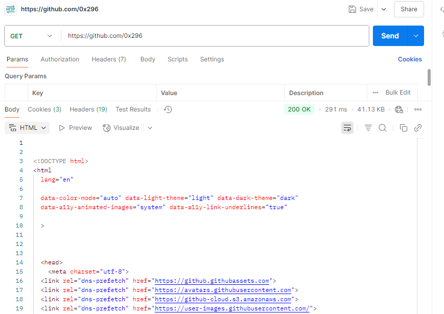
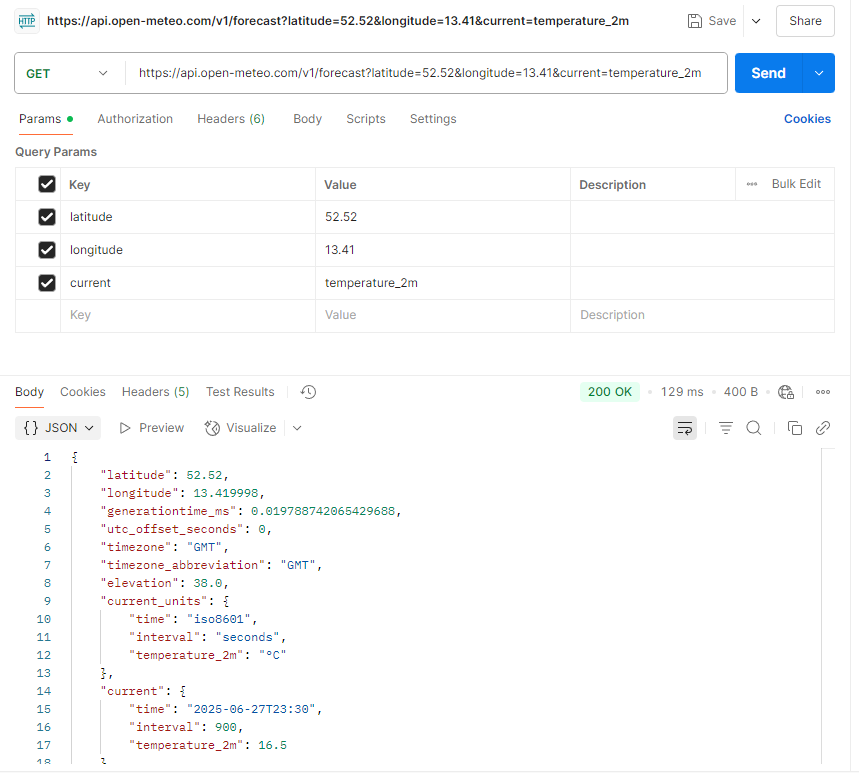
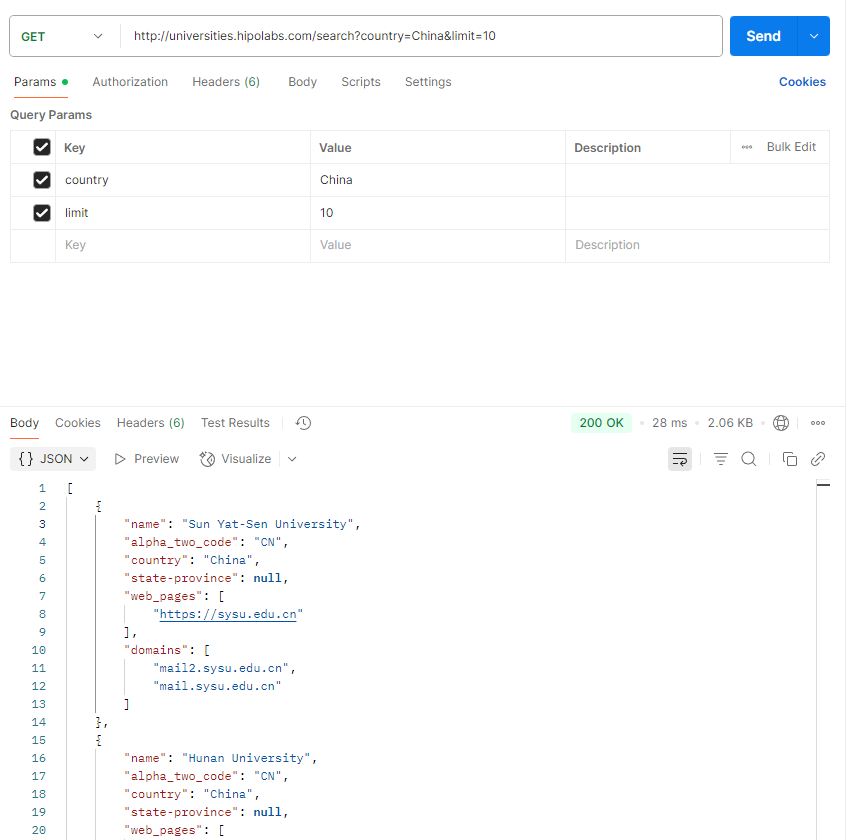
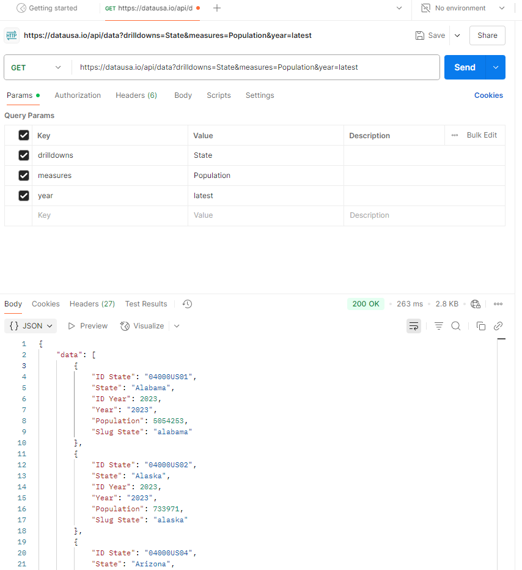
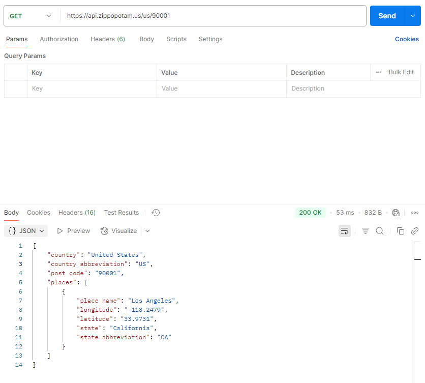

1.API is a set of rules that the client program must follow to access the service. API is needed because the server need to understand the requests sent by client to properly do the work, and the client need to understand the responses returned.

2.Developer API could be any form, like command line, method, jar package etc. It is mainly for developers to use, users should know the interface specification. Application API should have standard form (like REST) to make it accessible by applications that general users will use (like browser). It is designed mainly for regular users.

3.Some examples of api are REST API, GraphQL API, RPC API, Websocket API, SOAP API

4.Path variable is the variable appears in url path, before the ? mark. Request parameter is the key-value pair appears after the ? mark in url.

5.Rest API contains:

​	Protocol, URL, Method, HTTP version, Request header, Request Body, Response status code, Response header, Response Body. 

6.cURL is a command line tool to send HTTP request. API testing tools like postman is easy to modify the path variable/ query parameter/ authorization field etc. It is more convenient to use when testing complex api.

7.Common HTTP status code contains:

​	1xx: Informational response: meaning request is received. Rarely used

​	2xx: Requested is accepted and action is done successfully.like:

​		200: OK

​		201: Created

​	3xx: The resource have been moved to other place: like:

​		301: Moved Permanently

​	4xx: Client error

​		400: Bad Request

​		401: Unauthorized

​		403: Forbidden

​		404: Not Found

​	5xx: Server error

​		500: Internal server error

8.HTTP method contains:
	GET: Get a resource from the server. Expected code: 200 OK

​	POST: Upload a resource to the server. Expected code: 200 OK/ 201 Created

​	PUT: Replace an existing resource. Expected code: 200 OK/201 Created

​	PATCH: Partial updating a resource. Expected code: 200 OK

​	DELETE: Remove a resource on the server. Expected code: 200 OK/202 Accepted

9.The rest API is stateless because it is request-response based. No "connection" info is maintained at server.

10.Use JSON to represent data. Use nouns instead of verbs. Use correct method/status code. Must use pagination in api have "get all" meaning.

11.XSS: Cross-Site Scripting is for attackers inject malicious script into pages. To prevent it, websites could do restrictions to user input, encode the input appears in html, or use well-tested frameworks.

​	CSRF: Cross Site Request Forgery is for attackers trick user's browser to send unintended requests to another logged-in website. To prevent it, website could add secure tokens, or check referrer to filter out malicious requests.

API Practices:

1.

​	a.github user page: GET https://github.com/0x296

b. Weather api: GET https://api.open-meteo.com/v1/forecast?latitude=52.52&longitude=13.41&current=temperature_2m

​	c. Universities list api: GET http://universities.hipolabs.com/search?country=China&limit=10

d. US population search api: GET https://datausa.io/api/data?drilldowns=State&measures=Population&year=latest

e. Postcode information lookup api: GET https://api.zippopotam.us/us/90001

2.The b. Weather api supports pagination, but it is not required. If not provided, it will return a very long json list. Could make the pagination ("limit" query parameter) required.

3.Curl command:

a. curl "https://github.com/0x296"

b. curl "https://api.open-meteo.com/v1/forecast?latitude=52.52&longitude=13.41&current=temperature_2m"

c. curl " http://universities.hipolabs.com/search?country=China&limit=10"

d. curl "https://datausa.io/api/data?drilldowns=State&measures=Population&year=latest"

e. curl "https://api.zippopotam.us/us/90001"

Screenshot is at question 1.

4.

​	request header contains:

 	Host: domain name of the resource

​	User-Agent: type of the program sending request

​	Accept: tell server what type of content to receive

​	Accept encoding: compression schemes

​	Connection: keep alive

​	response header contains:

​	Date: date/time of response

​	Content-type: format of content in response body

​	Transfer-Encoding: chunked (break the body to chunks to transport)

​	Connection: keep alive

​	Content-Encoding: deflate (using deflate algorithm to compress)

​	

​	