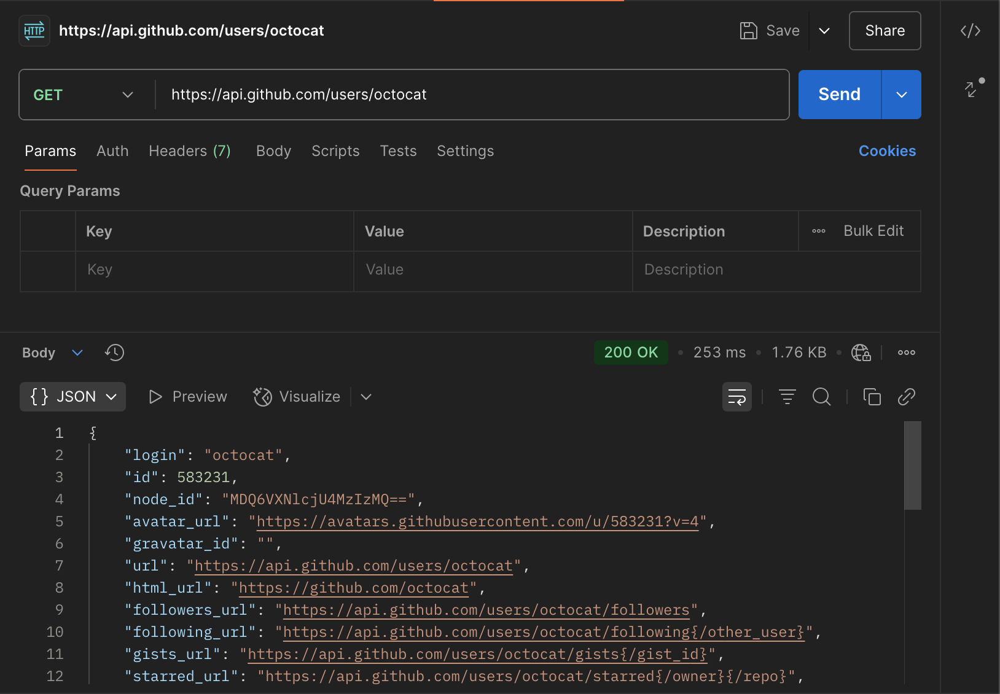
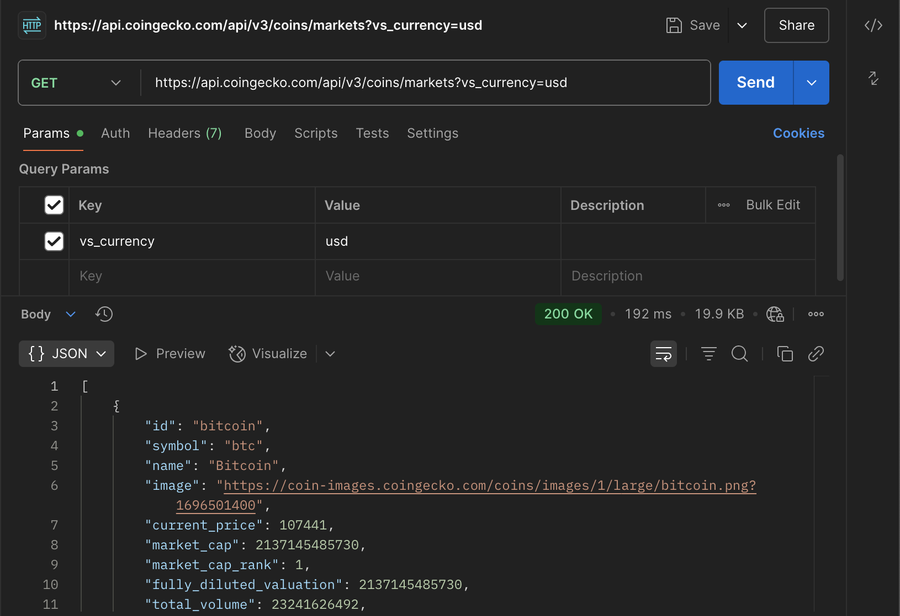
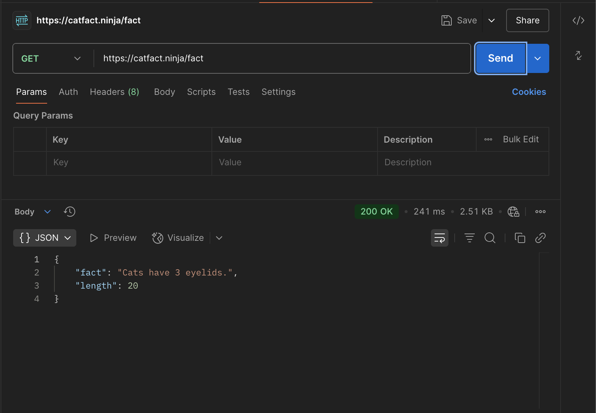
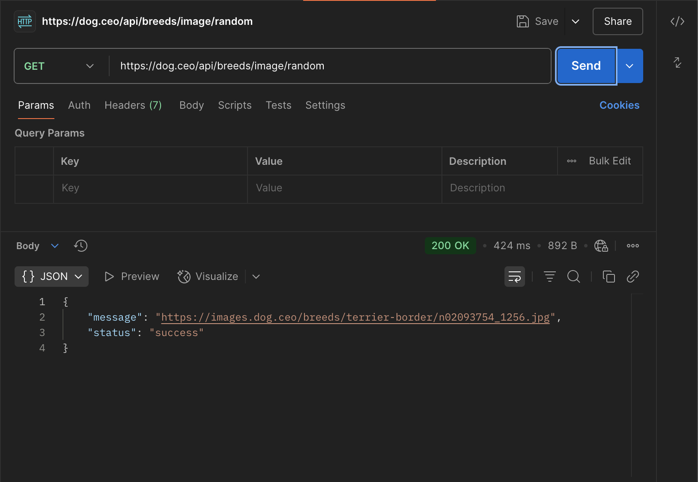

1. Explain the concept of API (Application Programming Interface), why do we need APIs.

	An API is a set of rules and protocols that allows different software applications to communicate with each other. It defines how requests should be made, what data formats to use, and what responses to expect.

	Key reasons to use API:

	1. Separation of Concerns: PIs allow the frontend (user interface) and backend (business logic, database) to work independently.

	2. Reusability: APIs can be reused across different applications. 

	3. Security: APIs can expose only the necessary data/functions to the outside world without revealing internal implementation details or exposing sensitive data.

	4. Efficiency and Scalability: APIs standardize data exchange formats (like JSON or XML), making integration more consistent and scalable.

	5. Automation and Integration: APIs enable automation between systems. 

2. Compare developer API vs application API (normal APIs)

	Developer API: A Developer API is an API designed for use by external developers (outside the team or company) to build applications that integrate with a platform, service, or product.

	Purpose:

	* To allow third-party developers to build on top of a product or platform.

	* Expose carefully designed endpoints for external consumption.

	* Designed with documentation, authentication, rate-limits, and versioning.

	Application API: An Application API refers to APIs used internally within a system or application. They connect different components/modules (e.g., frontend ↔ backend) and are usually not meant for public use.

	Purpose:

	* To facilitate communication between internal components.

	* Not intended for public developers; serves internal use cases.

3. Name some different types of APIs

	REST API: Stateless, uses HTTP methods (GET, POST, etc.), typically returns JSON.

	SOAP API: Protocol-based, uses XML, strict standards and formal contracts.

	GraphQL API: Flexible queries for only the data you need, single endpoint.

	WebSocket API: Persistent connection, used for real-time data.

4. Compare path variables vs request parameters in REST API.

	Path Variables: Values embedded directly in the URL path to identify specific resources.

	Request Parameters (Query Parameters): Key-value pairs appended to the URL after the ?, used to filter, sort, or customize results.

5. Explain the different components that make up a RESTful API and what does each part do?

	URIs: Each resource is identified by a unique URI (Uniform Resource Identifier).

	HTTP Methods:

	* GET: Read/fetch data

	* POST: Create new resource

	* PUT: Replace/update resource

	* PATCH: Partial update
	
	* DELETE: Remove resource

6. Explain what cURL is and why we use API testing tools like Postman instead of testing APIs directly with cURL.

	cURL (Client URL) is a command-line tool used to make requests to servers using various protocols—most commonly HTTP and HTTPS. It can used to test REST APIs by making GET, POST, PUT, DELETE, and other requests directly from the terminal. (e.g. curl -X GET https://api.example.com/users/123)

	While cURL is powerful, it has limitations—especially for ease of use, productivity, and automation. That’s where tools like Postman come in. Use Postman when you want a user-friendly interface, easier debugging, reusable collections, and rich testing features.

7. List common HTTP status codes and their meanings.

	* 100	Continue: Server received the request headers, client can proceed with body.

	* 101	Switching Protocols: Server is switching to a different protocol (e.g., HTTP to WebSocket).
	
	* 200 OK:	Request was successful.
	
	* 201	Created: New resource created (e.g., after POST).
	
	* 202	Accepted: Request accepted but not yet processed.
	
	* 204	No Content:	Success, but no data returned in response.
	
	* 301	Moved Permanently: Resource has been permanently moved to a new URL.
	
	* 302	Found: Temporarily redirected to a different URL.
	
	* 304	Not Modified: Cached version is still valid (no need to resend).
	
	* 400	Bad Request: Malformed or invalid request from client.
	
	* 401	Unauthorized: Authentication is required or failed.
	
	* 403	Forbidden: Client is authenticated but not authorized.
	
	* 404	Not Found: Resource doesn't exist at the given URL.
	
	* 405	Method Not Allowed: HTTP method not allowed on this resource.
	
	* 409	Conflict: Conflict with the current state of the resource.
	
	* 429	Too Many Requests: Rate limit exceeded.
	
	* 500	Internal Server Error: Generic server-side error.
	
	* 502	Bad Gateway: Invalid response from upstream server.
	
	* 503	Service Unavailable: Server is overloaded or down for maintenance.
	
	* 504	Gateway Timeout: Upstream server took too long to respond.

8. List HTTP methods and their meanings, and their expected HTTP status codes.

	* GET: Retrieve data (read-only) from the server
	Expected Status Codes: 200 OK, 404 Not Found
	
	* POST: Create a new resource on the server
	Expected Status Codes: 201 Created, 400 Bad Request, 409 Conflict

	* PUT: Fully update/replace an existing resource
	Expected Status Codes: 200 OK, 204 No Content, 400 Bad Request, 404 Not Found

	* PATCH: Partially update a resource (only certain fields)
	Expected Status Codes: 200 OK, 204 No Content, 400 Bad Request, 404 Not Found

	* DELETE: Delete a resource
	Expected Status Codes: 200 OK, 204 No Content, 404 Not Found

9. Explain why REST API is stateless.

	Scalability: Servers don’t have to store session info, so they can handle more requests. Easier to scale horizontally (add more servers).

	Simplicity: No session management = simpler server logic and less memory usage.

	Reliability: Each request is independent, so failure in one doesn't affect others.

	Caching Support: Since the response depends only on the request, responses can be cached more easily.

10. Discuss about best practices for REST API design, from performance perspective.

	**Use HTTP Caching:** Reduce server load and response time for repeated requests.
	
	**Use Pagination, Filtering, and Sorting:** Avoid loading too much data in one request.
	
	**Minimize Payload Size:** Reduces bandwidth and speeds up transfer.

	**Use Appropriate HTTP Methods and Status Codes：** Helps clients handle responses correctly and efficiently.

	**Enable HTTP/2:** Improves performance over HTTP/1.1 with multiplexing (parallel requests over one connection) and header compression.

	**Batch Requests When Possible**: Reduce number of network round-trips.

	**Use Asynchronous Processing for Heavy Tasks:** Avoid blocking requests that take long.

	**Avoid Deeply Nested Resource URLs:** Easier to cache and more efficient to query.

	**Optimize Database Queries:** Backend DB calls are often bottlenecks.

	**Use Rate Limiting and Throttling:** Prevent API abuse and ensure fair usage.

	**Support Content Compression:** Reduce payload size on the wire.

	**Avoid Unnecessary Round Trips:** Each request adds latency.

	**Use Proper Content Types:** Ensures parsing efficiency and consistency.

11. Explain the concept of XSS (Cross-Site Scripting) and CSRF (Cross Site Request Forgery) and how to avoid them.

	XSS is a security vulnerability that allows attackers to inject and execute malicious JavaScript code in a user's browser by exploiting unsafe handling of user input by a web application.

	How to Prevent XSS:

	* Escape user-generated content before rendering it in HTML.

	* Use secure frameworks (like React or Angular) that auto-escape output.

	* Sanitize input using libraries (e.g., DOMPurify).

	* Implement a Content Security Policy (CSP) to restrict script sources.

	* Validate inputs on both client and server sides.

	CSRF is an attack that tricks a logged-in user's browser into sending unauthorized commands to a web application on their behalf.

	How to Prevent CSRF:

	* Use anti-CSRF tokens (unique per session/request).

	* Set SameSite attributes on cookies (Lax or Strict) to prevent cross-site requests.

	* Validate the Origin or Referer headers.

	* Use POST or PUT for state-changing operations — never GET.

API Practices:
Use Postman or other API testing tools to:

1. Find at least 5 different public APIs (e.g., GitHub APIs, Google Cloud APIs, GeoInfo APIs, Weather APIs) and use them to explain what defines a REST API. These APIs can use any HTTP methods and may also include non-REST APIs (e.g., GraphQL). Some public APIs may require API keys (user registration required);

	A REST API (Representational State Transfer) adheres to key constraints:

	* Uses HTTP methods: GET, POST, PUT, DELETE

	* Resources are identified via URIs

	* Communication is stateless

	* Returns structured data (usually JSON)

	* Uses standard HTTP status codes

2. Justify whether these APIs follow API design best practices, and provide your better design for them.

	1. **GET https://api.github.com/users/octocat**

	Strengths

	• Noun-based resource (users)

	• Shallow path

	• HTTPS & proper status codes

	• GitHub versions via Accept: application/vnd.github.v3+json

	Could be better

	• Versioning is header-only

	Better design: GET https://api.github.com/v3/users/octocat

	2. **GET https://restcountries.com/v3.1/name/japan**

	Strengths

	• Version segment (v3.1)

	• HTTPS

	• Simple GET	

	Could be better

	• Mixed path/query semantics – “search by name” feels like a filter, not a sub-resource

	• Not plural (name)

	• No pagination on large result sets

	Better design: GET https://restcountries.com/v3/countries?name=Japan

	3. **GET https://api.coingecko.com/api/v3/coins/markets?vs_currency=usd**

	Strengths

	• Version segment

	• Clear collection (coins) with sub-collection (markets)

	• Query param filter	

	Could be better

	• Long path depth (/api/v3/coins/markets) – the /api prefix is noise

	• Missing optional pagination hints in example (CoinGecko supports them but many devs miss it)

	Better design: GET https://restcountries.com/v3/markets/coins?currency=usd&page=1&per_page=50

	4. **GET https://catfact.ninja/fact**

	Strengths

	• Very simple

	• HTTPS	

	Could be better

	• No versioning

	• Singular noun (fact) but returns an object with no ID–clients can’t address a specific fact later

	• No way to request multiple facts or filter by length/species

	Better design: GET https://catfact.ninja/v1/facts/random?max_len=60

	5. **GET https://dog.ceo/api/breeds/image/random**

	Strengths

	• HTTPS

	• Self-describing (breeds, image, random)	

	Could be better

	• No versioning

	• Deeply nested path

	• The word “breeds” early in the path but no way to filter by breed without another nested segment

	Better design: GET https://dog.ceo/api/v1/breeds/{breed}/images

3. List the above APIs in form of cURL commands, and attach Postman screenshots in your markdown submission.

	curl -X GET https://api.github.com/users/octocat

	

	curl -X GET https://restcountries.com/v3.1/name/japan

	

	curl -X GET "https://api.coingecko.com/api/v3/coins/markets?vs_currency=usd"

	

	curl -X GET https://catfact.ninja/fact

	

	curl -X GET https://dog.ceo/api/breeds/image/random

	

4. List the request headers and response headers of the APIs mentioned above, and explain what each key-value pair in the headers section does.

	1. https://api.github.com/users/octocat

	Request headers:

	* User-Agent: <anything> 

	* Accept: application/vnd.github+json

	Response headers:

	* Content-Type: application/json; charset=utf-8 

	* ETag

	* Cache-Control: public, max-age=60 

	* X-RateLimit-Limit / Remaining / Reset 

	* Link 

	* Vary: Accept, Accept-Encoding

	* Strict-Transport-Security 

	2. https://restcountries.com/v3.1/name/japan

	Request headers:

	* User-Agent: <anything>

	* Accept: application/json

	Response headers:

	* Content-Type: application/json

	* ETag

	* Cache-Control: public, max-age=86400

	* Access-Control-Allow-Origin: *

	* Vary: Accept, Accept-Encoding

	3. https://api.coingecko.com/api/v3/coins/markets?vs_currency=usd

	Request headers:

	* User-Agent: <anything>

	* Accept: application/json

	Response headers:

	* Content-Type: application/json

	* Cache-Control: public, max-age=45

	* X-Cg-RateLimit-Limit

	* X-Cg-RateLimit-Remaining

	* ETag

	* Access-Control-Allow-Origin: *

	* Vary: Accept, Accept-Encoding

	4. https://catfact.ninja/fact

	Request headers:

	* User-Agent: <anything>

	* Accept: application/json

	Response headers:

	* Content-Type: application/json

	* Content-Length

	* Server: nginx

	* Access-Control-Allow-Origin: *

	5. https://dog.ceo/api/breeds/image/random

	Request headers:

	* User-Agent: <anything>

	* Accept: application/json

	Response headers:

	* Content-Type: application/json

	* Cache-Control: no-cache

	* Access-Control-Allow-Origin: *

