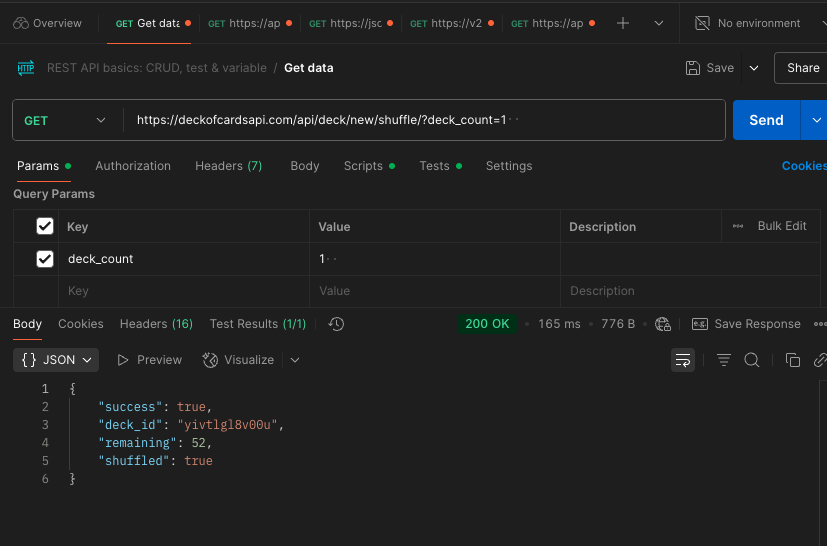
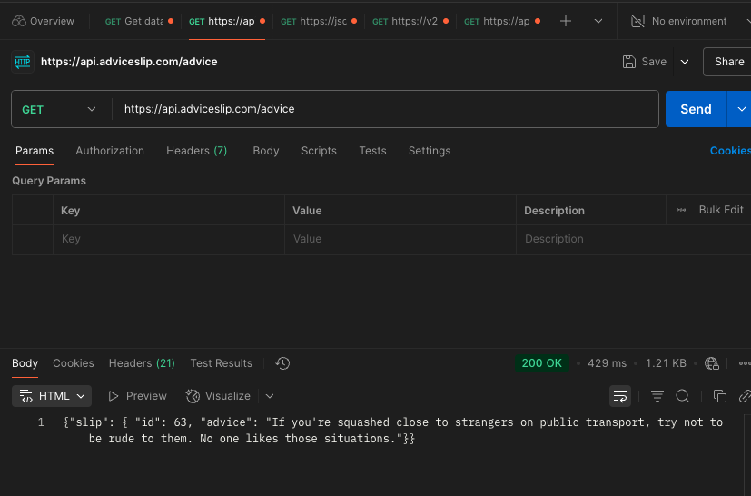
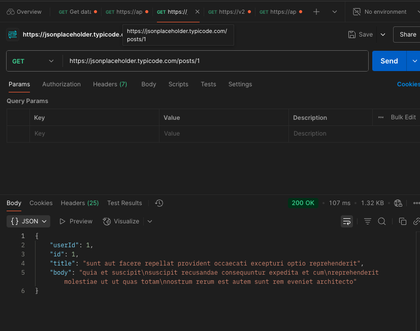
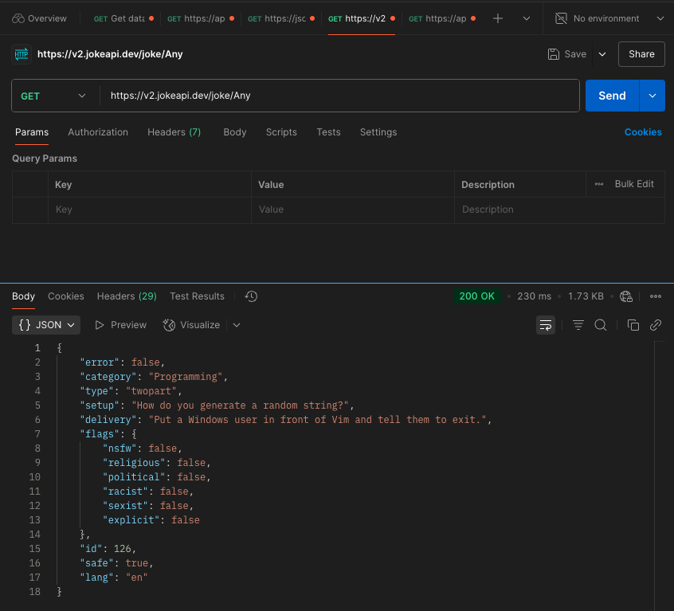
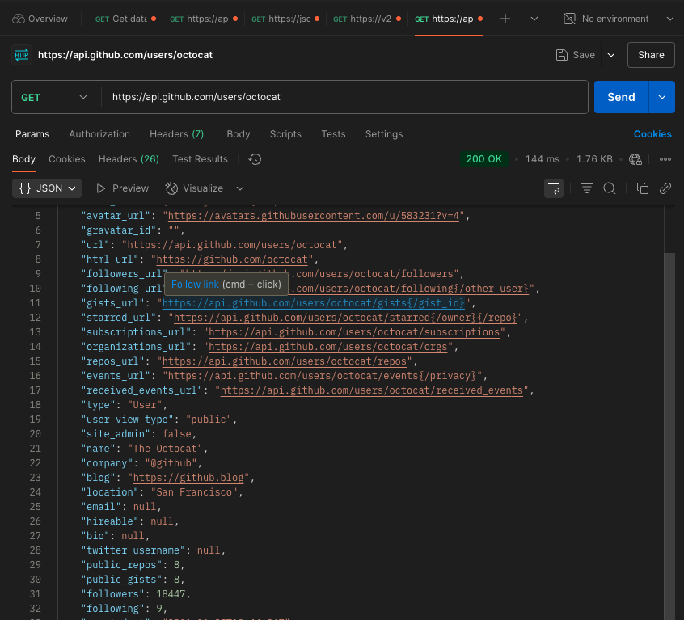

**1. Explain the concept of API (Application Programming Interface), why do we need APIs**
An **API(Application Programming Interface)** are mechanisms that enable two software components to communicate with each other using a set of definitions or protocols.

We need APIs to
- Connect systems (e.g. frontend to backend)
- Reuse services (e.g. payment, maps)
- Hide complexity (only expose needed features)
- Enable integration and automation across platforms

**2. Compare developer API vs application API (normal APIs)**

|	       | Developer API                                 | Application API (Normal API)                        |
|--------------|------------------------------------------------|-----------------------------------------------------|
| **Audience** | For **developers and systems**                    | For **applications and end-user features**       |
| **Purpose**  | Enable integration, automation, or development | Support app functions like login, data fetch, etc.  |
| **Examples** | GitHub API, AWS SDK, Docker API               | Weather API, Twitter API, Payment API               |

- Developer APIs are tools for developers.
- Application APIs are features for apps.

**3. Name some different types of APIs**
- **Open API (Public API)**: Available for anyone (e.g. Google Maps API)
- **Internal API (Private API)**: Used within a company
- **Partner API**: Shared with specific partners (e.g. Payment gateways)
- **REST API**: Web API using HTTP methods
- **SOAP API**: XML-based protocol for structured data exchange
- **GraphQL API**: Flexible query-based API from Facebook
- **WebSocket API**: For real-time, two-way communication
- **Library/API (e.g. Java API)**: Language-specific interfaces for developers

**4. Compare path variables vs request parameters in REST API.**
|	            | Path Variable                                | Request Parameter                             |
|-------------------|----------------------------------------------|-----------------------------------------------|
| **Location**      | Part of the URL path			   | After `?` in the URL			   |
| **Usage**         | Identify a specific resource 		   | Filter, sort, or provide optional data	   |
| **Example URL**   | `/users/123`				   | `/users?role=admin&active=true`		   |
| **Java Annotation** |`@PathVariable`				   | `@RequestParam`				   |
| **Required?**	    | Usually required				   | Often optional				   |

- Use **Path Variables** to locate specific resources (e.g. `/products/45`)
- Use **Request Parameters** to pass optional or filtering information (e.g. `/products?category=books&limit=10`).

**5. Explain the different components that make up a RESTful API and what does each part do?**

- **Endpoint(URI)**: The URL that represents a resource, e.g. `/users/123`
- **HTTP methods**: Define actions: `GET`(read), `POST`(create), `PUT`(update), `DELETE`(remove)
- **HTTP Headers**: Carry metadata like `Content-Type`, `Authorization`, or custom info
- **Request Body**: Sends data to the server (used with `POST`, `PUT`, etc..)
- **Response Headers**: key-value pairs sent by the server. Provide metadata about the response
- **Response Body**: The server's data response (usually in JSON or XML format)
- **Status Codes**: Tell the client the result: `200 OK`, `201 Created`, `400 Bad Request`, etc.

**6. Explain what cURL is and why we use API testing tools like Postman instead of testing APIs directly with cURL.**
**cURL** is a command-line tool used to **send HTTP requests** to a server. It's often used to test APIs by manually crafting requests like `GET`, `POST`, `PUT`, etc.
<pre markdown="1"> ### Example: cURL GET Request ```bash curl -X GET https://api.example.com/users/123 ``` - `-X GET` specifies the HTTP method (GET) - The URL `/users/123` targets the user with ID 123 </pre>

We use **Postman** because it makes **API testing faster, clearer, and more manageable**, especially when working with complex payloads, environments, and teams. **cURL** is powerful for quick, scriptable API calls, but lacks the usability and features of dedicated API platforms.

**7. List common HTTP status codes and their meanings.**
- **200 OK** – Request succeeded    
- **201 Created** – Resource created  
- **204 No Content** – Success, no response body  
- **400 Bad Request** – Invalid client request  
- **401 Unauthorized** – Auth required or failed  
- **403 Forbidden** – Access denied  
- **404 Not Found** – Resource not found  
- **500 Internal Server Error** – Server error  
- **503 Service Unavailable** – Server overloaded/down

**8. List HTTP methods and their meanings, and their expected HTTP status codes.**
| **Method** | **Purpose**               | **Common Status Codes**        |
|------------|---------------------------|--------------------------------|
| **GET**    | Retrieve data              | 200 OK, 404 Not Found          |
| **POST**   | Create new resource        | 201 Created, 400 Bad Request   |
| **PUT**    | Update/replace resource    | 200 OK, 204 No Content, 404    |
| **PATCH**  | Partially update resource  | 200 OK, 204, 404               |
| **DELETE** | Delete resource            | 200 OK, 204 No Content, 404    |
| **HEAD**   | Like GET, no body returned | 200 OK, 404 Not Found          |
| **OPTIONS**| Check allowed methods      | 204 No Content                 |

**9. Explain why REST API is stateless.**

A REST API is **stateless** because each request from the client to the server must contain all the information needed to understand and process the request, without relying on any stored context on the server. This design improves scalability and reliability because the server doesn't need to store session data or track previous interactions. It allows load balancers to easily distribute requests across multiple servers and makes failure recovery simpler. Statelessness also aligns with REST principles, making the API easier to maintain and scale.

**10. Discuss about best practices for REST API design, from performance perspective.**

To ensure high-performance REST APIs, I follow these best practices:
- **Caching**: Use `Cache-Control`, `ETag`, and `Last-Modified` to reduce unnecessary server load.
- **Pagination and Filtering**: Avoid large payloads by returning only what's needed (e.g. `limit`, `offset`, `?status=active`).
- **Compression**: Enable GZIP to reduce response size
- **Bulk Operations**: Support batch endpoints (e.g., `/users/bulk-update`) to reduce round trips.
- **Async Processing**: For long tasks, return `202 Accepted` with a status-check endpoint.
- **Lightweight Responses**: Minimize over-fetching using field selection or projection.
- **Rate Limiting**: Prevent abuse and ensure fair usage with throttling mechanisms.

** 11. Explain the concept of XSS (Cross-Site Scripting) and CSRF (Cross Site Request Forgery) and how to avoid them.**

**XSS (Cross-Site Scripting)** is when attackers inject malicious scripts into a website to steal data or manipulate the page.
Prevent it by: sanitizing user input and using **Content Security Policy (CSP)**.

**CSRF (Cross-Site Request Forgery)** tricks a logged-in user’s browser into making unintended requests.
Prevent it by: using CSRF tokens and setting **SameSite on cookies**.

# API Practices

se **Postman** or other **API testing tools** to:

1. **Find at least 5 different public APIs**  
   (e.g., GitHub APIs, Google Cloud APIs, GeoInfo APIs, Weather APIs)
  - Use them to explain what defines a **REST API**.
  - These APIs can use any **HTTP methods**, and may also include **non-REST APIs** (e.g., **GraphQL**).
  - Some **public APIs** may require **API keys** (user registration required).

- https://deckofcardsapi.com/api/deck/new/shuffle/?deck_count=1  
- https://api.adviceslip.com/advice  
- https://jsonplaceholder.typicode.com/posts/1  
- https://v2.jokeapi.dev/joke/Any 
- https://api.github.com/users/octocat

2. **Justify whether these APIs follow API design best practices**,  
   and provide your better design for them.

## 1. deckofcardsapi.com – Shuffle New Deck

 **URL:** `https://deckofcardsapi.com/api/deck/new/shuffle/?deck_count=1`  
- **Method:** GET  
- **RESTful:** Yes  
- **Request Headers Example:**
 - `Accept: application/json`
- **Response Headers Example:**
  - `Content-Type: application/json`
  - `Cache-Control: no-cache`
- **Best Practices Followed:**
  - Resource-oriented path (`/deck/new/shuffle`) 
  - Supports query parameters for category filtering (`deck_count`)
  - JSON-based response
- **Improvement Suggestions:**
  - Include API versioning (`/v1/deck/...`)
  - Support pagination or bulk shuffle if the data grows large


---

## 2. adviceslip.com – Random Advice

	- **URL:** `https://api.adviceslip.com/advice`  
	- **Method:** GET  
	- **RESTful:** Yes  
	- **Request Headers Example:**
  		- `Accept: application/json`
	- **Response Headers Example:**
  		- `Content-Type: application/json`
  		- `Cache-Control: max-age=600`
	- **Best Practices Followed:**
 		- Simple and descriptive endpoint
  		- Stateless and readable JSON output
	- **Improvement Suggestions:**
  		- Support category filtering: `/advice?topic=life`
		- Add API versioning prefix (`/v1/advice`)

---

## 3. jsonplaceholder.typicode.com – Get Post by ID

	- **URL:** `https://jsonplaceholder.typicode.com/posts/1`  
	- **Method:** GET  
	- **RESTful:** Yes  
	- **Request Headers Example:**
 		- `Accept: application/json`
	- **Response Headers Example:**
		- `Content-Type: application/json; charset=utf-8`
	- **Best Practices Followed:**
  		- Clear hierarchical resource path
  		- Descriptive and version-neutral
	- **Improvement Suggestions:**
  		- Add versioning (`/v1/posts/1`)
  		- Add `ETag` or `Cache-Control` headers

---

## 4. jokeapi.dev – Get Random Joke

	- **URL:** `https://v2.jokeapi.dev/joke/Any`  
	- **Method:** GET  
	- **RESTful:** Yes  
	- **Request Headers Example:**
 		- `Accept: application/json`
	- **Response Headers Example:**
  		- `Content-Type: application/json`
	- **Best Practices Followed:**
  		- Category-based routing in path
  		- Stateless and consistent JSON
	- **Improvement Suggestions:**
  		- Add query params (`type=twopart`)
  		- Use consistent version headers (`X-API-Version`)

--

## 5. GitHub API – Get User Info
	- **URL:** `https://api.github.com/users/octocat`  
	- **Method:** GET  
	- **RESTful:** Yes  
	- **Request Headers Example:**
  		- `Accept: application/vnd.github.v3+json`
	- **Response Headers Example:**
 	 	- `ETag: "abc123"`
  		- `X-RateLimit-Limit: 60`
  		- `Content-Type: application/json`
	- **Best Practices Followed:**
  		- Strong RESTful structure
  		- Uses versioned media types in headers
  		- Pagination support and caching
	- **Improvement Suggestions:**
  		- Optionally allow verbosity toggling: `?details=summary`


3. **List the above APIs in form of cURL commands**,  
   and attach **Postman screenshots** in your markdown submission.

## cURL Commands

### 1. Deck of Cards API
```bash
curl -X GET "https://deckofcardsapi.com/api/deck/new/shuffle/?deck_count=1" \
  -H "Accept: application/json"
```


### 2. Advice Slip API
```bash
curl -X GET "https://api.adviceslip.com/advice" \
  -H "Accept: application/json"
```



### 3. JSONPlaceholder Post API
```bash
curl -X GET "https://jsonplaceholder.typicode.com/posts/1" \
  -H "Accept: application/json"
```




### 4. JokeAPI
```bash
curl -X GET "https://v2.jokeapi.dev/joke/Any" \
  -H "Accept: application/json"
```



### 5. GitHub Users API
```bash
curl -X GET "https://api.github.com/users/octocat" \
  -H "Accept: application/vnd.github.v3+json"
```




4. **List the request headers and response headers** of the APIs mentioned above, and explain what each key-value pair in the headers section does.

### Request and Response Headers Summary

| API                                         | Header Type   | Header Key                 | Description                                                       |
|---------------------------------------------|---------------|----------------------------|-------------------------------------------------------------------|
| All APIs                                    | Request       | Accept: application/json   | Informs the server that the client expects JSON responses.        |
| All APIs                                    | Response      | Content-Type               | Indicates the media type of the response (typically JSON).        |
| GitHub (users/octocat)                      | Response      | X-RateLimit-Limit          | Max number of requests allowed per hour (rate limiting).          |
| GitHub (users/octocat)                      | Response      | X-RateLimit-Remaining      | Remaining allowed requests in the current time window.            |
| JSONPlaceholder (posts/1)                   | Response      | ETag                       | Response version identifier for **caching** and conditional requests. |
| Deck of Cards (shuffle)                     | Response      | Cache-Control              | Defines how and for **how long the response can be cached.**         |
| Cat Fact (fact)                             | Response      | Server                     | Shows server software (e.g., nginx, Apache) that handled request. |
| JokeAPI (joke/Any)                          | Response      | Content-Encoding           | Specifies any encoding (e.g., gzip) applied to the response body. |


